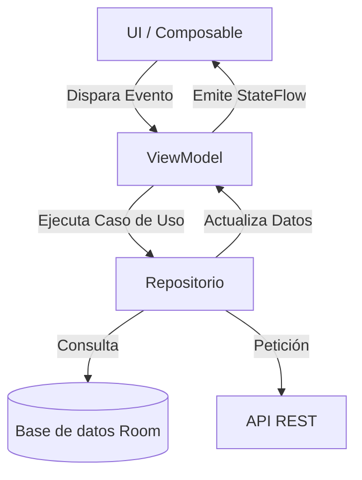

# Pila Tecnológica de Documentación (MkDocs Material & Docker)

Este documento detalla la infraestructura, configuración y extensiones del sitio de documentación para asegurar que cualquier contenido generado sea 100% compatible con el renderizador.

---

## 1. Entorno de Ejecución Local con Docker

El proyecto utiliza un contenedor Docker para aislar todas las dependencias de Python y MkDocs.

### Archivos de Configuración Docker:
- **`docker-compose.yml`**:
  - Servicio: `mkdocs`
  - Imagen base construida desde: `.docker/dockerfile`
  - Contenedor: `Mkdocs-pmdm2627`
  - Mapeo de puertos: `8005:8000` (El sitio se visualiza en `http://localhost:8005`)
  - Volumen montado: `./:/docs`
  - Comando de ejecución: `serve --dev-addr 0.0.0.0:8000 --dirtyreload`
  - Variable de entorno: `WATCHDOG_USE_POLLING=true` (garantiza detección de cambios en sistemas host macOS/Linux)
- **`.docker/dockerfile`**:
  - Basado en `squidfunk/mkdocs-material`
  - Instala dependencias adicionales listadas en `.docker/user-requirements.txt` (actualmente `mkdocs-glightbox` y fijación de versión `click<8.2.2`).

### Comandos de Gestión:
```bash
# Iniciar servidor de documentación en segundo plano
docker compose up -d

# Ver registros de compilación / advertencias de mkdocs en tiempo real
docker compose logs -f mkdocs

# Acceder a la terminal dentro del contenedor
docker compose exec mkdocs sh

# Detener el contenedor
docker compose down
```

---

## 2. Configuración de `mkdocs.yml`

El archivo `mkdocs.yml` define el tema, el árbol de navegación (`nav`), los plugins y las extensiones markdown activas.

### Parámetros Principales
- `site_name`: 2º DAM - Programación Multimedia y Desarrollo móvil - Curso 26/27
- `site_url`: https://jssdocente.github.io/pmdm2627d
- `use_directory_urls`: `false` (los archivos generados terminan en `.html` explícito, facilitando navegación sin servidor web complejo).
- `theme`:
  - `name: material`
  - `language: es`
  - Paletas de color: Modo claro (primary: light blue, accent: Teal) y modo oscuro (slate).
  - Logo y Favicon: `imagenes/logofp.png` y `imagenes/favicon.png`.

---

## 3. Extensiones Markdown Soportadas

Al redactar contenido en archivos `.md`, se pueden (y deben) aprovechar las siguientes capacidades avanzadas configuradas:

### 3.1. Cajas de Aviso (Admonitions)
Permiten resaltar información de manera estructurada:
```markdown
!!! note "Nota Importante"
    Contenido explicativo indentado con 4 espacios.

!!! tip "Consejo de Buenas Prácticas"
    Evita instanciar ViewModels dentro de sub-composables.

!!! warning "Atención con permisos en Android"
    Los permisos peligrosos deben solicitarse en tiempo de ejecución.

??? example "Código Ocultable / Desplegable"
    Este bloque aparece contraído por defecto (`???`) o abierto (`???+`).
```

### 3.2. Pestañas de Contenido (Content Tabs)
Ideal para comparar código o configuraciones alternativas:
```markdown
=== "Kotlin (Jetpack Compose)"
    ```kotlin
    @Composable
    fun Saludo(nombre: String) {
        Text(text = "Hola $nombre")
    }
    ```

=== "XML Clásico (Views)"
    ```xml
    <TextView
        android:id="@+id/tvSaludo"
        android:layout_width="wrap_content"
        android:layout_height="wrap_content" />
    ```
```

### 3.3. Diagramas Mermaid (`pymdownx.superfences`)
Generación de diagramas de arquitectura, flujos o secuencia sin imágenes externas:
````markdown

````

### 3.4. Zoom de Imágenes con Lightbox (`mkdocs-glightbox`)
Cualquier imagen insertada con sintaxis estándar `` dispone automáticamente de zoom y visualización modal sin configuración adicional.

### 3.5. Resaltado y Selección de Código (`pymdownx.highlight`)
- `content.code.copy`: Botón de copiado integrado en cada bloque de código.
- `content.code.annotate`: Permite añadir notas numeradas al código usando `(1)` y listándolas debajo:
  ```kotlin
  val viewModel: MiViewModel by viewModel() // (1)
  ```
  1. Inyección de dependencia gestionada por Koin.

---

## 4. Despliegue Automatizado (CI/CD)

El repositorio incluye un workflow en `.github/workflows/build-push-mkdocs.yml`:
- Se activa ante un `push` a la rama `master` o mediante disparo manual (`workflow_dispatch`).
- Instala `mkdocs` y `mkdocs-material` en Ubuntu.
- Ejecuta `mkdocs build` generando los estáticos en `site/`.
- Publica el directorio generado en la rama `gh-pages` utilizando `s0/git-publish-subdir-action`.
