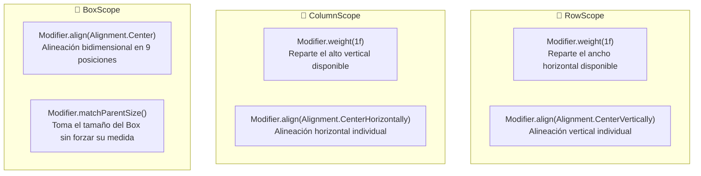

# Funciones componibles en Jetpack Compose

En Jetpack Compose, las interfaces de usuario se crean a partir de funciones componibles, que son funciones que devuelven un árbol de elementos de la interfaz de usuario. Puedes componer estas funciones para crear interfaces de usuario complejas y reutilizables.

## Crear una función componible

Para crear una función componible en Jetpack Compose, utiliza la anotación `@Composable` antes de la definición de la función. Una función componible puede tener parámetros y devolver un árbol de elementos de la interfaz de usuario utilizando las funciones de composición proporcionadas por Compose.

```kotlin
@Composable
fun Greeting(name: String) {
    Text(text = "Hello, $name!")
}
```

En el ejemplo anterior, se define una función componible `Greeting` que toma un parámetro `name` de tipo `String` y devuelve un elemento de texto `Text` que muestra un saludo personalizado.

## Componer funciones componibles

Puedes componer funciones componibles para crear interfaces de usuario más complejas. Utiliza las funciones de composición proporcionadas por Compose, como `Column`, `Row`, `Box`, `Spacer`, etc., para organizar y diseñar los elementos de la interfaz de usuario.

```kotlin
@Composable
fun GreetingList(names: List<String>) {
    Column {
        names.forEach { name ->
            Greeting(name = name)
        }
    }
}
```

En el ejemplo anterior, se define una función componible `GreetingList` que toma una lista de nombres y muestra un saludo personalizado para cada nombre utilizando la función componible `Greeting`.

!!! info "Video introducción a Compose"
    <iframe width="560" height="315" src="https://www.youtube.com/embed/DQq3L4FDjuI?si=P2HmN_2u5p722iKN" title="YouTube video player" frameborder="0" allow="accelerometer; autoplay; clipboard-write; encrypted-media; gyroscope; picture-in-picture; web-share" referrerpolicy="strict-origin-when-cross-origin" allowfullscreen></iframe>


## Actualización de funciones componibles

Las funciones componibles en Jetpack Compose son reactivas, lo que significa que se vuelven a ejecutar automáticamente cuando cambian los datos de entrada. Esto permite que la interfaz de usuario se actualice de forma dinámica en respuesta a los cambios en los datos.

```kotlin
@Composable
fun Counter(count: Int) {
    Text(text = "Count: $count")
}
```

En el ejemplo anterior, se define una función componible `Counter` que muestra el recuento actual. Cuando cambia el recuento, la función componible se vuelve a ejecutar automáticamente para reflejar el nuevo valor.

## Columnas y filas en Jetpack Compose+

Jetpack Compose proporciona las funciones `Column` y `Row` para organizar elementos de la interfaz de usuario en columnas y filas respectivamente. Puedes anidar columnas y filas para crear diseños más complejos y reutilizables.

```kotlin
@Composable
fun GreetingList(names: List<String>) {
    Column {
        names.forEach { name ->
            Greeting(name = name)
            Spacer(modifier = Modifier.height(8.dp))
        }
    }
}
```

En el ejemplo anterior, se utiliza la función `Column` para organizar los saludos en una lista vertical. Se añade un `Spacer` entre cada saludo para separarlos visualmente.

## Modificadores en Jetpack Compose

Jetpack Compose utiliza modificadores (`Modifier`) para aplicar estilos, posicionamiento y comportamientos interactivos a los elementos de la interfaz de usuario. Puedes utilizarlos para cambiar el tamaño, la posición, el color de fondo, la forma, los bordes o responder a gestos táctiles.

```kotlin
@Composable
fun Greeting(name: String, modifier: Modifier = Modifier) {
    Text(
        text = "Hello, $name!",
        modifier = modifier
            .padding(16.dp)
            .background(Color.Blue)
            .clickable { /* Acción al hacer clic */ }
    )
}
```

### 1. La Regla de Oro de los Modificadores (Directriz Oficial de Google)

En Android moderno con Jetpack Compose, **todo composable público o reutilizable debe aceptar un parámetro opcional `modifier: Modifier = Modifier` y encadenarlo directamente en su componente contenedor raíz**:

```kotlin
// ✅ BUENA PRÁCTICA OFICIAL:
@Composable
fun TarjetaUsuario(
    nombre: String,
    modifier: Modifier = Modifier // Primer parámetro opcional con valor por defecto
) {
    Surface(
        modifier = modifier, // Se aplica al nodo raíz
        shape = RoundedCornerShape(8.dp)
    ) {
        Text(text = nombre, modifier = Modifier.padding(16.dp))
    }
}
```

**¿Por qué es crucial esta regla?**  
Permite que quien consuma tu composable desde fuera pueda decidir su tamaño (`fillMaxWidth()`), su margen exterior (`padding()`) o su alineación sin necesidad de modificar el código interno del componente.

### 2. La Importancia Crítica del Orden de los Modificadores

En Compose, **el orden en que encadenas los modificadores altera drásticamente el resultado visual**:

```kotlin
// Caso A: El fondo cubre el padding (Padding interno tradicional)
Box(
    modifier = Modifier
        .background(Color.Yellow) // 1. Pinta el fondo amarillo
        .padding(16.dp)           // 2. Empuja el contenido hacia adentro
) {
    Text("Padding Interno")
}

// Caso B: El fondo se aplica DESPUÉS del padding (Simula un Margen externo)
Box(
    modifier = Modifier
        .padding(16.dp)           // 1. Deja 16 dp de espacio transparente alrededor
        .background(Color.Yellow) // 2. Pinta el fondo solo en la zona interior restante
) {
    Text("Margen Externo")
}
```

!!! info "Video Modificadores y uso del tema"
    <iframe width="560" height="315" src="https://www.youtube.com/embed/oqV6ZQ48sjM?si=q_RKkBR4TwZJBcKV" title="YouTube video player" frameborder="0" allow="accelerometer; autoplay; clipboard-write; encrypted-media; gyroscope; picture-in-picture; web-share" referrerpolicy="strict-origin-when-cross-origin" allowfullscreen></iframe>

## Recursos en Jetpack Compose

Jetpack Compose utiliza el sistema de recursos de Android para gestionar los recursos de la interfaz de usuario, como cadenas, colores, dimensiones, etc. Puedes acceder a los recursos utilizando la función `stringResource()`, `colorResource()`, `dimenResource()`, etc.

```kotlin
@Composable
fun Greeting() {
    Text(
        text = stringResource(id = R.string.hello),
        color = colorResource(id = R.color.primary),
        fontSize = dimenResource(id = R.dimen.text_size)
    )
}
```

En el ejemplo anterior, se utiliza la función `stringResource()` para obtener una cadena de recursos, la función `colorResource()` para obtener un color de recursos, y la función `dimenResource()` para obtener una dimensión de recursos.

## Temas en Jetpack Compose (Material 3)

Jetpack Compose utiliza **Material Design 3 (Material 3)** para aplicar estilos coherentes a la interfaz de usuario mediante `MaterialTheme` y `lightColorScheme()`:

```kotlin
import androidx.compose.material3.MaterialTheme
import androidx.compose.material3.lightColorScheme

val EsquemaColoresClaro = lightColorScheme(
    primary = Color(0xFF6750A4),
    secondary = Color(0xFF625B71),
    tertiary = Color(0xFF7D5260)
)

@Composable
fun MyApp(content: @Composable () -> Unit) {
    MaterialTheme(
        colorScheme = EsquemaColoresClaro,
        typography = Typography,
        shapes = Shapes
    ) {
        content()
    }
}
```

## Ejemplos de funciones componibles

### Ejemplo de función con Row

```kotlin
@Composable
fun Greeting(name: String) {
    Row {
        Text(text = "Hello, $name!")
        Spacer(modifier = Modifier.width(8.dp))
        Icon(Icons.Default.Favorite, contentDescription = null)
    }
}
```

En el ejemplo anterior, se utiliza la función `Row` para organizar el texto y el icono en una fila horizontal.

### Ejemplo de función con Box

```kotlin
@Composable
fun Greeting(name: String) {
    Box(
        modifier = Modifier
            .background(Color.Blue)
            .padding(16.dp)
    ) {
        Text(text = "Hello, $name!", color = Color.White)
    }
}
```

En el ejemplo anterior, se utiliza la función `Box` para colocar el texto en un cuadro azul con un relleno de 16 dp.

### Ejemplo de función con Column

```kotlin
@Composable
fun GreetingList(names: List<String>) {
    Column {
        names.forEach { name ->
            Greeting(name = name)
            HorizontalDivider(thickness = 1.dp, color = Color.Gray)
        }
    }
}
```

En el ejemplo anterior, se utiliza la función `Column` para organizar los saludos en una lista vertical con una línea divisoria entre cada saludo.

### Cómo añadir imágenes usando Image y painterResource

```kotlin
@Composable
fun Greeting(name: String) {
    Row {
        Image(
            painter = painterResource(id = R.drawable.ic_launcher_foreground),
            contentDescription = null,
            modifier = Modifier.size(48.dp)
        )
        Spacer(modifier = Modifier.width(8.dp))
        Text(text = "Hello, $name!")
    }
}
```

En el ejemplo anterior, se utiliza la función `Image` para añadir una imagen a la interfaz de usuario utilizando un recurso de imagen.

## Los Layout Scopes: RowScope, ColumnScope y BoxScope

Una de las preguntas más frecuentes entre los estudiantes al empezar con Jetpack Compose es:  
*«¿Por qué ciertos modificadores, como `Modifier.weight()` o `Modifier.align()`, funcionan en algunos sitios pero en otros dan error de compilación en rojo?»*

La respuesta reside en los **Layout Scopes (Ámbitos de Diseño)**. En Compose, la lambda de contenido de un `Row`, `Column` o `Box` no es un bloque de código genérico, sino una **Lambda con Receptor**:

- `Row` expone un `RowScope.() -> Unit`.
- `Column` expone un `ColumnScope.() -> Unit`.
- `Box` expone un `BoxScope.() -> Unit`.
- `LazyColumn / LazyRow` exponen un `LazyItemScope` dentro de cada elemento.

Esto significa que el compilador de Kotlin restringe qué modificadores están disponibles según el contenedor padre en el que te encuentres, garantizando en tiempo de compilación que no apliques reglas de maquetación incoherentes (como intentar alinear horizontalmente un hijo dentro de un `Row` que ya fluye de izquierda a derecha).

---

### 1. Modificadores Exclusivos por Scope



#### En `RowScope` (Distribución Horizontal)

- **`Modifier.weight(weight: Float)`**: Distribuye el ancho horizontal restante proporcionalmente entre los hijos que tengan peso asignado.
- **`Modifier.align(alignment: Alignment.Vertical)`**: Sobrescribe la alineación vertical general del `Row` solo para este elemento específico (`Alignment.Top`, `Alignment.CenterVertically`, `Alignment.Bottom`).

#### En `ColumnScope` (Distribución Vertical)

- **`Modifier.weight(weight: Float)`**: Distribuye el alto vertical restante entre los hijos.
- **`Modifier.align(alignment: Alignment.Horizontal)`**: Sobrescribe la alineación horizontal de la columna para este elemento (`Alignment.Start`, `Alignment.CenterHorizontally`, `Alignment.End`).

#### En `BoxScope` (Apilamiento en Capas)

- **`Modifier.align(alignment: Alignment)`**: Posiciona al hijo en cualquiera de las 9 coordenadas del contenedor (`TopStart`, `Center`, `BottomEnd`, etc.).
- **`Modifier.matchParentSize()`**: Hace que el elemento mida exactamente lo mismo que el `Box` padre medido por los demás hijos, **sin influir en el cálculo del tamaño final del `Box`** (a diferencia de `Modifier.fillMaxSize()`, que obligaría al padre a expandirse al máximo).

---

### 2. El Problema Típico al Extraer Composables

Supongamos que tienes una fila con dos botones que se reparten el 50% del ancho cada uno usando `Modifier.weight(1f)`:

```kotlin
Row(modifier = Modifier.fillMaxWidth()) {
    Button(modifier = Modifier.weight(1f), onClick = {}) { Text("Aceptar") }
    Button(modifier = Modifier.weight(1f), onClick = {}) { Text("Cancelar") }
}
```

Al refactorizar para extraer el botón a una función separada, surge el error clásico:

```kotlin
// ❌ ERROR DE COMPILACIÓN: Unresolved reference: weight
@Composable
fun BotonAccion(texto: String, onClick: () -> Unit) {
    Button(
        modifier = Modifier.weight(1f), // ¡El compilador no sabe qué es weight aquí fuera!
        onClick = onClick
    ) {
        Text(texto)
    }
}
```

**¿Por qué falla?**  
Porque la función `BotonAccion` es una función ordinaria fuera del contexto de `RowScope`. El método de extensión `.weight()` solo existe como miembro de la interfaz `RowScope` o `ColumnScope`.

---

### 3. Las Dos Soluciones Profesionales

Existen dos maneras de resolver este escenario según el grado de reutilización que desees para tu componente:

#### Solución A: Convertir tu Composable en Extensión del Scope (Acoplado al Contenedor)

Si el componente ha sido diseñado para existir **única y exclusivamente dentro de un `Row`**:

```kotlin
// ✅ VÁLIDO: La función se declara como función de extensión de RowScope
@Composable
fun RowScope.BotonAccion(texto: String, onClick: () -> Unit) {
    Button(
        modifier = Modifier.weight(1f), // Válido porque 'this' es RowScope
        onClick = onClick
    ) {
        Text(texto)
    }
}

// Uso dentro de un Row:
Row(modifier = Modifier.fillMaxWidth()) {
    BotonAccion("Aceptar", onClick = {})
    BotonAccion("Cancelar", onClick = {})
}
```

!!! info "Seguridad en tiempo de compilación"
    Si intentas llamar a `BotonAccion` dentro de un `Column` o fuera de un `Row`, el compilador de Kotlin te impedirá compilar el proyecto.

#### Solución B: Elevar el Modificador (Patrón Recomendado y Flexible)

Si deseas que `BotonAccion` sea un componente universal que pueda usarse dentro de un `Row`, de un `Column` o en cualquier otra parte, **aplica la Regla de Oro de los modificadores**:

```kotlin
// ✅ MEJOR PRÁCTICA: El composable recibe el Modifier desde fuera y lo aplica al nodo raíz
@Composable
fun BotonAccion(
    texto: String,
    onClick: () -> Unit,
    modifier: Modifier = Modifier // Recibe el modificador configurado
) {
    Button(
        modifier = modifier,
        onClick = onClick
    ) {
        Text(texto)
    }
}

// En el llamador (donde sí existe el RowScope), aplicamos el weight:
Row(modifier = Modifier.fillMaxWidth()) {
    BotonAccion(texto = "Aceptar", onClick = {}, modifier = Modifier.weight(1f))
    BotonAccion(texto = "Cancelar", onClick = {}, modifier = Modifier.weight(1f))
}
```

Para comprender en profundidad cómo Kotlin implementa estas *Lambdas con Receptor*, consulta el [Anexo: La Magia de los DSL en Kotlin](../00-kotlin/61-dsl-en-kotlin.md#ingrediente-2-lambdas-con-receptor-function-types-with-receiver).

---

## Previews en Jetpack Compose

Jetpack Compose proporciona una función `@Preview` que te permite previsualizar tus funciones componibles en tiempo real en Android Studio. Puedes definir previsualizaciones para tus funciones componibles y ver cómo se ven en diferentes configuraciones y estados.

```kotlin
@Preview
@Composable
fun GreetingPreview() {
    Greeting(name = "World")
}
```

En el ejemplo anterior, se define una previsualización `GreetingPreview` para la función componible `Greeting` con el nombre "World". Puedes ver la previsualización en Android Studio y ajustarla según sea necesario.

### Opciones de previsualización

Jetpack Compose proporciona varias opciones de previsualización que te permiten personalizar la apariencia de tus previsualizaciones. Puedes definir diferentes configuraciones, tamaños, orientaciones, temas, etc., para tus previsualizaciones y ver cómo se ven en diferentes contextos.

```kotlin
@Preview(
    showBackground = true,
    name = "Greeting Preview",
    uiMode = Configuration.UI_MODE_NIGHT_YES,
    widthDp = 320,
    heightDp = 240
)
@Composable
fun GreetingPreview() {
    Greeting(name = "World")
}
```

Las opciones de previsualización son las siguientes:

- `showBackground`: Muestra un fondo en la previsualización.
- `name`: Nombre de la previsualización.
- `uiMode`: Modo de interfaz de usuario (claro, oscuro, etc.).
- `widthDp`: Ancho de la previsualización en dp.
- `heightDp`: Alto de la previsualización en dp.

## Opciones de alineación en Jetpack Compose

Jetpack Compose proporciona opciones de alineación que te permiten alinear los elementos de la interfaz de usuario de forma horizontal y vertical. Puedes utilizar las opciones de alineación para controlar la posición de los elementos en la pantalla y crear diseños más precisos y coherentes.

```kotlin
@Composable
fun Greeting(name: String) {
    Column(modifier = Modifier.fillMaxWidth()) {
        Text(
            text = "Hello, $name!",
            modifier = Modifier.align(Alignment.CenterHorizontally)
        )
    }
}
```

En el ejemplo anterior, se utiliza el modificador `align` dentro del ámbito de una `Column` (`ColumnScope`) para alinear el texto horizontalmente en el centro.

### Opciones de alineación horizontal

Las opciones de alineación horizontal en Jetpack Compose son las siguientes:

- `start`: Alinea el elemento al principio del eje horizontal.
- `centerHorizontally`: Alinea el elemento en el centro del eje horizontal.
- `end`: Alinea el elemento al final del eje horizontal.

### Opciones de alineación vertical

Las opciones de alineación vertical en Jetpack Compose son las siguientes:

- `top`: Alinea el elemento en la parte superior del eje vertical.
- `centerVertically`: Alinea el elemento en el centro del eje vertical.
- `bottom`: Alinea el elemento en la parte inferior del eje vertical.

### Opciones de alineación personalizadas

Además de las opciones de alineación predefinidas, Jetpack Compose te permite crear opciones de alineación personalizadas utilizando la función `Alignment`.

```kotlin
val CustomAlignment = Alignment(0.25f, 0.75f)
```

En el ejemplo anterior, se define una opción de alineación personalizada `CustomAlignment` con un desplazamiento horizontal del 25% y un desplazamiento vertical del 75%.

### Uso de opciones de alineación en Column y Row

Puedes utilizar las opciones de alineación en las funciones `Column` y `Row` para alinear los elementos de la interfaz de usuario de forma horizontal y vertical.

```kotlin
@Composable
fun Greeting(name: String) {
    Row(
        verticalAlignment = Alignment.CenterVertically,
        horizontalArrangement = Arrangement.SpaceEvenly
    ) {
        Text(text = "Hello, $name!")
        Icon(Icons.Default.Favorite, contentDescription = null)
    }
}
```

En el ejemplo anterior, se utiliza la opción de alineación vertical `Alignment.CenterVertically` y la disposición horizontal `Arrangement.SpaceEvenly` para alinear el texto y el icono en una fila horizontal.

Las diferentes opciones de alineación y disposición te permiten crear diseños flexibles y personalizados en Jetpack Compose.

Para el Arrangement existen las siguientes opciones:

- `SpaceAround`: Distribuye el espacio entre los elementos de forma uniforme, con espacio adicional alrededor de los elementos.
- `SpaceBetween`: Distribuye el espacio entre los elementos de forma uniforme, sin espacio adicional alrededor de los elementos.
- `SpaceEvenly`: Distribuye el espacio entre los elementos de forma uniforme, con espacio adicional alrededor de los elementos y en los extremos.
- `Center`: Centra los elementos en el espacio disponible.
- `Start`: Coloca los elementos al principio del espacio disponible.
- `End`: Coloca los elementos al final del espacio disponible.

En las siguientes imágenes animadas se muestran ejemplos de alineación horizontal y vertical en Jetpack Compose:


## Más ejemplos de modificaciones

### Modificador de tamaño

```kotlin
@Composable
fun Greeting(name: String) {
    Text(text = "Hello, $name!", modifier = Modifier.size(48.dp))
}
```

En el ejemplo anterior, se utiliza el modificador `size` para cambiar el tamaño del texto a 48 dp.

### Modificador de altura y anchura

```kotlin
@Composable
fun Greeting(name: String) {
    Text(text = "Hello, $name!", modifier = Modifier.width(100.dp).height(50.dp))
}
```

En el ejemplo anterior, se utilizan los modificadores `width` y `height` para cambiar la anchura del texto a 100 dp y la altura a 50 dp.

### Modificador de tipografía

```kotlin
@Composable
fun Greeting(name: String) {
    Text(text = "Hello, $name!", style = TextStyle(fontWeight = FontWeight.Bold))
}
```

En el ejemplo anterior, se utiliza el modificador `style` para cambiar el peso de la fuente del texto a negrita.

### Modificador de alineación

```kotlin
@Composable
fun Greeting(name: String) {
    Column(modifier = Modifier.fillMaxWidth()) {
        Text(text = "Hello, $name!", modifier = Modifier.align(Alignment.CenterHorizontally))
    }
}
```

En el ejemplo anterior, se utiliza el modificador `align` dentro de una `Column` para alinear el texto horizontalmente en el centro.

### Modificador de margen

```kotlin
@Composable
fun Greeting(name: String) {
    Text(text = "Hello, $name!", modifier = Modifier.padding(16.dp))
}
```

En el ejemplo anterior, se utiliza el modificador `padding` para añadir un margen de 16 dp alrededor del texto.

### Modificador de color de fondo

```kotlin
@Composable
fun Greeting(name: String) {
    Text(text = "Hello, $name!", modifier = Modifier.background(Color.Blue))
}
```

En el ejemplo anterior, se utiliza el modificador `background` para cambiar el color de fondo del texto a azul.

### Modificador de borde

```kotlin
@Composable
fun Greeting(name: String) {
    Text(text = "Hello, $name!", modifier = Modifier.border(1.dp, Color.Black))
}
```

En el ejemplo anterior, se utiliza el modificador `border` para añadir un borde de 1 dp de grosor alrededor del texto.

### Modificador de clic

```kotlin
@Composable
fun Greeting(name: String) {
    Text(text = "Hello, $name!", modifier = Modifier.clickable { /* Acción al hacer clic */ })
}
```

En el ejemplo anterior, se utiliza el modificador `clickable` para añadir una acción al hacer clic en el texto.

### Modificador de forma

```kotlin
@Composable
fun Greeting(name: String) {
    Text(text = "Hello, $name!", modifier = Modifier.clip(RoundedCornerShape(4.dp)))
}
```

En el ejemplo anterior, se utiliza el modificador `clip` para aplicar una forma redondeada con un radio de 4 dp alrededor del texto.

### Modificador de rotación

```kotlin
@Composable
fun Greeting(name: String) {
    Text(text = "Hello, $name!", modifier = Modifier.rotate(45f))
}
```

En el ejemplo anterior, se utiliza el modificador `rotate` para rotar el texto 45 grados.

### Modificador de escala

```kotlin
@Composable
fun Greeting(name: String) {
    Text(text = "Hello, $name!", modifier = Modifier.scale(1.5f))
}
```

En el ejemplo anterior, se utiliza el modificador `scale` para escalar el texto a 1.5 veces su tamaño original.

### Modificador de desplazamiento

```kotlin
@Composable
fun Greeting(name: String) {
    Text(text = "Hello, $name!", modifier = Modifier.offset(x = 16.dp, y = 16.dp))
}
```

En el ejemplo anterior, se utiliza el modificador `offset` para desplazar el texto 16 dp hacia la derecha y 16 dp hacia abajo.

### Modificador de sombra

```kotlin
@Composable
fun Greeting(name: String) {
    Text(text = "Hello, $name!", modifier = Modifier.shadow(4.dp, shape = CircleShape))
}
```

En el ejemplo anterior, se utiliza el modificador `shadow` para añadir una sombra de 4 dp alrededor del texto con una forma circular.

### Modificador de desenfoque

```kotlin
@Composable
fun Greeting(name: String) {
    Text(text = "Hello, $name!", modifier = Modifier.blur(4.dp))
}
```

En el ejemplo anterior, se utiliza el modificador `blur` para aplicar un efecto de desenfoque al texto con un radio de 4 dp.

## Otros ejemplos de funciones componibles de interés

### El uso de Spacer

```kotlin
@Composable
fun Greeting(name: String) {
    Row {
        Text(text = "Hello, $name!")
        Spacer(modifier = Modifier.width(8.dp))
        Icon(Icons.Default.Favorite, contentDescription = null)
    }
}
```

En el ejemplo anterior, se utiliza la función `Spacer` para añadir un espacio entre el texto y el icono en una fila horizontal.

