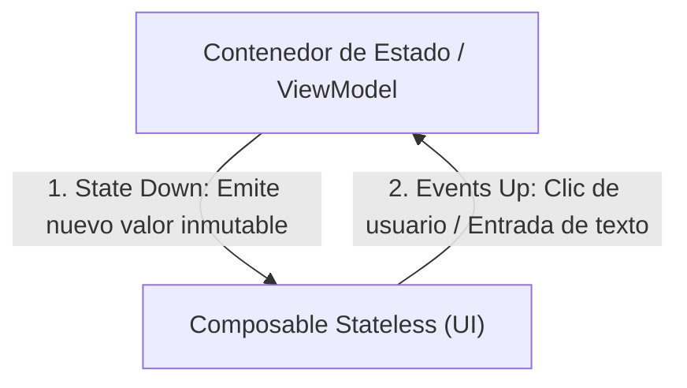
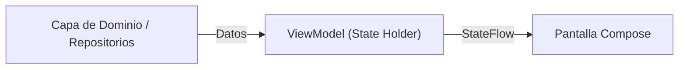

# Gestión de estado en Jetpack Compose

Jetpack Compose es un marco de trabajo moderno para la creación de interfaces de usuario en aplicaciones Android. Con Compose, puedes crear interfaces de usuario de manera declarativa, lo que significa que puedes definir cómo se ve tu aplicación en función del estado de la misma.

## ❓**¿Qué es el estado y por qué es importante ?**

Imagina que construyes una aplicación sin pensar en cómo se gestionan los datos. Al principio, todo parece funcionar. Un botón cambia un texto. Un campo de entrada muestra lo que el usuario escribe. Pero pronto, la complejidad crece:

-   ¿Qué pasa si al girar la pantalla todo el texto que el usuario escribió desaparece?
-   ¿Cómo se asegura una pantalla de que está mostrando los datos más actualizados que acaban de llegar de internet?
-   Si actualizas un dato en la pantalla A, ¿cómo se entera la pantalla B de que debe mostrar ese cambio?

Estos problemas surgen de una **gestión de estado deficiente o inexistente**. La gestión del estado no es un concepto académico y abstracto; es el pilar fundamental sobre el que se construye cualquier aplicación interactiva y fiable.

En esencia, el **estado** es la verdad; es el conjunto de datos que define cómo se ve y se comporta tu aplicación en un momento dado. La **gestión del estado** es la disciplina de controlar cómo y dónde fluye esa verdad a través de tu aplicación.

En Jetpack Compose, un framework de UI **declarativo**, esta importancia se multiplica por diez. A diferencia de los sistemas imperativos (como las Vistas de Android XML) donde tú manualmente buscas un `TextView` y le dices `setText()`, en Compose simplemente declaras: "La UI debe mostrar el valor de *esta* variable de estado". Cuando la variable cambia, la UI **reacciona y se actualiza sola**.

!!! tip "Importante"
    **dominar** la gestión del estado en Compose no es una opción, es el **requisito principal** para construir aplicaciones que funcionen correctamente, sean fáciles de mantener y estén libres de errores impredecibles.

### ¿Qué es el Estado en Jetpack Compose?

En Jetpack Compose, el **estado** es cualquier valor que puede cambiar con el tiempo y que, al hacerlo, debe provocar que la interfaz de usuario se actualice (se redibuje).

Piénsalo de esta manera:

-   El texto que un usuario introduce en un `TextField`.
-   El estado de un `Checkbox` (marcado o no marcado).
-   La posición de un `Slider`.
-   Una lista de mensajes que se carga desde una base de datos.

Todos estos son ejemplos de estado. Si el valor cambia, la UI debe reflejar ese cambio. El mecanismo por el cual Compose redibuja la UI cuando el estado cambia se llama **Recomposición**.

### Declarando el Estado: El Dúo Indispensable `remember` y `mutableStateOf`

Para que Compose pueda "observar" un valor y reaccionar a sus cambios, no podemos usar una variable normal como `var nombre = "Android"`. Necesitamos declararla de una forma especial. Aquí es donde entran en juego dos funciones clave:

1.  `mutableStateOf(valorInicial)`: Esta función toma un valor inicial y lo envuelve en un objeto `State` observable. Cuando el `.value` de este objeto cambia, Compose se entera y programa una recomposición para todas las funciones Composable que lean ese estado.

2.  `remember { ... }`: Las funciones Composable pueden ejecutarse muchas veces (durante las recomposiciones). `remember` es el antídoto contra la "amnesia" de la recomposición. Almacena en caché el resultado del bloque de código que se le pasa, asegurando que este valor **sobreviva** y no se reinicie cada vez que la UI se redibuja.

**La combinación de ambos es la fórmula mágica para el estado local en un Composable:**

`remember { mutableStateOf(valorInicial) }`

-   `mutableStateOf` crea el estado observable.
-   `remember` se asegura de que este estado no se pierda en las recomposiciones.

### Formas de Definir el Estado

Veamos un ejemplo práctico: un simple contador que incrementa un número cada vez que se presiona un botón. Exploraremos las tres formas sintácticas de declarar y usar el estado.

#### Ejemplo 1: La Forma Explícita con `.value`

Esta es la forma más literal. Accedemos y modificamos el valor del estado a través de su propiedad `.value`. Es excelente para entender lo que sucede internamente.

**Analogía:** Tienes una caja (`contadorState`) que es inmutable, pero puedes abrirla para cambiar su contenido (`contadorState.value`).

```kotlin
import androidx.compose.foundation.layout.Column
import androidx.compose.material3.*
import androidx.compose.runtime.*

@Composable
fun ContadorConValue() {
    // Creamos el estado y lo recordamos. Su tipo es MutableState<Int>.
    val contadorState = remember { mutableStateOf(0) }

    Column {
        // Para leer el valor, debemos usar .value
        Text(text = "Has presionado el botón ${contadorState.value} veces.")

        Button(onClick = {
            // Para modificar el valor, también usamos .value
            contadorState.value = contadorState.value + 1
        }) {
            Text("¡Presióname!")
        }
    }
}
```

---

#### Ejemplo 2: La Forma Idiomática con el Delegado `by`

Esta es la forma más común y recomendada en Kotlin. Usamos el delegado de propiedad `by` para que Compose gestione el acceso a `.value` por nosotros. El código resulta mucho más limpio y legible.

**Analogía:** Contratas a un asistente (`by`). En lugar de abrir la caja tú mismo, le pides el valor directamente a tu asistente, y él se encarga de los detalles.

```kotlin
import androidx.compose.foundation.layout.Column
import androidx.compose.material3.*
import androidx.compose.runtime.*

@Composable
fun ContadorConDelegado() {
    // Usamos 'var' porque reasignaremos el valor y 'by' para delegar.
    // 'contador' se comporta ahora como un Int, no como un State<Int>.
    var contador by remember { mutableStateOf(0) }

    Column {
        // Leemos el valor directamente, ¡sin .value!
        Text(text = "Has presionado el botón $contador veces.")

        Button(onClick = {
            // Modificamos el valor directamente.
            contador++ // o contador = contador + 1
        }) {
            Text("¡Presióname!")
        }
    }
}
```
*(Nota: Para usar el delegado `by`, es posible que necesites añadir `import androidx.compose.runtime.getValue` y `setValue`)*

---

#### Ejemplo 3: La Forma con Desestructuración

Esta sintaxis, popular en otros frameworks como React, permite desestructurar el estado en una variable de solo lectura para el valor y una función para actualizarlo.

**Analogía:** Tienes un termostato con dos partes: una pantalla que te muestra la temperatura (`contador`) y una rueda que te permite cambiarla (`setContador`).

```kotlin
import androidx.compose.foundation.layout.Column
import androidx.compose.material3.*
import androidx.compose.runtime.*

@Composable
fun ContadorDesestructurado() {
    // Desestructuramos el State en un valor y una función lambda para actualizarlo.
    val (contador, setContador) = remember { mutableStateOf(0) }

    Column {
        // Leemos el valor directamente.
        Text(text = "Has presionado el botón $contador veces.")

        Button(onClick = {
            // Usamos la función para establecer el nuevo valor.
            setContador(contador + 1)
        }) {
            Text("¡Presióname!")
        }
    }
}
```

!!! bug "Recuerda los puntos clave"

    1.  **El estado es la fuente de verdad** que impulsa tu UI.

    2.  La **recomposición** es el proceso automático por el cual Compose actualiza la UI cuando el estado cambia.

    3.  `mutableStateOf` crea un estado **observable** que Compose puede rastrear.

    4.  `remember` le da **memoria** a tus Composables, permitiendo que el estado sobreviva a las recomposiciones.

    5.  La sintaxis con el delegado **`by` es la forma preferida** por su simplicidad y legibilidad.


!!! info "Video introducción al manejo del estado en Compose"
    <iframe width="560" height="315" src="https://www.youtube.com/embed/R5o1aoUT78o?si=EkLkn1pirJROAgqc" title="YouTube video player" frameborder="0" allow="accelerometer; autoplay; clipboard-write; encrypted-media; gyroscope; picture-in-picture; web-share" referrerpolicy="strict-origin-when-cross-origin" allowfullscreen></iframe>


## 🔬 **Más en detalle**

Puedes definir el estado de tu aplicación utilizando la función `mutableStateOf()` de Compose.

```kotlin
val contador = mutableStateOf(0)
```

En el ejemplo anterior, se define un estado `contador` con un valor inicial de `0`.

### Observación de estado

Puedes observar el estado de tu aplicación utilizando la función `observeAsState()` de Compose.

```kotlin
val contadorState = contador.observeAsState()
val contador = contadorState.value
```

En el ejemplo anterior, se observa el estado `contador` y se obtiene su valor actual.

### Actualización de estado

Puedes actualizar el estado de tu aplicación utilizando la función `value` de Compose.

```kotlin
contador.value++
```

En el ejemplo anterior, se incrementa en uno el valor del estado `contador`.

!!! danger "¡Importante!"
    El estado en Compose es inmutable, por lo que debes utilizar la función `value` para actualizar el estado.

    Para que haya recomposición, la actualización del estado debe realizarse dentro de un evento de un componente `@Composable`.


#### Ejemplo completo

```kotlin
@Composable
fun Contador() {
    val contador = mutableStateOf(0)
    val contadorState = contador.observeAsState()
    
    Button(onClick = { contador.value++ }) {
        Text(text = "Contador: ${contadorState.value}")
    }
}
```

En el ejemplo anterior, se define un componente `Contador` que muestra un botón y un texto con el valor del estado `contador`. Al hacer clic en el botón, se incrementa en uno el valor del estado `contador`.

### Tipos de estado

En Jetpack Compose, puedes utilizar diferentes tipos de estado para gestionar la información de tu aplicación de forma reactiva.

- `mutableStateOf()`: Crea un estado mutable que puede cambiar a lo largo del tiempo.
- `remember`: Crea un estado que se mantiene entre recomposiciones.
- `derivedStateOf()`: Crea un estado derivado a partir de otros estados.

#### Uso de remember

La función `remember` de Compose te permite crear un estado que se mantiene entre recomposiciones.

```kotlin
@Composable
fun Contador() {
    val contador = remember { mutableStateOf(0) }
    val contadorState = contador.observeAsState()
    
    Button(onClick = { contador.value++ }) {
        Text(text = "Contador: ${contadorState.value}")
    }
}
```

En el ejemplo anterior, se utiliza la función `remember` para crear un estado `contador` que se mantiene entre recomposiciones.

#### Uso de rememberSaveable

La función `rememberSaveable` de Compose te permite crear un estado que se mantiene entre configuraciones.

```kotlin
@Composable
fun Contador() {
    val contador = rememberSaveable { mutableStateOf(0) }
    val contadorState = contador.observeAsState()
    
    Button(onClick = { contador.value++ }) {
        Text(text = "Contador: ${contadorState.value}")
    }
}
```

En el ejemplo anterior, se utiliza la función `rememberSaveable` para crear un estado `contador` que se mantiene entre configuraciones.

!!! tip "Remember vs RememberSaveable"
    La diferencia entre `remember` y `rememberSaveable` es que `rememberSaveable` guarda el estado en el `Bundle` de la actividad para que se pueda restaurar después de una recreación de la actividad.

    Esto es útil para guardar el estado de la aplicación cuando la actividad se destruye y se vuelve a crear, por ejemplo, al girar la pantalla.


#### Uso de derivedStateOf

La función `derivedStateOf` de Compose te permite crear un estado derivado a partir de otros estados.

```kotlin
@Composable
fun Contador() {
    val contador = mutableStateOf(0)
    val doble = derivedStateOf { contador.value * 2 }
    
    Button(onClick = { contador.value++ }) {
        Text(text = "Contador: ${contador.value}, Doble: ${doble.value}")
    }
}
```

En el ejemplo anterior, se utiliza la función `derivedStateOf` para crear un estado `doble` que es el doble del estado `contador`.

## 💦 **Flows en Kotlin**

En Kotlin, un `Flow` es una secuencia de valores que se emiten de forma asíncrona y reactiva. Los `Flow` te permiten trabajar con datos de forma reactiva y gestionar la concurrencia de forma sencilla.

!!! info "Explicación sencilla"

    Imagina que los Flows son como mangueras de agua 💧. Transportan datos (el agua) desde un emisor (el grifo) hasta un colector (alguien que recoge el agua). La diferencia entre los tipos de Flow radica en cómo y a quién entregan esa agua.

    Existen principalmente tres tipos que debes dominar:

    - Flow (**Frío** 🥶): Es la manguera estándar. Solo empieza a soltar agua (emitir datos) cuando alguien abre el grifo (collect). Cada persona que se conecta (collect) obtiene su propia manguera y recibe toda la secuencia de datos desde el principio. No empieza a producir si nadie está escuchando.

    - SharedFlow (**Caliente** 🔥): Es como un aspersor en un jardín. Emite datos constantemente (o bajo ciertas condiciones) sin importar si alguien está mirando o no. Múltiples colectores pueden conectarse a él y todos recibirán los mismos datos que se emitan después de que se conecten. Es ideal para eventos que deben ser compartidos entre varias partes de tu app (ej: "¡Pago realizado con éxito!").

    - StateFlow (**Caliente y con memoria** 🧐): Es una especialización de SharedFlow. Piensa en él como un termómetro digital en la pared. Siempre tiene un valor (la temperatura actual) y cualquiera que lo mire verá ese valor. Si el valor cambia, todos los que lo estén mirando verán la actualización. La clave es que **siempre tiene un valor inicial** y solo emite el valor más reciente a los nuevos colectores. No emite valores repetidos si son idénticos al anterior.


??? example "Ejemplo 1 `Flow`: El Flujo Frío"

    Un Flow solo se activa cuando se consume. Perfecto para operaciones de un solo disparo que devuelven una secuencia, como leer de una base de datos o hacer una petición de red.

    ```kotlin
    import kotlinx.coroutines.delay
    import kotlinx.coroutines.flow.Flow
    import kotlinx.coroutines.flow.flow
    import kotlinx.coroutines.runBlocking

    // 1. Definimos un Flow que emite números del 1 al 3, con una pausa.
    fun getNumeros(): Flow<Int> = flow {
        println("El Flow ha comenzado a emitir.")
        for (i in 1..3) {
            delay(1000) // Simula trabajo o espera
            emit(i)
        }
    }

    fun main() = runBlocking {
        println("Llamando a la función que devuelve el Flow...")
        val miFlow = getNumeros()
        
        println("Esperando para recolectar...")
        delay(2000)
        
        println("Iniciando la recolección.")
        miFlow.collect { numero ->
            println("Número recibido: $numero")
        }
        
        println("La recolección ha terminado.")
    }
    ```
    Resultado de la ejecución:

    ```text
    Llamando a la función que devuelve el Flow...
    Esperando para recolectar...
    Iniciando la recolección.
    El Flow ha comenzado a emitir. // <-- ¡NOTA! El código del flow no se ejecuta hasta el .collect()
    Número recibido: 1
    Número recibido: 2
    Número recibido: 3
    La recolección ha terminado.
    ```

??? example "Ejemplo 2 `SharedFlow`: El flujo para eventos"

    Ideal para enviar eventos a múltiples suscriptores. No tiene un estado inicial.

    ```kotlin
    import kotlinx.coroutines.delay
    import kotlinx.coroutines.flow.MutableSharedFlow
    import kotlinx.coroutines.launch
    import kotlinx.coroutines.runBlocking

    fun main() = runBlocking {
    // Creamos un SharedFlow mutable para poder emitir valores.
    val eventos = MutableSharedFlow<String>()

    // Lanzamos una corrutina para el primer suscriptor
    launch {
        println("Suscriptor 1 esperando eventos...")
        eventos.collect { evento ->
            println("Suscriptor 1 recibió: $evento")
        }
    }

    delay(500) // Damos tiempo a que el primer suscriptor se conecte

    println("Emitiendo 'Evento A'")
    eventos.emit("Evento A")

    // Lanzamos una segunda corrutina para otro suscriptor
    launch {
        println("Suscriptor 2 esperando eventos...")
        eventos.collect { evento ->
            println("Suscriptor 2 recibió: $evento")
        }
    }

    delay(500)

    println("Emitiendo 'Evento B'")
    eventos.emit("Evento B") // Ambos suscriptores reciben este
    }
    ```
    Resultado de la ejecución:

    ```text
    Suscriptor 1 esperando eventos...
    Emitiendo 'Evento A'
    Suscriptor 1 recibió: Evento A
    Suscriptor 2 esperando eventos...
    Emitiendo 'Evento B'
    Suscriptor 1 recibió: Evento B
    Suscriptor 2 recibió: Evento B // <-- Ambos reciben los eventos emitidos DESPUÉS de suscribirse
    ```


??? example "Ejemplo 3 `StateFlow`: El Rey de Jetpack Compose 👑"

    === "Ejemplo"
    
        En este ejemplo, crearemos una clase Carrito que expondrá el número de artículos como un StateFlow. Así, cualquier parte de nuestro código que esté "observando" el carrito sabrá inmediatamente cuántos artículos hay.

        ```kotlin
        import kotlinx.coroutines.*
        import kotlinx.coroutines.flow.MutableStateFlow
        import kotlinx.coroutines.flow.asStateFlow
        import kotlinx.coroutines.flow.update

        // 1. La clase que gestiona el estado
        class Carrito {

            // Privado y Mutable: Solo el carrito puede cambiar el número de artículos.
            // Lo inicializamos con un valor de 0 artículos.
            private val _numeroDeArticulos = MutableStateFlow(0)

            // Público e Inmutable: Exponemos el Flow como solo lectura.
            // Cualquiera puede observar cuántos artículos hay, pero no pueden cambiar el valor directamente.
            val numeroDeArticulos = _numeroDeArticulos.asStateFlow()

            fun anadirArticulo() {
                // Usamos .update para cambiar el valor de forma segura.
                // Es la forma recomendada para modificar un StateFlow.
                _numeroDeArticulos.update { valorActual ->
                    valorActual + 1
                }
                println("📦 Artículo añadido. Total: ${_numeroDeArticulos.value}")
            }

            fun quitarArticulo() {
                if (_numeroDeArticulos.value > 0) {
                    _numeroDeArticulos.update { it - 1 } // 'it' es el valor actual
                    println("🗑️ Artículo quitado. Total: ${_numeroDeArticulos.value}")
                } else {
                    println("⚠️ El carrito ya está vacío.")
                }
            }
        }

        // 2. La función principal que simula el uso
        fun main() = runBlocking {
            val miCarrito = Carrito()

            // Lanzamos una corrutina que se quedará observando el carrito.
            // Este sería el equivalente a nuestra "UI" o consumidor de datos.
            val jobObservador = launch {
                println("👀 Observador conectado. Esperando actualizaciones del carrito...")
                miCarrito.numeroDeArticulos.collect { total ->
                    // Este bloque se ejecutará cada vez que el valor del StateFlow cambie.
                    println("🛒 (Observador) El carrito ahora tiene $total artículos.")
                }
            }

            // Damos un pequeño respiro para que el observador se inicie
            delay(100)

            // Simulamos interacciones del usuario
            println("\n--- Simulación de usuario ---")
            miCarrito.anadirArticulo()
            delay(1000)

            miCarrito.anadirArticulo()
            delay(1000)

            miCarrito.quitarArticulo()
            delay(1000)

            miCarrito.quitarArticulo()
            delay(1000)

            miCarrito.quitarArticulo() // Intentamos quitar cuando está vacío
            println("--- Fin de la simulación ---\n")

            // Cancelamos la corrutina del observador para que el programa termine
            jobObservador.cancel()
        }
        ```
        Salida esperada en la consola:

        ```text
        👀 Observador conectado. Esperando actualizaciones del carrito...
        🛒 (Observador) El carrito ahora tiene 0 artículos.

        --- Simulación de usuario ---
        📦 Artículo añadido. Total: 1
        🛒 (Observador) El carrito ahora tiene 1 artículos.
        📦 Artículo añadido. Total: 2
        🛒 (Observador) El carrito ahora tiene 2 artículos.
        🗑️ Artículo quitado. Total: 1
        🛒 (Observador) El carrito ahora tiene 1 artículos.
        🗑️ Artículo quitado. Total: 0
        🛒 (Observador) El carrito ahora tiene 0 artículos.
        ⚠️ El carrito ya está vacío.
        --- Fin de la simulación ---
        ```
    === "Explicación del código"

      1.  **La Clase `Carrito`**:
          
          -   **`_numeroDeArticulos`**: Es un `MutableStateFlow`. El guion bajo `_` es una convención en Kotlin para indicar que es una propiedad privada que no debe usarse desde fuera. Al ser `Mutable`, esta clase puede cambiar su valor. **Siempre necesita un valor inicial** (en este caso, `0`).
              
          -   **`numeroDeArticulos`**: Esta es la versión pública y de solo lectura (`StateFlow`). La "UI" o el consumidor observará esta propiedad. Esto protege el estado; nadie fuera de la clase `Carrito` puede modificar el número de artículos. Es un principio de **encapsulación**.
              
          -   **`anadirArticulo()` y `quitarArticulo()`**: Son las acciones que modifican el estado interno (`_numeroDeArticulos`). La función `.update { ... }` es la forma moderna y segura de hacerlo.
              
      2.  **La Función `main`**:
          
          -   **`launch`**: Creamos un "observador" en una corrutina separada. Este se suscribe al `StateFlow` público.
              
          -   **`.collect`**: Aquí ocurre la magia. El código dentro de `.collect` se ejecuta **inmediatamente** con el valor actual del `StateFlow` (que es `0`) y luego se vuelve a ejecutar **cada vez que el valor cambia**.
              
          -   **`delay`**: Usamos pausas para simular el paso del tiempo y que se pueda ver claramente en la consola cómo el observador reacciona a los cambios.

Puedes crear un `Flow` utilizando la función `flowOf()` de Kotlin.

```kotlin
val numeros = flowOf(1, 2, 3, 4, 5)
```

En el ejemplo anterior, se crea un `Flow` `numeros` con los valores `1, 2, 3, 4, 5`.

### Observación de Flows

Puedes observar un `Flow` utilizando la función `collect()` de Kotlin.

```kotlin
numeros.collect { numero ->
    println(numero)
}
```

En el ejemplo anterior, se observa el `Flow` `numeros` y se imprime cada valor que se emite.

### Transformación de Flows

Puedes transformar un `Flow` utilizando operadores como `map`, `filter`, `flatMap`, etc.

```kotlin
val cuadrados = numeros.map { numero -> numero * numero }
val pares = numeros.filter { numero -> numero % 2 == 0 }
```

En el ejemplo anterior, se utilizan los operadores `map` y `filter` para transformar el `Flow` `numeros`.

### Tipos de flow en Kotlin


## Elevación del Estado (*State Hoisting*) y Patrón UDF

En Compose, un componente que gestiona su propio estado interno mediante `remember { mutableStateOf(...) }` se denomina **Stateful** (con estado). Aunque es cómodo para prototipos rápidos, tiene graves desventajas: es difícil de reutilizar, imposible de previsualizar en `@Preview` con datos variados y complejo de testear.

La técnica oficial para resolver esto es la **Elevación del Estado (*State Hoisting*)**, que consiste en trasladar el estado al componente padre que lo llamó, convirtiendo el componente hijo en **Stateless** (sin estado).

### La Regla de Oro del State Hoisting

Un composable *Stateless* **NUNCA debe recibir un `MutableState<T>`**. Debe recibir exactamente dos parámetros:

1. **El valor actual (Solo lectura):** `value: T`

2. **El evento de cambio (Lambda):** `onValueChange: (T) -> Unit` o `onClick: () -> Unit`

```kotlin
// ✅ COMPONENTE STATELESS (Reutilizable, testeable y previsualizable):
@Composable
fun ContadorControl(
    cuenta: Int,                // 1. El estado fluye hacia abajo (State Down)
    onIncrementar: () -> Unit,  // 2. El evento fluye hacia arriba (Event Up)
    modifier: Modifier = Modifier
) {
    Row(
        modifier = modifier.padding(16.dp),
        verticalAlignment = Alignment.CenterVertically
    ) {
        Text(text = "Total: $cuenta", style = MaterialTheme.typography.titleMedium)
        Spacer(modifier = Modifier.width(16.dp))
        Button(onClick = onIncrementar) {
            Text("Sumar +1")
        }
    }
}
```

### Arquitectura UDF (*Unidirectional Data Flow*)

La elevación de estado es la base del **Flujo de Datos Unidireccional (UDF)**:



- **El Estado fluye hacia abajo:** La pantalla solo lee datos inmutables y los pinta.
- **Los Eventos fluyen hacia arriba:** La pantalla no modifica ninguna variable; simplemente avisa hacia arriba invocando lambdas cuando el usuario interactúa.

---

## Modelado Profesional del Estado: `UiState`

Para pantallas reales (no solo contadores), Google recomienda encapsular todo lo que la pantalla necesita en un único objeto inmutable llamado **`UiState`**. Existen dos patrones oficiales:

### Patrón 1: Estados Mutuamente Excluyentes (`sealed interface`)
Ideal para pantallas que cambian por completo según el momento (Cargando, Éxito o Error):

```kotlin
sealed interface CatalogoUiState {
    data object Cargando : CatalogoUiState
    data class Exito(val juegos: List<String>) : CatalogoUiState
    data class Error(val mensaje: String) : CatalogoUiState
}
```

### Patrón 2: Estado Agregado Continuo (`data class`)
Ideal para formularios o pantallas con múltiples filtros y recarga en segundo plano:

```kotlin
data class FormularioUiState(
    val textoBusqueda: String = "",
    val isLoading: Boolean = false,
    val esFavorito: Boolean = false,
    val error: String? = null
)
```

---

## El `ViewModel` como State Holder en la Arquitectura

Cuando el estado de la pantalla debe sobrevivir a rotaciones de dispositivo, comunicarse con la base de datos o realizar llamadas de red, `remember` ya no es suficiente. Debemos delegar el estado en un **`ViewModel`** de Jetpack.



### 1. El ViewModel expone un `StateFlow`
El `ViewModel` mantiene un estado mutable privado y expone un `StateFlow` público inmutable:

```kotlin
class CatalogoViewModel(
    private val repository: GameRepository // Inyectado por Koin
) : ViewModel() {

    private val _uiState = MutableStateFlow<CatalogoUiState>(CatalogoUiState.Cargando)
    val uiState: StateFlow<CatalogoUiState> = _uiState.asStateFlow()

    init {
        cargarJuegos()
    }

    fun cargarJuegos() {
        viewModelScope.launch {
            _uiState.value = CatalogoUiState.Cargando
            try {
                val lista = repository.obtenerJuegos()
                _uiState.value = CatalogoUiState.Exito(lista)
            } catch (e: Exception) {
                _uiState.value = CatalogoUiState.Error(e.message ?: "Error desconocido")
            }
        }
    }
}
```

### 2. Consumo Seguro en Compose: `collectAsStateWithLifecycle()`

!!! danger "¡Cuidado con collectAsState() a secas!"
    La función `collectAsState()` de Compose sigue recolectando emisiones aunque la aplicación esté en segundo plano (minimizada o con la pantalla apagada), desperdiciando batería y ciclos de CPU.
    
    La **directriz obligatoria de Google** es utilizar **`collectAsStateWithLifecycle()`** (de la librería `androidx.lifecycle:lifecycle-runtime-compose`), que cancela la recolección cuando la Activity se detiene (`STOPPED`) y la reanuda automáticamente cuando vuelve a primer plano (`STARTED`).

### 3. La Estructura Pantalla Completa (*Stateful* vs. *Stateless*) con Koin:

```kotlin
import androidx.compose.runtime.Composable
import androidx.compose.runtime.getValue
import androidx.lifecycle.compose.collectAsStateWithLifecycle
import org.koin.androidx.compose.koinViewModel

// 1. COMPOSABLE STATEFUL: Resuelve Koin y recolecta el ciclo de vida
@Composable
fun CatalogoScreen(
    viewModel: CatalogoViewModel = koinViewModel(), // Inyección Koin
    onNavegarADetalle: (String) -> Unit
) {
    val uiState by viewModel.uiState.collectAsStateWithLifecycle()

    CatalogoContent(
        uiState = uiState,
        onReintentar = viewModel::cargarJuegos,
        onJuegoClick = onNavegarADetalle
    )
}

// 2. COMPOSABLE STATELESS: Puramente visual, previsualizable en @Preview
@Composable
fun CatalogoContent(
    uiState: CatalogoUiState,
    onReintentar: () -> Unit,
    onJuegoClick: (String) -> Unit,
    modifier: Modifier = Modifier
) {
    Box(modifier = modifier.fillMaxSize()) {
        when (uiState) {
            is CatalogoUiState.Cargando -> {
                CircularProgressIndicator(modifier = Modifier.align(Alignment.Center))
            }
            is CatalogoUiState.Error -> {
                Column(modifier = Modifier.align(Alignment.Center)) {
                    Text(text = "Error: ${uiState.mensaje}", color = MaterialTheme.colorScheme.error)
                    Button(onClick = onReintentar) { Text("Reintentar") }
                }
            }
            is CatalogoUiState.Exito -> {
                LazyColumn {
                    items(uiState.juegos, key = { it }) { juego ->
                        Text(
                            text = juego,
                            modifier = Modifier
                                .fillMaxWidth()
                                .clickable { onJuegoClick(juego) }
                                .padding(16.dp)
                        )
                    }
                }
            }
        }
    }
}
```

---

## 📚 Enlaces y Siguientes Pasos

- [Guía Oficial de Arquitectura en Android](../02-arquitectura/01-guia-arquitectura-google.md#capa-ui-layer): Conoce la relación entre la Capa de UI y el resto del sistema.
- [Clean Architecture en Android](../02-arquitectura/02-clean-architecture.md): Cómo desacoplar Dominio, Casos de Uso y Modelos.
- [Inyección de Dependencias con Koin](../02-arquitectura/03-inyeccion-dependencias-koin.md#inyeccion-en-compose-koinviewmodel): Cómo configurar y registrar ViewModels para inyectarlos con `koinViewModel()`.
- [Tipos Sellados y UiState en Kotlin](../00-kotlin/26-sealed-classes.md#5-el-patron-universal-de-arquitectura-en-android-uistate): Teoría del lenguaje sobre `sealed interface` y `data object`.