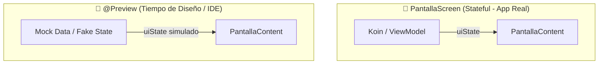

# Diseño Ágil con @Preview y Datos Mock en Jetpack Compose

Una de las mayores revoluciones de Jetpack Compose respecto al antiguo sistema de vistas XML es la capacidad de **diseñar, iterar y validar interfaces de usuario en tiempo real sin ejecutar la aplicación en un emulador o dispositivo físico**. 

Este flujo de trabajo se denomina **Preview-Driven Development (Desarrollo Guiado por Previsualización)**: permite visualizar instantáneamente cómo responde un componente ante diferentes estados de la UI, temas de color (claro/oscuro), idiomas o tamaños de pantalla utilizando datos simulados (*Mock Data*).

---

## 1. El Principio Arquitectónico: Stateful vs Stateless

Para que una pantalla completa o componente pueda previsualizarse con `@Preview`, **su diseño debe estar desacoplado del `ViewModel` y de la inyección de dependencias**.

!!! danger "Por qué falla `@Preview` con un ViewModel"
    Las funciones anotadas con `@Preview` se renderizan dentro del propio motor gráfico de Android Studio/IntelliJ, **sin un sistema operativo Android completo en ejecución**. Si un `@Preview` intenta instanciar un `ViewModel` real o resolver dependencias de Koin/Room, la vista previa fallará con un error en tiempo de diseño.

La solución estándar consiste en dividir cada pantalla en dos composables:

1. **`PantallaScreen` (Stateful):** Inyecta el ViewModel (o Koin), observa el `UiState` y conecta los eventos. No lleva `@Preview`.
2. **`PantallaContent` (Stateless):** Es una función pura. Solo recibe el `UiState` inmutable y expone lambdas para los eventos. **¡Esta es la función que se previsualiza y testea!**



### Ejemplo de Implementación Desacoplada

```kotlin
import androidx.compose.runtime.Composable
import androidx.compose.runtime.getValue
import androidx.lifecycle.compose.collectAsStateWithLifecycle
import org.koin.androidx.compose.koinViewModel

// 1. Contenedor Stateful (Producción)
@Composable
fun CatalogoJuegosScreen(
    onNavegarADetalle: (Long) -> Unit,
    viewModel: CatalogoViewModel = koinViewModel()
) {
    val uiState by viewModel.uiState.collectAsStateWithLifecycle()

    CatalogoJuegosContent(
        uiState = uiState,
        onJuegoClick = onNavegarADetalle,
        onReintentar = { viewModel.cargarJuegos() }
    )
}

// 2. Contenedor Stateless (Previsualizable y Testeable)
@Composable
fun CatalogoJuegosContent(
    uiState: CatalogoUiState,
    onJuegoClick: (Long) -> Unit,
    onReintentar: () -> Unit,
    modifier: Modifier = Modifier
) {
    when (uiState) {
        is CatalogoUiState.Cargando -> IndicadorCarga(modifier)
        is CatalogoUiState.Error -> PantallaError(mensaje = uiState.mensaje, onReintentar = onReintentar)
        is CatalogoUiState.Exito -> ListaJuegos(juegos = uiState.juegos, onJuegoClick = onJuegoClick)
    }
}
```

---

## 2. Configuración de `@Preview`

La anotación `@Preview` acepta múltiples parámetros para simular diversos entornos de ejecución:

```kotlin
import android.content.res.Configuration
import androidx.compose.material3.MaterialTheme
import androidx.compose.material3.Surface
import androidx.compose.runtime.Composable
import androidx.compose.ui.tooling.preview.Devices
import androidx.compose.ui.tooling.preview.Preview

// Previsualización simple con fondo
@Preview(name = "Vista Estándar", showBackground = true)
@Composable
fun CatalogoPreview() {
    MaterialTheme {
        CatalogoJuegosContent(
            uiState = CatalogoUiState.Exito(juegos = JuegosMock.listaEjemplo),
            onJuegoClick = {},
            onReintentar = {}
        )
    }
}

// Previsualización en Modo Oscuro
@Preview(
    name = "Modo Noche",
    showBackground = true,
    uiMode = Configuration.UI_MODE_NIGHT_YES
)
@Composable
fun CatalogoNochePreview() {
    MiAplicacionTheme(darkTheme = true) {
        Surface {
            CatalogoJuegosContent(
                uiState = CatalogoUiState.Exito(juegos = JuegosMock.listaEjemplo),
                onJuegoClick = {},
                onReintentar = {}
            )
        }
    }
}

// Previsualización en Tablet
@Preview(
    name = "Formato Tablet",
    device = Devices.TABLET,
    showSystemUi = true
)
@Composable
fun CatalogoTabletPreview() {
    MiAplicacionTheme {
        CatalogoJuegosContent(
            uiState = CatalogoUiState.Exito(juegos = JuegosMock.listaEjemplo),
            onJuegoClick = {},
            onReintentar = {}
        )
    }
}
```

---

## 3. Multipreviews Personalizadas (Anotaciones Compuestas)

En lugar de copiar y pegar múltiples `@Preview` encima de cada composable, Compose permite crear tus propias **Multi-anotaciones**:

```kotlin
import android.content.res.Configuration
import androidx.compose.ui.tooling.preview.Preview

// Definimos una anotación reutilizable que genera vista clara y oscura a la vez
@Preview(name = "1. Modo Claro", showBackground = true)
@Preview(name = "2. Modo Oscuro", showBackground = true, uiMode = Configuration.UI_MODE_NIGHT_YES)
annotation class ModoClaroOscuroPreview

// Uso en cualquier composable
@ModoClaroOscuroPreview
@Composable
fun TarjetaJuegoPreview() {
    MiAplicacionTheme {
        TarjetaJuego(juego = JuegosMock.zelda)
    }
}
```

---

## 4. Creación de Datos Simulados (Mock Data)

Tener un archivo centralizado de objetos de prueba ahorra tiempo y garantiza consistencia visual en todo el equipo de desarrollo.

```kotlin
// Archivo: JuegosMock.kt (en src/debug/ o en el mismo paquete)
object JuegosMock {
    val zelda = Juego(
        id = 1L,
        titulo = "The Legend of Zelda: Tears of the Kingdom",
        precio = 69.99,
        portadaUrl = "https://example.com/zelda.jpg",
        esFavorito = true
    )

    val hollowKnight = Juego(
        id = 2L,
        titulo = "Hollow Knight",
        precio = 14.99,
        portadaUrl = "https://example.com/hollow.jpg",
        esFavorito = false
    )

    val listaEjemplo = listOf(zelda, hollowKnight)
}
```

---

## 5. Previsualización de Todos los Estados de la Pantalla

Al modelar el `UiState` con una `sealed interface`, podemos renderizar en el IDE simultáneamente todas las posibles bifurcaciones visuales de la pantalla:

```kotlin
@Preview(name = "1. Estado Cargando", showBackground = true)
@Composable
fun EstadoCargandoPreview() {
    MiAplicacionTheme {
        CatalogoJuegosContent(
            uiState = CatalogoUiState.Cargando,
            onJuegoClick = {},
            onReintentar = {}
        )
    }
}

@Preview(name = "2. Estado Éxito con Datos", showBackground = true)
@Composable
fun EstadoExitoPreview() {
    MiAplicacionTheme {
        CatalogoJuegosContent(
            uiState = CatalogoUiState.Exito(juegos = JuegosMock.listaEjemplo),
            onJuegoClick = {},
            onReintentar = {}
        )
    }
}

@Preview(name = "3. Estado Éxito pero Lista Vacía", showBackground = true)
@Composable
fun EstadoVacioPreview() {
    MiAplicacionTheme {
        CatalogoJuegosContent(
            uiState = CatalogoUiState.Exito(juegos = emptyList()),
            onJuegoClick = {},
            onReintentar = {}
        )
    }
}

@Preview(name = "4. Estado Error de Conexión", showBackground = true)
@Composable
fun EstadoErrorPreview() {
    MiAplicacionTheme {
        CatalogoJuegosContent(
            uiState = CatalogoUiState.Error("No se pudo conectar con el servidor"),
            onJuegoClick = {},
            onReintentar = {}
        )
    }
}
```

---

## 6. Proveedores Dinámicos con `@PreviewParameter`

Cuando un componente debe probarse con múltiples variantes de un mismo modelo (por ejemplo, una `TarjetaJuego` con título corto, título ultra largo, juego gratis o juego de 80€), se utiliza `PreviewParameterProvider`:

```kotlin
import androidx.compose.ui.tooling.preview.Preview
import androidx.compose.ui.tooling.preview.PreviewParameter
import androidx.compose.ui.tooling.preview.PreviewParameterProvider

class JuegoVariantesProvider : PreviewParameterProvider<Juego> {
    override val values: Sequence<Juego> = sequenceOf(
        Juego(id = 1L, titulo = "Tetris", precio = 0.0, esFavorito = false),
        Juego(id = 2L, titulo = "Hollow Knight: Silksong (Edición Coleccionista con Título Extremadamente Largo)", precio = 49.99, esFavorito = true),
        Juego(id = 3L, titulo = "Cyberpunk 2077", precio = 59.99, esFavorito = false)
    )
}

@Preview(showBackground = true)
@Composable
fun TarjetaJuegoVariantesPreview(
    @PreviewParameter(JuegoVariantesProvider::class) juego: Juego
) {
    MiAplicacionTheme {
        TarjetaJuego(juego = juego)
    }
}
```

!!! tip "Detección de errores de diseño antes de compilar"
    Gracias a este proveedor, el IDE renderizará automáticamente **3 tarjetas distintas**. Podrás verificar inmediatamente si un título largo rompe el diseño (*text overflow*), si el texto gratis se ve bien formateado o si el icono de favorito queda alineado correctamente, todo en menos de un segundo.

---

## 📚 Enlaces Relacionados

- [Gestión de Estado y UiState](./22-state-management.md#modelado-del-uistate)
- [Funciones Componibles y Modificadores](./21-composable-functions.md)
- [Testing en Android y KMP](../02-arquitectura/06-testing-android-kmp.md)
