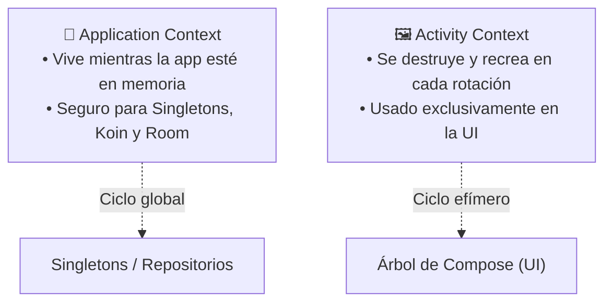
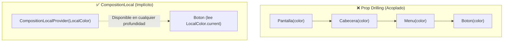
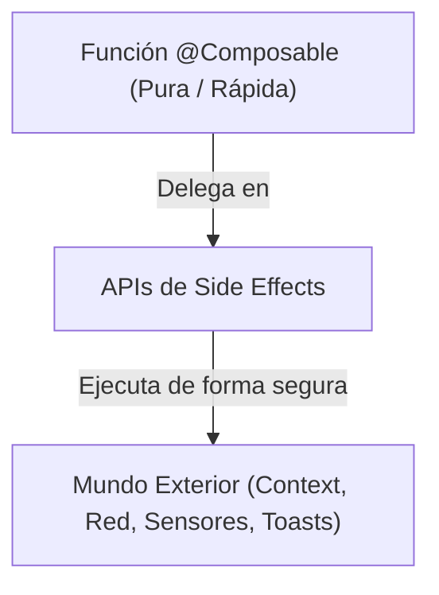

# Contexto en Android, CompositionLocal y Efectos Secundarios

En el desarrollo de aplicaciones con Jetpack Compose existen conceptos avanzados que conectan el árbol visual declarativo con el sistema operativo subyacente de Android. Dos de los más determinantes para arquitecturas limpias y sin fugas de memoria son el **manejo del `Context`**, la inyección implícita de datos en el árbol mediante **`CompositionLocal` y sus Providers**, y el control de operaciones asíncronas con **Efectos Secundarios (*Side Effects*)**.

---

## 1. El Concepto de Context en Android: Tipos y Riesgos

El objeto `Context` es la puerta de entrada a los servicios y recursos del sistema operativo Android. Permite acceder a recursos del paquete (`strings.xml`, imágenes), interactuar con el sistema de archivos, enviar mensajes a otros componentes mediante `Intent` e interactuar con servicios del dispositivo (geolocalización, vibración, Bluetooth).

Sin embargo, en Android coexisten dos tipos principales de `Context` con ciclos de vida radicalmente diferentes:



1. **`ApplicationContext` (Contexto de Aplicación):**
   
   - Está asociado al proceso global de la aplicación.
   - Nace cuando se inicia la app y muere únicamente cuando el sistema operativo elimina el proceso de la memoria RAM.
   - **Es seguro guardarlo** en dependencias globales, bases de datos (Room) o módulos de Koin.

2. **`ActivityContext` (Contexto de Actividad):**
   
   - Está asociado a una pantalla gráfica concreta (`ComponentActivity`).
   - Se destruye y recrea cada vez que ocurre un cambio de configuración (rotar el teléfono, cambiar de idioma o alternar el modo oscuro).
   - **¡PELIGRO DE MEMORY LEAK!** Si pasas este contexto a un `ViewModel`, a un `Repository` o a una corrutina de fondo, la pantalla destruida quedará retenida en la memoria RAM, provocando una fuga de memoria masiva (*OutOfMemoryError*).

### Obtención Segura del Contexto en Compose

En Jetpack Compose, **nunca** debes pasar el `Context` como parámetro de constructor a tus clases de negocio. Si una función composable requiere el contexto para una acción visual (como lanzar un `Toast` o un `Intent` para abrir una página web), debe obtenerlo localmente mediante:

```kotlin
import android.content.Intent
import android.net.Uri
import androidx.compose.material3.Button
import androidx.compose.material3.Text
import androidx.compose.runtime.Composable
import androidx.compose.ui.platform.LocalContext

@Composable
fun BotonAbrirWeb(url: String) {
    // Obtenemos el contexto actual de forma segura desde el árbol de composición
    val context = LocalContext.current

    Button(
        onClick = {
            val intent = Intent(Intent.ACTION_VIEW, Uri.parse(url))
            context.startActivity(intent)
        }
    ) {
        Text("Visitar sitio oficial")
    }
}
```

---

## 2. El Problema del *Prop Drilling* y la Solución con CompositionLocal

Imagina que tienes una jerarquía visual con 10 niveles de composables anidados y el botón del nivel más profundo necesita conocer el espaciado o los colores de la marca.

El enfoque tradicional obligaría a pasar ese parámetro manualmente a través de los 10 componentes intermedios, aunque a 9 de ellos no les interese dicho dato. Este anti-patrón se denomina **Prop Drilling** (*perforación de propiedades*) y vuelve el código rígido, acoplado y difícil de mantener.



### ¿Qué es `CompositionLocal`?

`CompositionLocal` es una herramienta de Jetpack Compose que permite **hacer que ciertos datos fluyan de manera implícita hacia abajo en el árbol de componentes**, sin necesidad de declararlos explícitamente en los parámetros de cada función.

De hecho, Compose utiliza `CompositionLocal` internamente para proveer casi todo su entorno:

- `LocalContext.current`: El contexto de Android de la ventana actual.
- `LocalDensity.current`: La densidad de píxeles (`dp` a `px`) de la pantalla.
- `LocalTextStyle.current`: El estilo tipográfico activo en ese nodo.
- `LocalFocusManager.current`: El gestor del foco del teclado.
- `LocalClipboardManager.current`: Acceso al portapapeles del sistema.

---

## 3. Sobrescritura de Valores con `CompositionLocalProvider`

Con `CompositionLocalProvider`, podemos alterar el valor de cualquier `CompositionLocal` para un subárbol completo de composables:

```kotlin
import androidx.compose.foundation.layout.Column
import androidx.compose.material3.LocalContentColor
import androidx.compose.material3.LocalTextStyle
import androidx.compose.material3.MaterialTheme
import androidx.compose.material3.Text
import androidx.compose.runtime.Composable
import androidx.compose.runtime.CompositionLocalProvider

@Composable
fun EjemploSobrescrituraLocal() {
    Column {
        Text("Texto normal con estilos por defecto")

        // Proveemos un nuevo color y tipografía solo para los composables dentro de este bloque
        CompositionLocalProvider(
            LocalContentColor provides MaterialTheme.colorScheme.error,
            LocalTextStyle provides MaterialTheme.typography.labelSmall
        ) {
            // Todos los hijos heredan implícitamente estas propiedades sin pasarlas por parámetro
            Text("Aviso: La suscripción está próxima a caducar.")
            Text("Por favor, actualiza tu método de pago.")
        }

        Text("Texto de nuevo con los estilos estándar")
    }
}
```

---

## 4. Creación de Providers Propios: Espaciados Adaptativos (`LocalSpacing`)

Uno de los usos más potentes y profesionales de `CompositionLocal` es crear un sistema de **espaciados consistentes** para toda la aplicación que pueda cambiar dinámicamente según si el dispositivo es un móvil compacto o una tablet.

### Paso 1: Definir la clase de datos de espaciados

```kotlin
import androidx.compose.ui.unit.Dp
import androidx.compose.ui.unit.dp

data class AppSpacing(
    val extraSmall: Dp = 4.dp,
    val small: Dp = 8.dp,
    val medium: Dp = 16.dp,
    val large: Dp = 24.dp,
    val extraLarge: Dp = 32.dp
)
```

### Paso 2: Crear el `CompositionLocal`

Compose ofrece dos funciones para instanciar un `CompositionLocal`:

- **`staticCompositionLocalOf`:** Úsalo para datos que **cambian rara vez o nunca** (como espaciados o temas). Si el valor cambia, Compose recompone todo el subárbol completo, pero consume muy poca memoria mientras no cambie.
- **`compositionLocalOf`:** Úsalo para datos que **cambian frecuentemente** (como animaciones o estados en tiempo real). Solo recompone los componentes que lean efectivamente ese valor con `.current`.

```kotlin
import androidx.compose.runtime.staticCompositionLocalOf

// Valor por defecto en caso de que un composable se use fuera de un Provider
val LocalAppSpacing = staticCompositionLocalOf { AppSpacing() }
```

### Paso 3: Proveer los valores en la raíz del tema

```kotlin
import androidx.compose.runtime.Composable
import androidx.compose.runtime.CompositionLocalProvider

@Composable
fun MiAplicacionTheme(
    spacing: AppSpacing = AppSpacing(),
    content: @Composable () -> Unit
) {
    CompositionLocalProvider(LocalAppSpacing provides spacing) {
        MaterialTheme(content = content)
    }
}
```

### Paso 4: Consumir el espaciado en cualquier composable

```kotlin
import androidx.compose.foundation.layout.padding
import androidx.compose.material3.Card
import androidx.compose.material3.Text
import androidx.compose.runtime.Composable
import androidx.compose.ui.Modifier

@Composable
fun TarjetaConEspaciadoCentralizado() {
    // Acceso directo y desacoplado al espaciado oficial
    val spacing = LocalAppSpacing.current

    Card(modifier = Modifier.padding(spacing.medium)) {
        Text("Contenido con espaciado consistente", modifier = Modifier.padding(spacing.small))
    }
}
```

---

## 5. Efectos Secundarios (*Side Effects*): Cruzando la frontera de la Composición

Las funciones composables deben ser **puras**: deben ejecutarse rápidamente, en cualquier orden y recomponerse decenas de veces sin producir cambios en el mundo exterior (*side effects*).

Si necesitas ejecutar código que interactúe con el `Context`, corrutinas o listeners del sistema operativo, **debes encapsularlo en las APIs de Efectos de Jetpack Compose**:



### 1. `LaunchedEffect`: Ejecutar corrutinas asociadas a un ciclo de vida

Se ejecuta cuando el composable entra en pantalla por primera vez o cuando cambia una de sus claves (*keys*):

```kotlin
import androidx.compose.runtime.Composable
import androidx.compose.runtime.LaunchedEffect
import kotlinx.coroutines.delay

@Composable
fun TemporizadorMensaje(mensajeId: Long, onExpirado: () -> Unit) {
    // Se cancela y reinicia automáticamente si mensajeId cambia
    LaunchedEffect(key1 = mensajeId) {
        delay(3000)
        onExpirado()
    }
}
```

### 2. `rememberCoroutineScope`: Lanzar corrutinas desde eventos del usuario

Permite obtener un `CoroutineScope` atado al ciclo de vida del composable para invocar funciones suspendidas desde lambdas (`onClick`):

```kotlin
import androidx.compose.material3.Button
import androidx.compose.material3.SnackbarHostState
import androidx.compose.material3.Text
import androidx.compose.runtime.Composable
import androidx.compose.runtime.rememberCoroutineScope
import kotlinx.coroutines.launch

@Composable
fun BotonConSnackbar(snackbarHostState: SnackbarHostState) {
    val scope = rememberCoroutineScope()

    Button(
        onClick = {
            scope.launch {
                snackbarHostState.showSnackbar("Operación completada con éxito")
            }
        }
    ) {
        Text("Guardar")
    }
}
```

### 3. `DisposableEffect`: Registrar y limpiar listeners usando el Context

Ideal para componentes que deben suscribirse a eventos del sistema (sensores, geolocalización o receptores de broadcast con el `LocalContext`) y desuscribirse cuando el composable desaparece de la pantalla para evitar fugas de memoria:

```kotlin
import android.content.BroadcastReceiver
import android.content.Context
import android.content.Intent
import android.content.IntentFilter
import androidx.compose.runtime.Composable
import androidx.compose.runtime.DisposableEffect
import androidx.compose.ui.platform.LocalContext

@Composable
fun ReceptorBateria() {
    val context = LocalContext.current

    DisposableEffect(key1 = context) {
        val receiver = object : BroadcastReceiver() {
            override fun onReceive(context: Context?, intent: Intent?) {
                // Notificar cambio de nivel de batería
            }
        }

        val filter = IntentFilter(Intent.ACTION_BATTERY_CHANGED)
        context.registerReceiver(receiver, filter)

        // Limpieza obligatoria: se ejecuta cuando el composable sale de pantalla
        onDispose {
            context.unregisterReceiver(receiver)
        }
    }
}
```

---

## 📚 Enlaces y Conexiones

- [Gestión del Estado y UDF](./22-state-management.md)
- [Diseño Ágil con @Preview y Datos Mock](./26-preview-diseno-mock.md)
- [Glosario y Patrones Clave de Arquitectura](../02-arquitectura/05-glosario-patrones.md)
- [Documentación oficial de CompositionLocal (Google Developers)](https://developer.android.com/develop/ui/compose/compositionlocal)
