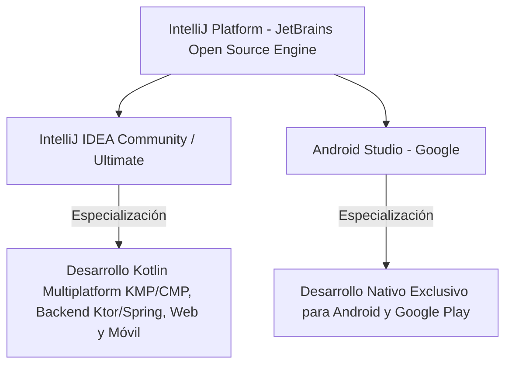
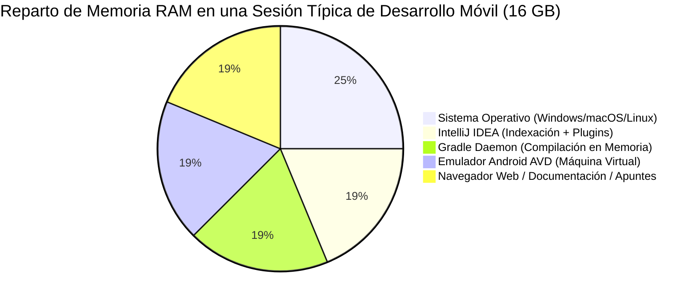
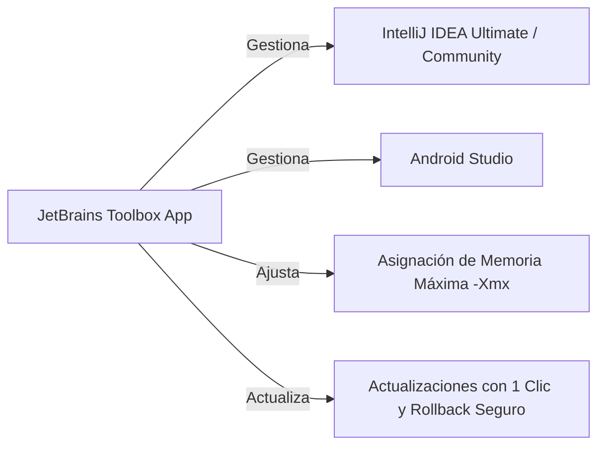
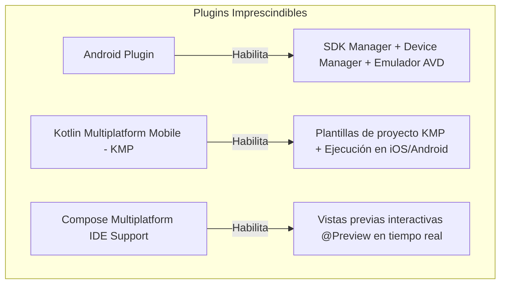
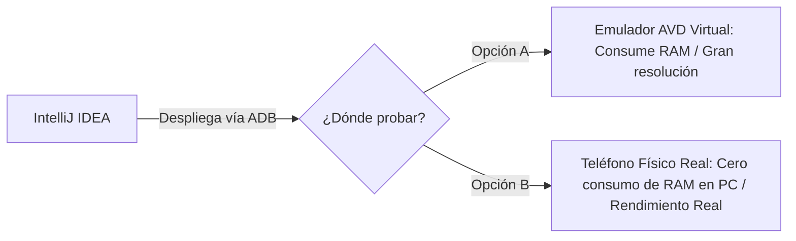

# Configuración de IntelliJ IDEA para Desarrollo Móvil y KMP

---

## 1. Introducción: ¿Por qué IntelliJ IDEA para Desarrollo Móvil?

Cuando pensamos en programar aplicaciones para Android, la primera herramienta que suele venir a la mente es **Android Studio**. Sin embargo, en el panorama del desarrollo moderno —y muy especialmente con la eclosión de **Kotlin Multiplatform (KMP)** y **Compose Multiplatform (CMP)**—, **IntelliJ IDEA** se ha consolidado como un entorno de desarrollo integrado (IDE) de primer nivel para construir aplicaciones móviles.

Para entender la relación entre ambas herramientas, conviene recordar un dato clave de ingeniería:

> **Android Studio está construido por Google sobre la base de código abierto de IntelliJ IDEA Community Edition.**

Ambos entornos comparten el mismo motor de indexación, los mismos atajos de teclado, el mismo depurador y la misma integración con el compilador de Kotlin desarrollado por JetBrains.



### 1.1. IntelliJ IDEA vs Android Studio: ¿Cuándo Usar Cuál?

| Criterio | Android Studio (Google) | IntelliJ IDEA (JetBrains) |
| :--- | :--- | :--- |
| **Enfoque Principal** | Desarrollo exclusivo para el ecosistema Android (móvil, Wear OS, Android TV, Auto). | Desarrollo multiplataforma integral: **KMP**, Compose Multiplatform, Backend (Ktor/Spring), Web y Android. |
| **Soporte de Kotlin Multiplatform (KMP)** | Soporte centrado en la parte Android; soporte limitado para targets de Desktop o Web. | **Soporte nativo excelente** para todos los targets: Android, iOS, Desktop (Windows/Mac/Linux) y Web (Wasm). |
| **Desarrollo Fullstack (Móvil + API Backend)** | Poco práctico; orientado exclusivamente al cliente Android. | **Ideal:** Puedes tener en el mismo espacio de trabajo la app móvil y el microservicio backend en Kotlin. |
| **Herramientas de Base de Datos** | App Inspection básico para Room/SQLite en el dispositivo. | **DataGrip integrado** (en Ultimate): conexión y gestión visual de bases de datos PostgreSQL, MySQL, SQLite, etc. |
| **Licenciamiento** | 100% Gratuito (Google / Apache 2.0). | Versión **Community** (gratuita) y versión **Ultimate** (comercial, con **licencia gratuita para alumnos de FP**). |

---

## 2. Requisitos Hardware del Equipo Anfitrión

El desarrollo móvil es, con diferencia, una de las disciplinas más exigentes en consumo de recursos dentro de la informática. No solo se ejecuta el IDE; de forma simultánea conviven el compilador de Kotlin, el demonio en segundo plano de **Gradle**, los analizadores de código y el **emulador de Android (AVD)**, que no es más que una máquina virtual completa ejecutando el sistema operativo móvil sobre el procesador de tu ordenador.



### 2.1. Procesador (CPU) y Virtualización
- **Mínimo:** Procesador de 4 núcleos y 8 hilos (Intel Core i5 de 10ª gen, AMD Ryzen 5 serie 3000 o Apple Silicon M1).
- **Recomendado:** 6 a 8 núcleos o superior (Intel Core i7/i9, AMD Ryzen 7 o Apple Silicon M1/M2/M3/M4 Pro/Max).
- **Requisito Obligatorio: Virtualización Hardware activada en BIOS/UEFI.**
  El emulador de Android requiere tecnologías de virtualización asistida por hardware:
  - **Intel VT-x** (en procesadores Intel).
  - **AMD-V / SVM** (en procesadores AMD).
  - En equipos con **Apple Silicon (ARM)**, la virtualización es nativa y el emulador de Android vuela con un consumo de batería mínimo al no requerir traducción de arquitectura de CPU (ARM sobre ARM).

### 2.2. Memoria RAM
- **8 GB (Mínimo absoluto):** Muy ajustado. Al arrancar el emulador de Android junto con IntelliJ y varias pestañas del navegador, el sistema operativo sufrirá presión de memoria y recurrirá a paginación en disco, ralentizando todo el ordenador.
  !!! tip "Consejo si tienes 8 GB de RAM"
      En lugar de usar un emulador virtual (AVD), **conecta un teléfono móvil físico real** por cable USB con depuración activada. Te ahorrarás entre 2 y 4 GB de consumo de RAM en tu ordenador.
- **16 GB (El estándar recomendado para el curso):** Permite trabajar con fluidez, manteniendo el IDE, el emulador y el navegador abiertos simultáneamente.
- **32 GB (Óptimo para proyectos profesionales y KMP):** Compilación instantánea con amplios cachés de Gradle en memoria.

### 2.3. Almacenamiento: Disco SSD Obligatorio
- **Un disco de estado sólido (SSD NVMe o SATA) es estrictamente necesario.**
  Gradle realiza miles de operaciones de lectura y escritura de archivos pequeños durante cada compilación. En un disco duro mecánico tradicional (HDD), una compilación que en SSD tarda 15 segundos puede demorarse más de 2 o 3 minutos.
- **Espacio libre necesario:** Reserva un mínimo de **30 a 50 GB de espacio libre** en disco para:
  - Instalación del IDE y plugins (~3 GB).
  - Android SDK, Command-line Tools y Build-Tools (~10-15 GB).
  - Imágenes del sistema para el emulador AVD (cada imagen de Android ocupa entre 3 y 6 GB).
  - Caché local de Gradle y dependencias Maven (`~/.gradle/caches/`, que crece rápidamente).

---

## 3. Ediciones de IntelliJ IDEA: Community vs Ultimate

JetBrains distribuye IntelliJ IDEA en dos variantes principales:

### 3.1. IntelliJ IDEA Community Edition
- **Coste:** 100% Gratuita y de código abierto (licencia Apache 2.0).
- **Alcance:** Soporte completo para Java, Kotlin, Gradle, Git y desarrollo Android mediante plugins oficiales.
- **Limitaciones:** No incluye herramientas avanzadas de perfilado de bases de datos, diagramas arquitectónicos ni soporte para tecnologías web fullstack (Spring Boot, frameworks JavaScript avanzados).

### 3.2. IntelliJ IDEA Ultimate Edition (Licencia Educativa Gratuita)
- Es la versión comercial profesional completa de JetBrains.
- **¡Gratis para estudiantes y profesores de Formación Profesional!**
  JetBrains ofrece el programa **JetBrains Student Pack**, que otorga una licencia anual renovable para todo el catálogo de herramientas (IntelliJ Ultimate, DataGrip, CLion, WebStorm, etc.).

!!! info "Cómo Solicitar tu Licencia de Estudiante Gratuita"
    1. Accede al portal oficial de [JetBrains Student Support](https://www.jetbrains.com/community/education/#students).
    2. Pulsa en **Apply Now**.
    3. Selecciona el método de verificación:
       - **University email address:** Introduce tu correo electrónico educativo oficial proporcionado por tu centro o consejería educativa (por ejemplo, terminados en `.edu`, `@g.educaand.es`, etc.).
       - **Documentación oficial:** Si tu correo no es reconocido automáticamente, puedes adjuntar una fotografía de tu matrícula escolar o carnet de estudiante del curso 2026/2027.
    4. Recibirás un correo de confirmación para activar tu cuenta de JetBrains y vincularla a tu IDE.

---

## 4. Métodos de Instalación

Existen dos vías para instalar IntelliJ IDEA en tu sistema operativo:

### Método A (Recomendado): Mediante JetBrains Toolbox App

**JetBrains Toolbox** es un gestor ligero de escritorio oficial que centraliza todas las herramientas de JetBrains.



**Ventajas de usar Toolbox:**
1. **Actualizaciones sin roturas:** Actualiza el IDE en segundo plano manteniendo intactos tus proyectos, plugins y preferencias.
2. **Rollback:** Si una actualización reciente presenta incompatibilidades con algún plugin, permite volver a la versión anterior con un solo clic.
3. **Gestión de Memoria JVM:** Permite ajustar la memoria RAM asignada al IDE (`-Xmx`) desde una interfaz gráfica sin editar archivos `.vmoptions` a mano.

👉 **Descarga:** [Descargar JetBrains Toolbox App](https://www.jetbrains.com/toolbox-app/)

---

### Método B: Instalación Individual Tradicional

Si prefieres no utilizar Toolbox, puedes descargar directamente el instalador standalone:

- **Windows:** Descarga el instalador ejecutable (`.exe`). Durante el asistente, marca las opciones de:
  - *Add "bin" folder to the PATH* (para ejecutar el IDE desde la terminal).
  - *Create Desktop Shortcut*.
  - *Add "Open Folder as Project" to context menu*.
- **macOS:** Descarga la imagen de disco (`.dmg`). **Presta atención a la arquitectura de tu procesador:**
  - Descarga la versión **Apple Silicon (ARM64)** si tu Mac tiene chip M1, M2, M3 o M4.
  - Descarga la versión **Intel (x86_64)** únicamente si tienes un Mac antiguo con procesador Intel.
- **Linux:** Descarga el archivo comprimido `.tar.gz` y descomprímelo en `/opt/`, o instálalo vía Snap:
  ```bash
  sudo snap install intellij-idea-community --classic
  # o para Ultimate:
  sudo snap install intellij-idea-ultimate --classic
  ```

---

## 5. Plugins Imprescindibles para Desarrollo Móvil

Una vez abierto IntelliJ IDEA, dirígete a:
👉 `Settings` (o `Preferences` en macOS) → **Plugins** → pestaña **Marketplace**.

Instala las siguientes extensiones esenciales:



1. **Android (desarrollado por JetBrains):**
   - Habilita en IntelliJ todas las herramientas del SDK de Android, el editor visual de Manifest y layouts, y la integración con el depurador ADB.
2. **Kotlin Multiplatform (KMP):**
   - Añade los asistentes para crear proyectos KMP compartidos entre Android e iOS, y permite lanzar y depurar la aplicación en simuladores de iPhone directamente desde IntelliJ (en macOS).
3. **Compose Multiplatform IDE Support:**
   - Permite visualizar las funciones `@Composable` mediante anotaciones `@Preview` directamente en un panel lateral dividido (*Split View*) sin necesidad de compilar y desplegar toda la app en el emulador.
4. **Plugins de Productividad Docente Recomendados:**
   - **Rainbow Brackets:** Colorea cada par de llaves y paréntesis con un color diferente, facilitando la lectura de árboles anidados de Compose.
   - **Key Promoter X:** Cada vez que haces clic en un botón con el ratón, te muestra una notificación con el atajo de teclado correspondiente para acelerar tu flujo de trabajo.
   - **.ignore:** Resaltado de sintaxis y plantillas automáticas para archivos `.gitignore`.

---

## 6. Configuración del Entorno: Android SDK y Variables del Sistema

Para que IntelliJ IDEA pueda compilar proyectos de Android y ejecutar comandos de terminal como `adb`, debemos configurar el SDK de Android y registrar sus rutas en las variables de entorno de tu sistema operativo.

### 6.1. Descargar el SDK desde IntelliJ IDEA

1. Abre IntelliJ IDEA y ve a `Settings` → `Languages & Frameworks` → **Android SDK**.
2. En **Android SDK Location**, pulsa en *Edit* si no tienes ninguna ruta configurada.
3. El IDE te sugerirá una ruta predeterminada:
   - **Windows:** `C:\Users\<TuUsuario>\AppData\Local\Android\Sdk`
   - **macOS:** `/Users/<TuUsuario>/Library/Android/sdk`
   - **Linux:** `/home/<TuUsuario>/Android/Sdk`
4. En la pestaña **SDK Platforms**, selecciona la última versión estable (por ejemplo, **Android 15 - API 35**).
5. En la pestaña **SDK Tools**, asegúrate de marcar:
   - *Android SDK Build-Tools*
   - *Android Emulator*
   - *Android SDK Platform-Tools* (contiene la utilidad `adb`)

---

### 6.2. Configuración de Variables de Entorno en el Sistema Operativo

Configurar las variables de entorno permite que cualquier terminal o script (y herramientas como KMP Wizard) localice el compilador de Android sin fallos.

=== "macOS (Zsh)"
    Edita tu archivo de configuración de terminal `~/.zshrc`:
    ```bash
    nano ~/.zshrc
    ```
    Añade al final del archivo las siguientes líneas:
    ```bash
    # Ruta base del Android SDK
    export ANDROID_HOME=$HOME/Library/Android/sdk

    # Herramientas añadidas al PATH de comandos
    export PATH=$PATH:$ANDROID_HOME/emulator
    export PATH=$PATH:$ANDROID_HOME/platform-tools
    export PATH=$PATH:$ANDROID_HOME/cmdline-tools/latest/bin
    ```
    Guarda los cambios (`Ctrl + O`, `Enter` y sal con `Ctrl + X`) y recarga la configuración:
    ```bash
    source ~/.zshrc
    ```

=== "Linux (Bash / Zsh)"
    Edita tu archivo `~/.bashrc` (o `~/.zshrc`):
    ```bash
    nano ~/.bashrc
    ```
    Añade al final:
    ```bash
    export ANDROID_HOME=$HOME/Android/Sdk
    export PATH=$PATH:$ANDROID_HOME/emulator
    export PATH=$PATH:$ANDROID_HOME/platform-tools
    export PATH=$PATH:$ANDROID_HOME/cmdline-tools/latest/bin
    ```
    Aplica los cambios:
    ```bash
    source ~/.bashrc
    ```

=== "Windows (Variables de Entorno del Sistema)"
    1. Pulsa la tecla `Windows`, escribe **"variables de entorno"** y pulsa en *Editar las variables de entorno del sistema*.
    2. Pulsa en el botón **Variables de entorno...**.
    3. En **Variables de usuario** (o del sistema), pulsa en **Nueva...**:
       - **Nombre de variable:** `ANDROID_HOME`
       - **Valor de variable:** `C:\Users\<TuUsuario>\AppData\Local\Android\Sdk`
    4. Localiza en la lista la variable **`Path`**, selecciónala y pulsa en **Editar...**.
    5. Pulsa en **Nuevo** y añade una a una estas tres rutas:
       - `%ANDROID_HOME%\platform-tools`
       - `%ANDROID_HOME%\emulator`
       - `%ANDROID_HOME%\cmdline-tools\latest\bin`
    6. Pulsa en **Aceptar** en todas las ventanas y reinicia cualquier terminal que tuvieras abierta.

#### Verificación en Terminal:
Abre una terminal nueva y ejecuta:
```bash
adb version
```
Si la salida muestra `Android Debug Bridge version X.X.X`, la configuración se ha realizado con total éxito.

---

## 7. Configuración del JDK y la Matriz de Compatibilidad

!!! danger "¡Punto Crítico de Fallo para Estudiantes!"
    El error más frecuente en clase ocurre cuando IntelliJ intenta sincronizar el proyecto de Android utilizando una versión de Java incompatible con la versión de Gradle configurada.

Para asegurarte de que el proyecto compila:
1. Abre tu proyecto en IntelliJ.
2. Ve a `Settings` → `Build, Execution, Deployment` → `Build Tools` → **Gradle**.
3. Revisa el desplegable **Gradle JVM**:
   - Debe apuntar a un **JDK 17** o **JDK 21** (puedes seleccionar la opción de descargar automáticamente *Amazon Corretto 17*, *Eclipse Temurin 17* o usar el *JetBrains Runtime* embebido).

!!! note "Guía Completa de Versiones y Compatibilidad"
    Para entender exactamente qué versión de Gradle, AGP, Java y compilador de Kotlin debes combinar en tus proyectos para evitar que el proyecto "crashee" al sincronizar, consulta nuestra guía dedicada:  
    👉 [**Matriz de Compatibilidad en Android: JDK, Gradle, AGP y Kotlin**](../00-tools/04-matriz-compatibilidad.md).

---

## 8. Dispositivos de Pruebas: Emulador AVD vs Dispositivo Físico

Para ejecutar y probar tu aplicación necesitas un destino de despliegue.



### 8.1. Creación de un Emulador Virtual (AVD - Android Virtual Device)
1. En el panel lateral derecho o barra de herramientas superior, abre el icono de **Device Manager**.
2. Pulsa en **Create Device** (`+`).
3. Elige un modelo de hardware (por ejemplo, *Pixel 8* o *Pixel 7*).
4. Selecciona la imagen del sistema operativo:
   - Descarga una imagen con **Google Play** para disponer de servicios de autenticación y mapas.
   - En equipos Intel/AMD, selecciona la pestaña **x86_64**.
   - En equipos Apple Silicon (Mac M1-M4), selecciona la pestaña **arm64-v8a**.
5. Finaliza el asistente y pulsa el icono de **Play** (▶) para arrancar el dispositivo virtual.

### 8.2. Uso de un Teléfono Físico Real por USB
Si tu ordenador tiene recursos de memoria limitados, utilizar tu propio móvil es la mejor alternativa:
1. En tu smartphone, ve a `Ajustes` → `Acerca del teléfono` (o `Información de software`).
2. Localiza el campo **Número de compilación** y pulsa **7 veces seguidas** sobre él. Aparecerá el mensaje: *"¡Ahora eres desarrollador!"*.
3. Vuelve al menú principal de Ajustes y entra en la nueva sección **Opciones de desarrollador**.
4. Activa la casilla **Depuración por USB**.
5. Conecta el teléfono por cable al ordenador. En la pantalla del móvil aparecerá un aviso: *"¿Permitir depuración por USB desde este equipo?"*; marca la casilla *Permitir siempre* y pulsa **Aceptar**.
6. En IntelliJ IDEA, verás cómo tu modelo de teléfono aparece automáticamente en el selector de dispositivos de la barra superior.

---

## 9. Resolución de Problemas Frecuentes ("Gotchas")

### 1. Licencias del Android SDK no aceptadas
- **Síntoma:** Error en Gradle: `Failed to install the following Android SDK packages as some licences have not been accepted`.
- **Solución:** Abre tu terminal y ejecuta:
  ```bash
  yes | sdkmanager --licenses
  ```
  Esto aceptará automáticamente los acuerdos de licencia de Google.

### 2. Memoria insuficiente durante la compilación de Gradle
- **Síntoma:** Gradle se detiene con el error `java.lang.OutOfMemoryError: Java heap space`.
- **Solución:** Edita el archivo `gradle.properties` de la raíz de tu proyecto y aumenta la memoria máxima asignada al demonio de compilación:
  ```properties
  org.gradle.jvmargs=-Xmx4096m -Dfile.encoding=UTF-8
  ```

### 3. Problemas de aceleración en Windows (Hyper-V / VT-x)
- **Síntoma:** El emulador no arranca o muestra un mensaje de que la aceleración por hardware no está disponible.
- **Solución:** Comprueba que en la BIOS de tu placa base está activado **Intel Virtualization Technology** o **SVM Mode (AMD)**, y en Windows activa la característica *"Plataforma de hipervisor de Windows"*.
