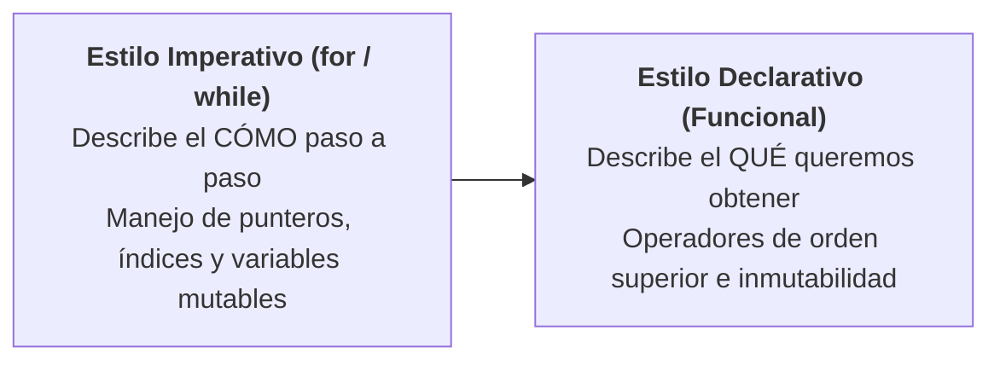

# Bucles e Iteración en Kotlin: Imperativo vs Declarativo

En la programación en Java tradicional, el bucle clásico `for (int i = 0; i < n; i++)` ha sido la herramienta estándar para iterar. En Kotlin, la filosofía de diseño evoluciona: **no existe el bucle de estilo C**. En su lugar, Kotlin trata la repetición mediante **rangos, progresiones numéricas y pipelines declarativos**, reduciendo los típicos errores por un elemento de más o de menos (*off-by-one errors*) y maximizando la legibilidad.

---

## 1. La Filosofía de Iteración en Kotlin

A diferencia de otros lenguajes, en Kotlin todo bucle `for` opera sobre un elemento que implemente la interfaz `Iterable` o sobre una **progresión matemática**:

=== "Kotlin (Idiomático)"
    ```kotlin
    // Itera directamente sobre una progresión matemática
    for (i in 1..5) {
        println("Paso $i")
    }
    ```

=== "Java Tradicional"
    ```java
    // Requiere gestionar manualmente inicialización, condición y paso
    for (int i = 1; i <= 5; i++) {
        System.out.println("Paso " + i);
    }
    ```

---

## 2. El Bucle `for` y las Progresiones Numéricas

Kotlin proporciona operadores nativos para construir secuencias de números con extrema claridad sintáctica:

### 2.1. Rango Inclusivo (`..`)
El operador `..` crea un rango que **incluye tanto el valor inicial como el final**:

```kotlin
for (i in 1..3) {
    print("$i ") // Salida: 1 2 3 
}
```

### 2.2. Rango Semiabierto (`until`)
El operador `until` excluye el límite superior. Es el modismo perfecto para iterar sobre estructuras indexadas desde `0` hasta `longitud - 1`:

```kotlin
val maxPantallas = 4

for (indice in 0 until maxPantallas) {
    println("Cargando pantalla $indice") // Salida: 0, 1, 2, 3 (no llega al 4)
}
```

### 2.3. Cuenta Atrás Inversa (`downTo`)
Si necesitas iterar en sentido descendente, Kotlin no permite usar `5..1` (dicho rango se considera vacío). Se utiliza la palabra clave `downTo`:

```kotlin
for (cuentaAtras in 5 downTo 1) {
    print("$cuentaAtras... ") // Salida: 5... 4... 3... 2... 1...
}
println("¡Despegue!")
```

### 2.4. Saltos Personalizados (`step`)
Por defecto, el incremento o decremento es de `1` en `1`. Con `step` puedes alterar el salto:

```kotlin
// Números pares del 2 al 10
for (par in 2..10 step 2) {
    print("$par ") // Salida: 2 4 6 8 10 
}

// Cuenta atrás de 10 a 0 de dos en dos
for (n in 10 downTo 0 step 2) {
    print("$n ") // Salida: 10 8 6 4 2 0 
}
```

### 2.5. Iteración sobre Cadenas y Colecciones con Índice

En Kotlin puedes recorrer directamente cualquier cadena de caracteres o colección:

```kotlin
// Iterar carácter a carácter sobre un String
for (letra in "Kotlin") {
    print("$letra-") // Salida: K-o-t-l-i-n-
}

// Obtener simultáneamente el índice y el elemento con withIndex()
val nombres = listOf("Mario", "Luigi", "Peach")
for ((posicion, nombre) in nombres.withIndex()) {
    println("Posición $posicion: $nombre")
}
```

---

## 3. Bucles Indeterminados: `while` y `do-while`

Cuando no se conoce de antemano el número de iteraciones y la repetición depende de una **condición booleana dinámica** (como el ciclo de vida de un juego, la lectura de un sensor o la espera de un recurso de red), se recurre a `while` o `do-while`.

### 3.1. Bucle `while` (Comprobación Previa)
Evalúa la condición antes de cada iteración. Si la condición inicial es falsa, el cuerpo del bucle **no llega a ejecutarse nunca**:

```kotlin
var bateria = 15 // Porcentaje de batería

while (bateria > 0) {
    println("Navegando... Batería restante: $bateria%")
    bateria -= 5
}
println("Dispositivo apagado.")
```

### 3.2. Bucle `do-while` (Comprobación Posterior)
Ejecuta el bloque de código al menos una vez antes de comprobar la condición por primera vez:

```kotlin
var intentos = 0

do {
    intentos++
    println("Intento de conexión #$intentos...")
} while (intentos < 3)
```

---

## 4. Control de Flujo con Etiquetas (*Labels*)

En bucles anidados complejos, el uso de `break` o `continue` estándar solo afecta al bucle más interno. Para interrumpir o saltar un bucle exterior sin ensuciar el código con variables booleanas bandera (`var encontrado = false`), Kotlin introduce las **etiquetas identificadas con `@`**:

```kotlin
searchLoop@ for (fila in 1..3) {
    for (columna in 1..3) {
        if (fila == 2 && columna == 2) {
            println("Objetivo encontrado en ($fila, $columna). Deteniendo búsqueda completa.")
            break@searchLoop // Cancela inmediatamente ambos bucles
        }
        println("Escaneando celda [$fila, $columna]")
    }
}
```

---

## 5. El Modismo Ágil: `repeat(n)`

Cuando necesitas ejecutar una acción repetitiva un número exacto de veces y **no requieres gestionar manualmente una variable de índice**, la función estándar `repeat()` de Kotlin es la alternativa más concisa y limpia:

=== "Con repeat (Idiomático)"
    ```kotlin
    repeat(3) { intento ->
        println("Lanzando pulso de radar (ciclo $intento)...")
    }
    ```

=== "Con for clásico (Más verboso)"
    ```kotlin
    for (intento in 0 until 3) {
        println("Lanzando pulso de radar (ciclo $intento)...")
    }
    ```

---

## 6. Comparativa a Fondo: Nivel Imperativo vs Nivel Declarativo

En el desarrollo de software moderno (y muy especialmente en Android con Jetpack Compose y Kotlin Coroutines), existe una marcada transición entre dos paradigmas de pensamiento:



### 6.1. Ejemplo Práctico: Suma de Números Pares

Imaginemos que tenemos una lista de números y deseamos obtener la suma de aquellos que sean pares:

=== "Estilo Imperativo (for tradicional)"
    ```kotlin
    val numeros = listOf(1, 2, 3, 4, 5, 6)
    var acumuladorPares = 0 // Requiere una variable mutable externa

    for (n in numeros) {
        if (n % 2 == 0) {
            acumuladorPares += n
        }
    }

    println("Suma total de pares: $acumuladorPares") // 12
    ```

=== "Estilo Declarativo (Pipelines Funcionales)"
    ```kotlin
    val numeros = listOf(1, 2, 3, 4, 5, 6)

    // Sin variables mutables ni gestión manual de bucles
    val acumuladorPares = numeros
        .filter { it % 2 == 0 }
        .sum()

    println("Suma total de pares: $acumuladorPares") // 12
    ```

### 6.2. Matriz Comparativa

| Dimensión | Enfoque Imperativo (`for`, `while`) | Enfoque Declarativo (`map`, `filter`, `forEach`) |
| :--- | :--- | :--- |
| **Foco mental** | Instrucciones de **cómo** avanzar (índices, saltos, acumuladores). | Expresión de **qué** transformación se desea sobre los datos. |
| **Estado mutable** | Requiere frecuentemente `var` mutables como acumuladores o contadores. | Favorece referencias **`val` inmutables** en cada fase del pipeline. |
| **Riesgo de errores** | Propensión a errores *Off-by-one* (`<` vs `<=`) o de límites de índice. | Prácticamente nulo: las funciones de extensión gestionan los límites internamente. |
| **Encadenamiento** | Difícil de componer; requiere anidar bucles y sentencias `if`. | Muy fluido; permite encadenar `.filter { }.map { }.take(3)`. |
| **Rendimiento bruto** | Muy eficiente para algoritmos matemáticos críticos en CPU. | Puede generar objetos intermedios (a menos que se utilicen `Sequence` o funciones inline). |
| **Rol en Android** | Bucles de físicas en Unity, motores gráficos o simulaciones locales. | Patrón preferido para procesar listas de la base de datos (Room) o APIs en la UI. |

---

## 7. Errores Frecuentes (*Gotchas*)

!!! danger "Gotcha 1: Confundir `..` con `until` al iterar por longitud"
    En Kotlin, `lista.size` devuelve la cantidad de elementos. Si recorres con `0..lista.size`, la última iteración intentará acceder a un índice inexistente provocando `IndexOutOfBoundsException`. Usa siempre **`0 until lista.size`** o directamente **`for (item in lista)`**.

!!! danger "Gotcha 2: Escribir rangos descendentes con `..`"
    El código `for (i in 10..1)` compila sin errores sintácticos, pero el rango se evalúa como **vacío** en tiempo de ejecución y el bucle jamás se ejecuta. Para contar hacia atrás, debes usar obligatoriamente **`10 downTo 1`**.

!!! danger "Gotcha 3: Modificar una lista mientras se recorre con `for`"
    Alterar una colección mutable mientras se itera con un bucle `for` tradicional provocará una excepción `ConcurrentModificationException`:
    ```kotlin
    val tareas = mutableListOf("Comprar", "Estudiar", "Correr")
    for (t in tareas) {
        // tareas.remove(t) // ¡PELIGRO!: Rompe el iterador activo
    }
    // Forma idiomática declarativa:
    tareas.removeAll { it == "Correr" }
    ```

---

## 8. Retos Prácticos Sencillos

Consolida lo aprendido con estos cuatro ejercicios pequeños y directos:

### 🟢 Reto 1: Cuenta Atrás con Salto Personalizado
Escribe una cuenta atrás que empiece en `20` y descienda de `5` en `5` hasta llegar a `0` utilizando `downTo` y `step`. Al terminar, imprime `"¡Tiempo agotado!"`.

??? tip "Ver solución"
    ```kotlin
    fun main() {
        for (segundos in 20 downTo 0 step 5) {
            println("Quedan $segundos segundos...")
        }
        println("¡Tiempo agotado!")
    }
    ```

### 🟢 Reto 2: Repetición Idiomática con `repeat`
Utiliza la función `repeat` para imprimir 4 veces el sonido de recarga de un arma o sensor: `"Cargando escudo de energía..."`.

??? tip "Ver solución"
    ```kotlin
    fun main() {
        repeat(4) { vuelta ->
            println("Cargando escudo de energía (fase ${vuelta + 1}/4)...")
        }
    }
    ```

### 🟡 Reto 3: Bucle Indeterminado con `while`
Declara una variable mutable `var combustible = 80`. Mediante un bucle `while`, simula el gasto de combustible restando `25` en cada vuelta mientras quede combustible suficiente (`combustible >= 25`). Muestra los litros consumidos y el remanente final.

??? tip "Ver solución"
    ```kotlin
    fun main() {
        var combustible = 80

        while (combustible >= 25) {
            combustible -= 25
            println("Salto hiperespacial realizado. Combustible restante: $combustible L")
        }

        println("Combustible insuficiente para otro salto. Reserva final: $combustible L")
    }
    ```

### 🟡 Reto 4: Salida Limpia de Matriz con Etiqueta (`break@label`)
Dada una matriz de coordenadas de `1..4` para filas y `1..4` para columnas, recorre ambas con bucles `for` anidados. Si la celda es fila `3` y columna `2`, detén la búsqueda completa al instante usando una etiqueta (`@label`).

??? tip "Ver solución"
    ```kotlin
    fun main() {
        busqueda@ for (fila in 1..4) {
            for (col in 1..4) {
                if (fila == 3 && col == 2) {
                    println("¡Tesoro encontrado en ($fila, $col)! Deteniendo radar.")
                    break@busqueda
                }
                println("Revisando sector [$fila, $col]")
            }
        }
    }
    ```
