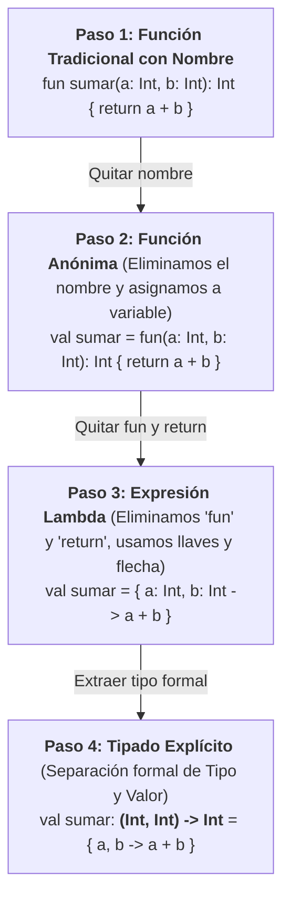
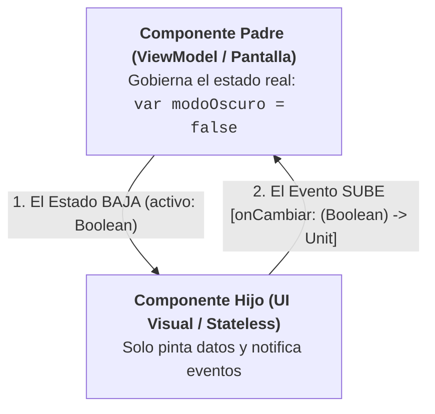

# Funciones, Lambdas y el Paradigma Declarativo en Kotlin

En Kotlin, las funciones son **ciudadanos de primera clase** (*First-Class Citizens*). Esto significa que las funciones pueden asignarse a variables, pasarse como argumentos a otras funciones, retornarse desde funciones y almacenarse en estructuras de datos, exactamente igual que cualquier otro valor como un `Int` o un `String`.

Comprender en profundidad las lambdas y las funciones de orden superior en Kotlin es **el requisito más importante para dominar Jetpack Compose** y el desarrollo moderno en Android.

---

!!! info "Código de Colores de Aprendizaje"
    A lo largo de este tema encontrarás un código visual de colores en los encabezados para orientar tu avance pedagógico:

    - 🟢 **Verde:** Fundamentos esenciales que debes dominar desde el primer día.
    - 🟡 **Amarillo:** El núcleo del paradigma funcional y reactivo que emplearás a diario en Android y Compose.
    - 🔴 **Rojo:** Conceptos avanzados (mecanismos internos de Compose, DSLs declarativos y optimización de bytecode).

---

## 1. 🟢 Declaración Clásica de Funciones

La sintaxis básica emplea la palabra clave `fun`, seguida del nombre, parámetros entre paréntesis con su tipo correspondiente y el tipo de retorno:

```kotlin
fun sumar(a: Int, b: Int): Int {
    return a + b
}
```

Si una función no retorna ningún valor útil, su tipo de retorno es `Unit` (equivalente a `void` en Java, pero siendo un objeto real en Kotlin). Puede omitirse la declaración explícita de `Unit`:

```kotlin
fun registrarEvento(mensaje: String): Unit {
    println("[LOG]: $mensaje")
}

// Equivalente simplificado e idiomático:
fun registrarEventoSimple(mensaje: String) {
    println("[LOG]: $mensaje")
}
```

---

### 1.1. Inmutabilidad de los Parámetros

!!! danger "¡Atención: Diferencia fundamental con Java!"
    En Kotlin, **los parámetros de una función son siempre inmutables (`val`) por definición**. El compilador prohíbe taxativamente la reasignación de parámetros dentro del cuerpo de la función y no permite anteponer `var` en la firma:

    ```kotlin
    fun duplicar(numero: Int): Int {
        // numero = numero * 2 // ERROR de compilación: Val cannot be reassigned
        val resultado = numero * 2 // Correcto: creamos un nuevo valor local inmutable
        return resultado
    }
    ```

---

### 1.2. Funciones de Expresión Única (*Single-Expression Functions*)

Cuando el cuerpo de una función consiste en una única expresión o cálculo, se pueden omitir las llaves `{}` y la sentencia `return`, sustituyéndolas por el operador `=`:

```kotlin
// Versión verbosa con bloque:
fun esMayorDeEdad(edad: Int): Boolean {
    return edad >= 18
}

// Versión idiomática de expresión única (el tipo Boolean se infiere):
fun esMayorDeEdad(edad: Int) = edad >= 18
fun multiplicar(x: Int, y: Int) = x * y
```

---

### 1.3. Parámetros con Valores por Defecto y Argumentos con Nombre

En Java es común sobrecargar métodos creando 4 o 5 variantes del mismo constructor o método con diferente número de argumentos. Kotlin soluciona esto con **valores por defecto**:

```kotlin
fun crearPerfilUsuario(
    nombre: String,
    activo: Boolean = true,
    rol: String = "ESTUDIANTE",
    intentos: Int = 0
) {
    println("Usuario: $nombre | Rol: $rol | Activo: $activo | Intentos: $intentos")
}

// Llamada con todos los parámetros:
crearPerfilUsuario("Sofía", false, "ADMIN", 3)

// Llamada omitiendo los valores por defecto:
crearPerfilUsuario("Mateo") // Activo = true, Rol = "ESTUDIANTE", Intentos = 0

// Argumentos con nombre (Named Arguments): alteran el orden y aumentan la legibilidad:
crearPerfilUsuario(
    nombre = "Elena",
    rol = "DOCENTE",
    intentos = 1
)
```

---

## 2. 🟡 El Puente Pedagógico: De la Función Tradicional a la Lambda

Muchos estudiantes que provienen de Java tradicional perciben las expresiones lambda como una sintaxis extraña o "mágica". Sin embargo, **una lambda no es más que una función normal simplificada paso a paso**.

A continuación recorreremos la **escalera pedagógica de 4 pasos** que conecta una función clásica con su máxima síntesis declarativa:



---

### Paso 1: La Función Tradicional con Nombre

Tomamos la función clásica con la que todo programador está familiarizado:

```kotlin
fun sumar(a: Int, b: Int): Int {
    return a + b
}
```

Esta función tiene 5 elementos claramente identificables:

1. La palabra reservada `fun`.
2. El **Nombre** de la función: `sumar`.
3. Los **Parámetros con su tipo**: `(a: Int, b: Int)`.
4. El **Tipo de retorno**: `: Int`.
5. El **Cuerpo con sentencia `return`**: `{ return a + b }`.

---

### Paso 2: La Función Anónima (*Anonymous Function*)

¿Qué ocurre si a la función anterior **le borramos únicamente el nombre** `sumar`?

```kotlin
// Ya no tiene nombre propio:
fun(a: Int, b: Int): Int {
    return a + b
}
```

Como la función no tiene un identificador propio, no podemos invocarla directamente en el aire. Para utilizarla, debemos guardarla en una variable:

```kotlin
val sumar = fun(a: Int, b: Int): Int {
    return a + b
}

// O en formato de expresión única:
val sumar = fun(a: Int, b: Int): Int = a + b

// Se invoca exactamente igual que una función con nombre:
val resultado = sumar(4, 5)
println(resultado) // 9
```

!!! tip "💡 La gran ventaja didáctica de la Función Anónima"
    Observa que la función anónima mantiene **absolutamente todo** lo que ya conoces de Java y Kotlin básico:
    
    - Mantiene la palabra clave `fun`.
    - Mantiene los tipos de los argumentos `(a: Int, b: Int)`.
    - Mantiene el tipo de retorno explícito `: Int`.
    - Mantiene la palabra clave `return`.
    
    Solo ha cambiado una cosa: **la función se almacena en una variable inmutable `val` como si fuera un número o una cadena**.

---

### Paso 3: La Expresión Lambda (Máxima Síntesis)

Kotlin se da cuenta de que cuando guardas una función en una variable o la pasas como argumento, escribir `fun` y `return` es repetitivo y añade ruido visual.

La **expresión lambda** aplica tres reglas de simplificación mecánica:

1. **Elimina la palabra `fun`**.
2. **Envuelve todo el bloque entre llaves `{}`**.
3. **Mueve los parámetros al interior de las llaves** y los separa del cálculo con una flecha `->`.
4. **Elimina la palabra `return`**: en una lambda, **la última línea evaluada es el valor que se devuelve automáticamente**.

```kotlin
// Sintaxis Lambda directa:
val sumar = { a: Int, b: Int -> a + b }

println(sumar(10, 20)) // 30
```

---

### Paso 4: Descomposición en TIPO (Firma) vs. VALOR (Lambda)

Para comprender cómo utilizar lambdas en arquitecturas reales (como parámetros de ViewModels o componentes de Jetpack Compose), debemos descomponer formalmente la declaración en dos mitades:

```text
       Variable  :          TIPO DE DATO (Firma)          =            VALOR (Lambda / Cuerpo)
      val sumar  :           (Int, Int) -> Int            =               { a, b -> a + b }
                             ─────────────────                            ─────────────────
                                     │                                            │
                     ¿Qué recibe y qué devuelve?                          ¿Qué cálculo ejecuta?
                   (Contrato abstracto de tipos)                        (Implementación concreta)
```

1. **La Firma o Tipo de Función (`(Int, Int) -> Int`):**
   - Es el **TIPO** (análogo a poner `String` o `Double`).
   - Se compone de los tipos de entrada entre paréntesis `(Int, Int)`, seguidos de una flecha `->` y del tipo de retorno final `Int`.
   - Si no retorna nada, se indica `Unit`: `(String) -> Unit`.
   - Si no recibe nada, los paréntesis quedan vacíos: `() -> Unit`.

2. **El Cuerpo o Valor Lambda (`{ a, b -> a + b }`):**
   - Es el **VALOR** que asignamos.
   - Proporciona los nombres de las variables locales (`a, b`) y la expresión a calcular.

---

### Comparativa: Función Tradicional vs. Anónima vs. Lambda

| Aspecto | Función Clásica | Función Anónima | Expresión Lambda |
| :--- | :--- | :--- | :--- |
| **Identificador** | Obligatorio (`fun miNombre(...)`) | Sin nombre (`fun(...)`) | Sin nombre (`{ ... }`) |
| **Delimitadores** | Paréntesis `()` y llaves `{}` | Paréntesis `()` y llaves `{}` | Solo llaves `{}` |
| **Tipo de retorno** | Explícito o inferido | **Explícito** (`: Int`) | **Inferido** de la última línea |
| **Sentencia `return`** | Obligatoria con bloque | **Obligatoria con bloque** | **Prohibida sin etiqueta** (retorno implícito) |
| **Uso principal** | Métodos estándar del sistema | Lógicas complejas con múltiples `return` locales | El 95% del código funcional y Jetpack Compose |

---

### 2.1. El Parámetro Implícito `it`

Cuando la firma de la función indica que recibe **exactamente un único parámetro**, Kotlin nos ahorra la necesidad de inventarle un nombre y escribir la flecha `->`. El compilador genera automáticamente una variable local llamada **`it`**:

```kotlin
// Tipado explícito con nombre de parámetro:
val duplicar: (Int) -> Int = { numero -> numero * 2 }

// Simplificación con 'it':
val duplicarConIt: (Int) -> Int = { it * 2 }

val longitudTexto: (String) -> Int = { it.length }
val esPositivo: (Int) -> Boolean = { it > 0 }

println(duplicarConIt(7))         // 14
println(longitudTexto("Compose")) // 7
```

---

### 2.2. Galería Práctica de Descomposición Paso a Paso

Para interiorizar esta mecánica, analiza cómo se descompone una función en sus tres variantes (**Tradicional → Anónima → Lambda**) según los distintos tipos de firma habituales en Android:

#### Ejemplo A: Validación Booleana con 1 Parámetro `(String) -> Boolean`

=== "1. Función Tradicional con Nombre"
    ```kotlin
    fun esEmailValido(correo: String): Boolean {
        return correo.contains("@") && correo.contains(".")
    }

    println(esEmailValido("alumno@ies.es")) // true
    ```

=== "2. Función Anónima (en variable)"
    ```kotlin
    // Eliminamos el nombre 'esEmailValido' y asignamos a una variable inmutable:
    val esEmailValido = fun(correo: String): Boolean {
        return correo.contains("@") && correo.contains(".")
    }

    println(esEmailValido("alumno@ies.es")) // true
    ```

=== "3. Expresión Lambda (sintaxis compacta)"
    ```kotlin
    // Eliminamos 'fun' y 'return', trasladando el parámetro dentro de las llaves:
    val esEmailValido = { correo: String -> correo.contains("@") && correo.contains(".") }

    println(esEmailValido("alumno@ies.es")) // true
    ```

=== "4. Descomposición Formal con 'it'"
    ```kotlin
    // Separamos explícitamente TIPO (Firma) y VALOR (Lambda con 'it'):
    // Tipo de función : (String) -> Boolean
    // Cuerpo lambda   : { it.contains("@") && it.contains(".") }
    val esEmailValido: (String) -> Boolean = { it.contains("@") && it.contains(".") }

    println(esEmailValido("alumno@ies.es")) // true
    ```

---

#### Ejemplo B: Transformación de Texto `(String) -> String`

=== "1. Función Tradicional con Nombre"
    ```kotlin
    fun limpiarTexto(entrada: String): String {
        return entrada.trim().lowercase()
    }

    println(limpiarTexto("   KOTLIN   ")) // "kotlin"
    ```

=== "2. Función Anónima (en variable)"
    ```kotlin
    val limpiarTexto = fun(entrada: String): String {
        return entrada.trim().lowercase()
    }

    println(limpiarTexto("   KOTLIN   ")) // "kotlin"
    ```

=== "3. Expresión Lambda (sintaxis compacta)"
    ```kotlin
    val limpiarTexto = { entrada: String -> entrada.trim().lowercase() }

    println(limpiarTexto("   KOTLIN   ")) // "kotlin"
    ```

=== "4. Descomposición Formal con 'it'"
    ```kotlin
    // Firma: (String) -> String
    val limpiarTexto: (String) -> String = { it.trim().lowercase() }

    println(limpiarTexto("   KOTLIN   ")) // "kotlin"
    ```

---

#### Ejemplo C: Callback de Acción sin Retorno `(String) -> Unit`

Este es el patrón más común en **Android y Compose** para notificaciones, logs o eventos de botones:

=== "1. Función Tradicional con Nombre"
    ```kotlin
    fun registrarLog(evento: String): Unit {
        println("[SISTEMA ANDROID]: $evento")
    }

    registrarLog("Usuario pulsó botón Guardar")
    ```

=== "2. Función Anónima (en variable)"
    ```kotlin
    val registrarLog = fun(evento: String): Unit {
        println("[SISTEMA ANDROID]: $evento")
    }

    registrarLog("Usuario pulsó botón Guardar")
    ```

=== "3. Expresión Lambda (sintaxis compacta)"
    ```kotlin
    val registrarLog = { evento: String -> println("[SISTEMA ANDROID]: $evento") }

    registrarLog("Usuario pulsó botón Guardar")
    ```

=== "4. Descomposición Formal con 'it'"
    ```kotlin
    // Firma: (String) -> Unit
    val registrarLog: (String) -> Unit = { println("[SISTEMA ANDROID]: $it") }

    registrarLog("Usuario pulsó botón Guardar")
    ```

---

#### Ejemplo D: Cálculo Aritmético con 2 Parámetros `(Double, Double) -> Double`

=== "1. Función Tradicional con Nombre"
    ```kotlin
    fun aplicarDescuento(precio: Double, porcentaje: Double): Double {
        return precio - (precio * porcentaje / 100.0)
    }

    println(aplicarDescuento(100.0, 20.0)) // 80.0
    ```

=== "2. Función Anónima (en variable)"
    ```kotlin
    val aplicarDescuento = fun(precio: Double, porcentaje: Double): Double {
        return precio - (precio * porcentaje / 100.0)
    }

    println(aplicarDescuento(100.0, 20.0)) // 80.0
    ```

=== "3. Expresión Lambda (sintaxis compacta)"
    ```kotlin
    val aplicarDescuento = { precio: Double, porcentaje: Double ->
        precio - (precio * porcentaje / 100.0)
    }

    println(aplicarDescuento(100.0, 20.0)) // 80.0
    ```

=== "4. Descomposición Formal"
    ```kotlin
    // Como tiene 2 parámetros, se nombran explícitamente (no aplica 'it'):
    // Firma: (Double, Double) -> Double
    val aplicarDescuento: (Double, Double) -> Double = { precio, porcentaje ->
        precio - (precio * porcentaje / 100.0)
    }

    println(aplicarDescuento(100.0, 20.0)) // 80.0
    ```

---

#### Ejemplo E: Generador sin Parámetros `() -> Int`

=== "1. Función Tradicional con Nombre"
    ```kotlin
    fun lanzarDado(): Int {
        return (1..6).random()
    }

    println(lanzarDado()) // Número aleatorio entre 1 y 6
    ```

=== "2. Función Anónima (en variable)"
    ```kotlin
    val lanzarDado = fun(): Int {
        return (1..6).random()
    }

    println(lanzarDado())
    ```

=== "3. Expresión Lambda (sintaxis compacta)"
    ```kotlin
    val lanzarDado = { (1..6).random() }

    println(lanzarDado())
    ```

=== "4. Descomposición Formal"
    ```kotlin
    // Paréntesis vacíos () indican que no recibe parámetros:
    // Firma: () -> Int
    val lanzarDado: () -> Int = { (1..6).random() }

    println(lanzarDado())
    ```

---

### Tabla Resumen: De la Función Tradicional a la Lambda

| Propósito | Función Tradicional | Tipo de Función (Firma / Contrato) | Expresión Lambda Resultante |
| :--- | :--- | :--- | :--- |
| **Validar correo** | `fun validar(s: String): Boolean` | `(String) -> Boolean` | `{ it.contains("@") }` |
| **Limpiar texto** | `fun limpiar(s: String): String` | `(String) -> String` | `{ it.trim().lowercase() }` |
| **Registrar aviso** | `fun avisar(msg: String): Unit` | `(String) -> Unit` | `{ println(it) }` |
| **Calcular descuento** | `fun desc(p: Double, d: Double): Double` | `(Double, Double) -> Double` | `{ p, d -> p * (1 - d/100) }` |
| **Lanzar dado** | `fun dado(): Int` | `() -> Int` | `{ (1..6).random() }` |

---


## 3. 🟡 Funciones de Orden Superior (*Higher-Order Functions*)

Una **función de orden superior** es simplemente una función que recibe otra función como parámetro, devuelve una función, o ambas cosas.

Como ya conocemos la diferencia entre la **Firma** (el tipo de dato) y el **Valor** (la lambda), escribir una función de orden superior resulta totalmente natural:

```kotlin
// Parámetro 'operacion': su tipo es la firma (Int, Int) -> Int
fun ejecutarCalculo(a: Int, b: Int, operacion: (Int, Int) -> Int): Int {
    println("-> Ejecutando cálculo sobre $a y $b...")
    val resultado = operacion(a, b) // Invocamos la función recibida
    return resultado
}

fun main() {
    // 1. Pasando una variable que contiene una lambda:
    val suma: (Int, Int) -> Int = { x, y -> x + y }
    println(ejecutarCalculo(10, 5, suma)) // 15

    // 2. Pasando la lambda directamente en línea:
    val resta = ejecutarCalculo(10, 5, { x, y -> x - y })
    println(resta) // 5

    // 3. Pasando una función anónima con tipo de retorno explícito:
    val producto = ejecutarCalculo(10, 5, fun(x: Int, y: Int): Int = x * y)
    println(producto) // 50
}
```

---

## 4. Lambdas: El Motor de Jetpack Compose

El diseño visual de **Jetpack Compose** descansa enteramente sobre las convenciones de sintaxis que Kotlin diseñó para las lambdas.

---

### 4.1. 🟡 Regla 1: Sintaxis de Lambda Colgante (*Trailing Lambda*)

En Kotlin, **si el último parámetro de una función es una lambda, dicha lambda puede colocarse FUERA de los paréntesis ordinarios `()`**:

```kotlin
// Sintaxis convencional (dentro de los paréntesis):
ejecutarCalculo(10, 5, { x, y -> x * y })

// Sintaxis Trailing Lambda (la última lambda se extrae fuera):
ejecutarCalculo(10, 5) { x, y ->
    x * y
}
```

Si la lambda es el **único parámetro** que recibe la función, **los paréntesis `()` pueden omitirse por completo**:

```kotlin
fun ejecutarTarea(bloque: () -> Unit) {
    println("[SISTEMA]: Iniciando tarea...")
    bloque()
}

// Se omiten los paréntesis ():
ejecutarTarea {
    println("Sincronizando biblioteca de juegos con la nube...")
}
```

#### ¿Cómo se traduce esto en Jetpack Compose?

En Compose, los botones, tarjetas y pantallas no son etiquetas XML, sino llamadas a funciones de Kotlin que aprovechan esta regla:

```kotlin
// En Jetpack Compose:
// Button(onClick: () -> Unit, content: @Composable () -> Unit)
Button(onClick = { registrarClic() }) {
    Text(text = "Guardar Partida")
}
```

1. `onClick = { ... }` se pasa como argumento con nombre entre los paréntesis `()`.
2. `{ Text(...) }` es el último parámetro (`content`), por lo que **se extrae fuera de los paréntesis**.
3. El resultado es un código visualmente jerárquico que parece un lenguaje declarativo (como HTML/Flutter), pero es **100% código Kotlin estándar**.

---

### 4.2. 🟡 Regla 2: Elevación de Estado (*State Hoisting*) mediante Callbacks

En el desarrollo de interfaces declarativas con **Jetpack Compose**, los componentes visuales (un botón, una casilla, un interruptor) no deben almacenar ni mutar el estado de la aplicación directamente. Se diseñan como **componentes sin estado (*Stateless*)**:

- **El Estado BAJA (*State goes down*):** El contenedor padre (pantalla o ViewModel) le pasa los datos actuales al hijo como parámetros simples inmutables.
- **Los Eventos SUBEN (*Events go up*):** El componente hijo le avisa al padre cuando el usuario interactúa, pasándole el nuevo valor mediante una **lambda callback**.



Observa este patrón en un ejemplo de consola totalmente comprensible:

```kotlin
// 1. COMPONENTE HIJO (UI sin estado / Stateless):
// No tiene variables 'var' propias. Recibe el valor para pintarlo y una lambda para avisar.
fun InterruptorModoOscuro(
    activo: Boolean,
    onCambiar: (Boolean) -> Unit // Callback lambda: (Boolean) -> Unit
) {
    val icono = if (activo) "🌙 [Modo Oscuro]" else "☀️ [Modo Claro]"
    println("Dibujando interruptor en pantalla: $icono")

    // Simulamos que el usuario interactúa con la pantalla táctil:
    println("-> [Usuario]: Toca el interruptor con el dedo...")
    val nuevoValor = !activo
    onCambiar(nuevoValor) // ¡Avisamos hacia arriba al contenedor padre!
}

// 2. COMPONENTE PADRE (Gestor del estado / Pantalla):
fun main() {
    var modoOscuroActivado = false // El estado real de la aplicación reside aquí

    println("=== ESTADO INICIAL DE LA APP ===")
    println("Modo oscuro en la app: $modoOscuroActivado\n")

    // Renderizamos el componente pasándole el dato actual y la lambda de escucha:
    InterruptorModoOscuro(
        activo = modoOscuroActivado,
        onCambiar = { nuevoValor ->
            // El padre es el único que tiene la potestad de mutar la variable
            modoOscuroActivado = nuevoValor
            println("-> [Padre]: Estado actualizado con éxito a: $modoOscuroActivado")
        }
    )

    println("\n=== ESTADO TRAS LA INTERACCIÓN ===")
    println("Modo oscuro final: $modoOscuroActivado")
}
```

#### Salida en consola:

```text
=== ESTADO INICIAL DE LA APP ===
Modo oscuro en la app: false

Dibujando interruptor en pantalla: ☀️ [Modo Claro]
-> [Usuario]: Toca el interruptor con el dedo...
-> [Padre]: Estado actualizado con éxito a: true

=== ESTADO TRAS LA INTERACCIÓN ===
Modo oscuro final: true
```

#### ¿Cómo se traduce esto en Jetpack Compose real?

El componente oficial **`Switch`** de Compose se programa exactamente con esta misma firma de dos parámetros:

```kotlin
// En Jetpack Compose real:
Switch(
    checked = modoOscuroActivado,        // 1. El estado BAJA (Boolean)
    onCheckedChange = { modoOscuroActivado = it } // 2. El evento SUBE [(Boolean) -> Unit]
)
```

---

### 4.3. 🔴 Regla 3: Lambdas con Receptor (*Function Literals with Receiver*)

Una de las características más avanzadas y distintivas de Kotlin son las lambdas que se ejecutan **dentro del ámbito de un objeto receptor específico**.

Su tipo de función se define anteponiendo la clase o interfaz receptora: `Receptor.() -> TipoRetorno`.

Dentro del cuerpo de esa lambda, la palabra clave **`this` apunta automáticamente a la instancia del `Receptor`**, permitiendo llamar a sus propiedades y métodos directamente sin necesidad de prefijos:

```kotlin
class ConfiguradorCanvas {
    var ancho: Int = 0
    var alto: Int = 0
    var colorFondo: String = "Negro"

    fun renderizar() = println("Canvas $ancho x $alto - Fondo: $colorFondo")
}

// Acepta una lambda cuyo receptor es ConfiguradorCanvas:
fun construirCanvas(bloque: ConfiguradorCanvas.() -> Unit): ConfiguradorCanvas {
    val canvas = ConfiguradorCanvas()
    canvas.bloque() // Ejecutamos la lambda en el contexto del objeto 'canvas'
    return canvas
}

fun main() {
    // Dentro de las llaves, 'this' es la instancia de ConfiguradorCanvas:
    val miCanvas = construirCanvas {
        ancho = 1920             // Equivale a this.ancho = 1920
        alto = 1080              // Equivale a this.alto = 1080
        colorFondo = "Azul Noche" // Equivale a this.colorFondo = "Azul Noche"
    }

    miCanvas.renderizar()
}
```

#### ¿Por qué es fundamental en Jetpack Compose?

En Compose, contenedores como `Row` o `Column` definen su contenido como:

```kotlin
content: @Composable RowScope.() -> Unit
```

Gracias a que la lambda tiene como receptor a **`RowScope`**, dentro de una fila tienes disponibles modificadores exclusivos como `Modifier.weight(1f)` o `align(Alignment.CenterVertically)`, mientras que fuera de la fila el compilador no te permitirá usarlos.

---

### 4.4. 🔴 Retornos Locales vs. Retornos No Locales (*Non-Local Returns*)

Existe una diferencia semántica crítica entre las **funciones anónimas** y las **expresiones lambda**:

1. **En una Función Anónima:**  
   La sentencia `return` es siempre **local**: termina la ejecución de la función anónima y regresa al código que la invocó (exactamente igual que en una función normal).
2. **En una Lambda Ordinaria:**  
   Un `return` simple intentaría terminar la **función exterior que contiene la llamada** (*Non-Local Return*), lo cual solo está permitido si la función receptora es `inline`. Para hacer un retorno local dentro de una lambda, se debe utilizar una **etiqueta de retorno (*qualified return*)**:

```kotlin
fun probarRetornos() {
    val lista = listOf(1, 2, 3, 4, 5)

    // Con Función Anónima: el return sale solo de la iteración actual
    lista.forEach(fun(numero) {
        if (numero == 3) return // Sale únicamente de esta función anónima
        print("$numero ")
    })
    // Imprime: 1 2 4 5

    println()

    // Con Lambda: debemos usar return calificado con etiqueta
    lista.forEach { numero ->
        if (numero == 3) return@forEach // Salto local a la siguiente iteración
        print("$numero ")
    }
    // Imprime: 1 2 4 5
}
```

---

## 5. 🟡 Funciones de Extensión (*Extension Functions*)

Kotlin permite añadir nuevos métodos a clases existentes (incluso de librerías de terceros o clases estándar del JDK como `String` o `Double`) **sin necesidad de heredar de ellas ni recurrir al patrón clásico `StringUtils`**:

```kotlin
import java.text.NumberFormat
import java.util.Locale

// Añadimos el método 'esEmailValido' a la clase String
fun String.esEmailValido(): Boolean {
    return this.contains("@") && this.contains(".")
}

// Añadimos 'aMoneda' a Double con soporte de internacionalización
fun Double.aMoneda(locale: Locale = Locale.getDefault()): String {
    return NumberFormat.getCurrencyInstance(locale).format(this)
}

fun main() {
    val correo = "estudiante@dam.es"
    println(correo.esEmailValido()) // true

    val saldo = 49.99
    println(saldo.aMoneda()) // "49,99 €" (en España)
}
```

---

## 6. 🔴 Rendimiento y Bytecode: Funciones `inline`

En la Máquina Virtual de Java (JVM), cada vez que declaras o pasas una expresión lambda estándar, el compilador genera internamente un **objeto anónimo en memoria** (una clase que implementa la interfaz `FunctionN`). Si la lambda se ejecuta millones de veces dentro de un bucle, esto produce presión sobre el recolector de basura (*Garbage Collector*).

Para eliminar esta penalización de rendimiento a cero, Kotlin introduce el modificador **`inline`**:

```kotlin
inline fun medirTiempo(bloque: () -> Unit) {
    val inicio = System.currentTimeMillis()
    bloque() // Invocación
    val fin = System.currentTimeMillis()
    println("Tiempo transcurrido: ${fin - inicio} ms")
}
```

### ¿Qué hace el compilador entre bastidores?

Cuando una función está marcada como `inline`, el compilador de Kotlin **copia y pega el código de la función y el cuerpo de la lambda directamente en el sitio donde se invoca** en el *bytecode* final.

- **Ventaja:** No se crea ningún objeto en memoria ni se realiza una llamada a método adicional.
- **Uso en Kotlin:** La inmensa mayoría de las funciones de colecciones estándar (`filter`, `map`, `forEach`, `repeat`) son `inline`.

---

## 7. Retos Prácticos de Consolidación

### 🟢 Reto 1: Formateador con valores por defecto
Crea una función `formatearCabecera` que reciba un título obligatorio y dos parámetros opcionales: `caracterBorde` (por defecto `'*'`) y `longitud` (por defecto `30`). Utiliza llamadas con argumentos con nombre para probar diferentes combinaciones.

??? tip "Ver solución"
    ```kotlin
    fun formatearCabecera(
        titulo: String,
        caracterBorde: Char = '*',
        longitud: Int = 30
    ): String {
        val borde = caracterBorde.toString().repeat(longitud)
        return "$borde\n$titulo\n$borde"
    }

    fun main() {
        println(formatearCabecera("INICIO"))
        println(formatearCabecera(titulo = "GAME OVER", caracterBorde = '=', longitud = 20))
    }
    ```

---

### 🟡 Reto 2: Extensión y filtrado con lambdas
Crea una función de extensión sobre `List<Int>` llamada `filtrarPares` que acepte una lambda transformadora `(Int) -> String` y devuelva una lista de cadenas con los números pares procesados.

??? tip "Ver solución"
    ```kotlin
    fun List<Int>.filtrarPares(transformacion: (Int) -> String): List<String> {
        val resultado = mutableListOf<String>()
        for (numero in this) {
            if (numero % 2 == 0) {
                resultado.add(transformacion(numero))
            }
        }
        return resultado
    }

    fun main() {
        val numeros = listOf(1, 2, 3, 4, 5, 6)
        val paresFormateados = numeros.filtrarPares { "Par: $it" }
        println(paresFormateados) // [Par: 2, Par: 4, Par: 6]
    }
    ```

---

### 🔴 Reto 3: Mini-DSL declarativo al estilo Compose
Diseña una clase `NotificacionBuilder` con propiedades `titulo`, `mensaje` y `prioridadAlta`. Implementa una función de orden superior `notificacion(configuracion: NotificacionBuilder.() -> Unit): NotificacionBuilder` que permita crear una notificación con sintaxis declarativa limpia idéntica a los contenedores de Compose.

??? tip "Ver solución"
    ```kotlin
    class NotificacionBuilder {
        var titulo: String = ""
        var mensaje: String = ""
        var prioridadAlta: Boolean = false

        fun mostrar() {
            val prefijo = if (prioridadAlta) "URGENTE" else "INFO"
            println("[$prefijo] $titulo: $mensaje")
        }
    }

    fun notificacion(configuracion: NotificacionBuilder.() -> Unit): NotificacionBuilder {
        val builder = NotificacionBuilder()
        builder.configuracion() // Ejecuta la lambda con receptor sobre la instancia
        return builder
    }

    fun main() {
        val miAviso = notificacion {
            titulo = "Descarga Finalizada"
            mensaje = "El parche 1.4 de GameVault se ha instalado con éxito."
            prioridadAlta = true
        }

        miAviso.mostrar()
    }
    ```
