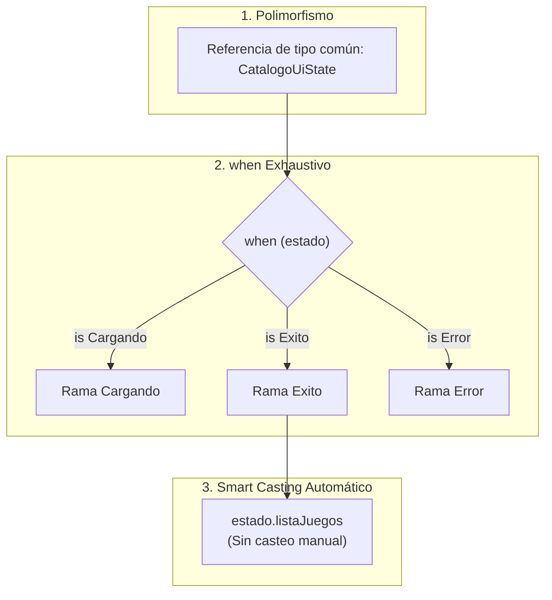
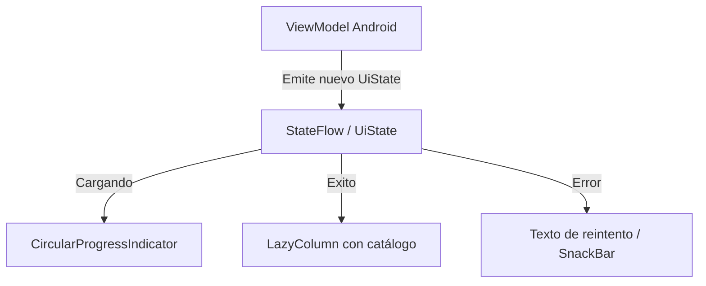

# Clases e Interfaces Selladas (Sealed Types) y el Patrón UI State

En el tema anterior aprendimos que los `enum class` permiten restringir un valor a un conjunto cerrado de opciones constantes. Sin embargo, los enums tienen una gran limitación: **cada constante solo puede almacenar los mismos datos fijos definidos en el constructor**.

¿Qué ocurre si queremos representar un resultado que puede ser o bien una **Carga en curso** (sin datos), o bien un **Éxito** (que contiene una lista de 50 videojuegos), o bien un **Error** (que contiene una excepción y un código HTTP)?

Para resolver este problema arquitectural de modelado, Kotlin proporciona los **tipos sellados**: **`sealed interface`** y **`sealed class`**, los cuales representan la máxima expresión del **polimorfismo seguro** en el lenguaje.

---

## 1. Conexión con Conocimientos Previos: El Polimorfismo y sus Desafíos

Antes de entender los tipos sellados, es fundamental refrescar un concepto angular de la Programación Orientada a Objetos aprendido en 1º de DAM: **el polimorfismo**.

### ¿Qué es el Polimorfismo?
El polimorfismo (del griego *"múltiples formas"*) es la capacidad de tratar instancias de distintas clases derivadas a través de una misma referencia común (su superclase o interfaz).

Por ejemplo, si tenemos una interfaz `Notificacion` y clases `Email`, `SMS` y `Push`:

```kotlin
// Tratamos cualquier notificación de forma polimórfica:
fun enviarAlerta(notificacion: Notificacion) {
    notificacion.enviar() // Cada subtipo ejecuta su propia versión del método
}
```

### El Gran Problema del Polimorfismo Abierto Tradicional
En Java y en la POO clásica, las jerarquías de herencia e interfaces son **abiertas por defecto**:

- Cualquier programador, en cualquier archivo o librería externa del proyecto, puede crear una nueva clase `class Fax : Notificacion` e implementarla.
- ¿Qué ocurre si necesitas realizar una acción específica según el tipo concreto de notificación? En Java te veías obligado a usar una cadena de `if-else` con `instanceof`, casteo manual y una rama `else` defensiva:

```java
// Código Java tradicional (frágil y propenso a errores):
if (notificacion instanceof Email) {
    Email e = (Email) notificacion; // Casteo manual redundante
    conectarServidorSmtp(e.getDireccion());
} else if (notificacion instanceof SMS) {
    SMS s = (SMS) notificacion;
    enviarViaModem(s.getTelefono());
} else {
    // Si alguien crea la clase 'Push' y olvida añadir el 'if',
    // el compilador NUNCA avisa y el programa falla en silencio.
    throw new IllegalArgumentException("Tipo de notificación no soportado");
}
```

En las arquitecturas móviles modernas, este polimorfismo abierto es peligroso para representar **estados de pantalla o respuestas de red**, porque necesitamos la certeza absoluta de haber controlado **todos los casos posibles**.

---

## 2. La Solución de Kotlin: Tipos Sellados (Polimorfismo Restringido)

Un **tipo sellado** (`sealed interface` o `sealed class`) es **polimorfismo con una jerarquía cerrada y finita**:

- Todas las subclases directas deben conocerse en **tiempo de compilación** y definirse dentro del mismo módulo/paquete.
- Ningún tercero (ni otra capa del código) puede inventar nuevas subclases en tiempo de ejecución.
- En ciencias de la computación, este concepto se conoce como **Tipos de Datos Algebraicos** (*Algebraic Data Types* o *Sum Types*).

### ¿Qué es una Interfaz y por qué preferir `sealed interface`?
Una **interfaz tradicional** (`interface`) define un **contrato de comportamiento**: declara *qué* sabe hacer un objeto, desacoplando la definición de la implementación. Una clase puede implementar múltiples interfaces.

Una **`sealed interface`** conserva todas las virtudes de una interfaz (flexibilidad, herencia múltiple, sin constructores pesados en memoria), pero le añade una cerradura de seguridad: **el compilador conoce exactamente qué clases implementan dicho contrato**.

En Kotlin moderno (1.9+), **`sealed interface` es la opción predilecta y recomendada por Google para Android**, reservando `sealed class` únicamente para casos donde varias subclases necesiten heredar código común de un constructor primario.

### Sintaxis Moderna con `data object` y `data class`
Para estados sin datos (como "Cargando"), usamos `data object` (instancia única tipo Singleton con `toString()` legible). Para estados con datos, usamos `data class`:

```kotlin
// Definición del contrato cerrado de estados de pantalla
sealed interface CatalogoUiState {

    // 1. Estado sin datos: 'data object' reutiliza una única instancia eficiente en memoria
    data object Cargando : CatalogoUiState

    // 2. Estado de éxito: 'data class' transporta los datos descargados
    data class Exito(val listaJuegos: List<String>, val totalRegistros: Int) : CatalogoUiState

    // 3. Estado de error: transporta los detalles del fallo
    data class Error(val mensaje: String, val codigoHttp: Int = 500) : CatalogoUiState
}
```

---

## 3. La Combinación Perfecta: Polimorfismo + `when` + *Smart Casting*

Cuando combinamos tipos sellados con la estructura de control `when`, se produce una de las sinergias más potentes y elegantes de Kotlin:



Observa la implementación:

```kotlin
fun renderizarPantalla(estado: CatalogoUiState) {
    // El polimorfismo nos permite recibir el tipo base 'CatalogoUiState'
    when (estado) {
        is CatalogoUiState.Cargando -> {
            println("⏳ Mostrando indicador circular de carga en Compose...")
        }
        is CatalogoUiState.Exito -> {
            // ¡SMART CASTING EN ACCIÓN!
            // El compilador sabe que aquí 'estado' es exactamente CatalogoUiState.Exito.
            // Accedemos a sus propiedades sin ningún casteo '((Exito) estado)':
            println("✅ Renderizando ${estado.totalRegistros} juegos:")
            estado.listaJuegos.forEach { println("   - $it") }
        }
        is CatalogoUiState.Error -> {
            // ¡Smart Cast automático a CatalogoUiState.Error!
            println("❌ Error [${estado.codigoHttp}]: ${estado.mensaje}")
        }
        // ¡No se necesita rama 'else'! El compilador sabe que no existen más casos posibles.
    }
}
```

### ¿Por qué esta sinergia es revolucionaria?

1. **Polimorfismo elegante:** La función `renderizarPantalla` solo depende del tipo padre `CatalogoUiState`.
2. **Seguridad en tiempo de compilación (Exhaustividad):** El compilador comprueba que has cubierto todas las ramas. Si mañana añades un nuevo estado `data object Vacio : CatalogoUiState`, el compilador detendrá la compilación marcando un error hasta que gestiones esa nueva pantalla en el `when`.
3. **Cero casteos manuales (*Smart Casting*):** Olvídate de los errores `ClassCastException` de Java. El compilador hace la conversión de tipo de manera automática y segura dentro del bloque `is`.

!!! danger "¿Por qué está PROHIBIDO usar la rama `else` en tipos sellados?"
    Si añades una rama `else -> { ... }` a un `when` que evalúa un tipo sellado, **anulas la protección del compilador**. 
    
    Si en el futuro agregas un estado `data object SinConexion : CatalogoUiState`, el compilador no te avisará de que olvidaste diseñarle una pantalla; el flujo caerá silenciosamente en el `else`, provocando bugs ocultos en producción. **Nunca pongas `else` con tipos sellados.**

---

## 4. Cuadro Comparativo: `enum class` vs `sealed interface`

| Criterio | `enum class` | `sealed interface` / `sealed class` |
| :--- | :--- | :--- |
| **Conjunto de casos** | Fijo y estático | Jerarquía cerrada de tipos |
| **Instancias** | Única por cada constante | Múltiples instancias posibles por cada subclase |
| **Estructura de datos** | Idéntica para todas las constantes | Cada subclase puede tener propiedades y constructores únicos |
| **Exhaustividad en `when`** | Sí (sin `else`) | Sí (sin `else`) con Smart Cast automático |
| **Caso de uso típico** | Días de la semana, roles fijos, temas claro/oscuro | **Estados de UI en Android (`UiState`), resultados de operaciones de red (`Result`)** |

---

## 5. El Patrón Universal de Arquitectura en Android: `UiState`

En la arquitectura moderna recomendada por Google (MVVM con Jetpack Compose), la pantalla nunca almacena múltiples booleanos desincronizados como `var estaCargando = false`, `var hayError = false`, `var datos = null`.

En su lugar, el `ViewModel` expone un único flujo reactivo de tipo sellado inmutable:



```kotlin
fun main() {
    // 1. La app arranca y empieza a descargar datos
    var estadoPantalla: CatalogoUiState = CatalogoUiState.Cargando
    renderizarPantalla(estadoPantalla)

    // 2. La descarga finaliza correctamente
    estadoPantalla = CatalogoUiState.Exito(
        listaJuegos = listOf("Zelda: Breath of the Wild", "Super Mario Odyssey"),
        totalRegistros = 2
    )
    renderizarPantalla(estadoPantalla)

    // 3. O bien ocurre un corte de conexión a internet
    estadoPantalla = CatalogoUiState.Error("Sin conexión a la base de datos de GameVault", 503)
    renderizarPantalla(estadoPantalla)
}
```

---

## 6. Retos Prácticos

### 🟢 Reto 1: Modelado de Estado de Autenticación (Básico)
Diseña una `sealed interface AuthState` con tres estados:

1. `data object NoAutenticado : AuthState`

2. `data object Autenticando : AuthState`

3. `data class Autenticado(val token: String, val email: String) : AuthState`
Crea una función `evaluarSesion(estado: AuthState)` que imprima el mensaje adecuado con un `when` exhaustivo.

??? tip "Ver solución"
    ```kotlin
    sealed interface AuthState {
        data object NoAutenticado : AuthState
        data object Autenticando : AuthState
        data class Autenticado(val token: String, val email: String) : AuthState
    }

    fun evaluarSesion(estado: AuthState) {
        when (estado) {
            is AuthState.NoAutenticado -> println("Mostrar pantalla de Login/Registro.")
            is AuthState.Autenticando -> println("Cargando credenciales con Firebase Auth...")
            is AuthState.Autenticado -> println("Bienvenido ${estado.email}. Token activo: ${estado.token}")
        }
    }

    fun main() {
        evaluarSesion(AuthState.Autenticando)
        evaluarSesion(AuthState.Autenticado("JWT_777", "alumno@dam.es"))
    }
    ```

### 🟡 Reto 2: Respuesta genérica de API (Intermedio)
Diseña una `sealed interface RespuestaApi<out T>` que admita un tipo genérico:

- `data class Correcta<T>(val datos: T) : RespuestaApi<T>`
- `data class Fallo(val mensaje: String, val codigo: Int) : RespuestaApi<Nothing>`
Escribe un programa que cree una respuesta correcta con un entero y otra de fallo, evaluando ambas.

??? tip "Ver solución"
    ```kotlin
    sealed interface RespuestaApi<out T> {
        data class Correcta<T>(val datos: T) : RespuestaApi<T>
        data class Fallo(val mensaje: String, val codigo: Int) : RespuestaApi<Nothing>
    }

    fun main() {
        val respuestaServidor: RespuestaApi<String> = RespuestaApi.Correcta("Datos del perfil sincronizados")
        val errorServidor: RespuestaApi<String> = RespuestaApi.Fallo("Timeout de red al conectar", 408)

        fun <T> procesar(r: RespuestaApi<T>) {
            when (r) {
                is RespuestaApi.Correcta -> println("Éxito en API: ${r.datos}")
                is RespuestaApi.Fallo -> println("Fallo [${r.codigo}]: ${r.mensaje}")
            }
        }

        procesar(respuestaServidor)
        procesar(errorServidor)
    }
    ```
