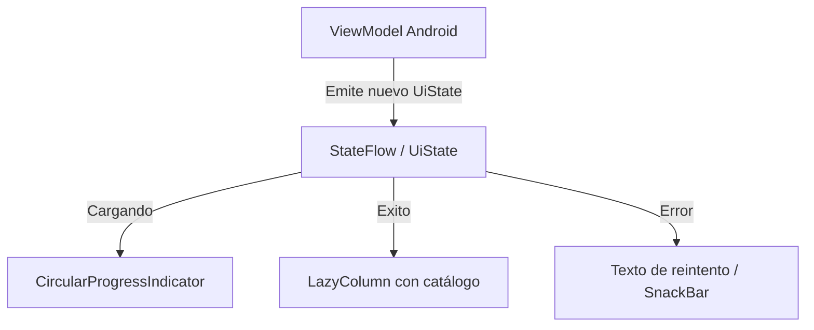

# Clases e Interfaces Selladas (Sealed Types) y el Patrón UI State

En el tema anterior aprendimos que los `enum class` permiten restringir un valor a un conjunto cerrado de opciones constantes. Sin embargo, los enums tienen una gran limitación: **cada constante solo puede almacenar los mismos datos fijos definidos en el constructor**.

¿Qué ocurre si queremos representar un resultado que puede ser o bien una **Carga en curso** (sin datos), o bien un **Éxito** (que contiene una lista de 50 videojuegos), o bien un **Error** (que contiene una excepción y un código HTTP)?

Para resolver este problema arquitectural de modelado, Kotlin proporciona los **tipos sellados**: **`sealed class`** y **`sealed interface`**.

---

## 1. ¿Qué es un Tipo Sellado? (Enums con Superpoderes)

Un tipo sellado representa una **jerarquía restringida de herencia**. Todas las subclases directas deben conocerse en tiempo de compilación y definirse dentro del mismo paquete o módulo.

A diferencia de un `enum`:
- Cada subclase de una `sealed class` o `sealed interface` puede ser una clase diferente (`data class`, `class` normal o `data object`).
- Cada subclase puede tener **su propio número y tipo de propiedades**, e incluso múltiples instancias independientes en memoria con datos distintos.

---

## 2. Sintaxis Moderna: `sealed interface` y `data object` (Kotlin 1.9+)

En el desarrollo Android contemporáneo, se prefiere **`sealed interface`** sobre `sealed class` siempre que no se necesite compartir código de constructor primario o estado mutable en la clase base, ya que es más ligera y permite herencia múltiple de interfaces.

Además, para estados que no contienen información adicional (como "Cargando" o "Vacío"), se utiliza **`data object`** (introducido en Kotlin 1.9), que genera automáticamente métodos limpios de `toString()` y `equals()` reutilizando una única instancia en memoria:

```kotlin
// Definición del contrato cerrado de estados de pantalla
sealed interface CatalogoUiState {
    // Estado sin datos: usamos 'data object' (instancia única y eficiente)
    data object Cargando : CatalogoUiState

    // Estado con datos de éxito: usamos 'data class' con la información descargada
    data class Exito(val listaJuegos: List<String>, val totalRegistros: Int) : CatalogoUiState

    // Estado de fallo: transporta el mensaje explicativo del error
    data class Error(val mensaje: String, val codigoHttp: Int = 500) : CatalogoUiState
}
```

---

## 3. Manejo con `when` Exhaustivo y *Smart Casting*

Al igual que con los enums, el compilador de Kotlin comprueba si has gestionado todas las variantes posibles del tipo sellado. 

Y lo más potente: gracias al **Smart Casting**, dentro de cada rama del `when` la variable se convierte automáticamente al subtipo correspondiente sin necesidad de ningún casteo manual:

```kotlin
fun renderizarPantalla(estado: CatalogoUiState) {
    when (estado) {
        is CatalogoUiState.Cargando -> {
            println("⏳ Mostrando indicador circular de carga en Compose...")
        }
        is CatalogoUiState.Exito -> {
            // Smart Cast automático a CatalogoUiState.Exito:
            println("✅ Renderizando ${estado.totalRegistros} juegos:")
            estado.listaJuegos.forEach { println("   - $it") }
        }
        is CatalogoUiState.Error -> {
            // Smart Cast automático a CatalogoUiState.Error:
            println("❌ Error [${estado.codigoHttp}]: ${estado.mensaje}")
        }
        // ¡No se necesita rama 'else'! El compilador sabe que no existen más casos posibles.
    }
}
```

!!! danger "¿Por qué evitar la rama `else` en tipos sellados?"
    Si añades una rama `else -> { ... }` a un `when` que evalúa un tipo sellado, **desactivas la protección del compilador**. Si en el futuro agregas un nuevo estado (ej. `data object Vacio : CatalogoUiState`), el compilador no te avisará de que olvidaste gestionarlo y caerá silenciosamente en el `else`, provocando comportamientos erróneos en tu interfaz.

---

## 4. Cuadro Comparativo: `enum class` vs `sealed interface`

| Criterio | `enum class` | `sealed interface` / `sealed class` |
| :--- | :--- | :--- |
| **Conjunto de casos** | Fijo y estático | Jerarquía cerrada de tipos |
| **Instancias** | Única por cada constante | Múltiples instancias posibles por cada subclase |
| **Estructura de datos** | Idéntica para todas las constantes | Cada subclase puede tener propiedades y constructores únicos |
| **Exhaustividad en `when`** | Sí (sin `else`) | Sí (sin `else`) con Smart Cast automático |
| **Caso de uso típico** | Días de la semana, roles fijos, temas claro/oscuro | **Estados de UI en Android (`UiState`), resultados de operaciones de red (`Result`)** |

---

## 5. El Patrón Universal de Arquitectura en Android: `UiState`

En la arquitectura moderna recomendada por Google (MVVM con Jetpack Compose), la pantalla nunca almacena múltiples booleanos desincronizados como `var estaCargando = false`, `var hayError = false`, `var datos = null`.

En su lugar, el `ViewModel` expone un único flujo reactivo de tipo sellado inmutable:



```kotlin
fun main() {
    // 1. La app arranca y empieza a descargar datos
    var estadoPantalla: CatalogoUiState = CatalogoUiState.Cargando
    renderizarPantalla(estadoPantalla)

    // 2. La descarga finaliza correctamente
    estadoPantalla = CatalogoUiState.Exito(
        listaJuegos = listOf("Zelda: Breath of the Wild", "Super Mario Odyssey"),
        totalRegistros = 2
    )
    renderizarPantalla(estadoPantalla)

    // 3. O bien ocurre un corte de conexión a internet
    estadoPantalla = CatalogoUiState.Error("Sin conexión a la base de datos de GameVault", 503)
    renderizarPantalla(estadoPantalla)
}
```

---

## 6. Retos Prácticos

### 🟢 Reto 1: Modelado de Estado de Autenticación (Básico)
Diseña una `sealed interface AuthState` con tres estados:
1. `data object NoAutenticado : AuthState`
2. `data object Autenticando : AuthState`
3. `data class Autenticado(val token: String, val email: String) : AuthState`
Crea una función `evaluarSesion(estado: AuthState)` que imprima el mensaje adecuado con un `when` exhaustivo.

??? tip "Ver solución"
    ```kotlin
    sealed interface AuthState {
        data object NoAutenticado : AuthState
        data object Autenticando : AuthState
        data class Autenticado(val token: String, val email: String) : AuthState
    }

    fun evaluarSesion(estado: AuthState) {
        when (estado) {
            is AuthState.NoAutenticado -> println("Mostrar pantalla de Login/Registro.")
            is AuthState.Autenticando -> println("Cargando credenciales con Firebase Auth...")
            is AuthState.Autenticado -> println("Bienvenido ${estado.email}. Token activo: ${estado.token}")
        }
    }

    fun main() {
        evaluarSesion(AuthState.Autenticando)
        evaluarSesion(AuthState.Autenticado("JWT_777", "alumno@dam.es"))
    }
    ```

### 🟡 Reto 2: Respuesta genérica de API (Intermedio)
Diseña una `sealed interface RespuestaApi<out T>` que admita un tipo genérico:
- `data class Correcta<T>(val datos: T) : RespuestaApi<T>`
- `data class Fallo(val mensaje: String, val codigo: Int) : RespuestaApi<Nothing>`
Escribe un programa que cree una respuesta correcta con un entero y otra de fallo, evaluando ambas.

??? tip "Ver solución"
    ```kotlin
    sealed interface RespuestaApi<out T> {
        data class Correcta<T>(val datos: T) : RespuestaApi<T>
        data class Fallo(val mensaje: String, val codigo: Int) : RespuestaApi<Nothing>
    }

    fun main() {
        val respuestaServidor: RespuestaApi<String> = RespuestaApi.Correcta("Datos del perfil sincronizados")
        val errorServidor: RespuestaApi<String> = RespuestaApi.Fallo("Timeout de red al conectar", 408)

        fun <T> procesar(r: RespuestaApi<T>) {
            when (r) {
                is RespuestaApi.Correcta -> println("Éxito en API: ${r.datos}")
                is RespuestaApi.Fallo -> println("Fallo [${r.codigo}]: ${r.mensaje}")
            }
        }

        procesar(respuestaServidor)
        procesar(errorServidor)
    }
    ```
