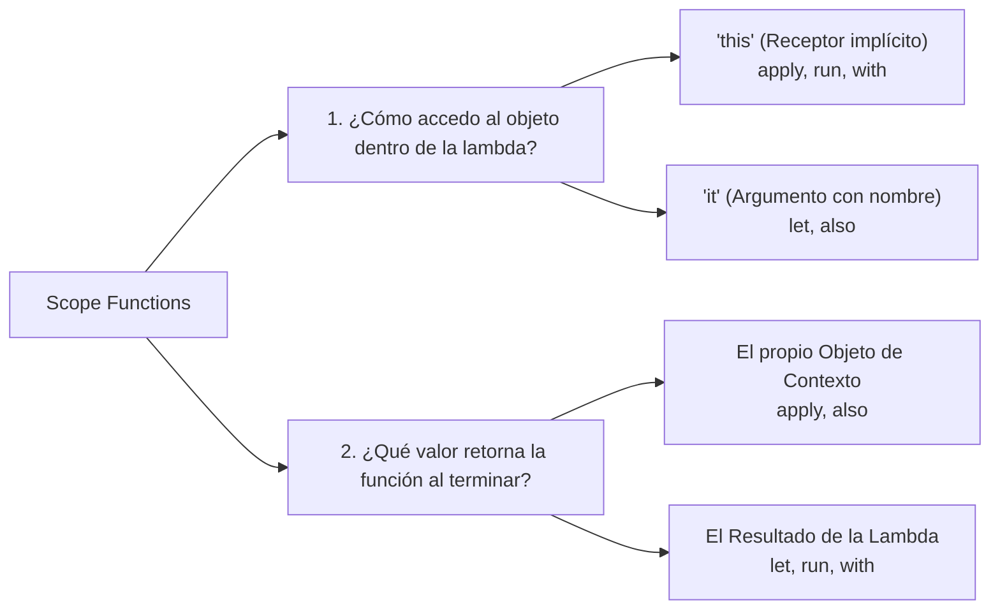
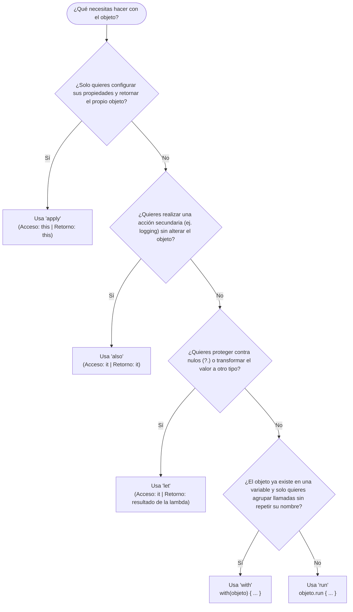

# Funciones de Ámbito (Scope Functions) en Kotlin

Las **Scope Functions** (funciones de ámbito) son una de las características más elegantes y distintivas de la biblioteca estándar de Kotlin. Permiten ejecutar un bloque de código **en el contexto temporal de un objeto determinado**.

Al invocar una de estas funciones sobre un objeto mediante una expresión lambda, se crea un ámbito (*scope*) temporal y delimitado donde puedes acceder al objeto sin tener que repetir su nombre continuamente y sin contaminar el resto de tu método con variables auxiliares.

Existen 5 funciones de ámbito en Kotlin: **`let`**, **`run`**, **`with`**, **`apply`** y **`also`**.

---

## 1. ¿Por qué son tan Importantes? (¿Qué Problema Resuelven?)

Para apreciar el valor real de las funciones de ámbito, debemos examinar cómo se escribe el código en lenguajes orientados a objetos tradicionales como **Java**:

### 1.1. Los 3 Problemas Habituales en POO Tradicional

1. **Repetición continua del nombre de la variable (*Verbosidad*):**  
   Al configurar un objeto con múltiples propiedades (como un cuadro de diálogo, una notificación o una petición de red), nos vemos obligados a teclear el nombre de la variable una y otra vez (`dialog.setTitle(...)`, `dialog.setMessage(...)`, `dialog.setIcon(...)`).
2. **Contaminación del ámbito (*Namespace Pollution*):**  
   Para instanciar y configurar ese objeto, creamos una variable temporal en el método (`val dialog = ...`). Una vez configurado y mostrado, esa variable sigue existiendo en el ámbito de la función, aumentando el riesgo de que otro desarrollador la modifique o reutilice por error más abajo.
3. **Ruptura de la fluidez en cadenas de datos:**  
   Si queremos imprimir un log de depuración a mitad de un cálculo, en Java nos vemos obligados a "romper" la cadena, guardar el resultado intermedio en una variable temporal, imprimir el log y luego continuar.

---

### 1.2. ¿Qué Sería Requerido si NO Existieran las Scope Functions?

Comparemos la misma tarea habitual en el desarrollo de Android: crear y configurar un objeto complejo para una pantalla:

=== "Java Tradicional (Sin Scope Functions)"
    ```java
    // 1. Nos vemos forzados a crear una variable temporal:
    DialogoConfig dialogo = new DialogoConfig();

    // 2. Repetición continua de 'dialogo.' para configurar cada propiedad:
    dialogo.setTitulo("Confirmar Salida");
    dialogo.setMensaje("¿Deseas guardar la partida antes de salir?");
    dialogo.setBotonAceptar("Guardar");
    dialogo.setBotonCancelar("Salir sin guardar");
    dialogo.setCancelable(false);

    // 3. Enviamos el objeto a la UI:
    mostrarDialogo(dialogo);

    // Problema: La variable 'dialogo' sigue viva aquí abajo durante todo el método,
    // ocupando memoria y pudiendo ser mutada por accidente.
    ```

=== "Kotlin Idiomático (Con la Scope Function 'apply')"
    ```kotlin
    // En Kotlin, 'apply' crea un ámbito cerrado donde configuramos el objeto directamente:
    mostrarDialogo(DialogoConfig().apply {
        titulo = "Confirmar Salida"
        mensaje = "¿Deseas guardar la partida antes de salir?"
        botonAceptar = "Guardar"
        botonCancelar = "Salir sin guardar"
        cancelable = false
    })

    // ¡Cero variables temporales intermedias!
    // El objeto se instancia, se configura en su propio ámbito y se entrega directamente.
    ```

!!! info "📚 Vínculo con el Tema 14: Null Safety"
    En el [Tema 14: Null Safety (Seguridad ante Nulos)](14-null-safety.md#5-el-modismo-estrella-en-android-objetolet) ya conociste a la primera de estas funciones: el modismo `objeto?.let { ... }`.  
    Allí vimos cómo `let` resuelve elegantemente las comprobaciones de nulos evitando que variables mutables cambien de valor entre un `if` y su uso. A continuación descubrirás que `let` es solo una de las 5 herramientas de una familia diseñada para hacer tu código mucho más limpio y expresivo.

---

## 2. El Modelo Mental: Las Dos Dimensiones Clave

Aunque las 5 funciones realizan tareas aparentemente similares, difieren exactamente en dos decisiones de diseño:



### Dimensión 1: ¿`this` o `it`?

- **`this` (Receptor implícito):** El objeto se convierte en el receptor de la lambda. Puedes llamar a sus propiedades y métodos directamente sin prefijo (`titulo = "Hola"` en lugar de `this.titulo = "Hola"`).  
  *Ideal para:* Configurar propiedades de un objeto (`apply`, `run`, `with`).
- **`it` (Argumento de la lambda):** El objeto se pasa como parámetro ordinario. Puedes usar el nombre implícito `it` o asignarle un nombre semántico (`{ usuario -> ... }`).  
  *Ideal para:* Pasar el objeto como argumento a otras funciones o cuando el nombre `it` aporta claridad (`let`, `also`).

### Dimensión 2: ¿Retornar el Objeto o el Resultado de la Lambda?

- **Retorna el Objeto de Contexto (`this` o `it`):** Devuelve la misma instancia sobre la que se llamó la función.  
  *Ideal para:* Encadenamiento de métodos continuos (*fluent chaining*), como configurar un objeto y pasarlo inmediatamente (`apply`, `also`).
- **Retorna el Resultado de la Lambda:** Devuelve el valor de la **última línea** de código ejecutada dentro del bloque.  
  *Ideal para:* Transformaciones de datos o cálculos derivados (`let`, `run`, `with`).

---

## 3. Tabla Maestra de Selección Rápida

| Función | Objeto de Contexto | Valor de Retorno | ¿Es Función de Extensión? | Cuándo Utilizarla (Regla Mnemotécnica) |
| :--- | :--- | :--- | :--- | :--- |
| **`apply`** | **`this`** (implícito) | **El propio objeto (`this`)** | Sí (`obj.apply { ... }`) | **Configuración e inicialización** de propiedades ("Aplica estas propiedades al objeto"). |
| **`also`** | **`it`** (o personalizado) | **El propio objeto (`it`)** | Sí (`obj.also { ... }`) | **Efectos secundarios adicionales** (como *logging*, validación o depuración) sin alterar el objeto ("Y además haz esto"). |
| **`let`** | **`it`** (o personalizado) | **Resultado de la lambda** | Sí (`obj.let { ... }`) | **Operaciones seguras con nulos** (`?.let`) o transformación local de datos. |
| **`run`** | **`this`** (implícito) | **Resultado de la lambda** | Sí (`obj.run { ... }`) | Configurar un objeto y calcular/devolver inmediatamente un resultado derivado. |
| **`with`** | **`this`** (implícito) | **Resultado de la lambda** | No (`with(obj) { ... }`) | Agrupar múltiples lecturas o llamadas sobre un objeto que ya sabemos que no es nulo. |

---

## 4. Guía Visual: ¿Cuál Debo Elegir en 3 Preguntas?



---

## 5. Estudio Detallado y Casos Reales en Android

### 5.1. `apply`: Configuración e Inicialización de Objetos

La regla mental de **`apply`** es: *"Toma este objeto recién creado, **aplica** las siguientes asignaciones a sus propiedades y devuélvelo listo para usar"*.

Dentro del bloque `{ }`:
- El objeto de contexto es **`this`** (puedes asignar directamente sus atributos sin anteponer el nombre de la variable).
- La función **retorna la propia instancia configurada**.

#### El contraste: Código Tradicional vs `apply`

Imagina que estás configurando un servicio o una notificación para el sistema:

```kotlin
class ConfiguradorNotificacion {
    var titulo: String = ""
    var cuerpo: String = ""
    var canalId: String = "general"
    var prioridadAlta: Boolean = false
    var sonidoHabilitado: Boolean = true
}

fun main() {
    // ❌ Enfoque tradicional (Repetición continua de 'notif1.'):
    val notif1 = ConfiguradorNotificacion()
    notif1.titulo = "Descarga completada"
    notif1.cuerpo = "El paquete de texturas ya está listo"
    notif1.canalId = "descargas"
    notif1.prioridadAlta = true

    // ✔️ Enfoque idiomático con apply (Directo, limpio y en un bloque cerrado):
    val notif2 = ConfiguradorNotificacion().apply {
        titulo = "Partida guardada"
        cuerpo = "Tu progreso se sincronizó en la nube"
        canalId = "partidas"
        prioridadAlta = false
    }

    println("Notificación lista: ${notif2.titulo} en canal [${notif2.canalId}]")
}
```

#### El gran superpoder de `apply`: Pasar objetos configurados "al vuelo"

Dado que `apply` devuelve el propio objeto recién configurado, puedes **instanciarlo, inicializarlo y entregárselo a otra función en una sola expresión**, sin necesidad de crear variables temporales auxiliares:

```kotlin
fun emitirAlertaSistema(config: ConfiguradorNotificacion) {
    println("Emitiendo alerta en [${config.canalId}]: ${config.titulo} - ${config.cuerpo}")
}

fun main() {
    // Se crea, se configura dentro de las llaves y se pasa de inmediato:
    emitirAlertaSistema(ConfiguradorNotificacion().apply {
        titulo = "Batería baja"
        cuerpo = "Nivel inferior al 15%. Conecta el dispositivo."
        prioridadAlta = true
        canalId = "sistema"
    })
}
```

!!! tip "💡 Pedagogía y Buenas Prácticas: ¿Por qué NO usamos `apply` para modelos de datos (como `Usuario`)?"
    Una duda muy común entre los estudiantes al descubrir `apply` es:  
    *«¿Por qué no creamos una clase ordinaria con campos mutables `var` para representar un `Usuario`, un `Producto` o una `Partida` y los inicializamos con `apply`?»*

    La respuesta es fundamental para comprender la arquitectura moderna en Kotlin y Android: **los modelos de datos deben ser inmutables**.

    - **Modelos de Dominio (`data class` inmutable):** Las entidades de datos (`Usuario`, `Partida`, `ItemInventario`) se modelan mediante `data class` con propiedades de solo lectura (`val`). Se inicializan de una sola vez en el constructor primario usando parámetros con nombre:
      ```kotlin
      // ✔️ Correcto: Inmutable, thread-safe y predecible
      data class Usuario(
          val id: Long,
          val nombre: String,
          val email: String,
          val activo: Boolean = true
      )

      val usuario = Usuario(
          id = 42,
          nombre = "Lucía",
          email = "lucia@pmdm.es"
      )
      ```
      En una `data class` inmutable con `val`, **`apply` no tiene sentido**, porque las propiedades no se pueden reasignar después de llamar al constructor.

    - **El verdadero propósito de `apply`:** Se reserva para **objetos de configuración, constructores (Builders) y componentes operativos de Android / librerías** (como canales de notificación, lienzos gráficos `Paint`, configuraciones de red o animaciones), que por diseño son clases de soporte con estado mutable interno y decenas de parámetros opcionales.

---

### 5.2. `let`: Operaciones Null-Safe y Transformaciones Locales

Como estudiamos en el [Tema 14: Null Safety](14-null-safety.md#5-el-modismo-estrella-en-android-objetolet), `let` recibe el objeto como `it` y devuelve la última expresión. Con el operador `?.`, es la forma estándar de aislar referencias no nulas:

```kotlin
fun procesarNombreUsuario(entrada: String?) {
    // Si 'entrada' es null, el bloque NO se ejecuta:
    val longitudFormateada = entrada?.let { nombre ->
        println("Usuario detectado: ${nombre.trim()}")
        nombre.trim().length // Última línea: se retorna como resultado
    } ?: 0

    println("Longitud válida: $longitudFormateada")
}

fun main() {
    procesarNombreUsuario("   Sofía   ") // Imprime usuario y longitud 5
    procesarNombreUsuario(null)          // Imprime longitud válida: 0
}
```

---

### 5.3. `also`: Efectos Secundarios (*Side Effects*) y Logging

`also` no modifica el valor que fluye a través de una cadena de operaciones; se utiliza para intercalar acciones secundarias como imprimir un log, emitir una métrica o validar datos sin romper el flujo:

```kotlin
fun crearDirectorioJuego(nombre: String): String {
    return "/data/user/0/gamevault/files/$nombre"
        .also { ruta -> println("[LOG DEL SISTEMA]: Carpeta calculada -> $ruta") }
        .also { ruta -> println("[AUDITORÍA]: Comprobando permisos en $ruta...") }
}

fun main() {
    val rutaFinal = crearDirectorioJuego("partidas_guardadas")
    println("Ruta obtenida: $rutaFinal")
}
```

---

### 5.4. `run`: Configuración y Cómputo de Resultado

Combina el acceso directo mediante `this` con la devolución del resultado de la última expresión. Es útil cuando necesitas configurar un objeto y calcular inmediatamente algo a partir de él:

```kotlin
class MotorFisicas {
    var gravedad = 9.8
    fun calcularTrayectoria(fuerza: Double, angulo: Double): Double = fuerza * angulo / gravedad
}

fun main() {
    val motor = MotorFisicas()

    val alcanceMaximo = motor.run {
        gravedad = 1.62 // Gravedad lunar para el cálculo
        calcularTrayectoria(100.0, 45.0) // Retorna este valor calculado
    }

    println("Alcance en la luna: $alcanceMaximo metros")
}
```

---

### 5.5. `with`: Agrupación de Llamadas sobre un Objeto

A diferencia de las otras 4, `with` no es una función de extensión; recibe el objeto como argumento ordinario: `with(objeto) { ... }`. Se recomienda cuando ya tienes un objeto que sabes que no es nulo y quieres evitar repetir su nombre:

```kotlin
class PersonajeEstadisticas {
    var nivel: Int = 10
    var fuerza: Int = 25
    var defensa: Int = 18
}

fun main() {
    val stats = PersonajeEstadisticas()

    with(stats) {
        println("=== FICHA DEL HÉROE ===")
        println("Nivel: $nivel")
        println("Ataque base: ${fuerza * 2}")
        println("Defensa total: $defensa")
    }
}
```

---

## 6. Retos Prácticos

### 🟢 Reto 1: Inicialización con `apply` (Básico)
Diseña una clase mutable `DialogoConfig` con propiedades `titulo`, `mensaje` y `cancelable: Boolean = true`. Crea una instancia utilizando `apply` para configurar sus tres propiedades e imprímela.

??? tip "Ver solución"
    ```kotlin
    class DialogoConfig {
        var titulo: String = ""
        var mensaje: String = ""
        var cancelable: Boolean = true
    }

    fun main() {
        val alerta = DialogoConfig().apply {
            titulo = "Confirmar Salida"
            mensaje = "¿Deseas cerrar la partida sin guardar?"
            cancelable = false
        }

        println("Diálogo: ${alerta.titulo} (Cancelable: ${alerta.cancelable})")
    }
    ```

### 🟡 Reto 2: Encadenamiento con `let` y `also` (Intermedio)
Dada una lista de números en texto `listOf("10", "20", "invalido", "40")`, utiliza operaciones funcionales encadenadas con `let` para transformar a número y `also` para registrar en consola cada número válido procesado.

??? tip "Ver solución"
    ```kotlin
    fun main() {
        val strings = listOf("10", "20", "error", "40")

        val total = strings
            .mapNotNull { it.toIntOrNull() }
            .also { println("Números válidos filtrados: $it") }
            .sum()

        println("Suma total: $total")
    }
    ```

### 🔴 Reto 3: Configuración y Cálculo con `run` (Avanzado)
Modela una clase `SimuladorRed` con propiedades `pingMs: Int = 50` y `paquetesPerdidos: Double = 0.01`. Utiliza la función `run` sobre una instancia para simular un empeoramiento temporal de la conexión (`pingMs = 280`, `paquetesPerdidos = 0.15`) y retornar un diagnóstico textual derivado (`"ALERTA: Latencia crítica (${pingMs}ms)"` si el ping supera los 200 ms, o `"Conexión estable"` en caso contrario).

??? tip "Ver solución"
    ```kotlin
    class SimuladorRed {
        var pingMs: Int = 50
        var paquetesPerdidos: Double = 0.01
    }

    fun main() {
        val red = SimuladorRed()

        val diagnostico = red.run {
            // Modificamos propiedades en el contexto 'this':
            pingMs = 280
            paquetesPerdidos = 0.15

            // La última línea se retorna como resultado del bloque:
            if (pingMs > 200 || paquetesPerdidos > 0.10) {
                "ALERTA: Latencia crítica (${pingMs}ms, ${paquetesPerdidos * 100}% pérdida)"
            } else {
                "Conexión estable (${pingMs}ms)"
            }
        }

        println("Diagnóstico de red: $diagnostico")
    }
    ```