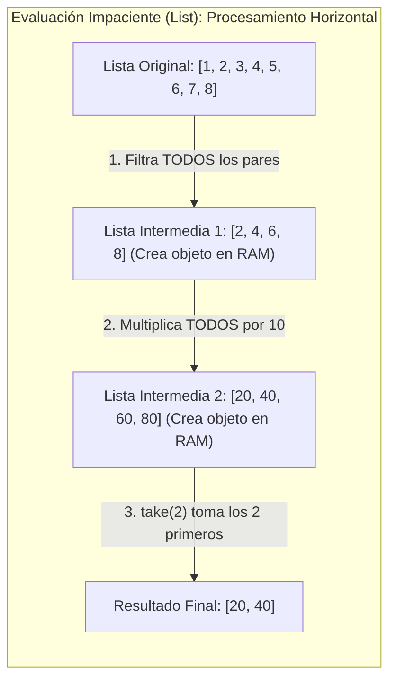
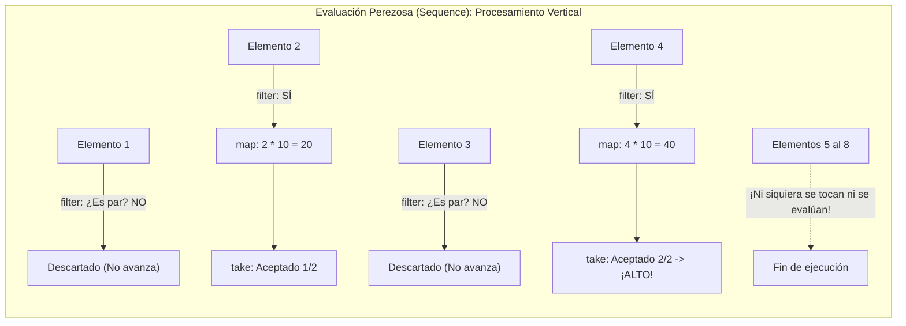

# Listas y Operaciones Funcionales en Kotlin

Las listas son la estructura de datos más utilizada en el desarrollo de aplicaciones. A diferencia de Java (donde la interfaz `java.util.List` contiene métodos de mutación como `add()` y `remove()`), Kotlin separa de forma tajante las listas en **dos interfaces diferenciadas**:

1. **`List<T>`:** Colección ordenada de **solo lectura (inmutable)**. No contiene métodos para añadir, eliminar o modificar elementos.
2. **`MutableList<T>`:** Colección ordenada **modificable (mutable)**. Dispone de métodos como `add()`, `remove()`, `clear()`, etc.

---

## 1. Creación de Listas: `listOf()` vs `mutableListOf()`

```kotlin
// 1. Lista de solo lectura (inmutable)
val consolas = listOf("PlayStation 5", "Nintendo Switch", "Xbox Series X")
// consolas.add("Steam Deck") // ERROR de compilación: add() no existe en List

// 2. Lista modificable (mutable)
val inventario = mutableListOf("Poción", "Antídoto")
inventario.add("Espada de Hierro") // Válido
inventario.removeAt(0)             // Elimina "Poción"
```

!!! tip "¿Arrays primitivos o Listas?"
    En Kotlin no existen tipos especiales como *IntList*. Si necesitas rendimiento numérico extremo a nivel de hardware (evitando el *boxing* en la JVM), utiliza arrays primitivos como **`IntArray`** (`intArrayOf(1, 2, 3)`). Para el 99% de las aplicaciones Android y modelos de datos de Compose, la recomendación estándar es usar **`List<T>`**.

---

## 2. Acceso y Recorrido de Elementos

Se puede acceder a los elementos mediante el operador de indexación `[indice]` o con métodos seguros ante índices fuera de rango:

```kotlin
val juegos = listOf("Mario Odyssey", "Metroid Dread", "Zelda BotW")

// Acceso directo por índice (lanza IndexOutOfBoundsException si no existe)
val primerJuego = juegos[0]

// Acceso seguro: devuelve null si el índice no existe
val juegoInexistente = juegos.getOrNull(10) // null (sin excepciones)

// Recorrido convencional con bucle for:
for (juego in juegos) {
    println("Título: $juego")
}

// Recorrido con índice y valor desestructurado:
for ((indice, juego) in juegos.withIndex()) {
    println("Posición #$indice -> $juego")
}
```

---

## 3. Inmutabilidad y Adición Funcional de Elementos (`+`)

¿Cómo añadimos un elemento si estamos trabajando con una lista inmutable `List<T>`? 

En lugar de mutar la lista original, Kotlin ofrece el operador **`+`**, que **crea y devuelve una nueva lista inmutable que contiene todos los elementos originales más el nuevo**:

```kotlin
val listaOriginal: List<String> = listOf("Kotlin", "Android")

// Se genera una nueva lista con 3 elementos; la original queda intacta
val listaActualizada: List<String> = listaOriginal + "Jetpack Compose"

println("Original: $listaOriginal")       // [Kotlin, Android]
println("Actualizada: $listaActualizada") // [Kotlin, Android, Jetpack Compose]
```

!!! info "Clave para Jetpack Compose"
    Esta técnica de derivar una nueva lista con `+` (o `filter`) en lugar de mutar una `MutableList` interna es la forma recomendada en los ViewModels de Android para que Compose detecte cambios en listas de elementos visualizados con `LazyColumn`.

---

## 4. Operaciones Funcionales Imprescindibles

La biblioteca estándar de Kotlin cuenta con un riquísimo catálogo de funciones de extensión para transformar y consultar listas sin necesidad de escribir bucles manuales:

### 4.1. `map`: Transformación elemento a elemento
Aplica una función a cada elemento y produce una nueva lista con los resultados:

```kotlin
val preciosDolares = listOf(10.0, 20.0, 50.0)
val preciosEuros = preciosDolares.map { it * 0.92 }
println(preciosEuros) // [9.2, 18.4, 46.0]
```

### 4.2. `filter`: Filtrado por condición
Devuelve una nueva lista con únicamente los elementos que cumplan el predicado booleano:

```kotlin
val numeros = listOf(1, 2, 3, 4, 5, 6, 7, 8)
val pares = numeros.filter { it % 2 == 0 }
println(pares) // [2, 4, 6, 8]
```

### 4.3. Búsqueda y Verificación: `find`, `any`, `all`
```kotlin
val nombres = listOf("Ana", "Mateo", "Carlos", "Beatriz")

// 'find': Devuelve el primer elemento que cumple la condición, o null
val primerNombreConC = nombres.find { it.startsWith("C") } // "Carlos"

// 'any': Devuelve true si al menos un elemento cumple la condición
val hayNombresLargos = nombres.any { it.length > 6 } // true (Beatriz)

// 'all': Devuelve true si TODOS los elementos cumplen la condición
val todosTienenMasDeDosLetras = nombres.all { it.length > 2 } // true
```

### 4.4. Agrupación y Ordenación: `groupBy` y `sortedBy`
```kotlin
data class Producto(val nombre: String, val categoria: String, val precio: Double)

val catalogo = listOf(
    Producto("Mando Pro", "Accesorios", 69.99),
    Producto("Auriculares Gaming", "Audio", 89.99),
    Producto("Funda Switch", "Accesorios", 19.99),
    Producto("Altavoces", "Audio", 45.0)
)

// Ordenar por precio ascendente
val ordenados = catalogo.sortedBy { it.precio }

// Agrupar en un Map por categoría:
val porCategoria = catalogo.groupBy { it.categoria }
println(porCategoria["Accesorios"]) // Lista con Mando Pro y Funda Switch
```

### 4.5. `flatMap`: Aplanando colecciones anidadas
Cuando cada elemento contiene a su vez una lista (relaciones 1 a N) y deseas obtener una única lista plana con todos los elementos combinados:

```kotlin
data class Desarrollador(val nombre: String, val habilidades: List<String>)

val equipo = listOf(
    Desarrollador("Lucía", listOf("Kotlin", "Compose")),
    Desarrollador("Marcos", listOf("Kotlin", "Corrutinas", "Room")),
    Desarrollador("Elena", listOf("Figma", "Compose"))
)

// flatMap transforma cada elemento en una colección y concatena los resultados
val todasHabilidades = equipo.flatMap { it.habilidades }
println(todasHabilidades)
// [Kotlin, Compose, Kotlin, Corrutinas, Room, Figma, Compose]
```

### 4.6. `distinct` y `distinctBy`: Eliminación de duplicados
```kotlin
// Elimina valores idénticos repetidos:
val habilidadesUnicas = todasHabilidades.distinct()
println(habilidadesUnicas) // [Kotlin, Compose, Corrutinas, Room, Figma]

// Elimina duplicados basándose en una propiedad clave del objeto:
val productosSinDuplicados = catalogo.distinctBy { it.categoria }
```

### 4.7. `take` y `drop`: Selección y descarte por cantidad
Ideales para paginación o para obtener los primeros o últimos puestos de una clasificación:

```kotlin
val puntuaciones = listOf(100, 95, 88, 70, 65, 40)

val podio = puntuaciones.take(3)        // [100, 95, 88] (Primeros 3)
val resto = puntuaciones.drop(3)        // [70, 65, 40] (Descarta los 3 primeros)
val aprobados = puntuaciones.takeWhile { it >= 50 } // [100, 95, 88, 70, 65]
```

### 4.8. `partition`: Bifurcación en dos listas simultáneas
Divide la colección en un par (`Pair<List<T>, List<T>>`) en una sola pasada: los que cumplen la condición (`first`) y los que no (`second`):

```kotlin
val notas = listOf(4.5, 7.0, 9.2, 3.8, 6.0)
val (aprobadosList, suspensosList) = notas.partition { it >= 5.0 }

println("Aprobados: $aprobadosList") // [7.0, 9.2, 6.0]
println("Suspensos: $suspensosList") // [4.5, 3.8]
```

### 4.9. Operaciones de Agregación: `sumOf`, `maxByOrNull`, `count`, `average`
```kotlin
val precios = listOf(19.99, 49.99, 9.99)

val totalGastado = precios.sumOf { it }          // 79.97
val precioMedio = precios.average()             // 26.65
val articulosCaros = precios.count { it > 20 }   // 1
val masCaro = catalogo.maxByOrNull { it.precio } // Producto con precio más alto
```

---

## 5. Programación Fluent: Pipelines de Transformación Encadenados

La **programación Fluent** (o interfaz fluida mediante *Method Chaining*) es un estilo de diseño donde las operaciones se encadenan consecutivamente con puntos (`.`). Cada función toma el resultado de la anterior, lo transforma y produce una nueva colección, permitiendo leer el código de izquierda a derecha o de arriba abajo como si fuera una frase en lenguaje natural.

### Comparativa: Enfoque Imperativo Tradicional vs. Pipeline Fluent

Imagina que de una lista de videojuegos queremos:

1. Filtrar solo los juegos de rol ("RPG").
2. Ordenarlos por puntuación de mayor a menor.
3. Extraer solo los títulos en mayúsculas de los 3 mejores.

=== "Estilo Imperativo Tradicional (Bucles e Índices)"
    ```kotlin
    // Muy propenso a errores, código extenso y variables mutables intermedias
    val topTitulos = mutableListOf<String>()
    val rpgs = mutableListOf<Videojuego>()
    
    for (juego in biblioteca) {
        if (juego.genero == "RPG") {
            rpgs.add(juego)
        }
    }
    
    rpgs.sortByDescending { it.puntuacion }
    
    val limite = if (rpgs.size < 3) rpgs.size else 3
    for (i in 0 until limite) {
        topTitulos.add(rpgs[i].titulo.uppercase())
    }
    ```

=== "Estilo Declarativo Fluent (Pipeline Encadenado)"
    ```kotlin
    // Limpio, inmutable, conciso y autodocumentado:
    val topTitulos = biblioteca
        .filter { it.genero == "RPG" }
        .sortedByDescending { it.puntuacion }
        .take(3)
        .map { it.titulo.uppercase() }
    ```

El pipeline Fluent describe **qué** queremos obtener en cada paso en lugar de cómo gestionar punteros, bucles o listas temporales.

---

## 6. Listas Impacientes (*Eager*) vs. Secuencias Perezosas (*Lazy Sequences*)

Aunque los pipelines encadenados con listas son extremadamente cómodos y elegantes, ocultan un **coste computacional invisible** que es vital comprender a fondo en desarrollo móvil.

### El Problema de las Listas Estándar: Evaluación Impaciente (*Eager*)

En Kotlin, las funciones de transformación sobre `List<T>` se ejecutan de forma **impaciente (*eager*)** y **horizontal (por etapas completas)**:

- Cada vez que llamas a `.filter { ... }`, Kotlin recorre la lista completa y **crea una nueva `List` intermedia en memoria RAM**.
- Cuando a continuación llamas a `.map { ... }`, Kotlin vuelve a recorrer la lista completa anterior y crea **otra nueva `List` intermedia en memoria RAM**.
- Si tu colección tiene 100.000 elementos y encadenas 4 operaciones, estás creando y tirando a la basura **3 listas intermedias gigantescas**, consumiendo memoria del smartphone y saturando el recolector de basura (*Garbage Collector*).



### La Solución: `Sequence<T>` (Los Streams Perezosos de Kotlin)

Una **`Sequence<T>`** evalúa las operaciones de forma **perezosa (*lazy*)** y **vertical (elemento a elemento)**:

- Cada elemento recorre el pipeline completo **de principio a fin antes de que el siguiente elemento comience a procesarse**.
- **No se crean colecciones intermedias en memoria RAM**.
- Si una operación final (como `take(2)`) ya ha conseguido los elementos necesarios, **el pipeline se detiene de inmediato (*short-circuiting*)**, ahorrando procesar el resto de la colección.



### El Experimento de los `println()`: La Prueba Irrefutable

Para ver con tus propios ojos cómo se comporta cada modelo, ejecuta este código y observa la salida en consola:

=== "Con Lista Estándar (Impaciente)"
    ```kotlin
    val numeros = listOf(1, 2, 3, 4, 5, 6, 7, 8)

    val resultado = numeros
        .filter { 
            println("  [List Filter]: $it")
            it % 2 == 0 
        }
        .map { 
            println("  [List Map]: $it")
            it * 10 
        }
        .take(2)

    println("Resultado: $resultado")
    ```
    
    **Salida en Consola:**
    ```text
      [List Filter]: 1
      [List Filter]: 2
      [List Filter]: 3
      [List Filter]: 4
      [List Filter]: 5
      [List Filter]: 6
      [List Filter]: 7
      [List Filter]: 8
      [List Map]: 2
      [List Map]: 4
      [List Map]: 6
      [List Map]: 8
    Resultado: [20, 40]
    ```
    *(Observa cómo filtró los 8 números y multiplicó los 4 números pares, para luego quedarse únicamente con 2).*

=== "Con Secuencia (Perezosa con .asSequence())"
    ```kotlin
    val numeros = listOf(1, 2, 3, 4, 5, 6, 7, 8)

    val resultado = numeros
        .asSequence() // Convertimos a evaluación perezosa (Stream)
        .filter { 
            println("  [Sequence Filter]: $it")
            it % 2 == 0 
        }
        .map { 
            println("  [Sequence Map]: $it")
            it * 10 
        }
        .take(2)
        .toList() // Operador terminal que solicita los datos

    println("Resultado: $resultado")
    ```
    
    **Salida en Consola:**
    ```text
      [Sequence Filter]: 1
      [Sequence Filter]: 2
      [Sequence Map]: 2
      [Sequence Filter]: 3
      [Sequence Filter]: 4
      [Sequence Map]: 4
    Resultado: [20, 40]
    ```
    *(¡Magia! En cuanto procesó el número 4, `take(2)` quedó satisfecho y la ejecución terminó. Los números 5, 6, 7 y 8 ni se filtraron ni se tocaron).*

### Operadores Intermedios vs. Operadores Terminales

En una secuencia existen dos clases de operadores:

1. **Operadores Intermedios (Perezosos):**
   - Devuelven otra `Sequence<T>`.
   - **No realizan ningún cómputo inmediatamente**: simplemente construyen la receta de cómo se transformará el dato cuando se le pida.
   - Ejemplos: `filter`, `map`, `take`, `drop`, `distinct`, `sortedBy`.

2. **Operadores Terminales (Ejecutores):**
   - Son los que "tiran de la cuerda" y desencadenan la evaluación elemento a elemento a lo largo de toda la cadena.
   - Devuelven un resultado cerrado (una lista, un número, un booleano o nada).
   - Ejemplos: `toList()`, `toSet()`, `first()`, `find()`, `count()`, `sumOf()`, `forEach()`.

!!! warning "Sin operador terminal no hay ejecución"
    Si escribes `val sec = miLista.asSequence().map { it * 2 }` y nunca invocas un operador terminal como `.toList()` o `.forEach()`, el bloque de código del `map` **nunca llegará a ejecutarse**.

### Equivalencias: Kotlin `Sequence` frente a Java `Stream`

Si ya conoces la API de Streams de Java (de 1º de DAM o *Acceso a Datos*), `Sequence` es su equivalente directo en Kotlin:

| Operación | Java Stream (`java.util.stream.Stream`) | Kotlin Sequence (`kotlin.sequences.Sequence`) |
| :--- | :--- | :--- |
| **Iniciar Stream** | `lista.stream()` | `lista.asSequence()` |
| **Filtrar** | `.filter(x -> x > 0)` | `.filter { it > 0 }` |
| **Mapear** | `.map(x -> x * 2)` | `.map { it * 2 }` |
| **Limitar cantidad** | `.limit(5)` | `.take(5)` |
| **Omitir elementos** | `.skip(3)` | `.drop(3)` |
| **Eliminar duplicados**| `.distinct()` | `.distinct()` o `.distinctBy { it.id }` |
| **Aplanar listas** | `.flatMap(x -> x.getHijos().stream())` | `.flatMap { it.hijos }` |
| **Cerrar a Lista** | `.collect(Collectors.toList())` | `.toList()` |

### ¿Cuándo usar `List` y cuándo usar `Sequence`?

| Criterio | Usar Lista Estándar (`List<T>`) | Usar Secuencia (`Sequence<T>`) |
| :--- | :--- | :--- |
| **Tamaño de la colección** | Pequeña o mediana (**< 1.000 elementos**). | Grande (**> 10.000 elementos**) o desconocida. |
| **Longitud del pipeline** | 1 o 2 operaciones (ej. solo un `filter`). | 3 o más operaciones encadenadas en la misma pasada. |
| **Operaciones con corte** | Raras veces necesario. | Esenciales: `first()`, `find()`, `take(n)`. |
| **Sobrecoste (Overhead)** | Muy bajo en colecciones cortas. | El coste de crear el objeto `Sequence` se amortiza en colecciones grandes. |
| **Contexto típico** | **UI y Jetpack Compose** (listas de pantalla paginadas). | **Procesamiento de ficheros, exportaciones o analítica**. |

### El Puente Hacia `Flow`: De Streams Síncronos a Reactivos

- **`List<T>`**: Colección estática en memoria. Fluent e impaciente.
- **`Sequence<T>`**: Stream síncrono perezoso en CPU. Procesa elemento a elemento bajo demanda pero bloquea el hilo si una operación tarda.
- **`Flow<T>`**: Stream asíncrono y reactivo. La versión con corrutinas de `Sequence`: procesa elemento a elemento a lo largo del tiempo sin bloquear jamás el hilo principal.

---

## 7. Retos Prácticos

### 🟢 Reto 1: Transformación de nombres (Básico)
Dada una lista `listOf("juan", "maría", "pedro")`, utiliza `map` para obtener una nueva lista donde cada nombre tenga la primera letra en mayúscula (`capitalize()` / `replaceFirstChar { it.uppercase() }`).

??? tip "Ver solución"
    ```kotlin
    fun main() {
        val nombres = listOf("juan", "maría", "pedro")
        val capitalizados = nombres.map { it.replaceFirstChar { c -> c.uppercase() } }
        println(capitalizados) // [Juan, María, Pedro]
    }
    ```

### 🟡 Reto 2: Filtrado y agregación de biblioteca de juegos (Intermedio)
Dada una lista de videojuegos con sus horas de duración `val partidas = listOf("Hades" to 65, "Celeste" to 15, "Witcher 3" to 120, "Inside" to 4)`, filtra los juegos de más de 20 horas y calcula el promedio de duración de esos juegos largos.

??? tip "Ver solución"
    ```kotlin
    fun main() {
        val partidas = listOf(
            "Hades" to 65,
            "Celeste" to 15,
            "Witcher 3" to 120,
            "Inside" to 4
        )

        val juegosLargos = partidas.filter { it.second > 20 }
        val promedio = juegosLargos.map { it.second }.average()

        println("Juegos largos: $juegosLargos")
        println("Promedio de horas: $promedio horas")
    }
    ```

### 🔴 Reto 3: Optimización de Gran Volumen con Secuencias y Cortocircuito (Avanzado)
Genera una secuencia infinita o un rango de 1 a 1.000.000 de números. Utiliza un pipeline Fluent para:

1. Filtrar solo los números divisibles por 7.
2. Transformar cada número elevándolo al cuadrado.
3. Tomar únicamente los primeros 5 resultados.
4. Convertir el resultado a una `List<Long>` final e imprimirlo.

Comprueba que el cálculo es instantáneo gracias a la evaluación perezosa y el cortocircuito de `Sequence`.

??? tip "Ver solución"
    ```kotlin
    fun main() {
        // Rango de 1 millón de elementos
        val primerosCincoCuadrados = (1..1_000_000)
            .asSequence() // ¡Clave de rendimiento! No genera listas de 1 millón de elementos
            .filter { it % 7 == 0 }
            .map { it.toLong() * it.toLong() }
            .take(5)
            .toList()

        println("Primeros 5 múltiplos de 7 al cuadrado: $primerosCincoCuadrados")
        // Salida: [49, 196, 441, 784, 1225]
    }
    ```
