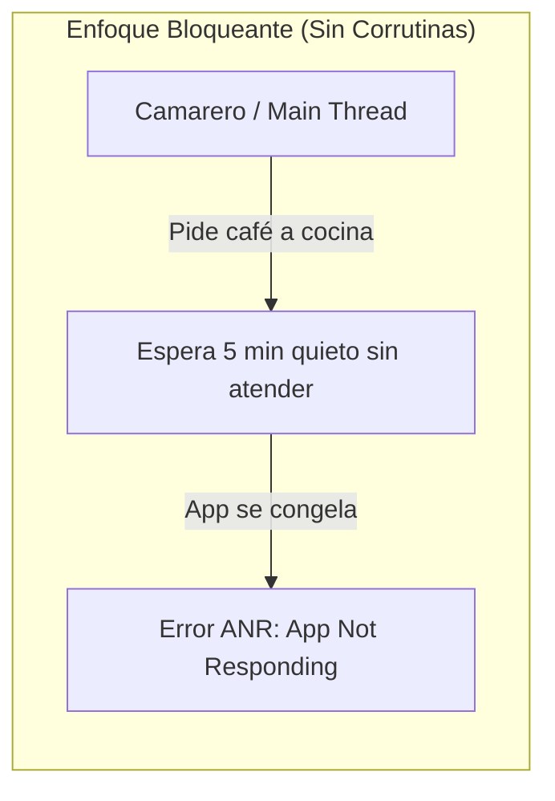

# Programación Asíncrona con Corrutinas en Kotlin

En el desarrollo de aplicaciones móviles, la **concurrencia asíncrona** es un requisito innegociable. Una aplicación móvil debe realizar operaciones que toman tiempo (descargar imágenes, consultar una API REST, leer una base de datos local SQLite/Room) sin **congelar jamás la pantalla** ni bloquear la interacción del usuario a 60 o 120 fotogramas por segundo.

Históricamente en Java y Android se utilizaban hilos manuales (`Thread`), manejadores (`Handler`), `AsyncTask` o complejas librerías de callbacks reactivos (`RxJava`). Kotlin revolucionó este panorama introduciendo las **corrutinas** (*Coroutines*): una solución elegante y ligera que permite escribir **código asíncrono no bloqueante con la misma sencillez y legibilidad que el código secuencial síncrono**.

---

## 1. La Analogía del Camarero: ¿Por qué bloquear un hilo es fatal?

Imagina un restaurante concurrido:



- **El Hilo Principal (*Main Thread* o Hilo de UI):** Es el **único camarero** del restaurante. Su trabajo vital es escuchar al usuario (toques en la pantalla, gestos, teclado) y redibujar los componentes visuales.
- **La Tarea Pesada:** Es un pedido complejo (por ejemplo, descargar el catálogo de juegos desde un servidor).

### El Enfoque Bloqueante (Sin Corrutinas)
Si el camarero toma el pedido, se mete a la cocina y se queda allí de pie 4 segundos esperando a que termine la máquina de café:
- Durante esos 4 segundos, **nadie atiende el comedor**.
- Si un cliente intenta pulsar un botón, la app no responde.
- El sistema operativo Android detecta que el hilo principal lleva más de 5 segundos sin procesar eventos y lanza el temido diálogo del sistema: **ANR (Application Not Responding)**, cerrando la app a la fuerza.

### El Enfoque con Corrutinas (No Bloqueante)
Con corrutinas, el camarero pasa la comanda a la cocina (lanza una corrutina en segundo plano) y **vuelve inmediatamente a la sala a seguir atendiendo a los clientes**. 
Cuando la cocina termina, la corrutina avisa al camarero, quien recoge el plato y lo entrega en la mesa sin haber dejado de atender la sala en ningún momento.

---

## 2. Corrutinas vs Hilos Tradicionales (*Threads*)

A menudo se confunden, pero su coste en recursos es drásticamente distinto:

| Característica | Hilo Tradicional (`Thread` del SO) | Corrutina de Kotlin |
| :--- | :--- | :--- |
| **Peso en memoria** | **Pesado** (consume ~1 MB de memoria de pila por hilo) | **Ultraligero** (consume unos pocos bytes en memoria) |
| **Creación** | Muy costosa (requiere intervención del kernel del SO) | Prácticamente instantánea (gestionada en espacio de usuario) |
| **Escalabilidad** | Crear 5.000 hilos colapsa la memoria de un teléfono móvil (`OutOfMemoryError`). | Puedes lanzar **100.000 corrutinas** simultáneamente sin problema. |
| **Concepto clave** | "Hilos de hardware/SO" | "Hilos virtuales cooperativos" que se ejecutan sobre un grupo de hilos reales. |

---

## 3. Funciones de Suspensión (`suspend fun`)

El bloque de construcción fundamental de las corrutinas es la palabra clave **`suspend`**.

Una función marcada como `suspend` es una función ordinaria con una capacidad especial: **puede pausar su ejecución en un punto determinado y reanudarse más tarde sin bloquear el hilo donde se está ejecutando**.

```kotlin
import kotlinx.coroutines.delay

// 'delay' es una función de suspensión: pausa la corrutina sin bloquear el hilo
suspend fun descargarDatosJuegos(): String {
    println("-> Iniciando descarga de catálogo en segundo plano...")
    delay(2000) // Simula una espera de red de 2 segundos de forma NO bloqueante
    return "Catálogo: 120 videojuegos disponibles"
}
```

!!! warning "Regla de compilación de funciones suspend"
    Una función `suspend` **solo puede ser invocada desde dentro de otra función de suspensión o desde el cuerpo de un constructor de corrutina (*Coroutine Builder*)**.

---

## 4. Constructores de Corrutinas (*Coroutine Builders*)

Para arrancar una corrutina desde código convencional síncrono, se utilizan los *builders*, los cuales se invocan siempre en el contexto de un ámbito de ejecución (**`CoroutineScope`**):

### 4.1. `launch`: Lanzar y Olvidar (*Fire and Forget*)
Se utiliza cuando se desea ejecutar una tarea en segundo plano y **no se necesita que devuelva un valor directo** (por ejemplo: registrar un log, guardar un ajuste local, enviar una analítica):

```kotlin
import kotlinx.coroutines.*

fun main() = runBlocking { // 'runBlocking' crea un scope bloqueante solo para pruebas en main
    println("Antes del launch")

    launch {
        delay(1000)
        println("Tarea secundaria completada en segundo plano")
    }

    println("Después del launch (se ejecuta de inmediato)")
}
```

### 4.2. `async` y `await`: Peticiones en Paralelo con Retorno de Valor
Se utiliza cuando **necesitamos un resultado devuelto**. `async` devuelve un objeto `Deferred<T>` (una promesa de que habrá un resultado futuro). Para esperar a que esté listo y extraer el valor se invoca `.await()`:

```kotlin
import kotlinx.coroutines.*

suspend fun obtenerPuntuacion(): Int {
    delay(1000)
    return 950
}

suspend fun obtenerNombreJugador(): String {
    delay(1000)
    return "Zelda"
}

fun main() = runBlocking {
    println("Cargando perfil en paralelo...")

    // Ambas tareas se ejecutan simultáneamente en paralelo:
    val puntuacionDeferred = async { obtenerPuntuacion() }
    val nombreDeferred = async { obtenerNombreJugador() }

    // .await() espera a que ambas finalicen (tardará 1 segundo en total, no 2)
    val nombre = nombreDeferred.await()
    val puntos = puntuacionDeferred.await()

    println("Perfil cargado: $nombre con $puntos puntos.")
}
```

---

## 5. Despachadores en Android (*Dispatchers*)

Un **Dispatcher** indica en qué grupo de hilos (*Thread Pool*) debe ejecutarse una corrutina determinada:

| Despachador | Diseñado para | Ejemplos en Android |
| :--- | :--- | :--- |
| **`Dispatchers.Main`** | Operaciones exclusivas de Interfaz de Usuario (hilo principal). | Actualizar estados de Jetpack Compose, animaciones, navegación. |
| **`Dispatchers.IO`** | Operaciones de Entrada/Salida bloqueantes fuera de CPU. | Consultas SQL con Room, peticiones HTTP de red, lectura/escritura de ficheros. |
| **`Dispatchers.Default`** | Tareas intensivas en cómputo de procesador. | Parseo de JSONs masivos, ordenación de listas gigantescas, compresión o filtros de imagen. |

### Cambio de Contexto Seguro con `withContext`
Permite cambiar temporalmente de hilo para una operación pesada y regresar automáticamente al hilo original:

```kotlin
import kotlinx.coroutines.*

suspend fun cargarCatalogoYActualizarUi() {
    // 1. Cambiamos al hilo de Entrada/Salida para descargar
    val datos = withContext(Dispatchers.IO) {
        println("Descargando en hilo de red: ${Thread.currentThread().name}")
        delay(1500)
        listOf("Metroid", "Pokemon", "Zelda")
    }

    // 2. Al salir de withContext, volvemos automáticamente al hilo original (Main)
    println("Actualizando pantalla en Compose con: $datos")
}
```

---

## 6. Manejo de Errores con `try-catch`

A diferencia de los callbacks antiguos donde las excepciones se perdían entre hilos, en las corrutinas puedes capturar errores de operaciones asíncronas con la sintaxis clásica de `try-catch`:

```kotlin
import kotlinx.coroutines.*

suspend fun descargarConFalloSeguro() {
    try {
        withContext(Dispatchers.IO) {
            delay(1000)
            throw java.io.IOException("Error 503: Servidor de GameVault no disponible")
        }
    } catch (e: java.io.IOException) {
        println("Error capturado limpiamente: ${e.message}")
        // Aquí actualizamos el UiState a CatalogoUiState.Error(...)
    }
}
```

---

## 7. Retos Prácticos

### 🟢 Reto 1: Saludo con retardo (Básico)
Crea una función de suspensión `saludarConRetardo(nombre: String, tiempoMs: Long)` que imprima "Iniciando espera...", espere el tiempo indicado usando `delay()` y luego imprima "¡Hola, $nombre!". Pruébala dentro de un bloque `runBlocking`.

??? tip "Ver solución"
    ```kotlin
    import kotlinx.coroutines.*

    suspend fun saludarConRetardo(nombre: String, tiempoMs: Long) {
        println("Iniciando espera para $nombre...")
        delay(tiempoMs)
        println("¡Hola, $nombre tras ${tiempoMs}ms!")
    }

    fun main() = runBlocking {
        saludarConRetardo("Mario", 1000)
    }
    ```

### 🟡 Reto 2: Descargas concurrentes con `async` (Intermedio)
Simula la carga de un juego descargando en paralelo sus texturas (demora 1.5 s) y sus sonidos (demora 1.0 s). Mide el tiempo total demostrando que no supera los 1.6 segundos al ejecutarse en paralelo.

??? tip "Ver solución"
    ```kotlin
    import kotlinx.coroutines.*

    suspend fun cargarTexturas(): String {
        delay(1500)
        return "Texturas 4K"
    }

    suspend fun cargarSonidos(): String {
        delay(1000)
        return "Efectos SFX"
    }

    fun main() = runBlocking {
        val inicio = System.currentTimeMillis()

        val texturas = async { cargarTexturas() }
        val sonidos = async { cargarSonidos() }

        println("Recursos listos: ${texturas.await()} y ${sonidos.await()}")
        val totalMs = System.currentTimeMillis() - inicio
        println("Tiempo total en paralelo: $totalMs ms (menos de 2 segundos)")
    }
    ```
