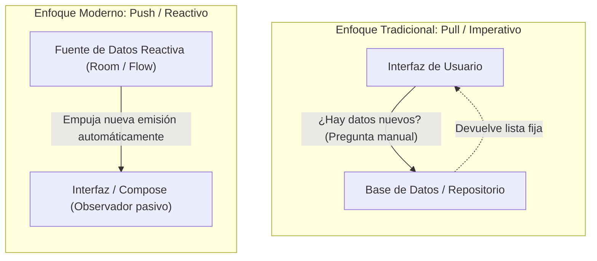
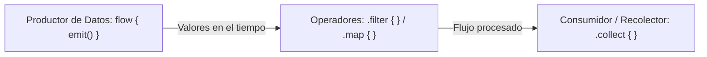
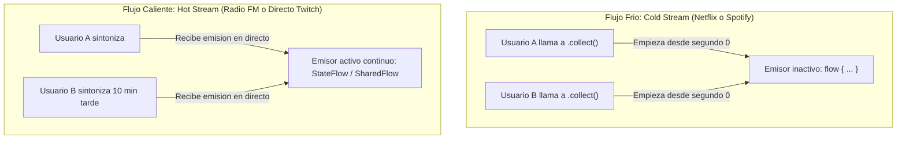
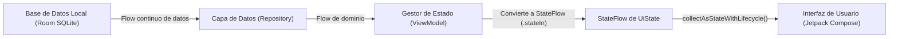

# Flujos Asíncronos y Reactivos en Kotlin: Flow y StateFlow

En el tema anterior aprendimos que una función de suspensión (`suspend fun`) permite realizar una tarea asíncrona y devolver **un único valor** (por ejemplo, descargar un archivo, calcular una ruta GPS o consultar un perfil en una API REST) sin bloquear el hilo principal de la aplicación.

Sin embargo, en las aplicaciones del mundo real a menudo nos encontramos con situaciones donde los datos no son un único valor cerrado, sino **una secuencia continua de datos que van llegando de forma asíncrona a lo largo del tiempo**:

- Los mensajes que van entrando en una conversación en tiempo real (**Discord, WhatsApp o Twitch**).

- Las actualizaciones continuas de la velocidad y ubicación de los sensores GPS en **Google Maps**.

- Las lecturas periódicas de las pulsaciones por minuto (PPM) en un **smartwatch deportivo**.

- La cuenta atrás de un temporizador de juego o un cronómetro de cocina.

- El progreso porcentual de una descarga pesada en **Steam o Google Play Store** (`10% -> 25% -> 60% -> 100%`).

- Los cambios en una base de datos local **Room** (la interfaz se actualiza sola cada vez que se inserta, edita o elimina una fila).

Para dar respuesta a este paradigma reactivo, Kotlin ofrece **Kotlin Flows**: un mecanismo nativo, elegante y eficiente para gestionar flujos de datos asíncronos construido directamente sobre el motor de las corrutinas.

---

## 0. Fundamentos del Paradigma Reactivo: De "Preguntar" (Pull) a "Reaccionar" (Push)

Antes de escribir una sola línea de código con `Flow`, es fundamental entender el **cambio de mentalidad** que exige este paradigma respecto a la programación imperativa y secuencial que has practicado en módulos anteriores.

### La Analogía de la Hoja de Cálculo (Excel)

Imagina una hoja de cálculo con dos celdas numéricas (`A1 = 50`, `B1 = 100`) y una tercera celda con una fórmula (`C1 = A1 + B1`), cuyo resultado visible es `150`.

- **En la programación imperativa tradicional (Secuencial):**
  
    Cuando escribes variables en memoria, la asignación ocurre una sola vez en el tiempo:
  
    ```kotlin
    var precio = 100
    var total = precio * 1.21 // total = 121
    
    // Si más adelante el precio cambia:
    precio = 200
    // ¡OJO! 'total' sigue valiendo 121 en memoria a menos que
    // recuerdes explícitamente volver a escribir 'total = precio * 1.21'
    ```
  
    En una aplicación móvil con interfaz gráfica, este enfoque secuencial obliga al programador a acordarse de invocar funciones como `actualizarPantalla()` o `miTextView.text = ...` cada vez que cualquier variable cambia. Si en alguna pantalla o hilo se te olvida hacerlo, **la interfaz mostrará datos obsoletos o inconsistentes**.

- **En la programación reactiva (Flujos de datos):**
  
    En Excel, tú nunca tienes que hacer clic en un botón que diga *"Recalcular celda C1"*. En cuanto el usuario edita el valor de `A1`, la celda `C1` **reacciona al instante** y se actualiza sola porque existe una **dependencia reactiva declarada**.
  
    En el desarrollo moderno con Kotlin y Android, modelamos los datos como tuberías reactivas: cuando la base de datos o un servicio web actualiza una cifra, esa modificación viaja sola por la tubería hasta los píxeles de la pantalla sin intervención manual.

### Comparativa: Modelo Pull (Imperativo) vs. Modelo Push (Reactivo)

| Característica | Modelo Tradicional (Pull / Polling) | Modelo Reactivo (Push / Streams) |
| :--- | :--- | :--- |
| **Iniciador de la acción** | El consumidor pide datos cuando cree necesitarlos. | La fuente de datos emite datos en cuanto ocurren. |
| **Mecanismo** | *Polling* o preguntas repetitivas: *"¿Hay novedades?"* | Suscripción pasiva: *"Avísame en cuanto cambie algo"*. |
| **Sincronización de UI** | Propensa a errores por olvido de llamadas de refresco. | Siempre sincronizada de forma automática y consistente. |
| **Analogía cotidiana** | Salir a la calle a ver si el cartero ha dejado una carta. | Recibir una notificación instantánea en la pantalla del móvil. |



### Los 4 Pilares del Paradigma Reactivo

Para dominar la programación reactiva en Android debemos interiorizar cuatro principios esenciales:

1. **Streams de datos (Tuberías en el tiempo):** Cualquier elemento susceptible de cambiar se modela como un flujo de valores continuos: los clics de un usuario, las lecturas del acelerómetro o GPS, la batería restante o las filas de una tabla SQL.

2. **Propagación del cambio:** En cuanto la fuente emisora coloca un nuevo dato en la tubería, todos los componentes suscritos lo reciben de manera automática e inmediata.

3. **Composición funcional declarativa:** No usamos bucles `for` ni listas temporales mutables para transformar datos. Encadenamos operadores declarativos (`map`, `filter`, `combine`, `debounce`) que describen de forma limpia cómo debe fluir y transformarse la información.

4. **Manejo de la Contrapresión (*Backpressure*):** Si una fuente emite 500 eventos por segundo (por ejemplo, un sensor) pero el procesador o la pantalla solo puede digerir 30 por segundo, el sistema reactivo debe proporcionar mecanismos para gestionar esa saturación (almacenar en búfer, suspender al emisor o descartar valores intermedios antiguos).

### Breve Evolución en Android: ¿Por qué Kotlin Flow?

Durante la historia de Android, gestionar datos asíncronos y eventos reactivos ha evolucionado a través de distintas etapas:

- **Listeners y Callbacks en Java:** El patrón `OnClickListener` o `OnDataLoadedListener`. Cuando los flujos se hacían complejos, provocaban el temido **Callback Hell** (múltiples niveles de llaves anidadas) y graves **fugas de memoria** (*memory leaks*) si la Activity se destruía antes de que el callback terminara.

- **RxJava:** Introdujo el paradigma reactivo potente en Android, pero introdujo una biblioteca gigantesca, muy compleja de depurar y con una curva de aprendizaje abrumadora para principiantes.

- **LiveData:** La primera solución oficial de Google consciente del ciclo de vida (`Lifecycle`). Muy útil en su momento, pero limitada exclusivamente a la capa de UI de Android y sin soporte para operaciones asíncronas complejas o Kotlin Multiplatform (KMP).

- **Kotlin Flows (El Estándar Actual):** Diseñado desde cero por JetBrains y adoptado plenamente por Google. Es 100% nativo de Kotlin, funciona de la mano con las corrutinas, soporta cancelación cooperativa automática, no depende de Android (sirve para KMP, backend y escritorio) y se integra de forma directa con **Jetpack Compose**.

---

## 1. ¿Qué es un Flow? La Analogía de la Cinta Transportadora

Para entender la diferencia conceptual entre las herramientas que conoces y un `Flow`, analiza este cuadro comparativo:

| Tipo de Retorno | Entrega de Valores | ¿Bloquea el hilo? | Caso Típico |
| :--- | :--- | :--- | :--- |
| **`fun obtener(): Int`** | Devuelve **1 valor** síncrono | **Sí** (si tarda, congela la app) | Operación matemática básica |
| **`suspend fun obtener(): Int`** | Devuelve **1 valor** asíncrono | **No** (suspensión cooperativa) | Petición a una API web |
| **`fun obtener(): List<Int>`** | Devuelve **muchos valores** a la vez | **Sí** (deben estar todos en memoria) | Leer una lista de opciones estática |
| **`fun obtener(): Flow<Int>`** | Emite **muchos valores en el tiempo** | **No** (cada valor fluye según llega) | Sensor en tiempo real, chat, Room |

### La Analogía de la Fábrica

- **Una función normal o `suspend`** es como pedir un paquete por mensajería: esperas a que el repartidor llegue a tu puerta, recoges **una única caja** y el servicio finaliza.

- **Un `Flow`** es como una **cinta transportadora de producción continua**:
  
    - En un extremo está el **Productor** (`emit()`), que va colocando cajas en la cinta una tras otra a medida que las fabrica o cuando ocurre un evento.
    
    - Por el medio pueden existir **Operadores de Transformación** (`map`, `filter`, `debounce`), que inspeccionan, limpian o modifican las cajas en marcha.
    
    - En el otro extremo se sitúa el **Consumidor o Recolector** (`collect()`), que permanece atento y procesa cada caja en el mismo instante en que llega.



---

## 2. Creación y Consumo Básico de un `Flow`

Para construir un flujo asíncrono utilizamos el constructor de flujo **`flow { ... }`**. Dentro de este bloque podemos invocar funciones de suspensión (`delay`, llamadas de red, lecturas de disco) y emitir nuevos datos hacia la cinta transportadora mediante la función **`emit(valor)`**.

Para escuchar los valores emitidos, el consumidor debe invocar el operador terminal **`collect { valor -> ... }`**.

### Ejemplo Práctico: Descarga de un Parche de Videojuego (Estilo Steam)

Imagina un servicio que descarga un paquete de datos y notifica el porcentaje completado a la interfaz de usuario:

```kotlin
import kotlinx.coroutines.*
import kotlinx.coroutines.flow.*

// 1. EL PRODUCTOR: Emite valores del 0% al 100% pausando sin bloquear
fun simularDescargaJuego(nombreJuego: String): Flow<Int> = flow {
    println("-> [SERVIDOR]: Iniciando descarga de '$nombreJuego'...")
    
    for (porcentaje in 0..100 step 25) {
        delay(600) // Simula la transferencia de paquetes por la red
        println("-> [CINTA]: Emitiendo progreso: $porcentaje%")
        emit(porcentaje) // Coloca el valor en el flujo reactivo
    }
    
    println("-> [SERVIDOR]: Todos los paquetes han sido transmitidos.")
}

// 2. EL CONSUMIDOR: Escucha el flujo y actualiza la pantalla
fun main() = runBlocking {
    println("Usuario pulsa 'Descargar e Instalar'")
    
    val flujoProgreso = simularDescargaJuego("Elden Ring: Shadow of the Erdtree")

    println("Conectando recolector con .collect()...\n")

    flujoProgreso.collect { progreso ->
        val barras = "█".repeat(progreso / 10)
        val espacios = " ".repeat(10 - (progreso / 10))
        println("🖥️ [UI PANTALLA]: Barra de progreso -> [$barras$espacios] $progreso%")
    }

    println("\n¡Instalación completada! El juego está listo para ejecutarse.")
}
```

**Salida en consola:**

```text
Usuario pulsa 'Descargar e Instalar'
Conectando recolector con .collect()...

-> [SERVIDOR]: Iniciando descarga de 'Elden Ring: Shadow of the Erdtree'...
-> [CINTA]: Emitiendo progreso: 0%
🖥️ [UI PANTALLA]: Barra de progreso -> [          ] 0%
-> [CINTA]: Emitiendo progreso: 25%
🖥️ [UI PANTALLA]: Barra de progreso -> [██        ] 25%
-> [CINTA]: Emitiendo progreso: 50%
🖥️ [UI PANTALLA]: Barra de progreso -> [█████     ] 50%
-> [CINTA]: Emitiendo progreso: 75%
🖥️ [UI PANTALLA]: Barra de progreso -> [███████   ] 75%
-> [CINTA]: Emitiendo progreso: 100%
🖥️ [UI PANTALLA]: Barra de progreso -> [██████████] 100%
-> [SERVIDOR]: Todos los paquetes han sido transmitidos.

¡Instalación completada! El juego está listo para ejecutarse.
```

---

## 3. Flujos Fríos (*Cold Streams*) vs Flujos Calientes (*Hot Streams*)

Uno de los conceptos más importantes de la programación reactiva en Android es distinguir si un flujo es **frío** o **caliente**:

### Flujos Fríos (*Cold Flows*)

El constructor estándar `flow { ... }` que acabamos de ver es un **flujo frío**:

- **Ejecución bajo demanda:** El código dentro de `flow { ... }` **no se ejecuta en absoluto** hasta que un consumidor llama a `.collect()`. Si nadie escucha, no se gasta batería, memoria ni datos de red.

- **Sesión privada para cada suscriptor:** Cada vez que un nuevo consumidor llama a `.collect()`, el flujo arranca **desde el principio solo para él**.

> 💡 **La Analogía de Netflix o Spotify On-Demand:** Una serie en Netflix es un flujo frío. La película no se reproduce en los servidores hasta que tú pulsas el botón *Play*. Si tu compañero de piso empieza a ver la misma serie 20 minutos después, él no empieza por el minuto 20: la serie arranca desde el minuto cero para él de forma totalmente independiente.

### Flujos Calientes (*Hot Flows*)

Un flujo caliente está activo y produciendo datos **independientemente de si hay alguien suscrito escuchando o no**:

- No espera a que llames a `.collect()`. Los datos fluyen continuamente.

- Múltiples suscriptores comparten la misma fuente en tiempo real. Si te suscribes tarde, te pierdes los datos pasados.

> 📻 **La Analogía de la Radio FM o un Directo de Twitch:** Una emisora de radio o un canal en directo de Twitch es un flujo caliente. El locutor sigue hablando y la música sigue sonando aunque apagues el receptor. Si sintonizas la radio a las 10:15, escucharás lo que se esté emitiendo a las 10:15; no puedes pretender que la radio empiece el programa de las 10:00 desde el inicio.

En el desarrollo móvil moderno con Android, los dos flujos calientes fundamentales son **`StateFlow`** y **`SharedFlow`**.



---

## 4. `StateFlow`: El Rey de la Arquitectura en Android y Compose

**`StateFlow`** es un flujo caliente diseñado con un propósito estelar: **almacenar y emitir estados de pantalla observables (UI State)**.

Es la pieza angular que conecta el **ViewModel** con las pantallas declarativas de **Jetpack Compose**.

### Características Clave de `StateFlow`:

1. **Siempre almacena un valor actual:** Puedes acceder a su valor de manera inmediata y síncrona en cualquier momento mediante la propiedad `.value`.

2. **Exige obligatoriamente un valor inicial:** Un estado de pantalla nunca puede estar "en la nada"; debe comenzar con un estado definido (por ejemplo, cargando, vacío o con valores por defecto).

3. **Optimización nativa contra duplicados (*Conflation*):** Si emites exactamente el mismo valor dos veces consecutivas (`valorNuevo == valorAnterior`), `StateFlow` descarta la segunda emisión y **no notifica a los suscriptores**, protegiendo a Jetpack Compose de recomposiciones innecesarias.

4. **Encapsulación y separación de responsabilidades:** Se declara una propiedad interna y mutable (`MutableStateFlow`) para que solo el ViewModel tenga permiso de modificar el estado, y se expone a la interfaz una versión pública de solo lectura (`StateFlow`) mediante `.asStateFlow()`.

### Ejemplo Práctico: Estado de Batería y Modo Ahorro en un Smartphone

Observa cómo modelar el estado del sistema en un ViewModel y cómo la pantalla reacciona automáticamente a cada fluctuación:

```kotlin
import kotlinx.coroutines.*
import kotlinx.coroutines.flow.*

// 1. Modelo inmutable del estado del sistema
data class BateriaUiState(
    val porcentaje: Int = 100,
    val cargando: Boolean = false,
    val modoAhorroActivado: Boolean = false
)

// 2. ViewModel simulado (Propietario del estado)
class BateriaViewModel {
    // Estado interno privado y mutable
    private val _uiState = MutableStateFlow(BateriaUiState())

    // Estado público de solo lectura para la UI
    val uiState: StateFlow<BateriaUiState> = _uiState.asStateFlow()

    // Operación para consumir energía
    fun descargarBateria(gasto: Int) {
        // .update aplica una modificación atómica y segura ante concurrencia
        _uiState.update { estadoActual ->
            val nuevoNivel = (estadoActual.porcentaje - gasto).coerceAtLeast(0)
            estadoActual.copy(
                porcentaje = nuevoNivel,
                modoAhorroActivado = nuevoNivel <= 20
            )
        }
    }

    // Operación al enchufar el cargador
    fun conectarCargador() {
        _uiState.update { it.copy(cargando = true) }
    }
}

// 3. Simulación de Compose observando el StateFlow
fun main() = runBlocking {
    val vm = BateriaViewModel()

    // Lanzamos una corrutina que simula el recolector de la UI de Compose
    val jobUI = launch {
        vm.uiState.collect { estado ->
            val iconoCarga = if (estado.cargando) "⚡" else "🔋"
            val alertaAhorro = if (estado.modoAhorroActivado) " [⚠️ MODO AHORRO ACTIVADO]" else ""
            println("📱 [UI REDIBUJADA]: $iconoCarga Nivel: ${estado.porcentaje}%$alertaAhorro")
        }
    }

    delay(300)
    println("\n--- Usuario juega a un videojuego 3D (-50% batería) ---")
    vm.descargarBateria(50)

    delay(300)
    println("\n--- Continúa jugando (-35% batería -> Nivel crítico 15%) ---")
    vm.descargarBateria(35)

    delay(300)
    println("\n--- Usuario conecta el cable de corriente ---")
    vm.conectarCargador()

    delay(300)
    jobUI.cancel() // Cancelamos el observador de la pantalla al cerrar
}
```

**Salida en consola:**

```text
📱 [UI REDIBUJADA]: 🔋 Nivel: 100%

--- Usuario juega a un videojuego 3D (-50% batería) ---
📱 [UI REDIBUJADA]: 🔋 Nivel: 50%

--- Continúa jugando (-35% batería -> Nivel crítico 15%) ---
📱 [UI REDIBUJADA]: 🔋 Nivel: 15% [⚠️ MODO AHORRO ACTIVADO]

--- Usuario conecta el cable de corriente ---
📱 [UI REDIBUJADA]: ⚡ Nivel: 15% [⚠️ MODO AHORRO ACTIVADO]
```

---

## 5. `SharedFlow`: Emisión de Eventos Únicos (*One-Shot Events*)

Si `StateFlow` gestiona el **estado permanente de la pantalla** (los datos que deben permanecer visibles aunque el usuario gire el móvil), **`SharedFlow`** es el especialista en **eventos de disparo único (*One-Shot Events*)**.

Un evento efímero es una acción puntual que:

- Debe procesarse **exactamente una vez**.

- **No debe persistir en pantalla** tras una rotación o recomposición.

- Si nadie está escuchando en el momento del disparo, el evento no se queda esperando eternamente.

### Casos Típicos de `SharedFlow`:

- Mostrar una notificación emergente temporal (**`Snackbar`** o **`Toast`**).

- Ordenar una navegación a otra pantalla (ej. tras validar las credenciales de un login).

- Lanzar una vibración háptica o reproducir un efecto sonoro tras un impacto en un juego.

```kotlin
import kotlinx.coroutines.*
import kotlinx.coroutines.flow.*

class BusNotificacionesCompra {
    // replay = 0 garantiza que quien se suscriba tarde no reciba compras pasadas
    private val _eventos = MutableSharedFlow<String>(replay = 0)
    val eventos: SharedFlow<String> = _eventos.asSharedFlow()

    suspend fun confirmarCompra(articulo: String, precio: Double) {
        // emit() es una función de suspensión que envía el aviso al bus compartido
        _eventos.emit("✅ Compra confirmada: '$articulo' por ${precio}€")
    }
}

fun main() = runBlocking {
    val bus = BusNotificacionesCompra()

    // Suscriptor 1: Módulo visual (Muestra un Toast emergente)
    val jobToast = launch {
        bus.eventos.collect { mensaje ->
            println("🍞 [TOAST UI]: $mensaje")
        }
    }

    // Suscriptor 2: Módulo de analíticas (Registra el evento en el servidor)
    val jobAnalytics = launch {
        bus.eventos.collect { mensaje ->
            println("📊 [ANALYTICS]: Evento auditado en base de datos: $mensaje")
        }
    }

    delay(100) // Aseguramos que ambos suscriptores estén conectados

    bus.confirmarCompra("Pase de Batalla - Temporada 4", 9.99)
    delay(200)

    bus.confirmarCompra("Pack 500 Gemas Mágicas", 4.99)
    delay(200)

    jobToast.cancel()
    jobAnalytics.cancel()
}
```

---

## 6. Operadores de Transformación Comunes

Al igual que aprendimos con las colecciones y las secuencias (`List` y `Sequence`), los flujos reactivos emplean **programación Fluent** y pipelines encadenados construidos con operadores tipo **Stream**. 

En Kotlin Flow, las operaciones se dividen en dos categorías:

- **Operadores Intermedios (Perezosos / Cold Streams):** No consumen ni disparan el flujo por sí mismos; se limitan a transformar, filtrar o retrasar las emisiones, devolviendo una nueva receta `Flow<T>`.
- **Operadores Terminales (Desencadenadores):** Son funciones de suspensión que arrancan la cinta transportadora y procesan cada elemento que llega (`collect`, `first`, `toList`, `reduce`).

### Operadores Esenciales

- **`map { ... }`**: Transforma cada elemento que viaja por el flujo en otro tipo de dato.

- **`filter { ... }`**: Deja pasar únicamente los valores que satisfagan un predicado booleano.

- **`take(n)`**: Toma únicamente las primeras $n$ emisiones y cancela el flujo automáticamente tras recibirlas (cortocircuito / *short-circuiting*).

- **`debounce(tiempoMs)`**: Descarta emisiones consecutivas si ocurren demasiado rápido, esperando a que transcurra una pausa silenciosa. Es la base de los **buscadores reactivos** (evita enviar peticiones a la API mientras el usuario teclea rápido).

- **`distinctUntilChanged()`**: Evita emitir valores repetidos si son idénticos al valor inmediatamente anterior.

### Ejemplo Práctico: Radar de Tráfico Inteligente

```kotlin
import kotlinx.coroutines.*
import kotlinx.coroutines.flow.*

// Fuente continua de lecturas emitidas por un radar de velocidad en carretera
fun radarAutovia(): Flow<Int> = flow {
    val lecturas = listOf(115, 118, 120, 142, 119, 155, 120, 168)
    for (velocidad in lecturas) {
        delay(300)
        emit(velocidad)
    }
}

fun main() = runBlocking {
    println("=== SISTEMA DE RADAR DE TRÁFICO ACTIVO (Límite: 120 km/h) ===")

    radarAutovia()
        .filter { kmh -> kmh > 120 } // 1. Filtramos infractores (velocidad excesiva)
        .map { infractor ->           // 2. Transformamos el número a un expediente de sanción
            val exceso = infractor - 120
            val multa = exceso * 10
            "🚨 [SANCIÓN]: Vehículo a ${infractor} km/h (+$exceso km/h) -> Multa: ${multa}€"
        }
        .take(2)                     // 3. Detenemos la patrulla tras capturar los 2 primeros infractores
        .collect { expediente ->
            println(expediente)
        }

    println("Patrulla completada: 2 sanciones tramitadas.")
}
```

**Salida en consola:**

```text
=== SISTEMA DE RADAR DE TRÁFICO ACTIVO (Límite: 120 km/h) ===
🚨 [SANCIÓN]: Vehículo a 142 km/h (+22 km/h) -> Multa: 220€
🚨 [SANCIÓN]: Vehículo a 155 km/h (+35 km/h) -> Multa: 350€
Patrulla completada: 2 sanciones tramitadas.
```

---

## 7. La Conexión Final: De Room a Jetpack Compose

En la arquitectura moderna recomendada por Google para Android, los flujos proporcionan una autopista de datos reactiva que conecta la base de datos con los píxeles de la pantalla de forma transparente:



### El Ciclo Reactivo en 3 Pasos:

1. **La Base de Datos Local (Room) es reactiva:** Al consultar registros en Room, el DAO devuelve un `Flow<List<Registro>>`. Si cualquier pantalla o servicio inserta, borra o actualiza una fila, Room emite automáticamente la nueva lista de registros sin que tengas que programar refrescos manuales.

2. **El ViewModel centraliza el estado:** El ViewModel recibe el flujo del repositorio, aplica transformaciones (`map`, `filter`) y lo convierte en un `StateFlow<CatalogoUiState>` inmutable mediante el operador `.stateIn()`.

3. **Jetpack Compose dibuja la pantalla:** En la función `@Composable`, la interfaz recolecta el estado mediante `uiState.collectAsStateWithLifecycle()`. Cada vez que el estado cambia, **Compose redibuja exclusivamente los componentes afectados**, garantizando una experiencia fluida a 60/120 fps.

---

## 8. Retos Prácticos

### 🟢 Reto 1: Temporizador regresivo reactivo (Básico)

Crea una función `temporizadorBomba(segundos: Int): Flow<String>` utilizando el constructor `flow { ... }` que emita el mensaje `"Tic-tac: $s..."` cada 500 ms y finalice emitiendo `"¡BOOM! 💥"`. Recolecta el flujo en un `runBlocking`.

??? tip "Ver solución comentada"
    ```kotlin
    import kotlinx.coroutines.*
    import kotlinx.coroutines.flow.*

    fun temporizadorBomba(segundos: Int): Flow<String> = flow {
        for (s in segundos downTo 1) {
            emit("Tic-tac: $s...")
            delay(500)
        }
        emit("¡BOOM! 💥")
    }

    fun main() = runBlocking {
        temporizadorBomba(3).collect { tick ->
            println(tick)
        }
    }
    ```

---

### 🟡 Reto 2: StateFlow de marcador de juego (Intermedio)

Diseña una clase `MarcadorJuego` que exponga un `StateFlow<Int>` con la puntuación de una partida en curso. Implementa métodos `sumarPuntos(puntos: Int)` y `reiniciar()`. Comprueba desde `main()` lanzando una corrutina recolectora que cada vez que se altere la puntuación, la consola reporte el cambio de marcador al instante.

??? tip "Ver solución comentada"
    ```kotlin
    import kotlinx.coroutines.*
    import kotlinx.coroutines.flow.*

    class MarcadorJuego {
        // Estado privado mutable
        private val _puntuacion = MutableStateFlow(0)
        
        // Estado público inmutable
        val puntuacion: StateFlow<Int> = _puntuacion.asStateFlow()

        fun sumarPuntos(puntos: Int) {
            _puntuacion.update { actual -> actual + puntos }
        }

        fun reiniciar() {
            _puntuacion.value = 0
        }
    }

    fun main() = runBlocking {
        val marcador = MarcadorJuego()

        val jobObservador = launch {
            marcador.puntuacion.collect { puntos ->
                println("🏀 [TABLERO DEPORTIVO]: Marcador actual -> $puntos pts")
            }
        }

        delay(100)
        marcador.sumarPuntos(2) // Canasta de 2
        delay(100)
        marcador.sumarPuntos(3) // Triple
        delay(100)
        marcador.reiniciar()   // Fin de cuarto
        delay(100)

        jobObservador.cancel()
    }
    ```

