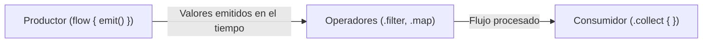

# Flujos Asíncronos y Reactivos en Kotlin: Flow y StateFlow

En el tema anterior aprendimos que una función de suspensión (`suspend fun`) permite realizar una tarea asíncrona y devolver **un único valor** (por ejemplo, descargar un archivo o realizar una consulta a una API REST) sin bloquear el hilo principal.

Sin embargo, en las aplicaciones móviles del mundo real a menudo necesitamos gestionar **múltiples valores asíncronos que llegan de forma continua a lo largo del tiempo**:
- Los cambios en una base de datos local **Room** (cada vez que se inserta o borra un registro).
- Las actualizaciones periódicas de la ubicación de los sensores GPS.
- La cuenta atrás de un temporizador o cronómetro.
- El estado de la interfaz en **Jetpack Compose** que cambia cada vez que el usuario interactúa.

Para resolver este paradigma reactivo, Kotlin ofrece **Kotlin Flows**: flujos de datos asíncronos construidos sobre el ecosistema de las corrutinas.

---

## 1. ¿Qué es un Flow? La Analogía de la Cinta Transportadora

Imagina una fábrica:
- Una función `suspend` es como pedir una caja por mensajería: esperas a que llegue, recibes **una sola caja** y el proceso termina.
- Un **`Flow`** es como una **cinta transportadora continua**: el productor va colocando cajas en la cinta una tras otra a medida que las fabrica, y el consumidor las va recogiendo y procesando una a una en tiempo real.



---

## 2. Creación y Consumo Básico de un `Flow`

Un flujo se construye mediante el constructor `flow { ... }` y emite valores mediante la función de suspensión **`emit()`**:

```kotlin
import kotlinx.coroutines.*
import kotlinx.coroutines.flow.*

// Función que devuelve un flujo continuo de enteros
fun contadorCuentaAtras(inicio: Int): Flow<Int> = flow {
    println("-> Arrancando cinta transportadora del contador...")
    for (i in inicio downTo 1) {
        delay(1000) // Pausa asíncrona de 1 segundo entre emisiones (sin bloquear)
        emit(i)     // Emite el siguiente valor al flujo
    }
    emit(0) // Emisión final
}

fun main() = runBlocking {
    println("Llamando a contadorCuentaAtras()...")
    val flujo = contadorCuentaAtras(3)

    println("Iniciando recolección con .collect():")
    // 'collect' es el operador terminal: escucha y procesa cada valor emitido
    flujo.collect { valor ->
        println("Valor recibido: $valor")
    }
    println("¡Cuenta atrás finalizada con éxito!")
}
```

**Salida en consola:**
```text
Llamando a contadorCuentaAtras()...
Iniciando recolección con .collect():
-> Arrancando cinta transportadora del contador...
Valor recibido: 3
Valor recibido: 2
Valor recibido: 1
Valor recibido: 0
¡Cuenta atrás finalizada con éxito!
```

---

## 3. Flujos Fríos (*Cold Streams*) vs Flujos Calientes (*Hot Streams*)

Comprender esta distinción es fundamental para la arquitectura en Android:

### Flujos Fríos (*Cold Flows*)
El `Flow` estándar que acabamos de ver es **frío**:
- El código dentro de `flow { ... }` **NO se ejecuta hasta que alguien invoca a `.collect()`**.
- Cada vez que un nuevo suscriptor invoca `.collect()`, el flujo arranca desde el principio de forma independiente para ese suscriptor.

### Flujos Calientes (*Hot Flows*)
Un flujo caliente está activo **independientemente de si hay suscriptores escuchándolo o no** (similar a una emisora de radio: la emisora sigue emitiendo música aunque nadie tenga la radio encendida).

En Android existen dos flujos calientes vitales: **`StateFlow`** y **`SharedFlow`**.

---

## 4. `StateFlow`: El Rey de la Arquitectura en Android y Compose

**`StateFlow`** es un flujo caliente diseñado específicamente para **gestionar y emitir estados de interfaz (UI State)**.

### Características Clave de `StateFlow`:
1. **Siempre almacena un valor actual:** Puedes consultar `miStateFlow.value` en cualquier momento de forma síncrona.
2. **Exige un valor inicial:** No puede existir vacío.
3. **Optimización contra duplicados:** Si emites exactamente el mismo valor dos veces seguidas (`equals() == true`), **no notifica a los suscriptores**, evitando recomposiciones innecesarias en Compose.
4. **Separación de mutabilidad:** Se declara un `MutableStateFlow` privado para que solo el propietario (el `ViewModel`) pueda emitir datos, y se expone como `StateFlow` público de solo lectura para la vista.

```kotlin
import kotlinx.coroutines.*
import kotlinx.coroutines.flow.*

// Modelo inmutable de estado de pantalla
data class GameVaultUiState(
    val cargando: Boolean = true,
    val juegos: List<String> = emptyList(),
    val error: String? = null
)

class GameViewModelSimulado {
    // 1. Estado interno mutable y privado (solo el ViewModel puede modificarlo)
    private val _uiState = MutableStateFlow(GameVaultUiState())

    // 2. Estado público de solo lectura (la UI solo puede observar)
    val uiState: StateFlow<GameVaultUiState> = _uiState.asStateFlow()

    fun cargarJuegos() {
        // Simulamos descarga asíncrona
        CoroutineScope(Dispatchers.Default).launch {
            delay(1500) // Simula espera de red
            val catalogoDescargado = listOf("Zelda: BotW", "Hollow Knight", "Elden Ring")

            // Actualización atómica idiomática mediante .update y .copy()
            _uiState.update { estadoActual ->
                estadoActual.copy(
                    cargando = false,
                    juegos = catalogoDescargado
                )
            }
        }
    }
}

fun main() = runBlocking {
    val viewModel = GameViewModelSimulado()

    // Simulamos la pantalla de Compose observando el StateFlow:
    val jobRecoleccion = launch {
        viewModel.uiState.collect { estado ->
            println("UI Recompuesta -> Cargando: ${estado.cargando} | Juegos: ${estado.juegos}")
        }
    }

    // El usuario entra en la pantalla y se dispara la carga:
    viewModel.cargarJuegos()

    delay(2000) // Esperamos a que finalice la simulación
    jobRecoleccion.cancel() // Cancelamos la suscripción
}
```

---

## 5. `SharedFlow`: Emisión de Eventos Únicos (*One-Shot Events*)

A diferencia de `StateFlow` (que representa un estado persistente), **`SharedFlow`** se utiliza para emitir **eventos de un solo uso** que no deben persistir en pantalla si el usuario rota el teléfono:
- Mostrar un mensaje temporal en un *Snackbar* o *Toast*.
- Navegar a otra pantalla tras completar un login.
- Reproducir un efecto de sonido en un juego.

```kotlin
class GestorEventosJuego {
    // Replay = 0 garantiza que los nuevos suscriptores no reciban eventos antiguos ya procesados
    private val _eventos = MutableSharedFlow<String>(replay = 0)
    val eventos: SharedFlow<String> = _eventos.asSharedFlow()

    suspend fun subirNivel(nuevoNivel: Int) {
        _eventos.emit("¡Felicidades! Has alcanzado el nivel $nuevoNivel 🎉")
    }
}
```

---

## 6. Operadores de Transformación Comunes

Al igual que las colecciones, los flujos disponen de operadores funcionales que transforman los datos sobre la marcha sin consumirlos:

```kotlin
import kotlinx.coroutines.*
import kotlinx.coroutines.flow.*

fun sensorTemperatura(): Flow<Double> = flow {
    emit(19.5)
    delay(500)
    emit(21.0)
    delay(500)
    emit(24.5)
    delay(500)
    emit(18.0)
}

fun main() = runBlocking {
    sensorTemperatura()
        .filter { it > 20.0 }                 // Filtra lecturas menores a 20°C
        .map { "Alerta: ${it}°C registrada" } // Transforma el dato a texto
        .take(2)                              // Cancela el flujo tras recibir 2 lecturas válidas
        .collect { println(it) }
}
```

---

## 7. La Conexión Final: De Room a Jetpack Compose

El flujo de datos completo en la arquitectura recomendada por Google funciona de la siguiente manera:

```mermaid
flowchart LR
    BD[(Room SQLite)] -->|Flow de BD| Repo[GameRepository]
    Repo -->|Flow de Dominio| VM[ViewModel]
    VM -->|Convierte a StateFlow con .stateIn()| State[uiState: StateFlow]
    State -->|collectAsStateWithLifecycle()| UI[Jetpack Compose UI]
```

1. **Room** devuelve un `Flow<List<GameEntity>>` que emite automáticamente cada vez que una fila cambia en la base de datos local.
2. El **ViewModel** lo transforma en un `StateFlow<CatalogoUiState>` inmutable.
3. **Jetpack Compose** recolecta el `StateFlow` y **redibuja la pantalla automáticamente** sin que tengas que programar ningún callback manual.

---

## 8. Retos Prácticos

### 🟢 Reto 1: Temporizador regresivo reactivo (Básico)
Crea una función `temporizadorBomba(segundos: Int): Flow<String>` que emita `"Tic-tac: $s..."` cada 500 ms y finalice con `"¡BOOM!"`. Recolecta el flujo en un `runBlocking`.

??? tip "Ver solución"
    ```kotlin
    import kotlinx.coroutines.*
    import kotlinx.coroutines.flow.*

    fun temporizadorBomba(segundos: Int): Flow<String> = flow {
        for (s in segundos downTo 1) {
            emit("Tic-tac: $s...")
            delay(500)
        }
        emit("¡BOOM! 💥")
    }

    fun main() = runBlocking {
        temporizadorBomba(3).collect { println(it) }
    }
    ```

### 🟡 Reto 2: StateFlow de marcador de juego (Intermedio)
Diseña una clase `MarcadorJuego` que exponga un `StateFlow<Int>` con la puntuación actual. Implementa métodos `sumarPuntos(puntos: Int)` y `reiniciar()`. Comprueba desde `main()` que al actualizar la puntuación los suscriptores reciben el cambio.

??? tip "Ver solución"
    ```kotlin
    import kotlinx.coroutines.*
    import kotlinx.coroutines.flow.*

    class MarcadorJuego {
        private val _puntuacion = MutableStateFlow(0)
        val puntuacion: StateFlow<Int> = _puntuacion.asStateFlow()

        fun sumarPuntos(puntos: Int) {
            _puntuacion.update { it + puntos }
        }

        fun reiniciar() {
            _puntuacion.value = 0
        }
    }

    fun main() = runBlocking {
        val marcador = MarcadorJuego()

        val job = launch {
            marcador.puntuacion.collect { puntos ->
                println("Scoreboard actualizado: $puntos pts")
            }
        }

        marcador.sumarPuntos(50)
        marcador.sumarPuntos(100)
        marcador.reiniciar()

        delay(100)
        job.cancel()
    }
    ```
