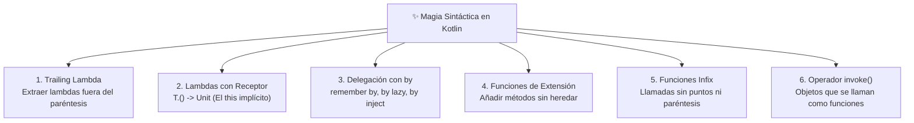

# Anexo: La "Magia" de los DSL en Kotlin (Compose, Gradle y Koin)

Cuando un desarrollador proveniente de Java, C# o Python se enfrenta por primera vez al código de **Jetpack Compose**, a los archivos de construcción **`build.gradle.kts`** o a los módulos de inyección de **Koin**, suele experimentar una mezcla de asombro y desconfianza:

```kotlin
// ¿Es esto Kotlin o un lenguaje completamente nuevo?
dependencies {
    implementation(libs.androidx.compose)
}

LazyColumn {
    items(usuarios) { usuario ->
        Text("Hola, ${usuario.nombre}")
    }
}

val appModule = module {
    singleOf(::GameRepositoryImpl) bind GameRepository::class
    viewModelOf(::CatalogoViewModel)
}
```

No hay ningún compilador esotérico ni preprocesador oculto detrás de esta sintaxis: es **100% código Kotlin estándar**. Lo que estamos presenciando es la capacidad de Kotlin para construir **Domain-Specific Languages (DSL)** internos.

En este anexo desglosaremos los **5 ingredientes del lenguaje** que hacen posible esta aparente "magia" y construiremos nuestro propio mini-DSL desde cero.

---

## 1. ¿Qué es un DSL Interno?

Un **DSL (Domain-Specific Language)** es un lenguaje diseñado específicamente para resolver problemas en un dominio concreto (como SQL para bases de datos o HTML para estructura web).

Un **DSL interno en Kotlin** aprovecha la flexibilidad sintáctica del lenguaje para que el código parezca un archivo de configuración declarativo o un lenguaje de marcado, pero manteniendo todas las ventajas de un lenguaje de tipado estático:

- Autocompletado inteligente en el IDE.
- Detección de errores en tiempo de compilación.
- Refactorización segura con un clic.

---

## 2. Los 6 Ingredientes de la "Magia" Sintáctica

Toda la sintaxis declarativa de Compose, Koin y Gradle se apoya en la combinación de 6 características del lenguaje:



---

### Ingrediente 1: Sintaxis de Lambda Final (*Trailing Lambda*)

Si el último parámetro de cualquier función es una función lambda, Kotlin permite **extraerla fuera de los paréntesis**. Y si la lambda es el único parámetro, los paréntesis pueden omitirse por completo:

```kotlin
// 1. Sintaxis tradicional con paréntesis
LazyColumn(modifier = Modifier.fillMaxSize(), content = { ... })

// 2. Trailing Lambda: La última función se extrae fuera
LazyColumn(modifier = Modifier.fillMaxSize()) {
    // contenido
}

// 3. Si no hay más parámetros, los paréntesis desaparecen
module({ ... })  ===>  module { ... }
```

---

### Ingrediente 2: Lambdas con Receptor (*Function Types with Receiver*)

Este es el **pilar maestro** de los DSLs en Kotlin. Compara estos dos tipos de funciones:

1. **Lambda estándar: `(Scope) -> Unit`**
   
   - La lambda recibe el objeto como parámetro (`it`).
   - Debes escribir `it.metodo()` para acceder a sus miembros.

2. **Lambda con receptor: `Scope.() -> Unit`**
   
   - La lambda se ejecuta **dentro del contexto del objeto `Scope`**.
   - El objeto receptor se convierte en el **`this` implícito**. Puedes llamar a sus métodos directamente sin ningún prefijo.

```kotlin
class LazyListScope {
    fun item(content: () -> Unit) { /* ... */ }
    fun items(count: Int, content: (Int) -> Unit) { /* ... */ }
}

// Definimos la función aceptando una Lambda con Receptor
fun MiLazyColumn(block: LazyListScope.() -> Unit) {
    val scope = LazyListScope()
    scope.block() // Ejecuta el bloque dentro de la instancia de LazyListScope
}

// Uso: Dentro de las llaves, "this" es LazyListScope
MiLazyColumn {
    item { /* ... */ }      // Llamada directa a this.item()
    items(10) { /* ... */ } // Llamada directa a this.items()
}
```

---

### Ingrediente 3: Delegación de Propiedades con `by` (*remember by*, *by lazy*, *by inject*)

En Kotlin, la palabra reservada **`by`** permite delegar la lectura (`get()`) y la escritura (`set()`) de una variable a un objeto externo mediante los operadores especiales `getValue()` y `setValue()`.

Esta técnica es la que hace que el manejo de estado en Compose y la inyección en Koin parezcan "mágicos":

#### El caso de Jetpack Compose: `remember` vs `remember by`

Cuando creas un estado en Compose con `mutableStateOf("")`, obtienes un objeto envoltorio de tipo `MutableState<String>`:

```kotlin
// 1. Sin delegación (Tedioso):
val textoState: MutableState<String> = remember { mutableStateOf("") }

// Cada vez que lees, tienes que poner .value
Text(text = textoState.value)

// Cada vez que escribes, tienes que asignar a .value
Button(onClick = { textoState.value = "Nuevo texto" })
```

Al utilizar la delegación con **`by`**, Kotlin elimina por completo la necesidad de escribir `.value`:

```kotlin
import androidx.compose.runtime.getValue
import androidx.compose.runtime.setValue

// 2. Con delegación 'by' (Fluido y natural):
var texto: String by remember { mutableStateOf("") }

// Se lee directamente como un String normal:
Text(text = texto)

// Se asigna como una variable ordinaria, pero por debajo ¡Compose dispara la recomposición!
Button(onClick = { texto = "Nuevo texto" })
```

!!! tip "El misterio de los imports de `getValue` y `setValue`"
    Para que `by remember` funcione, el compilador busca dos funciones de extensión con el modificador `operator`:

    - `operator fun <T> State<T>.getValue(...)`
    - `operator fun <T> MutableState<T>.setValue(...)`

    Si alguna vez Kotlin te marca un error en rojo en la palabra `by`, casi siempre se debe a que faltan los imports:
    `import androidx.compose.runtime.getValue` y `import androidx.compose.runtime.setValue`.

#### El caso de Koin: Inyección Perezosa con `by inject()`

En lugar de resolver e instanciar una dependencia pesada en el momento exacto en que se crea una clase, Koin ofrece delegados para posponer su resolución hasta el primer momento en que realmente se utilice:

```kotlin
class DetalleActivity : ComponentActivity() {
    // La base de datos o el repositorio no se resuelven hasta que no se lea la variable por primera vez
    val repository: GameRepository by inject()
}
```

#### El caso de Kotlin estándar: `by lazy`

Kotlin incluye delegados nativos en su biblioteca estándar, como `by lazy`, que calcula el valor una única vez de forma segura entre hilos (*thread-safe*) y lo almacena en caché:

```kotlin
val configuracionPesada: Configuracion by lazy {
    cargarConfiguracionDesdeDisco() // Solo se ejecuta si alguien accede a configuracionPesada
}
```

---

### Ingrediente 4: Funciones de Extensión

Permiten extender cualquier clase con métodos y propiedades nuevos sin tocar su código fuente original ni recurrir a herencia:

```kotlin
// En Compose: Extensión sobre Int para crear dimensiones Dp
val Int.dp: Dp get() = Dp(this.toFloat())

// Uso que parece una palabra clave del lenguaje
val margen = 16.dp

// En Ktor/Mappers: Funciones de extensión de transformación
fun JuegoDto.toDomain(): Juego = ...
```

---

### Ingrediente 5: Funciones Infijas (*Infix Functions*)

Al marcar una función miembro o de extensión con la palabra reservada `infix`, puede invocarse sin punto ni paréntesis si recibe exactamente un argumento:

```kotlin
// Función estándar de la biblioteca de Kotlin:
infix fun <A, B> A.to(that: B): Pair<A, B> = Pair(this, that)

// Sin infix:
val par = "clave".to("valor")

// Con infix (parece sintaxis nativa de configuración):
val par = "clave" to "valor"
val header = "Authorization" to "Bearer token_abc"

// En CompositionLocal:
LocalContentColor provides Color.Red
```

---

### Ingrediente 6: Sobrecarga del Operador `invoke()`

Cualquier clase u objeto que implemente un método con el modificador `operator fun invoke()` puede ser invocado utilizando la sintaxis de llamada a función con paréntesis `()`:

```kotlin
class ObtenerUsuarioUseCase {
    operator fun invoke(userId: Long): Usuario {
        return Usuario(id = userId, nombre = "Ada Lovelace")
    }
}

// Instanciación
val obtenerUsuario = ObtenerUsuarioUseCase()

// En lugar de escribir: obtenerUsuario.ejecutar(42L)
// ¡Invocamos el objeto directamente!
val usuario = obtenerUsuario(42L)
```

---

## 3. Práctica Guiada: Creando Nuestro Propio DSL desde Cero

Para asimilar cómo encajan todas estas piezas, construiremos un mini-DSL para configurar personajes de un videojuego en nuestra aplicación **GameVault**.

### Objetivo: Lograr esta sintaxis

```kotlin
val heroe = personaje {
    nombre = "Arthur Pendragon"
    clase = "Paladín"

    estadisticas {
        fuerza = 18
        agilidad = 12
        vitalidad = 20
    }

    inventario {
        equipar("Espada Excalibur")
        equipar("Escudo Sagrado")
        consumible("Poción de Salud", cantidad = 3)
    }
}
```

### Paso 1: Modelos de Datos Finales

```kotlin
data class Estadisticas(val fuerza: Int, val agilidad: Int, val vitalidad: Int)

data class Item(val nombre: String, val cantidad: Int, val equipado: Boolean)

data class Personaje(
    val nombre: String,
    val clase: String,
    val estadisticas: Estadisticas,
    val inventario: List<Item>
)
```

### Paso 2: Builders con Lambdas con Receptor

```kotlin
// Builder de Estadísticas
class EstadisticasBuilder {
    var fuerza: Int = 10
    var agilidad: Int = 10
    var vitalidad: Int = 10

    fun build(): Estadisticas = Estadisticas(fuerza, agilidad, vitalidad)
}

// Builder de Inventario
class InventarioBuilder {
    private val items = mutableListOf<Item>()

    fun equipar(nombreItem: String) {
        items.add(Item(nombre = nombreItem, cantidad = 1, equipado = true))
    }

    fun consumible(nombreItem: String, cantidad: Int = 1) {
        items.add(Item(nombre = nombreItem, cantidad = cantidad, equipado = false))
    }

    fun build(): List<Item> = items.toList()
}

// Builder Raíz de Personaje
class PersonajeBuilder {
    var nombre: String = ""
    var clase: String = "Aventurero"

    private var estadisticas: Estadisticas = Estadisticas(10, 10, 10)
    private var inventario: List<Item> = emptyList()

    // Recibe una Lambda con Receptor EstadisticasBuilder.() -> Unit
    fun estadisticas(block: EstadisticasBuilder.() -> Unit) {
        val builder = EstadisticasBuilder()
        builder.block()
        estadisticas = builder.build()
    }

    // Recibe una Lambda con Receptor InventarioBuilder.() -> Unit
    fun inventario(block: InventarioBuilder.() -> Unit) {
        val builder = InventarioBuilder()
        builder.block()
        inventario = builder.build()
    }

    fun build(): Personaje = Personaje(nombre, clase, estadisticas, inventario)
}
```

### Paso 3: Función de Entrada (*Entry Point*)

```kotlin
// Función de entrada que arranca el DSL
fun personaje(block: PersonajeBuilder.() -> Unit): Personaje {
    val builder = PersonajeBuilder()
    builder.block() // Ejecuta la configuración del usuario
    return builder.build()
}
```

---

## 4. Control de Alcance con `@DslMarker`

Cuando los DSLs crecen y tienen bloques anidados dentro de otros bloques, surge un problema sutil: **la contaminación de ámbitos (*Scope Pollution*)**.

Sin protección, dentro del bloque `inventario { ... }` podrías seguir llamando a `nombre = "Otro"` del `PersonajeBuilder` exterior porque sigue estando en el ámbito léxico.

Para evitar que una lambda anidada acceda a los métodos de un nivel superior, Kotlin proporciona la anotación meta **`@DslMarker`**:

```kotlin
// 1. Definimos una anotación de marcador de DSL
@DslMarker
annotation class GameVaultDsl

// 2. Anotamos todos los builders participantes
@GameVaultDsl
class PersonajeBuilder { ... }

@GameVaultDsl
class InventarioBuilder { ... }
```

Con `@DslMarker`, el compilador de Kotlin emitirá un **error de compilación inmediato** si intentas llamar a un método del builder padre desde un builder hijo, obligándote a mantener el código estrictamente estructurado.

---

## 5. Correlación: Cómo lo usan las herramientas reales

| Herramienta | Ejemplo en código | Ingrediente de Kotlin aplicado |
| :--- | :--- | :--- |
| **Gradle** | `dependencies { implementation(...) }` | `Project.() -> Unit` + trailing lambda |
| **Compose** | `LazyColumn { items(10) { ... } }` | `LazyListScope.() -> Unit` con `@DslMarker` |
| **Compose** | `var texto by remember { mutableStateOf("") }` | Delegación de propiedades con `by` (`getValue`/`setValue`) |
| **Compose** | `Modifier.fillMaxSize().padding(16.dp)` | Funciones de extensión encadenadas + `Int.dp` |
| **Compose** | `CompositionLocalProvider(LocalColor provides Color.Red)` | Función infija `provides` |
| **Koin** | `module { singleOf(::Repo) }` | `Module.() -> Unit` + constructor reference `::Repo` |
| **Koin** | `val repo: GameRepository by inject()` | Delegación perezosa de propiedades con `by` |
| **Clean Arch** | `val datos = obtenerJuegosUseCase()` | Operador `operator fun invoke()` |

---

## 📚 Enlaces Relacionados

- [Funciones y Lambdas en Kotlin](./13-funciones-lambdas.md)
- [Funciones de Ámbito (Scope Functions)](./31-scope-functions.md)
- [Inyección de Dependencias con Koin](../02-arquitectura/03-inyeccion-dependencias-koin.md)
- [Funciones Componibles en Compose](../00-compose/21-composable-functions.md)
