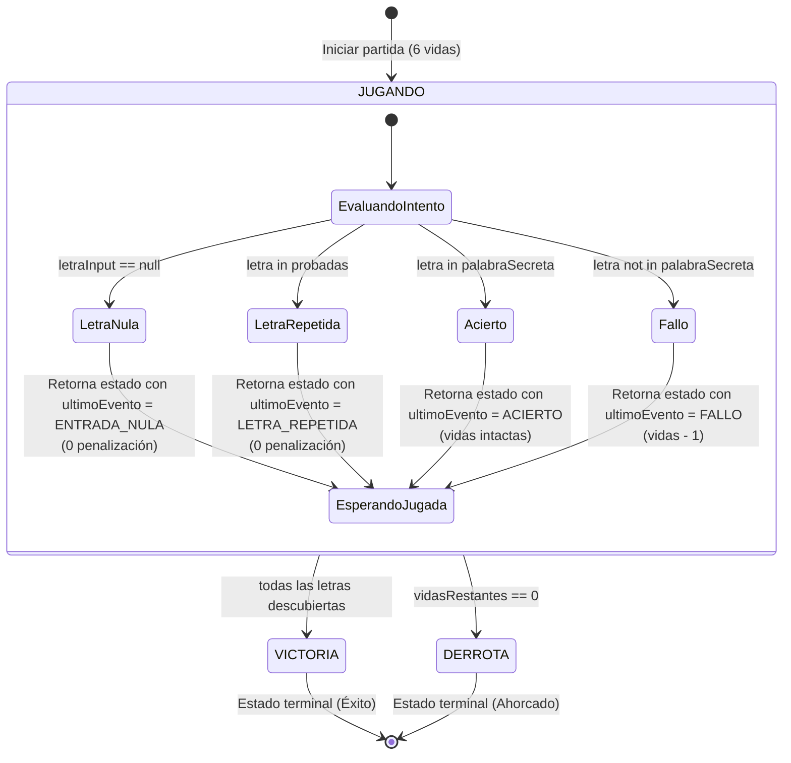

# Bloque 2: Funciones, Lambdas y Null Safety

En este segundo bloque dominarás la sintaxis de funciones de orden superior, la manipulación segura de valores nulos y el diseño de eventos mediante lambdas. En **Jetpack Compose**, cada interacción de usuario (como un clic en un botón) se comunica a la lógica mediante lambdas (*State Hoisting*).

📁 **Paquete de trabajo:** `package b02_funciones_lambdas`  
Ubicación en tu proyecto: `src/main/kotlin/b02_funciones_lambdas/`

!!! info "📚 Apuntes Teóricos de Referencia"
    Para resolver las actividades de este bloque, puedes consultar los siguientes temas de los apuntes:

    - [Funciones y Lambdas (Enfoque Compose)](../13-funciones-lambdas.md)
    - [Null Safety (Seguridad ante Nulos)](../14-null-safety.md)
    - [Scope Functions (`takeIf`, `let`, etc.)](../31-scope-functions.md)

---

## 🌱 Fase 0: Calentamiento Guiado (Gimnasio de Sintaxis)

Esta fase contiene **15 micro-ejercicios atómicos** diseñados para que interiorices el sistema de tipos seguros ante nulos (*Null Safety*), domines el operador Elvis en cascada y mecanices las funciones idiomáticas antes de construir lógica compleja.

📁 **Archivos de trabajo para esta fase:**  

- `E00_CalentamientoNullSafety.kt` (Niveles 1 y 2)  
- `E00_CalentamientoFunciones.kt` (Nivel 3)  
Ubicados en: `src/main/kotlin/b02_funciones_lambdas/`

---

### 🔹 Nivel 1: Null Safety y Llamadas Seguras

#### Ejercicio 0.1: Tipos No Nulos vs Nulos (`String` vs `String?`)
📄 **Archivo:** `E00_CalentamientoNullSafety.kt`  
📚 **Teoría de referencia:** [Tipos Nulables vs No Nulables](../14-null-safety.md#1-tipos-nulables-vs-no-nulables)

##### 1. Concepto y Código Resuelto
En Java, cualquier objeto puede ser `null`, lo que genera el infame `NullPointerException` (el "error del billón de dólares"). En Kotlin, las variables no pueden ser nulas por defecto; para permitir nulos, debe agregarse explícitamente `?` al tipo.

=== "Kotlin"
    ```kotlin
    package b02_funciones_lambdas

    fun main() {
        // Tipo no nulo: el compilador garantiza que NUNCA contendrá null
        val tituloJuego: String = "Elden Ring"
        // tituloJuego = null // ❌ ERROR DE COMPILACIÓN

        // Tipo nulo: explicitly declaramos que puede no tener valor
        var subtitulo: String? = "Shadow of the Erdtree"
        println("Título: $tituloJuego | Subtítulo: $subtitulo")

        subtitulo = null // ✅ Válido porque es String?
        println("Título: $tituloJuego | Subtítulo tras borrar: $subtitulo")
    }
    ```

=== "Java"
    ```java
    public class NullSafetyJava {
        public static void main(String[] args) {
            // En Java no hay distinción a nivel de compilador entre variables seguras y nulas:
            String tituloJuego = "Elden Ring";
            String subtitulo = "Shadow of the Erdtree";

            subtitulo = null; // Válido en Java, pero puede lanzar NullPointerException en cualquier llamada posterior
            System.out.println("Subtítulo longitud: " + subtitulo.length()); // 💥 CRASH: NullPointerException
        }
    }
    ```

##### 2. Salida en Consola
```text
Título: Elden Ring | Subtítulo: Shadow of the Erdtree
Título: Elden Ring | Subtítulo tras borrar: null
```

---

#### Ejercicio 0.2: Operador de Llamada Segura (`?.`)
📄 **Archivo:** `E00_CalentamientoNullSafety.kt`  
📚 **Teoría de referencia:** [Llamada Segura (?. )](../14-null-safety.md#2-operadores-para-el-manejo-seguro-de-nulos)

##### 1. Concepto y Código Resuelto
En lugar de escribir engorrosos bloques `if (variable != null)` para proteger cada acceso a propiedad o método, Kotlin utiliza `?.`. Si la referencia es nula, no se produce error: simplemente evalúa la expresión completa a `null`.

=== "Kotlin"
    ```kotlin
    package b02_funciones_lambdas

    fun main() {
        val apodo: String? = null

        // Llamada segura: si 'apodo' es null, no lanza excepción; devuelve null
        val longitud: Int? = apodo?.length
        println("Longitud calculada con seguridad: $longitud")

        val apodoMayus: String? = apodo?.uppercase()
        println("Texto en mayúsculas: $apodoMayus")
    }
    ```

=== "Java"
    ```java
    public class SafeCallJava {
        public static void main(String[] args) {
            String apodo = null;

            // En Java requiere comprobaciones defensivas constantes:
            Integer longitud = null;
            if (apodo != null) {
                longitud = apodo.length();
            }
            System.out.println("Longitud calculada con seguridad: " + longitud);
        }
    }
    ```

##### 2. Salida en Consola
```text
Longitud calculada con seguridad: null
Texto en mayúsculas: null
```

---

#### Ejercicio 0.3: Encadenamiento de Llamadas Seguras
📄 **Archivo:** `E00_CalentamientoNullSafety.kt`  
📚 **Teoría de referencia:** [Encadenamiento de Operadores Seguros](../14-null-safety.md#2-operadores-para-el-manejo-seguro-de-nulos)

##### 1. Enunciado y Requisitos
Dadas tres clases sencillas anidadas:
```kotlin
class Arma(val nombre: String)
class Inventario(val armaEquipada: Arma?)
class Jugador(val inventario: Inventario?)
```

1. Instancia un jugador con inventario nulo: `val p1 = Jugador(inventario = null)`.
2. Instancia un jugador con inventario y arma: `val p2 = Jugador(Inventario(Arma("Espada Maestra")))`.
3. Obtén el nombre del arma en una sola línea encadenando llamadas seguras `p1.inventario?.armaEquipada?.nombre`.

##### 2. Salida Esperada
```text
Arma jugador 1: null
Arma jugador 2: Espada Maestra
```

##### 3. Solución Comentada
??? tip "Ver solución comentada"
    ```kotlin
    package b02_funciones_lambdas

    class Arma(val nombre: String)
    class Inventario(val armaEquipada: Arma?)
    class Jugador(val inventario: Inventario?)

    fun main() {
        val p1 = Jugador(inventario = null)
        val p2 = Jugador(Inventario(Arma("Espada Maestra")))

        println("Arma jugador 1: ${p1.inventario?.armaEquipada?.nombre}")
        println("Arma jugador 2: ${p2.inventario?.armaEquipada?.nombre}")
    }
    ```

---

#### Ejercicio 0.4: Conversión Segura a Entero con `.toIntOrNull()`
📄 **Archivo:** `E00_CalentamientoNullSafety.kt`  
📚 **Teoría de referencia:** [Conversiones Numéricas](../11-variables-tipos-datos.md)

##### 1. Enunciado y Requisitos
En Java, `Integer.parseInt("abc")` lanza una excepción no comprobada `NumberFormatException`. En Kotlin, `.toIntOrNull()` devuelve `null` elegantemente si la cadena no es numérica.

1. Prueba a convertir `"2026"` y `"gratis"` usando `.toIntOrNull()`.
2. Imprime el resultado de ambas conversiones.

##### 2. Salida Esperada
```text
Año parseado: 2026
Precio parseado: null
```

##### 3. Solución Comentada
??? tip "Ver solución comentada"
    ```kotlin
    package b02_funciones_lambdas

    fun main() {
        val anio = "2026".toIntOrNull()
        val precio = "gratis".toIntOrNull()

        println("Año parseado: $anio")
        println("Precio parseado: $precio")
    }
    ```

---

#### Ejercicio 0.5: Casteo Seguro con `as?` (Evitando ClassCastException)
📄 **Archivo:** `E00_CalentamientoNullSafety.kt`  
📚 **Teoría de referencia:** [Casteo Seguro: as?](../14-null-safety.md#4-casteo-seguro-as)

##### 1. Enunciado y Requisitos

1. Declara una variable `val datoGenerico: Any = 12345` (un entero almacenado como `Any`).
2. Intenta castearlo a `String` de forma forzada usando `as String` dentro de un comentario explicando por qué fallaría.
3. Utiliza el operador de casteo seguro **`as? String`**, que devolverá `null` en lugar de romper el programa.

##### 2. Salida Esperada
```text
Resultado de casteo seguro a String: null
```

##### 3. Solución Comentada
??? tip "Ver solución comentada"
    ```kotlin
    package b02_funciones_lambdas

    fun main() {
        val datoGenerico: Any = 12345

        // val textoForzado: String = datoGenerico as String // ❌ CRASH: ClassCastException (Integer cannot be cast to String)
        val textoSeguro: String? = datoGenerico as? String

        println("Resultado de casteo seguro a String: $textoSeguro")
    }
    ```

---

### 🔹 Nivel 2: El Operador Elvis (`?:`) y Series Concatenadas

#### Ejercicio 0.6: El Operador Elvis Básico (Valor de Respaldo)
📄 **Archivo:** `E00_CalentamientoNullSafety.kt`  
📚 **Teoría de referencia:** [Operador Elvis (?:)](../14-null-safety.md#2-operadores-para-el-manejo-seguro-de-nulos)

##### 1. Concepto y Código Resuelto
El operador Elvis `?:` toma el valor de la izquierda si no es nulo; si la izquierda es nula, evalúa y devuelve la expresión de la derecha.

=== "Kotlin"
    ```kotlin
    package b02_funciones_lambdas

    fun main() {
        val bioRecibida: String? = null

        // Si bioRecibida es null, se asigna el valor de fallback:
        val biografia = bioRecibida ?: "Sin biografía disponible."
        println("Perfil: $biografia")
    }
    ```

=== "Java"
    ```java
    public class ElvisBasicoJava {
        public static void main(String[] args) {
            String bioRecibida = null;

            // En Java requiere operador ternario comprobando != null:
            String biografia = (bioRecibida != null) ? bioRecibida : "Sin biografía disponible.";
            System.out.println("Perfil: " + biografia);
        }
    }
    ```

##### 2. Salida en Consola
```text
Perfil: Sin biografía disponible.
```

---

#### Ejercicio 0.7: Serie de 2 Operadores Elvis Concatenados
📄 **Archivo:** `E00_CalentamientoNullSafety.kt`  
📚 **Teoría de referencia:** [Encadenamiento de Operadores Elvis](../14-null-safety.md#2-operadores-para-el-manejo-seguro-de-nulos)

##### 1. Enunciado y Requisitos
Un sistema de autenticación intenta identificar al usuario con la siguiente prioridad:

1. `nombrePerfil`
2. `emailRegistro`
3. Si ambos son nulos, `"Invitado"`

Declara `val nombrePerfil: String? = null` y `val emailRegistro: String? = "gamer@pmdm.es"`. Resuélvelo en una sola línea encadenando dos operadores Elvis.

##### 2. Salida Esperada
```text
Usuario autenticado: gamer@pmdm.es
```

##### 3. Solución Comentada
??? tip "Ver solución comentada"
    ```kotlin
    package b02_funciones_lambdas

    fun main() {
        val nombrePerfil: String? = null
        val emailRegistro: String? = "gamer@pmdm.es"

        // Cascada de 2 operadores Elvis:
        val usuarioFinal: String = nombrePerfil ?: emailRegistro ?: "Invitado"

        println("Usuario autenticado: $usuarioFinal")
    }
    ```

---

#### Ejercicio 0.8: Serie de 3 Operadores Elvis Concatenados
📄 **Archivo:** `E00_CalentamientoNullSafety.kt`  
📚 **Teoría de referencia:** [Encadenamiento de Operadores Elvis](../14-null-safety.md#2-operadores-para-el-manejo-seguro-de-nulos)

##### 1. Enunciado y Requisitos
Para mostrar el identificador público en un chat multijugador, se consulta:

1. `apodoPersonalizado: String?`
2. `nickCuenta: String?`
3. `telefonoAnonimizado: String?`
4. Valor por defecto: `"Jugador Anónimo"`

Simula que las tres primeras variables son nulas y comprueba que se aplica el valor final. Luego asigna un valor a `nickCuenta` y comprueba que se detiene en el primer no nulo.

##### 2. Salida Esperada
```text
Identificador en chat: Jugador Anónimo
Identificador tras registrar cuenta: PixelHero99
```

##### 3. Solución Comentada
??? tip "Ver solución comentada"
    ```kotlin
    package b02_funciones_lambdas

    fun main() {
        var apodoPersonalizado: String? = null
        var nickCuenta: String? = null
        var telefonoAnonimizado: String? = null

        // Cascada de 3 operadores Elvis:
        var tagVisible = apodoPersonalizado ?: nickCuenta ?: telefonoAnonimizado ?: "Jugador Anónimo"
        println("Identificador en chat: $tagVisible")

        nickCuenta = "PixelHero99"
        tagVisible = apodoPersonalizado ?: nickCuenta ?: telefonoAnonimizado ?: "Jugador Anónimo"
        println("Identificador tras registrar cuenta: $tagVisible")
    }
    ```

---

#### Ejercicio 0.9: Serie de 4 Operadores Elvis Concatenados (Resolución de Configuración)
📄 **Archivo:** `E00_CalentamientoNullSafety.kt`  
📚 **Teoría de referencia:** [Encadenamiento de Operadores Elvis](../14-null-safety.md#2-operadores-para-el-manejo-seguro-de-nulos)

##### 1. Enunciado y Requisitos
Un cliente de base de datos determina el host del servidor comprobando en estricto orden de prioridad:

1. `hostArgumentoCLI: String?`
2. `hostVariableEntorno: String?`
3. `hostFicheroConfiguracion: String?`
4. `hostPreferenciaUsuario: String?`
5. Host local definitivo: `"127.0.0.1"`

Configura el escenario donde solo `hostFicheroConfiguracion = "db.internal.gamevault.com"` tiene valor y resuelve el host final en una sola expresión.

##### 2. Salida Esperada
```text
Host seleccionado para la conexión: db.internal.gamevault.com
```

##### 3. Solución Comentada
??? tip "Ver solución comentada"
    ```kotlin
    package b02_funciones_lambdas

    fun main() {
        val hostArgumentoCLI: String? = null
        val hostVariableEntorno: String? = null
        val hostFicheroConfiguracion: String? = "db.internal.gamevault.com"
        val hostPreferenciaUsuario: String? = null

        // Cascada de 4 operadores Elvis concatenados:
        val hostFinal: String = hostArgumentoCLI
            ?: hostVariableEntorno
            ?: hostFicheroConfiguracion
            ?: hostPreferenciaUsuario
            ?: "127.0.0.1"

        println("Host seleccionado para la conexión: $hostFinal")
    }
    ```

---

#### Ejercicio 0.10: Elvis como Cláusula de Guarda y Excepción
📄 **Archivo:** `E00_CalentamientoNullSafety.kt`  
📚 **Teoría de referencia:** [Operador Elvis como Cláusula de Guarda](../14-null-safety.md#2-operadores-para-el-manejo-seguro-de-nulos)

##### 1. Enunciado y Requisitos
A la derecha de un operador Elvis se puede colocar una expresión de tipo `Nothing`, como `return` (para salir de una función) o `error(...)` (para lanzar `IllegalStateException`).

1. Crea una función `procesarToken(token: String?)`.
2. Utiliza el operador Elvis para guardar en `val tokenValido` el token recibido, o ejecuta `return` anticipado con un mensaje de aviso si es nulo.
3. Comprueba el comportamiento invocándola con `null` y con `"TOKEN_XYZ"`.

##### 2. Salida Esperada
```text
[ERROR]: Token nulo. Proceso abortado.
[OK]: Procesando token válido: TOKEN_XYZ
```

##### 3. Solución Comentada
??? tip "Ver solución comentada"
    ```kotlin
    package b02_funciones_lambdas

    fun procesarToken(token: String?) {
        // Cláusula de guarda con Elvis y bloque run con return:
        val tokenValido = token ?: run {
            println("[ERROR]: Token nulo. Proceso abortado.")
            return
        }

        println("[OK]: Procesando token válido: $tokenValido")
    }

    fun main() {
        procesarToken(null)
        procesarToken("TOKEN_XYZ")
    }
    ```

---

### 🔹 Nivel 3: Funciones Idiomáticas y Lambdas

#### Ejercicio 0.11: Parámetros con Valores por Defecto
📄 **Archivo:** `E00_CalentamientoFunciones.kt`  
📚 **Teoría de referencia:** [Valores por Defecto](../13-funciones-lambdas.md#13-parametros-con-valores-por-defecto-y-argumentos-con-nombre)

##### 1. Concepto y Código Resuelto
En Java, ofrecer variantes de un método requiere escribir múltiples sobrecargas (*overloads*) que se llaman entre sí (*telescoping methods*). En Kotlin, basta asignar valores por defecto en la cabecera.

=== "Kotlin"
    ```kotlin
    package b02_funciones_lambdas

    // Una sola función cubre todos los casos posibles de invocación:
    fun conectarServidor(host: String = "localhost", puerto: Int = 8080, ssl: Boolean = false) {
        val protocolo = if (ssl) "https" else "http"
        println("Conectando a: $protocolo://$host:$puerto")
    }

    fun main() {
        conectarServidor()                                  // Usa todos los valores por defecto
        conectarServidor("api.gamevault.es")                // Personaliza solo el host
        conectarServidor("api.gamevault.es", 443, true)    // Personaliza todos los parámetros
    }
    ```

=== "Java (Sobrecarga de Métodos)"
    ```java
    public class DefaultParamsJava {
        // En Java se requieren 3 métodos sobrecargados:
        public static void conectarServidor() {
            conectarServidor("localhost", 8080, false);
        }

        public static void conectarServidor(String host) {
            conectarServidor(host, 8080, false);
        }

        public static void conectarServidor(String host, int puerto, boolean ssl) {
            String protocolo = ssl ? "https" : "http";
            System.out.println("Conectando a: " + protocolo + "://" + host + ":" + puerto);
        }

        public static void main(String[] args) {
            conectarServidor();
            conectarServidor("api.gamevault.es");
            conectarServidor("api.gamevault.es", 443, true);
        }
    }
    ```

##### 2. Salida en Consola
```text
Conectando a: http://localhost:8080
Conectando a: http://api.gamevault.es:8080
Conectando a: https://api.gamevault.es:443
```

---

#### Ejercicio 0.12: Argumentos con Nombre (*Named Arguments*)
📄 **Archivo:** `E00_CalentamientoFunciones.kt`  
📚 **Teoría de referencia:** [Argumentos con Nombre](../13-funciones-lambdas.md#13-parametros-con-valores-por-defecto-y-argumentos-con-nombre)

##### 1. Concepto y Código Resuelto
En llamadas a métodos con múltiples booleanos o enteros (ej. `crearVentana(true, false, false, true)`), Java resulta ilegible sin mirar la documentación. En Kotlin, se puede indicar el nombre del argumento y alterar el orden a conveniencia.

=== "Kotlin"
    ```kotlin
    package b02_funciones_lambdas

    fun configurarBoton(texto: String, visible: Boolean = true, habilitado: Boolean = true, color: String = "Azul") {
        println("Botón '$texto' -> Visible: $visible, Habilitado: $habilitado, Color: $color")
    }

    fun main() {
        // Invocación alterando el orden y usando nombres de argumento explícitos (estilo Jetpack Compose):
        configurarBoton(
            color = "Rojo",
            texto = "Eliminar Partida",
            habilitado = false
        )
    }
    ```

=== "Java"
    ```java
    public class NamedArgsJava {
        // En Java no existen los argumentos con nombre; el orden posicional es estricto y ciego:
        public static void main(String[] args) {
            // El lector no sabe qué significa cada boolean sin consultar el método:
            configurarBoton("Eliminar Partida", true, false, "Rojo");
        }

        public static void configurarBoton(String texto, boolean visible, boolean habilitado, String color) {
            System.out.println("Botón '" + texto + "' -> Visible: " + visible + ", Habilitado: " + habilitado + ", Color: " + color);
        }
    }
    ```

##### 2. Salida en Consola
```text
Botón 'Eliminar Partida' -> Visible: true, Habilitado: false, Color: Rojo
```

---

#### Ejercicio 0.13: Funciones de Expresión Única (`=`)
📄 **Archivo:** `E00_CalentamientoFunciones.kt`  
📚 **Teoría de referencia:** [Funciones de Expresión Única](../13-funciones-lambdas.md#12-funciones-de-expresion-unica-single-expression-functions)

##### 1. Enunciado y Requisitos

1. Declara en una sola línea con `=` una función `esMayorDeEdad(edad: Int): Boolean`.
2. Declara en una sola línea una función `calcularPrecioConIva(precioBase: Double): Double` (aplicando el 21%).
3. Comprueba ambas funciones desde `main()`.

##### 2. Salida Esperada
```text
¿Edad 20 es mayor de edad?: true
Precio con IVA de 50.0€: 60.5€
```

##### 3. Solución Comentada
??? tip "Ver solución comentada"
    ```kotlin
    package b02_funciones_lambdas

    fun esMayorDeEdad(edad: Int): Boolean = edad >= 18

    fun calcularPrecioConIva(precioBase: Double): Double = precioBase * 1.21

    fun main() {
        println("¿Edad 20 es mayor de edad?: ${esMayorDeEdad(20)}")
        println("Precio con IVA de 50.0€: ${calcularPrecioConIva(50.0)}€")
    }
    ```

---

#### Ejercicio 0.14: El Modismo `objeto?.let { }`
📄 **Archivo:** `E00_CalentamientoFunciones.kt`  
📚 **Teoría de referencia:** [El Modismo objeto?.let](../14-null-safety.md#5-el-modismo-estrella-en-android-objetolet)

##### 1. Enunciado y Requisitos

1. Declara una variable `val correoUsuario: String? = "alumno@ies.es"`.
2. Utiliza `correoUsuario?.let { ... }` para ejecutar una simulación de envío de correo únicamente cuando no sea nulo.
3. Dentro del bloque, el valor seguro se referencia con el parámetro implícito `it`.
4. Asigna `null` a la variable y verifica que el bloque no se ejecuta.

##### 2. Salida Esperada
```text
Enviando código de verificación a: alumno@ies.es
(Con correo nulo no se imprime nada)
```

##### 3. Solución Comentada
??? tip "Ver solución comentada"
    ```kotlin
    package b02_funciones_lambdas

    fun main() {
        var correoUsuario: String? = "alumno@ies.es"

        correoUsuario?.let {
            println("Enviando código de verificación a: $it")
        }

        correoUsuario = null
        correoUsuario?.let {
            println("Esto nunca se imprimirá porque es nulo: $it")
        }
    }
    ```

---

#### Ejercicio 0.15: *Trailing Lambda* y el Parámetro Implícito `it`
📄 **Archivo:** `E00_CalentamientoFunciones.kt`  
📚 **Teoría de referencia:** [Sintaxis de Trailing Lambda](../13-funciones-lambdas.md#23-sintaxis-de-lambda-colgante-trailing-lambda-syntax)

##### 1. Enunciado y Requisitos
En Kotlin, si el último parámetro de una función es una lambda, las llaves `{ }` se pueden colocar **fuera de los paréntesis** `()`. Si además la lambda tiene un único parámetro, este se nombra automáticamente como `it`.

1. Define una función `repetirAccion(veces: Int, accion: (Int) -> Unit)`.
2. Invócala utilizando la sintaxis de *trailing lambda* imprimiendo `Paso actual: $it`.

##### 2. Salida Esperada
```text
Paso actual: 1
Paso actual: 2
Paso actual: 3
```

##### 3. Solución Comentada
??? tip "Ver solución comentada"
    ```kotlin
    package b02_funciones_lambdas

    fun repetirAccion(veces: Int, accion: (Int) -> Unit) {
        for (i in 1..veces) {
            accion(i) // Invocación de la lambda recibida
        }
    }

    fun main() {
        // Sintaxis de Trailing Lambda: las llaves van fuera de los paréntesis
        repetirAccion(3) {
            println("Paso actual: $it")
        }
    }
    ```

---

## 🟢 Nivel Básico (Funciones, Parámetros y Lambdas Simples)

### Ejercicio 2.1: Funciones de Expresión Única y Argumentos con Nombre
📄 **Archivo:** `E01_FuncionesExpresionUnica.kt`  
📚 **Teoría de referencia:** [Funciones de Expresión Única](../13-funciones-lambdas.md#12-funciones-de-expresion-unica-single-expression-functions)

#### 1. Enunciado y Requisitos

1. Define en una sola línea (`=`) una función `calcularDanoTotal(ataqueBase: Int, critico: Boolean, bonusArma: Int = 0): Int`:

    - Si `critico` es `true`, el ataque base se duplica antes de sumar el bonus.

2. Invoca a la función en `main()` utilizando **argumentos con nombre (*Named Arguments*)** alterando deliberadamente el orden de los parámetros para comprobar su legibilidad.

#### 2. Salida Esperada en Consola

```text
Daño normal: 45
Daño crítico con arma legendaria: 110
```

#### 3. Solución Comentada
??? tip "Ver solución comentada"
    ```kotlin
    package b02_funciones_lambdas

    // Función concisa de expresión única sin llaves {} ni palabra clave return:
    fun calcularDanoTotal(ataqueBase: Int, critico: Boolean, bonusArma: Int = 0): Int =
        (if (critico) ataqueBase * 2 else ataqueBase) + bonusArma

    fun main() {
        val golpe1 = calcularDanoTotal(ataqueBase = 45, critico = false)
        val golpe2 = calcularDanoTotal(bonusArma = 30, critico = true, ataqueBase = 40)

        println("Daño normal: $golpe1")
        println("Daño crítico con arma legendaria: $golpe2")
    }
    ```

---

### Ejercicio 2.2: Parámetros por Defecto al Estilo Compose
📄 **Archivo:** `E02_ParametrosDefectoModifiers.kt`  
📚 **Teoría de referencia:** [Parámetros con Valores por Defecto y Argumentos con Nombre](../13-funciones-lambdas.md#13-parametros-con-valores-por-defecto-y-argumentos-con-nombre)

#### 1. Enunciado y Requisitos

1. Implementa una función `renderizarBoton(texto: String, colorHex: String = "#6200EE", habilitado: Boolean = true, paddingDp: Int = 16)` que imprima una representación textual del botón.

2. Realiza 3 llamadas distintas:

    - Una pasando únicamente el texto obligatorio.

    - Otra cambiando solo el color.

    - Otra deshabilitando el botón y cambiando el padding mediante argumentos con nombre.

#### 2. Salida Esperada en Consola

```text
Boton [Texto: 'Comenzar', Color: #6200EE, Habilitado: true, Padding: 16dp]
Boton [Texto: 'Eliminar', Color: #B00020, Habilitado: true, Padding: 16dp]
Boton [Texto: 'Guardar', Color: #6200EE, Habilitado: false, Padding: 32dp]
```

#### 3. Solución Comentada
??? tip "Ver solución comentada"
    ```kotlin
    package b02_funciones_lambdas

    fun renderizarBoton(
        texto: String,
        colorHex: String = "#6200EE",
        habilitado: Boolean = true,
        paddingDp: Int = 16
    ) {
        println("Boton [Texto: '$texto', Color: $colorHex, Habilitado: $habilitado, Padding: ${paddingDp}dp]")
    }

    fun main() {
        // En Compose, casi todos los composables tienen parámetros por defecto como Modifier = Modifier
        renderizarBoton("Comenzar")
        renderizarBoton("Eliminar", colorHex = "#B00020")
        renderizarBoton("Guardar", habilitado = false, paddingDp = 32)
    }
    ```

---

### Ejercicio 2.3: Número Variable de Argumentos (`vararg`)
📄 **Archivo:** `E03_Varargs.kt`  
📚 **Teoría de referencia:** [Número Variable de Argumentos (vararg) y Operador Spread](../13-funciones-lambdas.md#14-numero-variable-de-argumentos-vararg-y-el-operador-spread)

#### 1. Enunciado y Requisitos

1. Crea una función `calcularPuntuacionTotal(nombreJugador: String, vararg bonificaciones: Int): Int`.

2. La función debe sumar todas las bonificaciones recibidas e imprimir el resumen.

3. En `main()`, invócala pasando una lista de enteros sueltos.

4. Luego, pasa un array de enteros utilizando el **operador spread (`*`)** para descomprimirlo.

#### 2. Salida Esperada en Consola

```text
Jugador Mario: 350 pts extra
Jugador Luigi: 600 pts extra (usando spread operator)
```

#### 3. Solución Comentada
??? tip "Ver solución comentada"
    ```kotlin
    package b02_funciones_lambdas

    fun calcularPuntuacionTotal(nombreJugador: String, vararg bonificaciones: Int): Int {
        val total = bonificaciones.sum()
        println("Jugador $nombreJugador: $total pts extra")
        return total
    }

    fun main() {
        calcularPuntuacionTotal("Mario", 100, 50, 200)

        val extrasLuigi = intArrayOf(200, 200, 200)
        // El operador asterisco (*) desempaqueta el array en argumentos independientes:
        calcularPuntuacionTotal("Luigi", *extrasLuigi)
    }
    ```

---

### Ejercicio 2.4: Deconstrucción de Funciones y Tipos de Función
📄 **Archivo:** `E04_TiposDeFuncion.kt`  
📚 **Teoría de referencia:** [De la Función Tradicional a la Lambda: El Camino Paso a Paso](../13-funciones-lambdas.md#2-de-la-funcion-tradicional-a-la-lambda-el-camino-paso-a-paso)

#### 1. Enunciado y Requisitos

En Kotlin, una función es un ciudadano de primera clase: puede almacenarse en variables, pasarse como argumento y devolverse como resultado. Para dominar las lambdas, es esencial interiorizar la escalera de simplificación sintáctica:

1. **Deconstrucción de una operación en 4 pasos:**

    - **Paso 1:** Define una función tradicional con nombre `fun calcularDescuento(precio: Double): Double` que aplique un 10% de descuento (`precio * 0.90`).

    - **Paso 2:** Transfórmala en una **función anónima** asignada a una variable `val descuentoAnonimo = fun(precio: Double): Double = ...`.

    - **Paso 3:** Conviértela en una **expresión lambda explícita** `val descuentoLambda: (Double) -> Double = { precio: Double -> precio * 0.90 }`.

    - **Paso 4:** Sintetízala a la **forma idiomática con `it`** `val descuentoIdiomatico: (Double) -> Double = { it * 0.90 }`.

2. **Tipo de función de múltiples parámetros:**

    - Declara una variable `val formatearPrecio: (Double, String) -> String` especificando su tipo formal a la izquierda y el cuerpo lambda a la derecha `{ importe, moneda -> "$importe $moneda" }`.

3. En `main()`, ejecuta cada variante con un precio base de `100.0` y comprueba que todas producen exactamente el mismo resultado (`90.0`).

#### 2. Salida Esperada en Consola

```text
=== DECONSTRUCCIÓN DE FUNCIONES (Precio base: 100.0 €) ===
1. Función tradicional: 90.0 €
2. Función anónima en variable: 90.0 €
3. Lambda con tipos explícitos: 90.0 €
4. Lambda idiomática con it: 90.0 €
Precio con divisa formateado: 90.0 EUR
```

#### 3. Solución Comentada
??? tip "Ver solución comentada"
    ```kotlin
    package b02_funciones_lambdas

    // Paso 1: Función tradicional con nombre
    fun calcularDescuento(precio: Double): Double {
        return precio * 0.90
    }

    fun main() {
        val precioBase = 100.0

        // Paso 2: Función anónima almacenada en variable
        val descuentoAnonimo = fun(precio: Double): Double {
            return precio * 0.90
        }

        // Paso 3: Expresión lambda con tipos declarados
        val descuentoLambda: (Double) -> Double = { precio: Double -> precio * 0.90 }

        // Paso 4: Expresión lambda idiomática con 'it' (un solo parámetro)
        val descuentoIdiomatico: (Double) -> Double = { it * 0.90 }

        // Tipo de función con 2 parámetros: (Double, String) -> String
        val formatearPrecio: (Double, String) -> String = { importe, moneda -> "$importe $moneda" }

        println("=== DECONSTRUCCIÓN DE FUNCIONES (Precio base: $precioBase €) ===")
        println("1. Función tradicional: ${calcularDescuento(precioBase)} €")
        println("2. Función anónima en variable: ${descuentoAnonimo(precioBase)} €")
        println("3. Lambda con tipos explícitos: ${descuentoLambda(precioBase)} €")
        println("4. Lambda idiomática con it: ${descuentoIdiomatico(precioBase)} €")

        val precioFinal = descuentoIdiomatico(precioBase)
        println("Precio con divisa formateado: ${formatearPrecio(precioFinal, "EUR")}")
    }
    ```

---

### Ejercicio 2.5: Validaciones Idiomáticas con `takeIf` y `takeUnless`
📄 **Archivo:** `E05_TakeIfTakeUnless.kt`  
📚 **Teoría de referencia:** [Operadores para el Manejo Seguro de Nulos](../14-null-safety.md#2-operadores-para-el-manejo-seguro-de-nulos) y [Scope Functions](../31-scope-functions.md#1-tabla-maestra-de-seleccion-rapida)

#### 1. Enunciado y Requisitos

En Kotlin, `takeIf` y `takeUnless` son funciones de filtrado funcional que actúan como "aduanas" o "puertas de validación" para cualquier objeto:

- **`takeIf { condicion }` (Filtro positivo):** Devuelve el objeto receptor **si cumple** la condición dada; si no la cumple, devuelve `null`. *(Piensa: "Tómalo SI...")*.
- **`takeUnless { condicion }` (Filtro de exclusión):** Devuelve el objeto receptor **a menos que cumpla** la condición; si la cumple, devuelve `null`. *(Piensa: "Tómalo A MENOS QUE...")*.

Al devolver `null` cuando no superan el filtro, se combinan a la perfección con el **operador Elvis (`?:`)** para proporcionar valores por defecto o mensajes descriptivos sin necesidad de anidar bloques `if-else`.

Diseña un validador para un formulario de registro de usuario con los siguientes requisitos:

1. **Función `sanitizarNombreUsuario(input: String?): String`:**
    - Recibe un nombre que puede ser nulo o contener espacios sobrantes.
    - Utiliza llamadas seguras `?.`, elimina los espacios laterales con `.trim()` y aplica `.takeIf { it.isNotBlank() }`.
    - Si el texto resultante es nulo o estaba en blanco, utiliza el operador Elvis `?:` para asignar por defecto el valor `"Invitado_Anonimo"`.

2. **Función `validarPasswordSegura(password: String): String`:**
    - Declara un conjunto inmutable de contraseñas prohibidas por ser demasiado comunes:
      ```kotlin
      val PASSWORD_COMUNES = setOf("123456", "password", "admin", "qwerty")
      ```
    - Aplica `password.takeUnless { it.lowercase() in PASSWORD_COMUNES }`.
    - Si la contraseña pertenece a la lista negra (el filtro devuelve `null`), usa el operador Elvis `?:` para retornar el mensaje: `"[RECHAZADA: Contraseña demasiado vulnerable]"`. En caso contrario, retorna la propia contraseña aceptada.

3. **En `main()`:**
    - Prueba `sanitizarNombreUsuario` con los casos:
        - `"  Link  "` (debe resultar `"Link"`).
        - `"     "` (espacios en blanco, debe resultar `"Invitado_Anonimo"`).
        - `null` (entrada nula, debe resultar `"Invitado_Anonimo"`).
    - Prueba `validarPasswordSegura` con los casos:
        - `"K0tlin_Compose#2026"` (contraseña segura, debe ser aceptada).
        - `"123456"` (contraseña prohibida, debe ser rechazada).
        - `"admin"` (contraseña prohibida, debe ser rechazada).

#### 2. Salida Esperada en Consola

```text
=== VALIDACIÓN DE NOMBRES CON takeIf ===
Entrada '  Link  ' -> Nombre final: Link
Entrada '     ' -> Nombre final: Invitado_Anonimo
Entrada null -> Nombre final: Invitado_Anonimo

=== VALIDACIÓN DE CONTRASEÑAS CON takeUnless ===
Password 'K0tlin_Compose#2026' -> K0tlin_Compose#2026
Password '123456' -> [RECHAZADA: Contraseña demasiado vulnerable]
Password 'admin' -> [RECHAZADA: Contraseña demasiado vulnerable]
```

#### 3. Solución Comentada
??? tip "Ver solución comentada"
    ```kotlin
    package b02_funciones_lambdas

    // Lista negra de contraseñas inseguras
    val PASSWORD_COMUNES = setOf("123456", "password", "admin", "qwerty")

    /**
     * Sanitiza el nombre de usuario usando takeIf:
     * Toma el texto limpio SI no está en blanco.
     * Si no cumple la condición o era nulo, Elvis proporciona un alias por defecto.
     */
    fun sanitizarNombreUsuario(input: String?): String {
        return input?.trim()
            ?.takeIf { it.isNotBlank() }
            ?: "Invitado_Anonimo"
    }

    /**
     * Valida una contraseña usando takeUnless:
     * Toma la contraseña A MENOS QUE coincida con una contraseña común vulnerable.
     */
    fun validarPasswordSegura(password: String): String {
        return password.takeUnless { it.lowercase() in PASSWORD_COMUNES }
            ?: "[RECHAZADA: Contraseña demasiado vulnerable]"
    }

    fun main() {
        println("=== VALIDACIÓN DE NOMBRES CON takeIf ===")
        println("Entrada '  Link  ' -> Nombre final: ${sanitizarNombreUsuario("  Link  ")}")
        println("Entrada '     ' -> Nombre final: ${sanitizarNombreUsuario("     ")}")
        println("Entrada null -> Nombre final: ${sanitizarNombreUsuario(null)}")

        println("\n=== VALIDACIÓN DE CONTRASEÑAS CON takeUnless ===")
        println("Password 'K0tlin_Compose#2026' -> ${validarPasswordSegura("K0tlin_Compose#2026")}")
        println("Password '123456' -> ${validarPasswordSegura("123456")}")
        println("Password 'admin' -> ${validarPasswordSegura("admin")}")
    }
    ```

---

### Ejercicio 2.6: Funciones de Orden Superior Propias y Callbacks
📄 **Archivo:** `E06_FuncionOrdenSuperiorPropia.kt`  
📚 **Teoría de referencia:** [Funciones de Orden Superior](../13-funciones-lambdas.md#3-funciones-de-orden-superior-higher-order-functions)

#### 1. Enunciado y Requisitos

Una función de orden superior es aquella que recibe otra función como parámetro o devuelve una función. Este patrón es la base de las operaciones en Android (como reintentar peticiones a un servidor o responder a eventos de interfaz).

1. Crea una función `ejecutarConReintentos(maxIntentos: Int, operacion: (intentoActual: Int) -> Boolean): Boolean`.

2. La función debe ejecutar en un bucle la lambda `operacion` pasándole el número de intento actual (`1..maxIntentos`).

3. Si la lambda devuelve `true`, imprime un mensaje de éxito y devuelve `true` inmediatamente.

4. Si agota todos los intentos sin éxito, imprime un mensaje de error y devuelve `false`.

5. En `main()`, simula una conexión de red que falla en los intentos 1 y 2 pero tiene éxito en el intento 3.

#### 2. Salida Esperada en Consola

```text
Iniciando operación con máximo 3 intentos...
[Intento 1/3]: Fallo de conexión de red. Reintentando...
[Intento 2/3]: Fallo de conexión de red. Reintentando...
[Intento 3/3]: ¡Conexión establecida con éxito!
Resultado final: Operación completada con éxito.
```

#### 3. Solución Comentada
??? tip "Ver solución comentada"
    ```kotlin
    package b02_funciones_lambdas

    fun ejecutarConReintentos(
        maxIntentos: Int,
        operacion: (intentoActual: Int) -> Boolean
    ): Boolean {
        for (intento in 1..maxIntentos) {
            val exito = operacion(intento)
            if (exito) {
                return true
            }
        }
        println("[ERROR]: Se han agotado los $maxIntentos intentos permitidos.")
        return false
    }

    fun main() {
        println("Iniciando operación con máximo 3 intentos...")

        val resultado = ejecutarConReintentos(maxIntentos = 3) { intento ->
            if (intento < 3) {
                println("[Intento $intento/3]: Fallo de conexión de red. Reintentando...")
                false
            } else {
                println("[Intento $intento/3]: ¡Conexión establecida con éxito!")
                true
            }
        }

        if (resultado) {
            println("Resultado final: Operación completada con éxito.")
        } else {
            println("Resultado final: No se pudo conectar al servidor.")
        }
    }
    ```

---

## 🟡 Nivel Intermedio (State Hoisting, Null Safety y Extensiones)

### Ejercicio 2.7: El Parámetro Implícito `it`
📄 **Archivo:** `E07_ParametroImplicitoIt.kt`  
📚 **Teoría de referencia:** [El Parámetro Implícito it](../13-funciones-lambdas.md#23-el-parametro-implicito-it)

#### 1. Enunciado y Requisitos

Cuando una expresión lambda tiene **exactamente un parámetro**, Kotlin permite omitir su declaración explícita y su flecha `->`. El compilador genera automáticamente una variable implícita llamada **`it`**.

1. Declara una función `transformarTexto(entrada: String, transformador: (String) -> String): String`.

2. La función debe devolver el resultado de aplicar la lambda `transformador` sobre la cadena `entrada`.

3. En `main()`, invoca a `transformarTexto` dos veces utilizando la sintaxis concisa de `it`:

    - Una para convertir el texto a mayúsculas: `{ it.uppercase() }`.

    - Otra para rodear el texto con corchetes de diseño: `{ "[[ $it ]]" }`.

#### 2. Salida Esperada en Consola

```text
Texto original: 'gamevault'
Transformación a mayúsculas: 'GAMEVAULT'
Transformación con marco: '[[ gamevault ]]'
```

#### 3. Solución Comentada
??? tip "Ver solución comentada"
    ```kotlin
    package b02_funciones_lambdas

    fun transformarTexto(entrada: String, transformador: (String) -> String): String {
        return transformador(entrada)
    }

    fun main() {
        val original = "gamevault"
        println("Texto original: '$original'")

        // 'it' hace referencia al único parámetro que recibe la lambda:
        val mayusculas = transformarTexto(original) { it.uppercase() }
        val enmarcado = transformarTexto(original) { "[[ $it ]]" }

        println("Transformación a mayúsculas: '$mayusculas'")
        println("Transformación con marco: '$enmarcado'")
    }
    ```

---

### Ejercicio 2.8: Invocación Progresiva de Lambdas (El Origen de la Sintaxis de Compose)
📄 **Archivo:** `E08_InvocacionLambdasTrailing.kt`  
📚 **Teoría de referencia:** [Cómo Invocar una Función de Orden Superior: La Evolución Gradual](../13-funciones-lambdas.md#32-como-invocarla-de-la-llamada-convencional-a-la-trailing-lambda)

#### 1. Enunciado y Requisitos

¿Te has preguntado alguna vez por qué en **Jetpack Compose** los botones y contenedores se escriben con llaves `{}` fuera de los paréntesis, como `Button(onClick = { ... }) { Text("Pulsar") }` o simplemente `Card { ... }`?

No es magia ni una sintaxis especial del framework: es pura **sintaxis idiomática de Kotlin** para funciones de orden superior.

En este ejercicio aprenderás a dominar las **cuatro formas progresivas** de invocar funciones que reciben lambdas, simulando el funcionamiento de un sistema de componentes de interfaz:

1. **Diseño de componentes de soporte:**
    - Define una función `renderizarBoton(texto: String, alPulsar: () -> Unit)`: imprime `"[BOTÓN: '$texto']"` y a continuación ejecuta la acción `alPulsar()`.
    - Define una función `tarjetaContenedor(contenido: () -> Unit)` que reciba **únicamente una lambda**: imprime un borde superior `"┌── TARJETA ──────────────┐"`, ejecuta `contenido()`, y cierra con `"└─────────────────────────┘"`.
    - Define una función nombrada tradicional:
      ```kotlin
      fun guardarEnNube() {
          println("  💾 [CLOUD]: Progreso del jugador sincronizado con éxito.")
      }
      ```

2. **Invocación en 4 variantes desde `main()`:**
    - **Paso A (Llamada convencional con paréntesis):** Invoca a `renderizarBoton` pasando la lambda como un argumento tradicional dentro de los paréntesis ordinarios:
      `renderizarBoton("Guardar Local", { println("  💿 Guardado en memoria flash.") })`.
    - **Paso B (*Trailing Lambda* — El estándar de Compose):** En Kotlin, si el último parámetro de una función es una lambda, dicha lambda puede (y debe) **extraerse FUERA de los paréntesis**:
      `renderizarBoton("Comprar Ítem") { println("  💰 Compra tramitada en la tienda.") }`.
    - **Paso C (Lambda como único parámetro — Sin paréntesis):** Si la función recibe **solo una lambda**, los paréntesis `()` son completamente opcionales y se omiten:
      `tarjetaContenedor { println("  🎮 GameVault: Biblioteca lista.") }`.
    - **Paso D (Referencia a función existente `::`):** Si la acción a ejecutar ya existe como función nombrada, pásala directamente con el operador de referencia `::` sin declarar llaves redundantes `{ guardarEnNube() }`:
      `renderizarBoton("Sincronizar Nube", ::guardarEnNube)`.

#### 2. Salida Esperada en Consola

```text
=== EVOLUCIÓN SINTÁCTICA: DE LAMBDAS A JETPACK COMPOSE ===

[Paso A: Convencional con ()]
[BOTÓN: 'Guardar Local']
  💿 Guardado en memoria flash.

[Paso B: Trailing Lambda fuera de ()]
[BOTÓN: 'Comprar Ítem']
  💰 Compra tramitada en la tienda.

[Paso C: Parámetro único sin ()]
┌── TARJETA ──────────────┐
  🎮 GameVault: Biblioteca lista.
└─────────────────────────┘

[Paso D: Referencia directa a función ::]
[BOTÓN: 'Sincronizar Nube']
  💾 [CLOUD]: Progreso del jugador sincronizado con éxito.
```

#### 3. Solución Comentada
??? tip "Ver solución comentada"
    ```kotlin
    package b02_funciones_lambdas

    // Componente con parámetro ordinario + lambda al final:
    fun renderizarBoton(texto: String, alPulsar: () -> Unit) {
        println("[BOTÓN: '$texto']")
        alPulsar()
    }

    // Componente donde la lambda es el ÚNICO parámetro:
    fun tarjetaContenedor(contenido: () -> Unit) {
        println("┌── TARJETA ──────────────┐")
        contenido()
        println("└─────────────────────────┘")
    }

    // Función nombrada reutilizable:
    fun guardarEnNube() {
        println("  💾 [CLOUD]: Progreso del jugador sincronizado con éxito.")
    }

    fun main() {
        println("=== EVOLUCIÓN SINTÁCTICA: DE LAMBDAS A JETPACK COMPOSE ===\n")

        // Paso A: Lambda como argumento ordinario dentro de los paréntesis ()
        println("[Paso A: Convencional con ()]")
        renderizarBoton("Guardar Local", { println("  💿 Guardado en memoria flash.") })

        // Paso B: Trailing Lambda -> la última lambda se extrae FUERA de los paréntesis ()
        // Esta es exactamente la forma en la que se configuran botones y eventos en Jetpack Compose
        println("\n[Paso B: Trailing Lambda fuera de ()]")
        renderizarBoton("Comprar Ítem") {
            println("  💰 Compra tramitada en la tienda.")
        }

        // Paso C: Si la función recibe únicamente una lambda, los paréntesis () se OMITEN
        // Es la forma en la que se definen contenedores como Column { ... }, Row { ... } o Card { ... }
        println("\n[Paso C: Parámetro único sin ()]")
        tarjetaContenedor {
            println("  🎮 GameVault: Biblioteca lista.")
        }

        // Paso D: Referencia a función existente mediante :: (sin abrir llaves {})
        // Muy utilizado para enlazar eventos directamente a funciones del ViewModel
        println("\n[Paso D: Referencia directa a función ::]")
        renderizarBoton("Sincronizar Nube", ::guardarEnNube)
    }
    ```

---

### Ejercicio 2.9: Safe Call Chaining (`?.`), Elvis (`?:`) y Cláusulas de Guarda
📄 **Archivo:** `E09_NullSafetyBasico.kt`  
📚 **Teoría de referencia:** [Llamada Segura (?. ) y Operador Elvis (?:)](../14-null-safety.md#2-operadores-para-el-manejo-seguro-de-nulos)

#### 1. Enunciado y Requisitos

En Kotlin, el sistema de tipos anulables (*Null Safety*) elimina por completo el temido `NullPointerException` sin obligar al programador a escribir complejas pirámides de comprobaciones `if (x != null)`.

Este ejercicio aborda los **tres patrones esenciales** de manejo de nulos en el desarrollo móvil:

1. **Encadenamiento de Llamadas Seguras (*Safe Call Chaining* `?.`):** Si cualquier eslabón de la cadena de propiedades es `null`, la evaluación se detiene de inmediato y retorna `null` de forma segura.
2. **Valor por Defecto con Elvis (`?:`):** Sustituye cualquier resultado nulo por un valor de respaldo (*fallback*) garantizado.
3. **Cláusula de Guarda con Elvis (`?: return`):** Una técnica estándar en arquitecturas limpias y Android para validar precondiciones: si un dato crítico falta, la función aborta su ejecución anticipadamente, permitiendo que el resto del código trabaje con variables no nulas sin indentaciones innecesarias.

---

Diseña un módulo de gestión de perfiles y pedidos con los siguientes requisitos:

1. **Modelos de datos:**
    ```kotlin
    data class Direccion(val ciudad: String, val codigoPostal: String?)
    data class PerfilUsuario(val nombre: String, val apodo: String?, val direccion: Direccion?)
    ```

2. **Función `obtenerDetallesEnvio(perfil: PerfilUsuario?): String`:**
    - Determina el nombre para mostrar: utiliza el `apodo` si existe; si es nulo, utiliza el `nombre`; y si todo el perfil fuera nulo, usa `"Invitado"`. *(Pista: `perfil?.apodo ?: perfil?.nombre ?: "Invitado"`)*.
    - Obtiene la ciudad de entrega en mayúsculas encadenando llamadas seguras: `perfil?.direccion?.ciudad?.uppercase() ?: "CIUDAD NO ESPECIFICADA"`.
    - Obtiene el código postal o `"00000"` si es nulo.
    - Devuelve una cadena formateada con estos tres campos.

3. **Función `procesarPedido(perfil: PerfilUsuario?, carritoId: String?)`:**
    - Aplica una **primera cláusula de guarda**: si `perfil` es nulo, imprime un mensaje de advertencia y ejecuta un `return` anticipado.
    - Aplica una **segunda cláusula de guarda**: si `carritoId` es nulo, imprime un mensaje de error y ejecuta `return`.
    - Si ambas condiciones se cumplen, imprime un mensaje de confirmación del pedido indicando el nombre del usuario y el identificador del carrito.

4. **En `main()`:**
    - Prueba `obtenerDetallesEnvio` con un usuario con todos los datos y otro con datos parciales nulos.
    - Prueba `procesarPedido` en 3 situaciones: sin perfil (`null`), con perfil pero sin carrito (`null`), y con todos los datos completos.

#### 2. Salida Esperada en Consola

```text
=== CONSULTA DE DETALLES DE ENVÍO ===
Usuario 1 -> Cliente: Link | Ciudad: HYRULE | CP: 28001
Usuario 2 -> Cliente: Zelda | Ciudad: CIUDAD NO ESPECIFICADA | CP: 00000
Usuario nulo -> Cliente: Invitado | Ciudad: CIUDAD NO ESPECIFICADA | CP: 00000

=== PROCESAMIENTO DE PEDIDOS (CLÁUSULAS DE GUARDA) ===
[PEDIDO 1]:
⛔ [ERROR]: No se puede tramitar el pedido sin una sesión de usuario activa.

[PEDIDO 2]:
⚠️ [ERROR]: El usuario 'Link' no tiene un carrito activo asociado.

[PEDIDO 3]:
📦 [ÉXITO]: Pedido tramitado correctamente para 'Link' con carrito #CART-9942.
```

#### 3. Solución Comentada
??? tip "Ver solución comentada"
    ```kotlin
    package b02_funciones_lambdas

    data class Direccion(val ciudad: String, val codigoPostal: String?)
    data class PerfilUsuario(val nombre: String, val apodo: String?, val direccion: Direccion?)

    /**
     * Consulta segura encadenando ?. y usando Elvis ?: para valores por defecto.
     */
    fun obtenerDetallesEnvio(perfil: PerfilUsuario?): String {
        val nombreVisible = perfil?.apodo ?: perfil?.nombre ?: "Invitado"
        val ciudadEnvio = perfil?.direccion?.ciudad?.uppercase() ?: "CIUDAD NO ESPECIFICADA"
        val cp = perfil?.direccion?.codigoPostal ?: "00000"

        return "Cliente: $nombreVisible | Ciudad: $ciudadEnvio | CP: $cp"
    }

    /**
     * Procesa un pedido validando precondiciones mediante cláusulas de guarda con Elvis.
     */
    fun procesarPedido(perfil: PerfilUsuario?, carritoId: String?) {
        // Cláusula de guarda 1: Comprobar existencia del usuario
        val usuarioActivo = perfil ?: run {
            println("⛔ [ERROR]: No se puede tramitar el pedido sin una sesión de usuario activa.")
            return
        }

        // Cláusula de guarda 2: Comprobar existencia del carrito
        val idCarrito = carritoId ?: run {
            val nombre = usuarioActivo.apodo ?: usuarioActivo.nombre
            println("⚠️ [ERROR]: El usuario '$nombre' no tiene un carrito activo asociado.")
            return
        }

        // A partir de aquí, usuarioActivo e idCarrito están garantizados como NO nulos:
        val nombreCliente = usuarioActivo.apodo ?: usuarioActivo.nombre
        println("📦 [ÉXITO]: Pedido tramitado correctamente para '$nombreCliente' con carrito #$idCarrito.")
    }

    fun main() {
        println("=== CONSULTA DE DETALLES DE ENVÍO ===")
        val u1 = PerfilUsuario("Link", "HeroeDelTiempo", Direccion("Hyrule", "28001"))
        val u2 = PerfilUsuario("Zelda", apodo = null, direccion = null)

        println("Usuario 1 -> ${obtenerDetallesEnvio(u1)}")
        println("Usuario 2 -> ${obtenerDetallesEnvio(u2)}")
        println("Usuario nulo -> ${obtenerDetallesEnvio(null)}")

        println("\n=== PROCESAMIENTO DE PEDIDOS (CLÁUSULAS DE GUARDA) ===")
        println("[PEDIDO 1]:")
        procesarPedido(perfil = null, carritoId = "CART-1234")

        println("\n[PEDIDO 2]:")
        procesarPedido(perfil = u1, carritoId = null)

        println("\n[PEDIDO 3]:")
        procesarPedido(perfil = u1, carritoId = "CART-9942")
    }
    ```

---

### Ejercicio 2.10: El Modismo Idiomático `objeto?.let { ... }`
📄 **Archivo:** `E10_ObjetoLet.kt`  
📚 **Teoría de referencia:** [El Modismo Estrella en Android: objeto?.let](../14-null-safety.md#5-el-modismo-estrella-en-android-objetolet)

#### 1. Enunciado y Requisitos

1. Crea una función `enviarNotificacionPush(mensaje: String?)`.

2. En lugar de comprobar `if (mensaje != null)`, utiliza el modismo estándar de Kotlin **`mensaje?.let { ... }`** para ejecutar el envío únicamente cuando haya un mensaje válido.

3. Comprueba el comportamiento invocando la función con un mensaje válido y con `null`.

#### 2. Salida Esperada en Consola

```text
Llamada 1:
[PUSH ENVIADO]: Tu partida ha sido guardada en la nube.
Llamada 2:
(No se envía nada porque el mensaje era nulo)
```

#### 3. Solución Comentada
??? tip "Ver solución comentada"
    ```kotlin
    package b02_funciones_lambdas

    fun enviarNotificacionPush(mensaje: String?) {
        // Solo entra al bloque si no es nulo y hace Smart Cast de 'it' a String no nula
        mensaje?.let { textoNoNulo ->
            println("[PUSH ENVIADO]: $textoNoNulo")
        }
    }

    fun main() {
        println("Llamada 1:")
        enviarNotificacionPush("Tu partida ha sido guardada en la nube.")

        println("Llamada 2:")
        enviarNotificacionPush(null)
        println("(No se envía nada porque el mensaje era nulo)")
    }
    ```

---

### Ejercicio 2.11: Fábricas de Lambdas y Clausuras (*Closures*)
📄 **Archivo:** `E11_FabricaDeFunciones.kt`  
📚 **Teoría de referencia:** [Clausuras (Closures): Funciones que Devuelven Funciones](../13-funciones-lambdas.md#33-clausuras-closures-captura-y-modificacion-de-variables-del-entorno)

#### 1. Enunciado y Requisitos

En Kotlin, las funciones son ciudadanos de primera clase (*first-class citizens*), lo que significa que una función puede recibir otras funciones como argumento y también **retornar una nueva función o lambda**.

Cuando una función creadora (fábrica) genera y retorna una lambda, dicha lambda forma una **clausura (*closure*)** con su entorno: **retiene y "recuerda" los parámetros recibidos por la fábrica**, aunque la función fábrica ya haya terminado su ejecución.

Este patrón de diseño es fundamental en arquitecturas móviles (por ejemplo, para crear **reglas de validación reutilizables en formularios de Jetpack Compose** sin duplicar lógica de comprobación).

1. **Fábrica de Validación de Longitud Mínima (`crearValidadorLongitudMinima`):**

    - Implementa una función fábrica `fun crearValidadorLongitudMinima(longitudMin: Int): (String) -> Boolean`.
    - Debe retornar una lambda que reciba un `String` y devuelva `true` si la longitud del texto es mayor o igual que `longitudMin`. La lambda retiene `longitudMin` en su clausura.

2. **Fábrica de Validación de Prefijo (`crearValidadorPrefijo`):**

    - Implementa una función fábrica `fun crearValidadorPrefijo(prefijo: String): (String) -> Boolean`.
    - Debe retornar una lambda que reciba un `String` y devuelva `true` si el texto comienza con `prefijo` (utilizando `.startsWith(prefijo, ignoreCase = true)`).

3. **Uso y Comprobación en `main()`:**

    - Genera dos validadores especializados: `val validadorPin = crearValidadorLongitudMinima(4)` y `val validadorPassword = crearValidadorLongitudMinima(8)`.
    - Genera un validador de dominio escolar: `val esEmailEscolar = crearValidadorPrefijo("alu.")`.
    - Comprueba desde `main()` varios casos válidos e inválidos para demostrar que cada función generada retiene de forma independiente su propia configuración.

#### 2. Salida Esperada en Consola

```text
=== 1. VALIDACIÓN DE LONGITUD (CLOSURE CON PARÁMETRO NUMÉRICO) ===
PIN '123' válido (mín. 4): false
PIN '9876' válido (mín. 4): true
Password 'abc' válida (mín. 8): false
Password 'pmdm2026' válida (mín. 8): true

=== 2. VALIDACIÓN DE PREFIJO (CLOSURE CON PARÁMETRO DE TEXTO) ===
Email 'alu.garcia@pmdm.es' (prefijo 'alu.'): true
Email 'profe.garcia@pmdm.es' (prefijo 'alu.'): false
```

#### 3. Solución Comentada
??? tip "Ver solución comentada"
    ```kotlin
    package b02_funciones_lambdas

    // 1. Fábrica de lambdas para longitud mínima:
    // Devuelve una función (String) -> Boolean que encapsula 'longitudMin' en su clausura
    fun crearValidadorLongitudMinima(longitudMin: Int): (String) -> Boolean {
        return { texto -> texto.length >= longitudMin }
    }

    // 2. Fábrica de lambdas para prefijos de texto:
    // Devuelve una función (String) -> Boolean que encapsula 'prefijo' en su clausura
    fun crearValidadorPrefijo(prefijo: String): (String) -> Boolean {
        return { texto -> texto.startsWith(prefijo, ignoreCase = true) }
    }

    fun main() {
        println("=== 1. VALIDACIÓN DE LONGITUD (CLOSURE CON PARÁMETRO NUMÉRICO) ===")
        // Cada validador es una instancia de función independiente con su propia configuración:
        val validadorPin = crearValidadorLongitudMinima(4)
        val validadorPassword = crearValidadorLongitudMinima(8)

        println("PIN '123' válido (mín. 4): ${validadorPin("123")}")
        println("PIN '9876' válido (mín. 4): ${validadorPin("9876")}")
        println("Password 'abc' válida (mín. 8): ${validadorPassword("abc")}")
        println("Password 'pmdm2026' válida (mín. 8): ${validadorPassword("pmdm2026")}")

        println("\n=== 2. VALIDACIÓN DE PREFIJO (CLOSURE CON PARÁMETRO DE TEXTO) ===")
        val esEmailEscolar = crearValidadorPrefijo("alu.")

        val email1 = "alu.garcia@pmdm.es"
        val email2 = "profe.garcia@pmdm.es"
        println("Email '$email1' (prefijo 'alu.'): ${esEmailEscolar(email1)}")
        println("Email '$email2' (prefijo 'alu.'): ${esEmailEscolar(email2)}")
    }
    ```

---

### Ejercicio 2.12: Casteo Seguro con `as?`
📄 **Archivo:** `E12_CasteoSeguro.kt`  
📚 **Teoría de referencia:** [Comprobaciones, Smart Casts y Casteo Seguro (as?)](../14-null-safety.md#3-comprobaciones-y-smart-casts)

#### 1. Enunciado y Requisitos

1. Crea una función `procesarRespuestaServidor(respuesta: Any)` que reciba un objeto genérico `Any`.

2. Utiliza el operador de casteo seguro **`as? String`** para intentar tratar la respuesta como texto sin provocar excepciones `ClassCastException`.

3. Si es una cadena, imprime su contenido en mayúsculas; si no lo es, imprime `"Respuesta en formato binario o numérico ignorada"`.

#### 2. Salida Esperada en Consola

```text
Resultado: MENSAJE RECIBIDO CON ÉXITO
Resultado: Formato de respuesta no soportado (devuelve null con seguridad)
```

#### 3. Solución Comentada
??? tip "Ver solución comentada"
    ```kotlin
    package b02_funciones_lambdas

    fun procesarRespuestaServidor(respuesta: Any) {
        // as? devuelve null si el casteo falla, evitando crasheos
        val textoSeguro: String? = respuesta as? String

        val salida = textoSeguro?.uppercase() ?: "Formato de respuesta no soportado (devuelve null con seguridad)"
        println("Resultado: $salida")
    }

    fun main() {
        procesarRespuestaServidor("Mensaje recibido con éxito")
        procesarRespuestaServidor(404)
    }
    ```

---

### Ejercicio 2.13: Funciones de Extensión y el Receptor `this`
📄 **Archivo:** `E13_FuncionesExtension.kt`  
📚 **Teoría de referencia:** [Funciones de Extensión](../13-funciones-lambdas.md#5-funciones-de-extension-extension-functions)

#### 1. Enunciado y Requisitos

En Kotlin, las **funciones de extensión** permiten añadir nuevas funciones a tipos existentes (incluso clases del sistema como `String`, `Int` o `Double`) sin tener acceso a su código fuente ni recurrir a la herencia. 

El tipo que precede al punto (`String.`, `Int.`) se denomina **tipo receptor (*receiver type*)**. Dentro del cuerpo de la función de extensión, la palabra reservada **`this`** representa la instancia concreta sobre la que se realiza la invocación (*receiver object*).

1. **El Concepto de `this`, Formateo y `Locale` (`java.util.Locale`):**

    - **¿Qué es un `Locale`?** La clase `java.util.Locale` representa una región geográfica, política o cultural específica (idioma y país). Afecta directamente al formateo numérico: en países anglosajones (como EE. UU. o Reino Unido) el separador de decimales es el punto (`19.99`), mientras que en España y gran parte de Europa se utiliza la coma decimal (`19,99`).
    - **¿Por qué es crucial especificarlo?** Si usamos `"%.2f".format(this)` sin indicar un `Locale`, Kotlin utiliza el `Locale.getDefault()` del sistema operativo donde se ejecute el código. Esto puede provocar comportamientos impredecibles en Android según el idioma configurado en el teléfono del usuario o causar fallos en tests automáticos.
    - **Sintaxis de formato con `Locale`:** En Kotlin podemos pasar el `Locale` directamente como primer argumento de `.format()` sobre una plantilla de texto: `"%.2f €".format(locale, this)` (o de forma estática `String.format(locale, "%.2f €", this)`).
    - **Requisito:** Define una función de extensión `fun Double.aMonedaEuro(locale: Locale = Locale("es", "ES")): String` que formatee el número decimal con dos decimales y el sufijo `"€"`. Al recibir un parámetro con valor por defecto `Locale("es", "ES")`, permite obtener por defecto el estándar español con coma decimal (`"19,99 €"`), pero ofrece la flexibilidad de forzar cualquier otro (como `Locale.US` para `"19.99 €"`).
    - Define también una función de extensión `fun Int.aFormatoMinutosYSegundos(): String` que interprete el entero en `this` como una cantidad de segundos y lo convierta a una cadena con formato `"MM:SS"` (por ejemplo, `125` segundos se convierte en `"02:05"` y `59` en `"00:59"`).

2. **Extensiones con Parámetros Adicionales y Valores por Defecto:**

    - Define una función de extensión `fun String.truncar(longitudMaxima: Int, sufijo: String = "..."): String`.
    - Si la longitud de la cadena (`this.length`) es menor o igual a `longitudMaxima`, devuelve `this` sin cambios.
    - Si supera el límite, extrae los primeros caracteres con `this.take(longitudMaxima)` y concatena el `sufijo`.

3. **Extensiones sobre Tipos Nulables (`String?`):**

    - Define una función de extensión `fun String?.oPorDefecto(valorDefecto: String): String`.
    - Fíjate en que el receptor es `String?` (puede ser nulo). Dentro del cuerpo, `this` tiene tipo `String?`. Utiliza el operador Elvis para devolver `this ?: valorDefecto`.
    - Comprueba desde `main()` que esta función puede invocarse directamente sobre una variable con valor `null` sin provocar ningún `NullPointerException`.

#### 2. Salida Esperada en Consola

```text
=== 1. EL RECEPTOR 'THIS' EN TIPOS NUMÉRICOS (CON LOCALE) ===
Precio formateado (ES - por defecto con coma): 19,99 €
Precio formateado (US - forzado con punto): 19.99 €
Duración de partida (125 seg): 02:05
Duración de partida (59 seg): 00:59

=== 2. EXTENSIÓN CON PARÁMETROS ADICIONALES ===
Texto corto: 'Elden Ring'
Texto truncado: 'The Legend of Zelda: Tears of the Kingdom...'
Texto truncado con sufijo personalizado: 'The Legend of Zelda: Tears of the Kingdom [LEER MÁS]'

=== 3. EXTENSIÓN SOBRE TIPO NULABLE (String?) ===
Valor seguro con texto real: 'Jugador_Activo'
Valor seguro con null: 'Invitado_Temporal'
```

#### 3. Solución Comentada
??? tip "Ver solución comentada"
    ```kotlin
    package b02_funciones_lambdas

    import java.util.Locale

    // 1. Extensiones numéricas utilizando 'this' y formato seguro con Locale:
    fun Double.aMonedaEuro(locale: Locale = Locale("es", "ES")): String {
        // 'this' es la instancia concreta de Double; pasamos 'locale' a format()
        return "%.2f €".format(locale, this)
    }

    fun Int.aFormatoMinutosYSegundos(): String {
        // 'this' representa los segundos totales
        val minutos = this / 60
        val segundosRestantes = this % 60
        return "%02d:%02d".format(minutos, segundosRestantes)
    }

    // 2. Extensión con parámetros adicionales y valores por defecto:
    fun String.truncar(longitudMaxima: Int, sufijo: String = "..."): String {
        // Podemos usar 'this.length' o directamente 'length' (this implícito)
        return if (this.length <= longitudMaxima) {
            this
        } else {
            "${this.take(longitudMaxima)}$sufijo"
        }
    }

    // 3. Extensión sobre tipo NULABLE (String?):
    // ¡En Kotlin podemos invocar extensiones sobre null de forma totalmente segura!
    fun String?.oPorDefecto(valorDefecto: String): String {
        // Dentro de la función, 'this' es de tipo String?, por lo que aplicamos Elvis:
        return this ?: valorDefecto
    }

    fun main() {
        println("=== 1. EL RECEPTOR 'THIS' EN TIPOS NUMÉRICOS (CON LOCALE) ===")
        val precio = 19.99
        // Llamada usando el Locale por defecto configurado (España, coma decimal):
        println("Precio formateado (ES - por defecto con coma): ${precio.aMonedaEuro()}")
        // Llamada forzando Locale internacional (EE.UU., punto decimal):
        println("Precio formateado (US - forzado con punto): ${precio.aMonedaEuro(Locale.US)}")

        val tiempo1 = 125
        val tiempo2 = 59
        println("Duración de partida ($tiempo1 seg): ${tiempo1.aFormatoMinutosYSegundos()}")
        println("Duración de partida ($tiempo2 seg): ${tiempo2.aFormatoMinutosYSegundos()}")

        println("\n=== 2. EXTENSIÓN CON PARÁMETROS ADICIONALES ===")
        val tituloCorto = "Elden Ring"
        val tituloLargo = "The Legend of Zelda: Tears of the Kingdom"

        println("Texto corto: '${tituloCorto.truncar(20)}'")
        println("Texto truncado: '${tituloLargo.truncar(25)}'")
        println("Texto truncado con sufijo personalizado: '${tituloLargo.truncar(25, " [LEER MÁS]")}'")

        println("\n=== 3. EXTENSIÓN SOBRE TIPO NULABLE (String?) ===")
        val nickValido: String? = "Jugador_Activo"
        val nickNulo: String? = null

        // Ambas llamadas son seguras; nickNulo no lanza NullPointerException:
        println("Valor seguro con texto real: '${nickValido.oPorDefecto("Invitado_Temporal")}'")
        println("Valor seguro con null: '${nickNulo.oPorDefecto("Invitado_Temporal")}'")
    }
    ```

---

### Ejercicio 2.14: Pipeline Funcional Concatenado (con Función Terminal `collect`)
📄 **Archivo:** `E14_PipelineFuncionalCollect.kt`  
📚 **Teoría de referencia:** [Taller Práctico: Creando un Pipeline Funcional Concatenado (con Función Terminal collect)](../13-funciones-lambdas.md#34-taller-practico-creando-un-pipeline-funcional-concatenado-con-funcion-terminal-collect)

#### 1. Enunciado y Requisitos

En el desarrollo moderno con Kotlin y en las arquitecturas reactivas de Android (como los **Kotlin Flows** o las secuencias de colecciones), el procesamiento de datos se organiza como un **pipeline**: una secuencia de operaciones intermedias concatenadas con el operador punto `.` que culmina con una **operación terminal** (`collect`) encargada de desencadenar la ejecución y recuperar o consumir los resultados.

1. **Operación Intermedia de Filtrado (`filtrar`):**

    - Implementa una función de extensión `fun List<Int>.filtrar(criterio: (Int) -> Boolean): List<Int>`.
    - Debe recorrer la lista receptora y retornar una nueva lista con los elementos que cumplan el predicado `criterio`.

2. **Operación Intermedia de Transformación (`transformar`):**

    - Implementa una función de extensión `fun List<Int>.transformar(transformacion: (Int) -> String): List<String>`.
    - Debe mapear cada elemento numérico al texto devuelto por la lambda `transformacion`.

3. **Operaciones Terminales de Recolección (`collect`):**

    - **Variante 1 (`collect(separador: String = ", "): String`):** Recupera y condensa todos los elementos resultantes en un único **`String` resumen**. Se debe utilizar la función de unión de colecciones de Kotlin **`joinToString(...)`** (familia `join...`), permitiendo configurar el separador textual mediante un valor por defecto.
    - **Variante 2 (`collect(accion: (String) -> Unit)`):** Recupera y entrega cada elemento uno a uno a la lambda `accion` para su consumo reactivo inmediato.

4. **El Pipeline en Acción desde `main()`:**

    - Dada la lista `val puntuaciones = listOf(35, 80, 95, 42, 60, 20, 100, 75)`:
    - **Contraste con el estilo tradicional:** Comenta la diferencia entre almacenar pasos intermedios en variables sueltas y escribir en **Modo Pipeline Fluido**.
    - **Caso 1:** Concatena `.filtrar { it >= 60 }.transformar { "Jugador con $it pts" }.collect()` para obtener el `String` resumen con los aprobados (mostrando tanto la versión por defecto en una línea como la versión en lista vertical con separador `"\n - "`).
    - **Caso 2:** Concatena con consumo reactivo directo mediante `.collect { println(...) }` para puntuaciones sobresalientes (`>= 95`).
    - **Caso 3:** Concatena utilizando una referencia a función existente con el operador `::`.

#### 2. Salida Esperada en Consola

```text
=== 1. MODO PIPELINE: OBTENER UN STRING RESUMEN CON COLLECT (JOINTOSTRING) ===
Resumen de aprobados en una línea:
Jugador con 80 pts, Jugador con 95 pts, Jugador con 60 pts, Jugador con 100 pts, Jugador con 75 pts

Resumen en formato lista vertical:
 - Jugador con 80 pts
 - Jugador con 95 pts
 - Jugador con 60 pts
 - Jugador con 100 pts
 - Jugador con 75 pts

=== 2. MODO PIPELINE: CONSUMO REACTIVO CON LAMBDA EN COLLECT ===
[ALERTA VIP]: Nivel superado con 95 pts
[ALERTA VIP]: Nivel superado con 100 pts

=== 3. MODO PIPELINE: REFERENCIA A MÉTODO (::) ===
Jugador con 80 pts
Jugador con 95 pts
Jugador con 60 pts
Jugador con 100 pts
Jugador con 75 pts
```

#### 3. Solución Comentada
??? tip "Ver solución comentada"
    ```kotlin
    package b02_funciones_lambdas

    // 1. Operación intermedia de extensión: Filtrar
    fun List<Int>.filtrar(criterio: (Int) -> Boolean): List<Int> {
        val resultado = mutableListOf<Int>()
        for (item in this) {
            if (criterio(item)) {
                resultado.add(item)
            }
        }
        return resultado
    }

    // 2. Operación intermedia de extensión: Transformar
    fun List<Int>.transformar(transformacion: (Int) -> String): List<String> {
        val resultado = mutableListOf<String>()
        for (item in this) {
            resultado.add(transformacion(item))
        }
        return resultado
    }

    // 3. Operación terminal: Variante 1 -> Genera un String resumen apoyándose en joinToString
    fun List<String>.collect(separador: String = ", "): String {
        return this.joinToString(separator = separador)
    }

    // 3. Operación terminal: Variante 2 -> Procesa/consume cada elemento reactivamente
    fun List<String>.collect(accion: (String) -> Unit) {
        for (item in this) {
            accion(item)
        }
    }

    fun esPuntuacionAprobada(puntos: Int): Boolean = puntos >= 60

    fun main() {
        val puntuaciones = listOf(35, 80, 95, 42, 60, 20, 100, 75)

        // ❌ ENFOQUE TRADICIONAL SIN PIPELINE (Variables intermedias innecesarias):
        // val paso1 = puntuaciones.filtrar { it >= 60 }
        // val paso2 = paso1.transformar { "Jugador con $it pts" }
        // val listaFinal = paso2.collect()

        println("=== 1. MODO PIPELINE: OBTENER UN STRING RESUMEN CON COLLECT (JOINTOSTRING) ===")
        // ✔️ ENFOQUE PIPELINE FLUIDO: Concatenación con '.' y cierre con collect() produciendo un String:
        val resumenLinea: String = puntuaciones
            .filtrar { it >= 60 }
            .transformar { "Jugador con $it pts" }
            .collect() // Usa separador por defecto ", " gracias a joinToString

        println("Resumen de aprobados en una línea:\n$resumenLinea")

        val resumenLista: String = puntuaciones
            .filtrar { it >= 60 }
            .transformar { "Jugador con $it pts" }
            .collect(separador = "\n - ")

        println("\nResumen en formato lista vertical:\n - $resumenLista")

        println("\n=== 2. MODO PIPELINE: CONSUMO REACTIVO CON LAMBDA EN COLLECT ===")
        puntuaciones
            .filtrar { it >= 95 }
            .transformar { "[ALERTA VIP]: Nivel superado con $it pts" }
            .collect { alerta ->
                println(alerta)
            }

        println("\n=== 3. MODO PIPELINE: REFERENCIA A MÉTODO (::) ===")
        puntuaciones
            .filtrar(::esPuntuacionAprobada)
            .transformar { "Jugador con $it pts" }
            .collect(::println)
    }
    ```

---

### Ejercicio 2.15: La "Trilogía de Nulabilidad" en Colecciones
📄 **Archivo:** `E15_ColeccionesNullables.kt`  
📚 **Teoría de referencia:** [Null Safety en Colecciones](../14-null-safety.md)

#### 1. Enunciado y Requisitos
Al consumir APIs REST o bases de datos móviles, la nulabilidad en colecciones tiene dos dimensiones ortogonales:

1. **`List<String?>`:** La lista existe con seguridad (no es nula), pero puede albergar elementos nulos en su interior.
2. **`List<String>?`:** La lista completa puede ser nula (no existir), pero si existe, todos sus elementos son cadenas válidas.
3. **`List<String?>?`:** La lista completa puede ser nula, y si existe, sus elementos también pueden ser nulos.

Simula la recepción de un JSON de servidor:

1. Declara `val listaElementosNulos: List<String?> = listOf("Zelda", null, "Mario", null, "Metroid")`.
2. Utiliza la función idiomática **`.filterNotNull()`** para obtener una lista limpia de tipo `List<String>`.
3. Declara una función `procesarListaOpcional(lista: List<String>?)` que utilice el operador de llamada segura `?.` y Elvis `?:` para imprimir el tamaño de la lista o `"Lista ausente (null)"`.

#### 2. Salida Esperada en Consola
```text
Lista original con nulos: [Zelda, null, Mario, null, Metroid]
Lista depurada con filterNotNull: [Zelda, Mario, Metroid]
Tamaño lista existente: 3 elementos
Tamaño lista ausente: Lista ausente (null)
```

#### 3. Solución Comentada
??? tip "Ver solución comentada"
    ```kotlin
    package b02_funciones_lambdas

    fun procesarListaOpcional(lista: List<String>?) {
        val resumen = lista?.let { "${it.size} elementos" } ?: "Lista ausente (null)"
        println("Tamaño lista: $resumen")
    }

    fun main() {
        // 1. Lista no nula que contiene elementos nulos:
        val listaElementosNulos: List<String?> = listOf("Zelda", null, "Mario", null, "Metroid")
        println("Lista original con nulos: $listaElementosNulos")

        // 2. filterNotNull() descarta los nulos y devuelve un List<String> no nulo:
        val listaLimpia: List<String> = listaElementosNulos.filterNotNull()
        println("Lista depurada con filterNotNull: $listaLimpia")

        // 3. Prueba con lista potencialmente nula:
        print("Tamaño lista existente: ")
        procesarListaOpcional(listaLimpia)

        print("Tamaño lista ausente: ")
        procesarListaOpcional(null)
    }
    ```

---

### Ejercicio 2.16: El Operador `!!` y Análisis de *Code Smell*
📄 **Archivo:** `E16_AsercionNoNulaCodeSmell.kt`  
📚 **Teoría de referencia:** [El Operador de Aserción No Nula (!!)](../14-null-safety.md#3-el-operador-de-asercion-no-nula)

#### 1. Enunciado y Requisitos
El operador de afirmación `!!` le dice al compilador: *"Sé más que tú; te juro que esta variable no es nula, y si lo es, mátame el programa"*. En la industria se considera un **Code Smell** (código con mal olor) porque reactiva los `NullPointerException` que Kotlin busca erradicar.

1. Declara una función `calcularLongitudPeligrosa(texto: String?): Int` que utilice `texto!!.length`. Comenta en su KDoc por qué está desaconsejada.
2. Refactoriza esa función a una versión segura `calcularLongitudSegura(texto: String?): Int` utilizando el operador Elvis `?: 0`.
3. Implementa una tercera variante `calcularLongitudConAsercionSemantica(texto: String?): Int` utilizando la función oficial **`requireNotNull(texto) { "El texto no puede ser nulo en esta operación" }`**, que lanza un `IllegalArgumentException` con mensaje explicativo en lugar de un NPE ciego.

#### 2. Salida Esperada en Consola
```text
Longitud segura con Elvis (null -> 0): 0
Longitud segura con Elvis ("Kotlin" -> 6): 6
Capturada excepción semántica: El texto no puede ser nulo en esta operación
```

#### 3. Solución Comentada
??? tip "Ver solución comentada y comparativa"
    ```kotlin
    package b02_funciones_lambdas

    // ❌ DESACONSEJADO: Rompe la promesa de seguridad de Kotlin
    fun calcularLongitudPeligrosa(texto: String?): Int {
        return texto!!.length // Si texto es null -> java.lang.NullPointerException
    }

    // ✅ RECOMENDADO 1: Fallback suave con Elvis
    fun calcularLongitudSegura(texto: String?): Int {
        return texto?.length ?: 0
    }

    // ✅ RECOMENDADO 2: Falla rápido con mensaje explicativo de depuración
    fun calcularLongitudConAsercionSemantica(texto: String?): Int {
        val seguro = requireNotNull(texto) { "El texto no puede ser nulo en esta operación" }
        return seguro.length
    }

    fun main() {
        println("Longitud segura con Elvis (null -> 0): ${calcularLongitudSegura(null)}")
        println("Longitud segura con Elvis (\"Kotlin\" -> 6): ${calcularLongitudSegura("Kotlin")}")

        try {
            calcularLongitudConAsercionSemantica(null)
        } catch (e: IllegalArgumentException) {
            println("Capturada excepción semántica: ${e.message}")
        }
    }
    ```

---

## 🔴 Nivel Avanzado (Reto Lúdico)

### Reto 2.17: El Juego del Ahorcado con Arquitectura de Estado Pura (*UiState*)
📄 **Archivo:** `Reto02_AhorcadoJuego.kt`  
📚 **Teoría de referencia:** [Funciones de Orden Superior](../13-funciones-lambdas.md#3-funciones-de-orden-superior-higher-order-functions), [Funciones de Extensión](../13-funciones-lambdas.md#5-funciones-de-extension-extension-functions) y [Operadores para el Manejo Seguro de Nulos](../14-null-safety.md#2-operadores-para-el-manejo-seguro-de-nulos)

#### 1. Contexto Pedagógico: El Concepto de "Estado" (*State*) y Fuente Única de la Verdad

En el desarrollo de software moderno —y de manera capital en **Jetpack Compose**— las interfaces de usuario no guardan información por su cuenta ni escuchan múltiples canales dispersos. Se rigen por un principio fundamental:

> **La interfaz de usuario es una representación directa del Estado (UI = f(Estado)).**  
> Todo lo que la pantalla necesita para pintarse (el marcador de letras, las vidas, si el jugador ha ganado y el último mensaje o feedback ocurrido) debe residir en un único contenedor inmutable.

Para conseguir este desacoplamiento total:

1. **Toda la fotografía del juego reside en `data class EstadoAhorcado`:** En lugar de tener variables sueltas y dispersas o callbacks colaterales, el contenedor de estado almacena tanto la situación persistente (`palabraSecreta`, `vidasRestantes`, `letrasProbadas`, `estado`) como la información del último turno jugado (`ultimoEvento: EventoTurno?`, `ultimaLetraJugada: Char?`).
2. **El algoritmo es una función pura de transición:** La función `procesarIntento(letraInput: Char?)` es una función de extensión sobre `EstadoAhorcado`. Recibe el estado actual y la letra propuesta, y **lo único que hace es calcular y retornar un NUEVO estado con `.copy()`**. No imprime nada por consola ni requiere callbacks auxiliares.
3. **La capa de presentación es reactiva y desacoplada:** La función `main()` (o una pantalla de Compose) simplemente observa el estado: lee `estado.ultimoEvento` para mostrar el mensaje de feedback y lee `estado.mascara` y `estado.vidasRestantes` para dibujar el marcador.

##### 🔄 El Juego como una Máquina de Estados

El juego se modela como una **máquina de estados finita**. A partir de una fotografía inicial en fase `JUGANDO`, cada intento actúa como una entrada que produce una transición hacia una nueva fotografía:



---

#### 2. Código Base Inicial

Para que puedas centrarte al 100% en la **arquitectura de estado**, las **funciones de extensión** y el **diseño inmutable**, se te proporciona el archivo base con la inicialización de la partida en `main()`.

Copia esta plantilla en tu archivo `Reto02_AhorcadoJuego.kt` y completa las piezas marcadas con `TODO()`:

```kotlin
package b02_funciones_lambdas

// 1. TODO: Define los enumerados para el ciclo de vida continuo y para la información del turno
// - EstadoPartida: JUGANDO, VICTORIA, DERROTA
// - EventoTurno: ACIERTO, FALLO, LETRA_REPETIDA, ENTRADA_NULA
TODO("Define enum class EstadoPartida y enum class EventoTurno")

// 2. TODO: Implementa las funciones de extensión sobre String
fun String.enmascarar(probadas: String): String {
    TODO("Implementar enmascaramiento con '_' y espacios usando map y joinToString")
}

fun String.estaAdivinada(probadas: String): Boolean {
    TODO("Implementar comprobación de victoria usando all")
}

// 3. TODO: Define la data class inmutable del estado del juego
// Debe incluir: palabraSecreta, letrasProbadas, vidasRestantes, estado, ultimoEvento y ultimaLetraJugada
// Además de la propiedad calculada: mascara
TODO("Define data class EstadoAhorcado")

// 4. TODO: Implementa la función pura de transición de estados sin efectos secundarios
fun EstadoAhorcado.procesarIntento(letraInput: Char?): EstadoAhorcado {
    TODO("Implementar transición de estado retornando una copia con .copy()")
}

// ============================================================================
// 🎮 PUNTO DE ENTRADA: INICIALIZACIÓN PROPORCIONADA
// Se te facilita la configuración inicial de la partida para que construyas
// el bucle interactivo que consume el estado y renderiza la consola.
// ============================================================================
fun main() {
    val palabraSecreta = when ((1..4).random()) {
        1 -> "KOTLIN"
        2 -> "COMPOSE"
        3 -> "ANDROID"
        else -> "CORRUTINA"
    }

    // Bolsa de caracteres donde '?' simula una entrada nula (Null Safety)
    val bolsaLetras = "ABCDEFGHIJKLMNÑOPQRSTUVWXYZ??"
    var estado = EstadoAhorcado(palabraSecreta = palabraSecreta)
    var turno = 1

    println("=== EL AHORCADO KOTLIN (ARQUITECTURA DE ESTADO PURA) ===")
    println("Palabra: ${estado.mascara} | Vidas: ${estado.vidasRestantes} | Probadas: ''\n")

    // TODO: 5. Implementa el bucle de juego interactivo:
    // - Itera mientras estado.estado sea EstadoPartida.JUGANDO
    // - Extrae un carácter aleatorio de bolsaLetras (si es '?' pasa null a procesarIntento)
    // - Actualiza el estado reasignando: estado = estado.procesarIntento(letraTurno)
    // - Lee estado.ultimoEvento para mostrar el mensaje adecuado mediante when (estado.ultimoEvento)
    // - Muestra el marcador tras cada turno e incrementa el contador de turnos
    // - Al terminar el bucle, muestra el mensaje de VICTORIA o DERROTA según estado.estado
}
```

---

#### 3. Requisitos Funcionales (Tu Misión)

Tu objetivo es sustituir los bloques `TODO()` de la plantilla anterior cumpliendo las siguientes especificaciones:

1. **RF-01 (Dominio con Enumerados):**
    - `EstadoPartida`: Con las fases de la partida `JUGANDO`, `VICTORIA` y `DERROTA`.
    - `EventoTurno`: Con los tipos de suceso `ACIERTO`, `FALLO`, `LETRA_REPETIDA` y `ENTRADA_NULA`.

2. **RF-02 (Funciones de Extensión sobre `String`):**
    - `fun String.enmascarar(probadas: String): String`: Recorre `this` con `.map` mostrando el carácter si está en `probadas` o `'_'` en caso contrario, y únelo con espacios mediante `.joinToString(" ")`.
    - `fun String.estaAdivinada(probadas: String): Boolean`: Comprueba de forma declarativa con `this.all { ... }` si todos los caracteres de la palabra están presentes en `probadas`.

3. **RF-03 (Contenedor de Estado Inmutable `EstadoAhorcado`):**
    - Parámetros del constructor primario:
        - `val palabraSecreta: String`
        - `val letrasProbadas: String = ""`
        - `val vidasRestantes: Int = 6`
        - `val estado: EstadoPartida = EstadoPartida.JUGANDO`
        - `val ultimoEvento: EventoTurno? = null` (evento producido en el último intento)
        - `val ultimaLetraJugada: Char? = null` (carácter propuesto en el último intento)
    - Propiedad computada: `val mascara: String get() = palabraSecreta.enmascarar(letrasProbadas)`.

4. **RF-04 (Función Pura de Transición `procesarIntento`):**
    - Firma: `fun EstadoAhorcado.procesarIntento(letraInput: Char?): EstadoAhorcado`.
    - Si el estado actual no es `JUGANDO`, retorna `this` sin alteraciones.
    - **Fase 1 (Null Safety):** Si `letraInput` es nulo, retorna `this.copy(ultimoEvento = EventoTurno.ENTRADA_NULA, ultimaLetraJugada = null)` sin penalizar vidas ni modificar probadas.
    - **Fase 2 (Repetición):** Normaliza a mayúsculas con `letraInput.uppercaseChar()`. Si la letra ya está en `this.letrasProbadas`, retorna `this.copy(ultimoEvento = EventoTurno.LETRA_REPETIDA, ultimaLetraJugada = letra)` sin penalizar vidas.
    - **Fase 3 (Acierto):** Si la letra está en `this.palabraSecreta`:
        - Añade la letra a las probadas (`nuevasProbadas = this.letrasProbadas + letra`).
        - Comprueba victoria con `this.palabraSecreta.estaAdivinada(nuevasProbadas)`.
        - Retorna `this.copy(...)` con el nuevo estado (`VICTORIA` o `JUGANDO`), `ultimoEvento = EventoTurno.ACIERTO` y `ultimaLetraJugada = letra`.
    - **Fase 4 (Fallo):** Si la letra no pertenece a la palabra:
        - Resta 1 vida (`nuevasVidas = this.vidasRestantes - 1`).
        - Comprueba derrota (`nuevasVidas <= 0`).
        - Retorna `this.copy(...)` con `vidasRestantes = nuevasVidas`, el nuevo estado (`DERROTA` o `JUGANDO`), `ultimoEvento = EventoTurno.FALLO` y `ultimaLetraJugada = letra`.

5. **RF-05 (Bucle de Simulación en `main()`):**
    - A partir de la inicialización proporcionada, implementa el bucle `while (estado.estado == EstadoPartida.JUGANDO)`.
    - En cada ronda, extrae un carácter de `bolsaLetras` y actualiza la variable de estado: `estado = estado.procesarIntento(letraTurno)`.
    - Evalúa `when (estado.ultimoEvento)` para mostrar el feedback adecuado en la consola.
    - Imprime el marcador tras cada turno e incrementa el contador de turnos.
    - Al concluir el bucle, muestra el desenlace final consultando `estado.estado`.

---

??? question "🧠 Preguntas de Reflexión Previa (Aprender a Pensar)"
    - **¿Por qué integrar `ultimoEvento` dentro de `EstadoAhorcado` en lugar de pasarlo en una lambda externa?**  
      En la arquitectura recomendada para Android y Compose, la interfaz es una función pura del estado. Tener toda la información en un único objeto garantiza una **única fuente de la verdad**. Si la pantalla se gira o se recompone, el estado conserva tanto los datos del marcador como el último mensaje que se debe mostrar al usuario.

    - **¿Por qué `procesarIntento` es una función de extensión sobre `EstadoAhorcado`?**  
      Permite una sintaxis fluida y natural: `estado = estado.procesarIntento(letra)`. La función opera sobre `this` y devuelve una nueva instancia inmutable mediante `.copy()`, garantizando cero efectos secundarios.

    - **¿Por qué la función no debe tener sentencias `println()`?**  
      Porque la lógica de negocio debe ser completamente agnóstica a la capa de presentación. Si mañana conectamos este mismo motor a una aplicación móvil en Compose o a un servicio web, no cambiará ni una sola línea de código.

??? tip "💡 Pistas Progresivas de Ayuda"
    === "Pista 1: Extensión String.enmascarar"
        ```kotlin
        fun String.enmascarar(probadas: String): String =
            this.map { if (it in probadas) it else '_' }.joinToString(" ")
        ```

    === "Pista 2: Manejo de nulos en procesarIntento"
        ```kotlin
        val letra = letraInput?.uppercaseChar() ?: return this.copy(
            ultimoEvento = EventoTurno.ENTRADA_NULA,
            ultimaLetraJugada = null
        )
        ```

    === "Pista 3: Retornar copia con acierto y comprobación de victoria"
        ```kotlin
        val nuevasProbadas = this.letrasProbadas + letra
        val victoria = this.palabraSecreta.estaAdivinada(nuevasProbadas)
        return this.copy(
            letrasProbadas = nuevasProbadas,
            estado = if (victoria) EstadoPartida.VICTORIA else EstadoPartida.JUGANDO,
            ultimoEvento = EventoTurno.ACIERTO,
            ultimaLetraJugada = letra
        )
        ```

??? example "🖥️ Ver Salida Esperada en Consola (Capa de Presentación)"
    ```text
    === EL AHORCADO KOTLIN (ARQUITECTURA DE ESTADO PURA) ===
    Palabra: _ _ _ _ _ _ _ | Vidas: 6 | Probadas: ''

    --- Turno 1 -> Letra propuesta: R ---
      [EVENTO ESTADO] ✅ ¡Acierto! La letra 'R' pertenece a la palabra secreta.
      Marcador: _ _ R _ _ _ _ | Vidas: 6 | Probadas: 'R'

    --- Turno 2 -> Letra propuesta: S ---
      [EVENTO ESTADO] ❌ ¡Fallo! La letra 'S' NO pertenece a la palabra secreta.
      Marcador: _ _ R _ _ _ _ | Vidas: 5 | Probadas: 'RS'

    --- Turno 3 -> Letra propuesta: null (entrada inválida) ---
      [EVENTO ESTADO] 🛑 Entrada no válida (null). Turno omitido sin penalización.
      Marcador: _ _ R _ _ _ _ | Vidas: 5 | Probadas: 'RS'

    --- Turno 4 -> Letra propuesta: R ---
      [EVENTO ESTADO] ⚠️ La letra 'R' ya fue probada anteriormente.
      Marcador: _ _ R _ _ _ _ | Vidas: 5 | Probadas: 'RS'

    ... (turnos sucesivos) ...

    🏆 ¡VICTORIA! 🎉 Has completado la palabra secreta: CORRUTINA
    ```

??? tip "💻 Ver Solución Comentada Paso a Paso"
    ```kotlin
    package b02_funciones_lambdas

    // 1. Enumerados para el ciclo de vida continuo y para el último evento del turno
    enum class EstadoPartida {
        JUGANDO,
        VICTORIA,
        DERROTA
    }

    enum class EventoTurno {
        ACIERTO,
        FALLO,
        LETRA_REPETIDA,
        ENTRADA_NULA
    }

    // 2. Funciones de extensión sobre String (Dominio de texto del juego)
    fun String.enmascarar(probadas: String): String {
        return this.map { c -> if (c in probadas) c else '_' }.joinToString(" ")
    }

    fun String.estaAdivinada(probadas: String): Boolean {
        return this.all { c -> c in probadas }
    }

    // 3. Contenedor de Estado Inmutable (Fuente Única de la Verdad)
    data class EstadoAhorcado(
        val palabraSecreta: String,
        val letrasProbadas: String = "",
        val vidasRestantes: Int = 6,
        val estado: EstadoPartida = EstadoPartida.JUGANDO,
        val ultimoEvento: EventoTurno? = null,
        val ultimaLetraJugada: Char? = null
    ) {
        val mascara: String 
            get() = palabraSecreta.enmascarar(letrasProbadas)
    }

    // 4. Algoritmo puro de transición de estados sin efectos secundarios
    fun EstadoAhorcado.procesarIntento(letraInput: Char?): EstadoAhorcado {
        if (this.estado != EstadoPartida.JUGANDO) return this

        // Fase 1: Cláusula de guarda Null Safety
        val letra = letraInput?.uppercaseChar() ?: return this.copy(
            ultimoEvento = EventoTurno.ENTRADA_NULA,
            ultimaLetraJugada = null
        )

        // Fase 2: Comprobación de repetición
        if (letra in this.letrasProbadas) {
            return this.copy(
                ultimoEvento = EventoTurno.LETRA_REPETIDA,
                ultimaLetraJugada = letra
            )
        }

        val nuevasProbadas = this.letrasProbadas + letra

        // Fase 3: Acierto
        if (letra in this.palabraSecreta) {
            val victoria = this.palabraSecreta.estaAdivinada(nuevasProbadas)
            return this.copy(
                letrasProbadas = nuevasProbadas,
                estado = if (victoria) EstadoPartida.VICTORIA else EstadoPartida.JUGANDO,
                ultimoEvento = EventoTurno.ACIERTO,
                ultimaLetraJugada = letra
            )
        }

        // Fase 4: Fallo
        val nuevasVidas = this.vidasRestantes - 1
        val derrota = (nuevasVidas <= 0)
        return this.copy(
            letrasProbadas = nuevasProbadas,
            vidasRestantes = nuevasVidas,
            estado = if (derrota) EstadoPartida.DERROTA else EstadoPartida.JUGANDO,
            ultimoEvento = EventoTurno.FALLO,
            ultimaLetraJugada = letra
        )
    }

    fun main() {
        val palabraSecreta = when ((1..4).random()) {
            1 -> "KOTLIN"
            2 -> "COMPOSE"
            3 -> "ANDROID"
            else -> "CORRUTINA"
        }

        // Bolsas de caracteres para la simulación (el '?' simula null)
        val bolsaLetras = "ABCDEFGHIJKLMNÑOPQRSTUVWXYZ??"
        var estado = EstadoAhorcado(palabraSecreta = palabraSecreta)
        var turno = 1

        println("=== EL AHORCADO KOTLIN (ARQUITECTURA DE ESTADO PURA) ===")
        println("Palabra: ${estado.mascara} | Vidas: ${estado.vidasRestantes} | Probadas: ''\n")

        // Bucle guiado por el estado continuo
        while (estado.estado == EstadoPartida.JUGANDO) {
            val sorteo = bolsaLetras.random()
            val letraTurno: Char? = if (sorteo == '?') null else sorteo

            println("--- Turno $turno -> Letra propuesta: ${letraTurno ?: "null (entrada inválida)"} ---")

            // Evolución inmutable del estado:
            estado = estado.procesarIntento(letraTurno)

            // La presentación se renderiza EXCLUSIVAMENTE a partir del estado:
            when (estado.ultimoEvento) {
                EventoTurno.ACIERTO -> println("  [EVENTO ESTADO] ✅ ¡Acierto! La letra '${estado.ultimaLetraJugada}' pertenece a la palabra secreta.")
                EventoTurno.FALLO -> println("  [EVENTO ESTADO] ❌ ¡Fallo! La letra '${estado.ultimaLetraJugada}' NO pertenece a la palabra secreta.")
                EventoTurno.LETRA_REPETIDA -> println("  [EVENTO ESTADO] ⚠️ La letra '${estado.ultimaLetraJugada}' ya fue probada anteriormente.")
                EventoTurno.ENTRADA_NULA -> println("  [EVENTO ESTADO] 🛑 Entrada no válida (null). Turno omitido sin penalización.")
                null -> Unit
            }

            println("  Marcador: ${estado.mascara} | Vidas: ${estado.vidasRestantes} | Probadas: '${estado.letrasProbadas}'\n")
            turno++
        }

        // Pantalla final según el estado terminal alcanzado
        when (estado.estado) {
            EstadoPartida.VICTORIA -> println("🏆 ¡VICTORIA! 🎉 Has completado la palabra secreta: ${estado.palabraSecreta}")
            EstadoPartida.DERROTA -> println("💀 ¡DERROTA! 🪢 Te has quedado sin vidas. La palabra era: ${estado.palabraSecreta}")
            EstadoPartida.JUGANDO -> Unit
        }
    }
    ```

---

### 🧪 ¿Cómo desarrollar este juego mediante TDD (Test-Driven Development)?

!!! tip "Siguiente Nivel de Calidad: TDD, Lambdas y Verificación de Callbacks"
    ¿Quieres experimentar la metodología de desarrollo que aplican los equipos de ingeniería de élite? En la sección de testing dispones de la suite de pruebas completa para el Ahorcado:

    - Diseña por contratos en un subpaquete limpio (`b02_funciones_lambdas.tdd`).
    - Pasa del **Rojo** al **Verde** implementando las funciones de extensión y el procesador de intentos.
    - Aprende a verificar de forma automática que los callbacks reactivos y las entradas nulas se comportan a la perfección.

    👉 **[Ir al Taller de Testing 2: El Ahorcado con TDD](../testing/02-test-ahorcado-tdd.md)**
