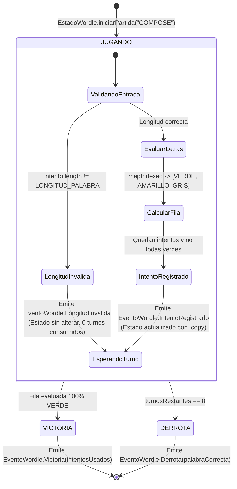

# Bloque 3: POO Idiomática, Data Classes y Tipos Sellados

En este tercer bloque dominarás la Programación Orientada a Objetos moderna en Kotlin: el diseño sin código repetitivo (*boilerplate*), las clases inmutables de datos (`data class`), los objetos únicos (`object`), las jerarquías selladas (`sealed interface`) para modelar estados de pantalla (**UiState**) y la varianza en tipos genéricos.

📁 **Paquete de trabajo:** `package b03_poo_sealed`  
Ubicación en tu proyecto: `src/main/kotlin/b03_poo_sealed/`

!!! info "📚 Apuntes Teóricos de Referencia"
    Para resolver las actividades de este bloque, puedes consultar los siguientes temas de los apuntes:

    - [Programación Orientada a Objetos (Clases, Herencia e Interfaces)](../21-poo.md)
    - [Singletons y Companion Object (Objetos y Factorías)](../22-objetos-anonimos.md)
    - [Data Classes (Modelos de Datos Inmutables)](../23-data-classes.md)
    - [Funciones de Extensión sobre Clases](../13-funciones-lambdas.md#5-funciones-de-extension-extension-functions)
    - [Enum Classes (Tipos Enumerados y `.entries`)](../24-enum-classes.md)
    - [Genéricos (Parámetros de Tipo y Covarianza)](../25-genericos.md)
    - [Tipos Sellados (Sealed Classes/Interfaces y UI State)](../26-sealed-classes.md)

---

## 🌱 Fase 0: Calentamiento Guiado (Gimnasio de Sintaxis)

Esta fase contiene **8 micro-ejercicios atómicos** diseñados para que mecanices la POO idiomática de Kotlin, asimiles la drástica reducción de *boilerplate* frente a Java y domines el modelado de datos inmutables y Singletons nativos.

📁 **Archivo de trabajo para esta fase:** `E00_CalentamientoPOO.kt`  
Ubicación: `src/main/kotlin/b03_poo_sealed/`

---

### 🔹 Nivel 1: Clases, Constructores y Data Classes

#### Ejercicio 0.1: Constructor Primario en Cabecera
📄 **Archivo:** `E00_CalentamientoPOO.kt`  
📚 **Teoría de referencia:** [Clases y Constructor Primario](../21-poo.md#1-clases-y-constructor-primario-idiomatico)

##### 1. Concepto y Código Resuelto
En Java, definir una clase sencilla requiere declarar campos privados, escribir un constructor que asigne `this.campo = campo` manualmente y definir métodos *getter*. En Kotlin, declarar `val` o `var` en los paréntesis de la cabecera define el campo, el constructor y los getters automáticamente.

=== "Kotlin"
    ```kotlin
    package b03_poo_sealed

    // Cabecera compacta: define los atributos, el constructor primario y los getters en una sola línea:
    class Personaje(val nombre: String, var salud: Int = 100)

    fun main() {
        val heroe = Personaje("Zelda")
        println("Héroe: ${heroe.nombre} | Salud inicial: ${heroe.salud}")

        heroe.salud -= 20
        println("Salud tras recibir daño: ${heroe.salud}")
    }
    ```

=== "Java"
    ```java
    public class PersonajeJava {
        private final String nombre;
        private int salud;

        // En Java se requiere constructor explícito y getters manuales:
        public PersonajeJava(String nombre, int salud) {
            this.nombre = nombre;
            this.salud = salud;
        }

        public PersonajeJava(String nombre) {
            this(nombre, 100);
        }

        public String getNombre() { return nombre; }
        public int getSalud() { return salud; }
        public void setSalud(int salud) { this.salud = salud; }
    }
    ```

##### 2. Salida en Consola
```text
Héroe: Zelda | Salud inicial: 100
Salud tras recibir daño: 80
```

---

#### Ejercicio 0.2: Bloque `init` y Validaciones Previas
📄 **Archivo:** `E00_CalentamientoPOO.kt`  
📚 **Teoría de referencia:** [Bloque de Inicialización init](../21-poo.md#2-bloque-de-inicializacion-init)

##### 1. Enunciado y Requisitos
Como el constructor primario no tiene cuerpo de código, cualquier lógica de inicialización o validación se ubica en el bloque **`init`**.

1. Declara una clase `ItemTienda(val nombre: String, val precio: Double)`.
2. Añade un bloque `init` que verifique mediante `require(precio >= 0.0) { "El precio no puede ser negativo" }`.
3. Comprueba que se crea correctamente un ítem con precio positivo y captura la excepción al intentar crear uno con precio `-5.0`.

##### 2. Salida Esperada
```text
Item creado: Poción (15.0€)
Error capturado: El precio no puede ser negativo
```

##### 3. Solución Comentada
??? tip "Ver solución comentada"
    ```kotlin
    package b03_poo_sealed

    class ItemTienda(val nombre: String, val precio: Double) {
        init {
            require(precio >= 0.0) { "El precio no puede ser negativo" }
        }
    }

    fun main() {
        val itemValido = ItemTienda("Poción", 15.0)
        println("Item creado: ${itemValido.nombre} (${itemValido.precio}€)")

        try {
            ItemTienda("Objeto Prohibido", -5.0)
        } catch (e: IllegalArgumentException) {
            println("Error capturado: ${e.message}")
        }
    }
    ```

---

#### Ejercicio 0.3: `data class` vs POJO Tradicional de Java
📄 **Archivo:** `E00_CalentamientoPOO.kt`  
📚 **Teoría de referencia:** [Data Classes](../23-data-classes.md#1-que-es-una-data-class)

##### 1. Concepto y Código Resuelto
En Java, modelar una entidad de datos requiere más de 50 líneas para implementar `equals()`, `hashCode()`, `toString()` y constructores. En Kotlin, la palabra clave **`data class`** genera todo esto de forma automática y óptima.

=== "Kotlin"
    ```kotlin
    package b03_poo_sealed

    // Genera automáticamente: toString(), equals(), hashCode(), copy() y componentN():
    data class Videojuego(val id: Int, val titulo: String, val precio: Double)

    fun main() {
        val j1 = Videojuego(1, "Metroid Prime", 59.99)
        val j2 = Videojuego(1, "Metroid Prime", 59.99)

        // toString() legible por defecto:
        println("Ficha del juego: $j1")

        // equals() estructural automático:
        println("¿Son el mismo juego según sus datos (==)?: ${j1 == j2}")
    }
    ```

=== "Java (POJO Tradicional)"
    ```java
    import java.util.Objects;

    public class VideojuegoJava {
        private final int id;
        private final String titulo;
        private final double precio;

        public VideojuegoJava(int id, String titulo, double precio) {
            this.id = id;
            this.titulo = titulo;
            this.precio = precio;
        }

        public int getId() { return id; }
        public String getTitulo() { return titulo; }
        public double getPrecio() { return precio; }

        @Override
        public boolean equals(Object o) {
            if (this == o) return true;
            if (o == null || getClass() != o.getClass()) return false;
            VideojuegoJava that = (VideojuegoJava) o;
            return id == that.id && Double.compare(that.precio, precio) == 0 && Objects.equals(titulo, that.titulo);
        }

        @Override
        public int hashCode() {
            return Objects.hash(id, titulo, precio);
        }

        @Override
        public String toString() {
            return "VideojuegoJava{id=" + id + ", titulo='" + titulo + "', precio=" + precio + "}";
        }
    }
    ```

##### 2. Salida en Consola
```text
Ficha del juego: Videojuego(id=1, titulo=Metroid Prime, precio=59.99)
¿Son el mismo juego según sus datos (==)?: true
```

---

#### Ejercicio 0.4: Mutación Inmutable con `.copy()`
📄 **Archivo:** `E00_CalentamientoPOO.kt`  
📚 **Teoría de referencia:** [El Método copy()](../23-data-classes.md#3-el-metodo-copy-mutacion-inmutable)

##### 1. Enunciado y Requisitos
En arquitecturas reactivas y Jetpack Compose, **los objetos de estado no se mutan internamente**; se genera una nueva instancia inmutable clonando la anterior con campos actualizados.

1. Utiliza la `data class Videojuego(val id: Int, val titulo: String, val precio: Double)`.
2. Instancia un juego con precio original de `69.99`.
3. Aplica un descuento de Black Friday generando un nuevo objeto mediante `.copy(precio = 39.99)`.
4. Muestra que la instancia original permanece intacta y la copia tiene el nuevo precio.

##### 2. Salida Esperada
```text
Juego original: Videojuego(id=101, titulo=Doom Eternal, precio=69.99)
Juego en oferta: Videojuego(id=101, titulo=Doom Eternal, precio=39.99)
```

##### 3. Solución Comentada
??? tip "Ver solución comentada"
    ```kotlin
    package b03_poo_sealed

    fun main() {
        val original = Videojuego(101, "Doom Eternal", 69.99)

        // Creamos una nueva instancia inmutable modificando únicamente el precio:
        val enOferta = original.copy(precio = 39.99)

        println("Juego original: $original")
        println("Juego en oferta: $enOferta")
    }
    ```

---

### 🔹 Nivel 2: Singletons, Companion Objects y Factorías

#### Ejercicio 0.5: El Patrón Singleton Nativo (`object`)
📄 **Archivo:** `E00_CalentamientoPOO.kt`  
📚 **Teoría de referencia:** [Declaración de Objetos: Singleton](../22-objetos-anonimos.md#1-declaracion-de-objetos-el-patron-singleton-nativo)

##### 1. Concepto y Código Resuelto
Un Singleton garantiza que solo exista una instancia en memoria. En Java requiere constructores privados y bloques `synchronized`. En Kotlin se declara simplemente con `object`.

=== "Kotlin"
    ```kotlin
    package b03_poo_sealed

    // Singleton nativo Thread-Safe garantizado por la JVM:
    object GestorConfiguracion {
        var idioma: String = "es"
        var modoOscuro: Boolean = true
    }

    fun main() {
        GestorConfiguracion.idioma = "en"

        val refA = GestorConfiguracion
        val refB = GestorConfiguracion

        println("Idioma configurado: ${refB.idioma}")
        println("¿Ambas referencias apuntan al mismo objeto en memoria (===)?: ${refA === refB}")
    }
    ```

=== "Java"
    ```java
    public class GestorConfiguracionJava {
        private static volatile GestorConfiguracionJava instance;
        private String idioma = "es";

        private GestorConfiguracionJava() {}

        public static GestorConfiguracionJava getInstance() {
            if (instance == null) {
                synchronized (GestorConfiguracionJava.class) {
                    if (instance == null) instance = new GestorConfiguracionJava();
                }
            }
            return instance;
        }

        public String getIdioma() { return idioma; }
        public void setIdioma(String idioma) { this.idioma = idioma; }
    }
    ```

##### 2. Salida en Consola
```text
Idioma configurado: en
¿Ambas referencias apuntan al mismo objeto en memoria (===)?: true
```

---

#### Ejercicio 0.6: `companion object` (Sustituto de `static`)
📄 **Archivo:** `E00_CalentamientoPOO.kt`  
📚 **Teoría de referencia:** [El Objeto Compañero](../22-objetos-anonimos.md#2-el-objeto-companero-companion-object-y-el-patron-factory-method)

##### 1. Concepto y Código Resuelto
Kotlin no tiene `static`. Los miembros asociados a la clase en lugar de a la instancia se ubican dentro de su `companion object`.

=== "Kotlin"
    ```kotlin
    package b03_poo_sealed

    class BaseDatos {
        companion object {
            const val TAG = "DATABASE_HELPER"
            const val VERSION = 1
        }
    }

    fun main() {
        // Acceso directo a través del nombre de la clase:
        println("Constante TAG: ${BaseDatos.TAG}")
        println("Versión de BD: ${BaseDatos.VERSION}")
    }
    ```

=== "Java"
    ```java
    public class BaseDatosJava {
        // En Java se declaran con public static final:
        public static final String TAG = "DATABASE_HELPER";
        public static final int VERSION = 1;
    }
    ```

##### 2. Salida en Consola
```text
Constante TAG: DATABASE_HELPER
Versión de BD: 1
```

---

#### Ejercicio 0.7: Método Factoría (*Factory Method*)
📄 **Archivo:** `E00_CalentamientoPOO.kt`  
📚 **Teoría de referencia:** [Patrón Factory Method en Companion Object](../22-objetos-anonimos.md#el-patron-factory-method-metodo-factoria)

##### 1. Enunciado y Requisitos
Aplica el patrón creacional [Factory Method](https://refactoring.guru/es/design-patterns/factory-method):

1. Declara una clase `ServicioApi private constructor(val url: String, val esSeguro: Boolean)`.
2. Dentro del `companion object`, define dos métodos factoría con nombres descriptivos:
    - `fun crearDesarrollo(): ServicioApi` (apunta a `http://localhost:3000`, seguro = false)
    - `fun crearProduccion(): ServicioApi` (apunta a `https://api.gamevault.es`, seguro = true)

3. Instancia ambos servicios desde `main()` y muestra su configuración.

##### 2. Salida Esperada
```text
Servicio Local: http://localhost:3000 (Seguro: false)
Servicio Prod: https://api.gamevault.es (Seguro: true)
```

##### 3. Solución Comentada
??? tip "Ver solución comentada"
    ```kotlin
    package b03_poo_sealed

    class ServicioApi private constructor(val url: String, val esSeguro: Boolean) {
        companion object {
            fun crearDesarrollo(): ServicioApi = ServicioApi("http://localhost:3000", esSeguro = false)
            fun crearProduccion(): ServicioApi = ServicioApi("https://api.gamevault.es", esSeguro = true)
        }
    }

    fun main() {
        val dev = ServicioApi.crearDesarrollo()
        val prod = ServicioApi.crearProduccion()

        println("Servicio Local: ${dev.url} (Seguro: ${dev.esSeguro})")
        println("Servicio Prod: ${prod.url} (Seguro: ${prod.esSeguro})")
    }
    ```

---

#### Ejercicio 0.8: Expresiones de Objeto Anónimas (*Object Expressions*)
📄 **Archivo:** `E00_CalentamientoPOO.kt`  
📚 **Teoría de referencia:** [Expresiones de Objeto](../22-objetos-anonimos.md#3-expresiones-de-objeto-object-expressions-objetos-anonimos)

##### 1. Enunciado y Requisitos
Para implementar una interfaz de un solo uso sin crear una clase con nombre:

1. Define `interface AccionBoton { fun alPulsar() }`.
2. En `main()`, crea una instancia anónima utilizando `val listener = object : AccionBoton { ... }`.
3. Invoca `listener.alPulsar()`.

##### 2. Salida Esperada
```text
¡Botón pulsado desde expresión de objeto anónima!
```

##### 3. Solución Comentada
??? tip "Ver solución comentada"
    ```kotlin
    package b03_poo_sealed

    interface AccionBoton {
        fun alPulsar()
    }

    fun main() {
        val listener = object : AccionBoton {
            override fun alPulsar() {
                println("¡Botón pulsado desde expresión de objeto anónima!")
            }
        }

        listener.alPulsar()
    }
    ```

---

## 🟢 Nivel Básico (POO Idiomática, Constructores y Propiedades)

### Ejercicio 3.1: Constructor Primario y Bloque `init`
📄 **Archivo:** `E01_ConstructorPrimarioInit.kt`  
📚 **Teoría de referencia:** [Clases y Constructor Primario Idiomático](../21-poo.md#1-clases-y-constructor-primario-idiomatico)

#### 1. Enunciado y Requisitos

1. Declara una clase `Jugador` cuyo constructor primario declare directamente en la cabecera dos propiedades: `val alias: String` y `var nivel: Int = 1`.

2. Añade un bloque `init` que valide mediante `require(alias.isNotBlank())` que el alias no esté vacío, y que el nivel inicial sea al menos `1`.

3. Instancia dos jugadores válidos en `main()`.

4. Intenta instanciar un jugador con alias en blanco dentro de un bloque `try-catch` para capturar la excepción `IllegalArgumentException`.

#### 2. Salida Esperada en Consola

```text
Jugador creado: Alias=Aloy, Nivel=1
Jugador creado: Alias=Kratos, Nivel=50
Capturado error esperado al crear jugador inválido: Failed requirement.
```

#### 3. Solución Comentada
??? tip "Ver solución comentada"
    ```kotlin
    package b03_poo_sealed

    class Jugador(
        val alias: String,
        var nivel: Int = 1
    ) {
        init {
            require(alias.isNotBlank()) { "El alias no puede estar vacío o en blanco." }
            require(nivel >= 1) { "El nivel debe ser como mínimo 1." }
        }

        override fun toString(): String = "Jugador(alias='$alias', nivel=$nivel)"
    }

    fun main() {
        val j1 = Jugador("Aloy")
        val j2 = Jugador("Kratos", 50)
        println("Jugador creado: Alias=${j1.alias}, Nivel=${j1.nivel}")
        println("Jugador creado: Alias=${j2.alias}, Nivel=${j2.nivel}")

        try {
            Jugador("   ", 0)
        } catch (e: IllegalArgumentException) {
            println("Capturado error esperado al crear jugador inválido: ${e.message}")
        }
    }
    ```

---

### Ejercicio 3.2: Constructores Secundarios vs Valores por Defecto
📄 **Archivo:** `E02_ConstructoresSecundarios.kt`  
📚 **Teoría de referencia:** [El Bloque de Inicialización: init y Constructores Secundarios](../21-poo.md#2-el-bloque-de-inicializacion-init)

#### 1. Enunciado y Requisitos

En Kotlin casi siempre se prefieren **valores por defecto en el constructor primario**, pero los **constructores secundarios** (`constructor(...) : this(...)`) son necesarios al extender clases de la plataforma Android (como `View(context, attrs)`).

1. Modela una clase `ServidorPartida(val ip: String, val puerto: Int, val sslHabilitado: Boolean)`.

2. Proporciona un constructor secundario que reciba únicamente la dirección `ip` y asigne por defecto el puerto `8080` y `sslHabilitado = false`.

3. Proporciona un segundo constructor secundario que reciba una URL completa (ej. `"https://servidor.es:443"`) y extraiga los datos delegando al constructor primario.

4. Instancia servidores usando ambas vías y muestra sus propiedades.

#### 2. Salida Esperada en Consola

```text
Servidor 1 (Constructor secundario por IP): ServidorPartida(ip='192.168.1.50', puerto=8080, ssl=false)
Servidor 2 (Constructor secundario por URL): ServidorPartida(ip='servidor.es', puerto=443, ssl=true)
```

#### 3. Solución Comentada
??? tip "Ver solución comentada"
    ```kotlin
    package b03_poo_sealed

    class ServidorPartida(
        val ip: String,
        val puerto: Int,
        val sslHabilitado: Boolean
    ) {
        // Constructor secundario 1: delega en el primario con this(...)
        constructor(ip: String) : this(ip, 8080, false)

        // Constructor secundario 2: parsea una URL simulada
        constructor(urlCompleta: String, esHttps: Boolean) : this(
            ip = urlCompleta.substringAfter("://").substringBefore(":"),
            puerto = urlCompleta.substringAfterLast(":").toIntOrNull() ?: 80,
            sslHabilitado = esHttps
        )

        override fun toString(): String = "ServidorPartida(ip='$ip', puerto=$puerto, ssl=$sslHabilitado)"
    }

    fun main() {
        val s1 = ServidorPartida("192.168.1.50")
        val s2 = ServidorPartida("https://servidor.es:443", esHttps = true)

        println("Servidor 1 (Constructor secundario por IP): $s1")
        println("Servidor 2 (Constructor secundario por URL): $s2")
    }
    ```

---

### Ejercicio 3.3: Getters y Setters Personalizados con `field`
📄 **Archivo:** `E03_GettersSettersField.kt`  
📚 **Teoría de referencia:** [Propiedades y Acceso (field): Getters y Setters](../21-poo.md#3-propiedades-y-acceso-field)

#### 1. Enunciado y Requisitos

1. Modela una clase `BarraDeVida(val maxVida: Int = 100)`.

2. Declara una propiedad mutable `var vidaActual: Int = maxVida`.

3. Implementa un `set(value)` personalizado que asegure que la vida nunca sea menor que `0` ni mayor que `maxVida` utilizando el identificador especial **`field`** (backing field).

4. Añade una propiedad computada de solo lectura `val estaVivo: Boolean` con un `get()` personalizado que devuelva `vidaActual > 0`.

5. Realiza pruebas en `main()` intentando restar más daño del permitido.

#### 2. Salida Esperada en Consola

```text
Vida inicial: 100/100 | ¿Vivo? true
Recibiendo 40 de daño...
Vida: 60/100 | ¿Vivo? true
Recibiendo 9999 de daño letal...
Vida: 0/100 (clamp a 0) | ¿Vivo? false
```

#### 3. Solución Comentada
??? tip "Ver solución comentada"
    ```kotlin
    package b03_poo_sealed

    class BarraDeVida(val maxVida: Int = 100) {
        var vidaActual: Int = maxVida
            set(value) {
                // 'field' almacena el valor real en memoria sin provocar recursión infinita
                field = value.coerceIn(0, maxVida)
            }

        // Propiedad computada sin backing field:
        val estaVivo: Boolean
            get() = vidaActual > 0
    }

    fun main() {
        val barra = BarraDeVida(100)
        println("Vida inicial: ${barra.vidaActual}/100 | ¿Vivo? ${barra.estaVivo}")

        println("Recibiendo 40 de daño...")
        barra.vidaActual -= 40
        println("Vida: ${barra.vidaActual}/100 | ¿Vivo? ${barra.estaVivo}")

        println("Recibiendo 9999 de daño letal...")
        barra.vidaActual -= 9999
        println("Vida: ${barra.vidaActual}/100 (clamp a 0) | ¿Vivo? ${barra.estaVivo}")
    }
    ```

---

### Ejercicio 3.4: Interfaces con Implementaciones por Defecto
📄 **Archivo:** `E04_InterfacesPolimorfismo.kt`  
📚 **Teoría de referencia:** [Clases Abstractas e Interfaces](../21-poo.md#6-clases-abstractas-e-interfaces)

#### 1. Enunciado y Requisitos

En Kotlin, las interfaces pueden contener tanto declaraciones de métodos abstractos como **implementaciones por defecto** y propiedades abstractas.

1. Declara una interfaz `Interactuable`:

    - Propiedad abstracta `val descripcion: String`.

    - Método abstracto `fun interactuar(personaje: String): String`.

    - Método con implementación por defecto `fun inspeccionar(): String = "Objeto interactivo: $descripcion"`.

2. Implementa la interfaz en dos clases: `CofreDelTesoro(val monedas: Int)` y `PalancaSecreta(var activada: Boolean)`.

3. Crea una lista polimórfica `List<Interactuable>` y recórrela ejecutando sus métodos.

#### 2. Salida Esperada en Consola

```text
Inspeccionando: Objeto interactivo: Cofre de madera antiguo
Acción: Link abre el Cofre y encuentra 50 monedas de oro.
Inspeccionando: Objeto interactivo: Palanca oxidada en la pared
Acción: Link tira de la palanca. Nueva posición: Activada.
```

#### 3. Solución Comentada
??? tip "Ver solución comentada"
    ```kotlin
    package b03_poo_sealed

    interface Interactuable {
        val descripcion: String
        fun interactuar(personaje: String): String
        fun inspeccionar(): String = "Objeto interactivo: $descripcion"
    }

    class CofreDelTesoro(val monedas: Int) : Interactuable {
        override val descripcion: String = "Cofre de madera antiguo"
        override fun interactuar(personaje: String): String =
            "$personaje abre el Cofre y encuentra $monedas monedas de oro."
    }

    class PalancaSecreta(var activada: Boolean = false) : Interactuable {
        override val descripcion: String = "Palanca oxidada en la pared"
        override fun interactuar(personaje: String): String {
            activada = !activada
            val estado = if (activada) "Activada" else "Desactivada"
            return "$personaje tira de la palanca. Nueva posición: $estado."
        }
    }

    fun main() {
        val objetos: List<Interactuable> = listOf(
            CofreDelTesoro(50),
            PalancaSecreta()
        )

        objetos.forEach { obj ->
            println("Inspeccionando: ${obj.inspeccionar()}")
            println("Acción: ${obj.interactuar("Link")}")
        }
    }
    ```

---

### Ejercicio 3.5: Herencia con `open` y `override`
📄 **Archivo:** `E05_HerenciaOpenOverride.kt`  
📚 **Teoría de referencia:** [Herencia: final por Defecto y la Palabra Clave open](../21-poo.md#5-herencia-final-por-defecto-y-la-palabra-clave-open)

#### 1. Enunciado y Requisitos

1. En Kotlin, todas las clases son `final` por defecto. Diseña una clase base `open class Enemigo(val nombre: String, val puntosSalud: Int)`.

2. Añade un método `open fun emitirSonidoAtaque()` que imprima un gruñido genérico.

3. Diseña una clase derivada `class BossFinal(nombre: String, salud: Int, val fase: Int) : Enemigo(nombre, salud)`.

4. Sobrescribe el método `emitirSonidoAtaque()` con `override` para que emita un rugido atronador.

#### 2. Salida Esperada en Consola

```text
Enemigo 'Goblin explorador' (30 HP) ataca: *Gruñido básico*
Boss 'Ganon el Conquistador' (500 HP, Fase 2) ataca: *¡RUGIDO DESTRUCTIVO!*
```

#### 3. Solución Comentada
??? tip "Ver solución comentada"
    ```kotlin
    package b03_poo_sealed

    open class Enemigo(val nombre: String, val puntosSalud: Int) {
        open fun emitirSonidoAtaque() {
            println("Enemigo '$nombre' ($puntosSalud HP) ataca: *Gruñido básico*")
        }
    }

    class BossFinal(
        nombre: String,
        puntosSalud: Int,
        val fase: Int
    ) : Enemigo(nombre, puntosSalud) {
        override fun emitirSonidoAtaque() {
            println("Boss '$nombre' ($puntosSalud HP, Fase $fase) ataca: *¡RUGIDO DESTRUCTIVO!*")
        }
    }

    fun main() {
        val e1: Enemigo = Enemigo("Goblin explorador", 30)
        val e2: Enemigo = BossFinal("Ganon el Conquistador", 500, fase = 2)

        e1.emitirSonidoAtaque()
        e2.emitirSonidoAtaque()
    }
    ```

---

### Ejercicio 3.6: Clases Abstractas y Polimorfismo: Pasarelas de Pago Móvil
📄 **Archivo:** `E06_ClasesAbstractasPago.kt`  
📚 **Teoría de referencia:** [Clases Abstractas: Jerarquías con Identidad Común](../21-poo.md#clases-abstractas-abstract-jerarquias-con-identidad-comun)

#### 1. Enunciado y Requisitos

En el desarrollo de aplicaciones móviles de comercio o servicios in-app, el usuario puede abonar una compra utilizando diferentes métodos de pago. Todos los métodos comparten una identidad común (titular y generación de recibo), pero cada uno valida y procesa el cobro con su propia lógica técnica:

1. Diseña una clase base abstracta `abstract class MetodoPago(val titular: String)`:

    - Método abstracto: `abstract fun procesarCobro(importe: Double): Boolean`. Cada pasarela debe implementarlo obligatoriamente.

    - Método concreto reutilizable:
      ```kotlin
      fun generarRecibo(importe: Double, exito: Boolean): String {
          val estado = if (exito) "PAGO ACEPTADO" else "PAGO RECHAZADO"
          return "[$estado] Titular: $titular | Total: ${String.format("%.2f", importe)} €"
      }
      ```

2. Implementa tres subclases concretas heredando de `MetodoPago`:

    - `class TarjetaCredito(titular: String, val numeroTarjeta: String, val cvv: String) : MetodoPago(titular)`: El cobro tiene éxito si `numeroTarjeta.length == 16` y `cvv.length == 3`. Imprime: `💳 Cobrando con Tarjeta terminado en [últimos 4 dígitos]...`

    - `class Bizum(titular: String, val telefono: String) : MetodoPago(titular)`: El cobro tiene éxito si `telefono.length == 9` y empieza por `'6'` o `'7'`. Imprime: `📱 Enviando petición Bizum al número [teléfono]...`

    - `class PayPal(titular: String, val email: String) : MetodoPago(titular)`: El cobro tiene éxito si el email contiene `'@'`. Imprime: `🌐 Redirigiendo a pasarela PayPal ([email])...`

3. En `fun main()`:

    - Crea una lista polimórfica `List<MetodoPago>` que contenga una tarjeta válida, un Bizum válido y una cuenta PayPal con formato de correo incorrecto.

    - Recorre la lista procesando un cobro de `49.99 €` para cada método e imprimiendo su recibo correspondiente.

#### 2. Salida Esperada en Consola

```text
💳 Cobrando 49.99 € con Tarjeta [****-****-****-4242]...
[PAGO ACEPTADO] Titular: Marta Sánchez | Total: 49.99 €
--------------------------------------------------
📱 Enviando petición Bizum de 49.99 € al 611223344...
[PAGO ACEPTADO] Titular: Carlos Ruiz | Total: 49.99 €
--------------------------------------------------
🌐 Redirigiendo a pasarela PayPal (usuario_invalido)...
[PAGO RECHAZADO] Titular: Ana Gómez | Total: 49.99 €
--------------------------------------------------
```

#### 3. Solución Comentada
??? tip "Ver solución comentada"
    ```kotlin
    package b03_poo_sealed

    abstract class MetodoPago(val titular: String) {
        // Método abstracto: obliga a cada pasarela a implementar su lógica de cobro
        abstract fun procesarCobro(importe: Double): Boolean

        // Método concreto: lógica compartida para generar el ticket/recibo
        fun generarRecibo(importe: Double, exito: Boolean): String {
            val estado = if (exito) "PAGO ACEPTADO" else "PAGO RECHAZADO"
            return "[$estado] Titular: $titular | Total: ${String.format("%.2f", importe)} €"
        }
    }

    class TarjetaCredito(
        titular: String,
        val numeroTarjeta: String,
        val cvv: String
    ) : MetodoPago(titular) {

        override fun procesarCobro(importe: Double): Boolean {
            val ultimosCuatro = if (numeroTarjeta.length >= 4) numeroTarjeta.takeLast(4) else "????"
            println("💳 Cobrando ${String.format("%.2f", importe)} € con Tarjeta [****-****-****-$ultimosCuatro]...")
            return numeroTarjeta.length == 16 && cvv.length == 3
        }
    }

    class Bizum(
        titular: String,
        val telefono: String
    ) : MetodoPago(titular) {

        override fun procesarCobro(importe: Double): Boolean {
            println("📱 Enviando petición Bizum de ${String.format("%.2f", importe)} € al $telefono...")
            return telefono.length == 9 && (telefono.startsWith("6") || telefono.startsWith("7"))
        }
    }

    class PayPal(
        titular: String,
        val email: String
    ) : MetodoPago(titular) {

        override fun procesarCobro(importe: Double): Boolean {
            println("🌐 Redirigiendo a pasarela PayPal ($email)...")
            return email.contains("@") && email.contains(".")
        }
    }

    fun main() {
        val pasarelas: List<MetodoPago> = listOf(
            TarjetaCredito("Marta Sánchez", "1234567812344242", "123"),
            Bizum("Carlos Ruiz", "611223344"),
            PayPal("Ana Gómez", "usuario_invalido")
        )

        val importeCompra = 49.99

        for (pasarela in pasarelas) {
            val exito = pasarela.procesarCobro(importeCompra)
            println(pasarela.generarRecibo(importeCompra, exito))
            println("-".repeat(50))
        }
    }
    ```

---

### Ejercicio 3.7: Composición sobre Herencia: Descuentos en Carrito Móvil
📄 **Archivo:** `E07_ComposicionDescuentos.kt`  
📚 **Teoría de referencia:** [Composición frente a Herencia](../21-poo.md#composicion-frente-a-herencia-composicion-sobre-herencia)

#### 1. Enunciado y Requisitos

En lugar de crear múltiples subclases rígidas para cada tipo de promoción comercial (`CarritoConDescuentoPorcentaje`, `CarritoConCuponFijo`), aplicaremos el principio **"Composición sobre Herencia"**: el carrito de compras **TIENE UNA** estrategia de descuento intercambiable en caliente:

1. Declara la interfaz de contrato para estrategias de descuento:
   ```kotlin
   interface EstrategiaDescuento {
       val descripcion: String
       fun calcular(precioBase: Double): Double
   }
   ```

2. Implementa tres clases que cumplan el contrato:

    - `class SinDescuento : EstrategiaDescuento`: devuelve el precio base íntegro sin alteraciones.

    - `class DescuentoPorcentaje(val porcentaje: Int) : EstrategiaDescuento`: descuenta el porcentaje indicado (ej. 20%).

    - `class DescuentoCuponFijo(val rebajaEuros: Double) : EstrategiaDescuento`: resta `rebajaEuros` del precio base, asegurando con `maxOf(0.0, ...)` que el total nunca sea negativo.

3. Diseña la clase compuesta `CarritoCompra(val usuario: String, var estrategiaDescuento: EstrategiaDescuento = SinDescuento())`:

    - Propiedad privada: `private val items = mutableListOf<Double>()`.

    - Método `fun agregarProducto(precio: Double)` que añada el importe a la lista.

    - Método `fun calcularTotal(): Double` que sume los precios y aplique la estrategia: `estrategiaDescuento.calcular(subtotal)`.

    - Método `fun imprimirTicket()` que muestre el subtotal, la descripción de la estrategia activa y el total final a abonar.

4. En `fun main()`:

    - Crea un carrito para el usuario `"Laura"` y añade dos productos por valor de `60.0 €` y `40.0 €` (subtotal = `100.00 €`).

    - Imprime el ticket inicial (con la estrategia por defecto `SinDescuento`).

    - Simula que la usuaria introduce un código promocional en la pantalla del móvil reasignando la propiedad en caliente:  
      `carrito.estrategiaDescuento = DescuentoPorcentaje(20)`. Imprime el nuevo ticket.

    - Simula que cambia a un cupón de fidelización de 15€:  
      `carrito.estrategiaDescuento = DescuentoCuponFijo(15.0)`. Imprime el ticket resultante.

#### 2. Salida Esperada en Consola

```text
🛒 Ticket de Laura (Subtotal: 100.00 €)
   Promoción: Sin descuento aplicado
   TOTAL A PAGAR: 100.00 €

🏷️ [El usuario aplica código: 'BLACKFRIDAY20']
🛒 Ticket de Laura (Subtotal: 100.00 €)
   Promoción: 20% de descuento Black Friday
   TOTAL A PAGAR: 80.00 €

🏷️ [El usuario canjea cupón de bienvenida de 15€]
🛒 Ticket de Laura (Subtotal: 100.00 €)
   Promoción: Cupón descuento directo de 15.00 €
   TOTAL A PAGAR: 85.00 €
```

#### 3. Solución Comentada
??? tip "Ver solución comentada"
    ```kotlin
    package b03_poo_sealed

    interface EstrategiaDescuento {
        val descripcion: String
        fun calcular(precioBase: Double): Double
    }

    class SinDescuento : EstrategiaDescuento {
        override val descripcion: String = "Sin descuento aplicado"
        override fun calcular(precioBase: Double): Double = precioBase
    }

    class DescuentoPorcentaje(val porcentaje: Int) : EstrategiaDescuento {
        override val descripcion: String = "$porcentaje% de descuento Black Friday"
        override fun calcular(precioBase: Double): Double = precioBase * (1.0 - porcentaje / 100.0)
    }

    class DescuentoCuponFijo(val rebajaEuros: Double) : EstrategiaDescuento {
        override val descripcion: String = "Cupón descuento directo de ${String.format("%.2f", rebajaEuros)} €"
        override fun calcular(precioBase: Double): Double = maxOf(0.0, precioBase - rebajaEuros)
    }

    // Composición: El Carrito 'TIENE UNA' EstrategiaDescuento intercambiable
    class CarritoCompra(
        val usuario: String,
        var estrategiaDescuento: EstrategiaDescuento = SinDescuento()
    ) {
        private val items = mutableListOf<Double>()

        fun agregarProducto(precio: Double) {
            items.add(precio)
        }

        fun calcularSubtotal(): Double = items.sum()

        fun calcularTotal(): Double = estrategiaDescuento.calcular(calcularSubtotal())

        fun imprimirTicket() {
            println("🛒 Ticket de $usuario (Subtotal: ${String.format("%.2f", calcularSubtotal())} €)")
            println("   Promoción: ${estrategiaDescuento.descripcion}")
            println("   TOTAL A PAGAR: ${String.format("%.2f", calcularTotal())} €\n")
        }
    }

    fun main() {
        val carrito = CarritoCompra(usuario = "Laura")
        carrito.agregarProducto(60.0)
        carrito.agregarProducto(40.0)

        // 1. Estado inicial sin descuento
        carrito.imprimirTicket()

        // 2. Cambio de comportamiento en caliente mediante composición:
        println("🏷️ [El usuario aplica código: 'BLACKFRIDAY20']")
        carrito.estrategiaDescuento = DescuentoPorcentaje(20)
        carrito.imprimirTicket()

        // 3. Cambio a cupón fijo:
        println("🏷️ [El usuario canjea cupón de bienvenida de 15€]")
        carrito.estrategiaDescuento = DescuentoCuponFijo(15.0)
        carrito.imprimirTicket()
    }
    ```

---

### Ejercicio 3.8: Delegación de Interfaces con `by`: Almacenamiento Local y Sesión Móvil
📄 **Archivo:** `E08_DelegacionInterfacesSesion.kt`  
📚 **Teoría de referencia:** [La Magia de Kotlin: Delegación de Interfaces (by)](../21-poo.md#la-magia-de-kotlin-delegacion-de-interfaces-by)

#### 1. Enunciado y Requisitos

En las aplicaciones móviles, una clase de negocio a menudo delega el almacenamiento físico en memoria o preferencias sin tener que reescribir manualmente cada método de la interfaz (*boilerplate*):

1. Define una interfaz de almacenamiento clave-valor:
   ```kotlin
   interface AlmacenamientoLocal {
       fun guardar(clave: String, valor: String)
       fun recuperar(clave: String): String?
       fun eliminar(clave: String)
   }
   ```

2. Implementa `class AlmacenamientoMemoria : AlmacenamientoLocal` utilizando internamente un mapa mutable `private val tabla = mutableMapOf<String, String>()`.

3. Crea la clase de negocio `GestorSesion(val usuarioId: String, almacenamiento: AlmacenamientoLocal) : AlmacenamientoLocal by almacenamiento`:

    - La cláusula `: AlmacenamientoLocal by almacenamiento` aplica la **delegación nativa de clases**: `GestorSesion` cumple el contrato de `AlmacenamientoLocal` redirigiendo automáticamente todas las llamadas al objeto delegado, **sin escribir ni una sola línea de código repetitivo**.

    - Añade lógica de negocio propia:
      ```kotlin
      fun iniciarSesion(tokenJwt: String) {
          guardar("TOKEN_SESION", tokenJwt)
          println("✅ Sesión iniciada para usuario $usuarioId.")
      }

      fun cerrarSesion() {
          eliminar("TOKEN_SESION")
          println("🚪 Sesión cerrada para usuario $usuarioId.")
      }

      val estaAutenticado: Boolean
          get() = recuperar("TOKEN_SESION") != null
      ```

4. En `fun main()`:

    - Instancia `GestorSesion` pasándole una instancia de `AlmacenamientoMemoria`.

    - Inicia sesión con el token `"JWT_XYZ_777"`.

    - Comprueba que `estaAutenticado` es `true`.

    - Lee el token llamando directamente a `gestor.recuperar("TOKEN_SESION")` (demostrando la delegación de interfaces en acción).

    - Cierra sesión y verifica que `estaAutenticado` pasa a ser `false`.

#### 2. Salida Esperada en Consola

```text
✅ Sesión iniciada para usuario USR-8842.
¿Usuario autenticado?: true
Token activo recuperado por delegación: JWT_XYZ_777
🚪 Sesión cerrada para usuario USR-8842.
¿Usuario autenticado tras logout?: false
```

#### 3. Solución Comentada
??? tip "Ver solución comentada"
    ```kotlin
    package b03_poo_sealed

    interface AlmacenamientoLocal {
        fun guardar(clave: String, valor: String)
        fun recuperar(clave: String): String?
        fun eliminar(clave: String)
    }

    class AlmacenamientoMemoria : AlmacenamientoLocal {
        private val tabla = mutableMapOf<String, String>()

        override fun guardar(clave: String, valor: String) {
            tabla[clave] = valor
        }

        override fun recuperar(clave: String): String? = tabla[clave]

        override fun eliminar(clave: String) {
            tabla.remove(clave)
        }
    }

    // Delegación nativa: GestorSesion implementa AlmacenamientoLocal redirigiendo a 'almacenamiento'
    class GestorSesion(
        val usuarioId: String,
        almacenamiento: AlmacenamientoLocal
    ) : AlmacenamientoLocal by almacenamiento {

        fun iniciarSesion(tokenJwt: String) {
            guardar("TOKEN_SESION", tokenJwt)
            println("✅ Sesión iniciada para usuario $usuarioId.")
        }

        fun cerrarSesion() {
            eliminar("TOKEN_SESION")
            println("🚪 Sesión cerrada para usuario $usuarioId.")
        }

        val estaAutenticado: Boolean
            get() = recuperar("TOKEN_SESION") != null
    }

    fun main() {
        val almacenamiento = AlmacenamientoMemoria()
        val gestor = GestorSesion(usuarioId = "USR-8842", almacenamiento = almacenamiento)

        gestor.iniciarSesion("JWT_XYZ_777")

        println("¿Usuario autenticado?: ${gestor.estaAutenticado}")

        // Llamada delegada directamente sobre 'gestor' sin métodos manuales en GestorSesion:
        val tokenActivo = gestor.recuperar("TOKEN_SESION")
        println("Token activo recuperado por delegación: $tokenActivo")

        gestor.cerrarSesion()
        println("¿Usuario autenticado tras logout?: ${gestor.estaAutenticado}")
    }
    ```

---

## 🟡 Nivel Intermedio (Data Classes, Singletons, Enums y Eventos)

### Ejercicio 3.9: Data Classes y Generación de Copias con `.copy()`
📄 **Archivo:** `E09_DataClassesCopy.kt`  
📚 **Teoría de referencia:** [Declaración de Data Classes y Método copy()](../23-data-classes.md#3-el-metodo-copy-y-la-inmutabilidad)

#### 1. Enunciado y Requisitos

1. Modela una entidad `data class Videojuego(val id: Long, val titulo: String, val precio: Double, val terminado: Boolean = false)`.

2. En `main()`, crea un videojuego `juego1`.

3. Utiliza la función **`.copy()`** para crear `juego2` con el mismo título e ID, pero marcando `terminado = true` y reduciendo su precio.

4. Demuestra que `juego1` sigue intacto en memoria (inmutabilidad).

5. Utiliza la desestructuración de datos `val (id, titulo, precio) = juego1` para imprimir sus propiedades directamente.

#### 2. Salida Esperada en Consola

```text
Juego original (intacto): Videojuego(id=1, titulo=Celeste, precio=19.99, terminado=false)
Juego modificado con .copy(): Videojuego(id=1, titulo=Celeste, precio=9.99, terminado=true)
Desestructuración: ID=1 | Título=Celeste | Precio=19.99 €
```

#### 3. Solución Comentada
??? tip "Ver solución comentada"
    ```kotlin
    package b03_poo_sealed

    data class Videojuego(
        val id: Long,
        val titulo: String,
        val precio: Double,
        val terminado: Boolean = false
    )

    fun main() {
        val juego1 = Videojuego(1L, "Celeste", 19.99, false)

        // Derivamos un nuevo estado sin tocar el original
        val juego2 = juego1.copy(precio = 9.99, terminado = true)

        println("Juego original (intacto): $juego1")
        println("Juego modificado con .copy(): $juego2")

        // Desestructuración automática generada por el compilador (componentN)
        val (id, titulo, precio) = juego1
        println("Desestructuración: ID=$id | Título=$titulo | Precio=$precio €")
    }
    ```

---

### Ejercicio 3.10: `companion object` para Constantes y Factorías
📄 **Archivo:** `E10_CompanionObjectFactory.kt`  
📚 **Teoría de referencia:** [El Objeto Compañero (Companion Object)](../22-objetos-anonimos.md#2-el-objeto-companero-companion-object-y-el-patron-factory-method)

!!! info "Patrón de Diseño: Factory Method (Método Factoría)"
    El uso de constructores privados junto con métodos de creación en el `companion object` es la implementación idiomática en Kotlin del patrón creacional **Factory Method**. Oculta los detalles de instanciación y dota a la creación de objetos de nombres semánticos claros (`crearLocal()`, `crearParaProduccion()`). Puedes profundizar en la teoría de este patrón en [Refactoring Guru: Factory Method](https://refactoring.guru/es/design-patterns/factory-method).

#### 1. Enunciado y Requisitos

1. Crea una clase `TarjetaRed(val mac: String, val ipAsignada: String)` con constructor primario privado (`private constructor(...)`).

2. Define un **`companion object`** que contenga:

    - Una constante `const val PUERTO_DEFECTO: Int = 8080`.

    - Un método factoría `fun crearLocal(): TarjetaRed` que devuelva una tarjeta con MAC `"00:00:00:00"` e IP `"127.0.0.1"`.

3. Accede a la constante y al método factoría directamente a través del nombre de la clase sin instanciarla (sustituto del `static` de Java).

#### 2. Salida Esperada en Consola

```text
Puerto por defecto del sistema: 8080
Tarjeta local instanciada mediante Factoría: MAC=00:00:00:00, IP=127.0.0.1
```

#### 3. Solución Comentada
??? tip "Ver solución comentada"
    ```kotlin
    package b03_poo_sealed

    class TarjetaRed private constructor(
        val mac: String,
        val ipAsignada: String
    ) {
        companion object {
            const val PUERTO_DEFECTO: Int = 8080

            fun crearLocal(): TarjetaRed {
                return TarjetaRed("00:00:00:00", "127.0.0.1")
            }
        }

        override fun toString(): String = "MAC=$mac, IP=$ipAsignada"
    }

    fun main() {
        println("Puerto por defecto del sistema: ${TarjetaRed.PUERTO_DEFECTO}")

        val tarjeta = TarjetaRed.crearLocal()
        println("Tarjeta local instanciada mediante Factoría: $tarjeta")
    }
    ```

---

### Ejercicio 3.11: `object` Nativo (Patrón Singleton Thread-Safe)
📄 **Archivo:** `E11_SingletonObject.kt`  
📚 **Teoría de referencia:** [Declaración de Objetos: El Patrón Singleton Nativo](../22-objetos-anonimos.md#1-declaracion-de-objetos-el-patron-singleton-nativo)

!!! info "Patrón de Diseño: Singleton en la Industria"
    El patrón **Singleton** garantiza que una clase tenga una única instancia global en toda la memoria de la aplicación. Para explorar su estructura clásica, aplicabilidad y pros/contras arquitecturales, consulta [Refactoring Guru: Patrón Singleton](https://refactoring.guru/es/design-patterns/singleton).

#### 1. Enunciado y Requisitos

1. Modela un gestor de sesión de usuario utilizando la palabra clave **`object`**.

2. Declara propiedades para el usuario actual y el tiempo de inicio de sesión.

3. Añade métodos para iniciar sesión y cerrar sesión.

4. Demuestra desde dos llamadas independientes en `main()` que ambas acceden exactamente a la misma instancia en memoria mediante igualdad referencial (`===`).

#### 2. Salida Esperada en Consola

```text
Sesión iniciada para: Link_Hero
Acceso desde componente A: Usuario activo = Link_Hero
Acceso desde componente B: Usuario activo = Link_Hero
¿Es exactamente la misma instancia en memoria? true
```

#### 3. Solución Comentada
??? tip "Ver solución comentada y comparativa Kotlin vs Java"
    === "Kotlin (Solución con object)"
        ```kotlin
        package b03_poo_sealed

        // En Kotlin, 'object' crea un Singleton seguro en concurrencia (Thread-Safe)
        // de forma nativa sin ningún código boilerplate
        object SesionManager {
            var usuarioActual: String? = null
                private set

            fun iniciarSesion(usuario: String) {
                usuarioActual = usuario
                println("Sesión iniciada para: $usuario")
            }

            fun cerrarSesion() {
                usuarioActual = null
            }
        }

        fun main() {
            SesionManager.iniciarSesion("Link_Hero")

            val ref1 = SesionManager
            val ref2 = SesionManager

            println("Acceso desde componente A: Usuario activo = ${ref1.usuarioActual}")
            println("Acceso desde componente B: Usuario activo = ${ref2.usuarioActual}")
            println("¿Es exactamente la misma instancia en memoria? ${ref1 === ref2}")
        }
        ```

    === "Java (Equivalente Tradicional con Doble Bloqueo)"
        ```java
        // En Java se requieren constructores privados, variables volátiles
        // y bloques sincronizados para lograr el mismo nivel de seguridad
        public class SesionManagerJava {
            private static volatile SesionManagerJava instance;
            private String usuarioActual;

            private SesionManagerJava() {}

            public static SesionManagerJava getInstance() {
                if (instance == null) {
                    synchronized (SesionManagerJava.class) {
                        if (instance == null) {
                            instance = new SesionManagerJava();
                        }
                    }
                }
                return instance;
            }

            public void iniciarSesion(String usuario) {
                this.usuarioActual = usuario;
                System.out.println("Sesión iniciada para: " + usuario);
            }

            public String getUsuarioActual() {
                return usuarioActual;
            }
        }
        ```

---

### Ejercicio 3.12: `enum class` con Propiedades y `.entries`
📄 **Archivo:** `E12_EnumEntries.kt`  
📚 **Teoría de referencia:** [Enums con Propiedades y Métodos](../24-enum-classes.md#2-enums-con-propiedades-y-metodos) e [Iteración con .entries](../24-enum-classes.md#3-iteracion-moderna-entries-vs-values)

#### 1. Enunciado y Requisitos

1. Modela un `enum class NivelDificultad(val factorMultiplicador: Double, val etiquetaUi: String)`:

    - `FACIL(0.8, "Modo Relajado")`

    - `NORMAL(1.0, "Modo Estándar")`

    - `DIFICIL(1.5, "Modo Desafío")`

    - `PESADILLA(2.5, "Modo Extremo")`

2. En lugar del obsoleto `.values()`, utiliza la propiedad moderna **`.entries`** de Kotlin 1.9+ para listar las dificultades.

3. Evalúa con un `when` exhaustivo una dificultad dada sin necesidad de rama `else`.

#### 2. Salida Esperada en Consola

```text
--- DIFICULTADES DISPONIBLES (usando .entries) ---
- FACIL: Modo Relajado (x0.8)
- NORMAL: Modo Estándar (x1.0)
- DIFICIL: Modo Desafío (x1.5)
- PESADILLA: Modo Extremo (x2.5)

Configuración activa: Modo Desafío -> Daño enemigo amplificado un 150%.
```

#### 3. Solución Comentada
??? tip "Ver solución comentada"
    ```kotlin
    package b03_poo_sealed

    enum class NivelDificultad(val factorMultiplicador: Double, val etiquetaUi: String) {
        FACIL(0.8, "Modo Relajado"),
        NORMAL(1.0, "Modo Estándar"),
        DIFICIL(1.5, "Modo Desafío"),
        PESADILLA(2.5, "Modo Extremo")
    }

    fun main() {
        println("--- DIFICULTADES DISPONIBLES (usando .entries) ---")
        NivelDificultad.entries.forEach { d ->
            println("- ${d.name}: ${d.etiquetaUi} (x${d.factorMultiplicador})")
        }

        val seleccionada = NivelDificultad.DIFICIL

        val descripcion = when (seleccionada) {
            NivelDificultad.FACIL -> "Modo asistido con daño reducido."
            NivelDificultad.NORMAL -> "Experiencia original diseñada por el equipo."
            NivelDificultad.DIFICIL -> "Daño enemigo amplificado un 150%."
            NivelDificultad.PESADILLA -> "Cualquier golpe puede ser letal. Muerte permanente."
        }

        println("\nConfiguración activa: ${seleccionada.etiquetaUi} -> $descripcion")
    }
    ```

---

### Ejercicio 3.13: Modelado de Eventos con `sealed interface UiEvent`
📄 **Archivo:** `E13_UiEventsSealed.kt`  
📚 **Teoría de referencia:** [Sintaxis Moderna: sealed interface y data object](../26-sealed-classes.md#2-sintaxis-moderna-sealed-interface-y-data-object-kotlin-19) y [Manejo con when Exhaustivo](../26-sealed-classes.md#3-manejo-con-when-exhaustivo-y-smart-casting)

#### 1. Enunciado y Requisitos

En Jetpack Compose, las acciones que el usuario realiza en la pantalla (pulsar botón, teclear texto, confirmar borrado) se representan como una jerarquía sellada de eventos (**UiEvent** o **UserIntent** en MVI).

1. Declara una jerarquía sellada `sealed interface DetalleJuegoUiEvent`:

    - `data class OnTituloCambiado(val nuevoTitulo: String) : DetalleJuegoUiEvent`

    - `data object OnGuardarPulsado : DetalleJuegoUiEvent`

    - `data object OnEliminarPulsado : DetalleJuegoUiEvent`

    - `data class OnConfirmarDialogo(val confirmar: Boolean) : DetalleJuegoUiEvent`

2. Implementa una función `procesarEvento(evento: DetalleJuegoUiEvent)` que utilice `when` exhaustivo para manejar cada acción.

3. Simula en `main()` una secuencia de acciones disparadas desde la UI.

#### 2. Salida Esperada en Consola

```text
[EVENTO PROCESADO]: Actualizando título en borrador a 'Zelda: Echoes of Wisdom'
[EVENTO PROCESADO]: Botón guardar pulsado. Guardando en Room...
[EVENTO PROCESADO]: Botón eliminar pulsado. Mostrando AlertDialog de confirmación.
[EVENTO PROCESADO]: Diálogo respondido: Confirmación = false. Cancelando borrado.
```

#### 3. Solución Comentada
??? tip "Ver solución comentada"
    ```kotlin
    package b03_poo_sealed

    sealed interface DetalleJuegoUiEvent {
        data class OnTituloCambiado(val nuevoTitulo: String) : DetalleJuegoUiEvent
        data object OnGuardarPulsado : DetalleJuegoUiEvent
        data object OnEliminarPulsado : DetalleJuegoUiEvent
        data class OnConfirmarDialogo(val confirmar: Boolean) : DetalleJuegoUiEvent
    }

    fun procesarEvento(evento: DetalleJuegoUiEvent) {
        when (evento) {
            is DetalleJuegoUiEvent.OnTituloCambiado ->
                println("[EVENTO PROCESADO]: Actualizando título en borrador a '${evento.nuevoTitulo}'")
            DetalleJuegoUiEvent.OnGuardarPulsado ->
                println("[EVENTO PROCESADO]: Botón guardar pulsado. Guardando en Room...")
            DetalleJuegoUiEvent.OnEliminarPulsado ->
                println("[EVENTO PROCESADO]: Botón eliminar pulsado. Mostrando AlertDialog de confirmación.")
            is DetalleJuegoUiEvent.OnConfirmarDialogo ->
                println("[EVENTO PROCESADO]: Diálogo respondido: Confirmación = ${evento.confirmar}. Cancelando borrado.")
        }
    }

    fun main() {
        procesarEvento(DetalleJuegoUiEvent.OnTituloCambiado("Zelda: Echoes of Wisdom"))
        procesarEvento(DetalleJuegoUiEvent.OnGuardarPulsado)
        procesarEvento(DetalleJuegoUiEvent.OnEliminarPulsado)
        procesarEvento(DetalleJuegoUiEvent.OnConfirmarDialogo(confirmar = false))
    }
    ```

---

### Ejercicio 3.14: Delegación de Propiedades con `by` y `Delegates.observable`
📄 **Archivo:** `E14_DelegatedProperties.kt`  
📚 **Teoría de referencia:** [Propiedades y Acceso en Clases](../21-poo.md#3-propiedades-y-acceso-field)

#### 1. Enunciado y Requisitos

Kotlin permite interceptar lecturas y escrituras en variables delegándolas mediante la palabra clave **`by`**.

1. Utiliza `kotlin.properties.Delegates.observable` para crear una propiedad mutable `var puntuacion: Int by Delegates.observable(0) { prop, anterior, nuevo -> ... }`.

2. En la lambda del observador, imprime un mensaje cada vez que cambie el valor indicando el valor antiguo y el nuevo.

3. En `main()`, modifica la puntuación 3 veces y observa cómo se dispara automáticamente el aviso de cambio sin escribir setters manuales.

#### 2. Salida Esperada en Consola

```text
Puntuación inicial: 0
[OBSERVADOR]: 'puntuacion' cambió de 0 a 150
[OBSERVADOR]: 'puntuacion' cambió de 150 a 450
[OBSERVADOR]: 'puntuacion' cambió de 450 a 1000
Puntuación final: 1000
```

#### 3. Solución Comentada
??? tip "Ver solución comentada"
    ```kotlin
    package b03_poo_sealed

    import kotlin.properties.Delegates

    class MarcadorPartida {
        var puntuacion: Int by Delegates.observable(0) { prop, anterior, nuevo ->
            println("[OBSERVADOR]: '${prop.name}' cambió de $anterior a $nuevo")
        }
    }

    fun main() {
        val marcador = MarcadorPartida()
        println("Puntuación inicial: ${marcador.puntuacion}")

        marcador.puntuacion = 150
        marcador.puntuacion = 450
        marcador.puntuacion = 1000

        println("Puntuación final: ${marcador.puntuacion}")
    }
    ```

---

## 🔴 Nivel Avanzado (Tipos Sellados, Genéricos y Reto Lúdico)

### Ejercicio 3.15: `sealed interface` y Patrón `UiState`
📄 **Archivo:** `E15_SealedUiState.kt`  
📚 **Teoría de referencia:** [El Patrón Universal de Arquitectura en Android: UiState](../26-sealed-classes.md#5-el-patron-universal-de-arquitectura-en-android-uistate)

#### 1. Enunciado y Requisitos

1. Define la jerarquía sellada recomendada oficialmente por Android para representar los estados de pantalla:

    ```kotlin
    sealed interface CatalogoUiState {
        data object Cargando : CatalogoUiState
        data class Exito(val juegos: List<String>) : CatalogoUiState
        data class Error(val mensaje: String) : CatalogoUiState
    }
    ```

2. Implementa una función `renderizarPantalla(estado: CatalogoUiState)` que evalúe exhaustivamente el estado mediante `when` sin rama `else`.

3. Comprueba el renderizado pasando los tres estados posibles.

#### 2. Salida Esperada en Consola

```text
[PANTALLA]: Mostrando animación de carga (Shimmer/Spinner)...
[PANTALLA]: Renderizando LazyColumn con 3 videojuegos: [Hollow Knight, Celeste, Dead Cells]
[PANTALLA]: Error de conexión: Servidor no disponible (503). Mostrando botón 'Reintentar'.
```

#### 3. Solución Comentada
??? tip "Ver solución comentada"
    ```kotlin
    package b03_poo_sealed

    sealed interface CatalogoUiState {
        data object Cargando : CatalogoUiState
        data class Exito(val juegos: List<String>) : CatalogoUiState
        data class Error(val mensaje: String) : CatalogoUiState
    }

    fun renderizarPantalla(estado: CatalogoUiState) {
        when (estado) {
            is CatalogoUiState.Cargando -> {
                println("[PANTALLA]: Mostrando animación de carga (Shimmer/Spinner)...")
            }
            is CatalogoUiState.Exito -> {
                println("[PANTALLA]: Renderizando LazyColumn con ${estado.juegos.size} videojuegos: ${estado.juegos}")
            }
            is CatalogoUiState.Error -> {
                println("[PANTALLA]: Error de conexión: ${estado.mensaje}. Mostrando botón 'Reintentar'.")
            }
        }
    }

    fun main() {
        renderizarPantalla(CatalogoUiState.Cargando)
        renderizarPantalla(CatalogoUiState.Exito(listOf("Hollow Knight", "Celeste", "Dead Cells")))
        renderizarPantalla(CatalogoUiState.Error("Servidor no disponible (503)"))
    }
    ```

---

### Ejercicio 3.16: Envoltorio Genérico con Covarianza `out`
📄 **Archivo:** `E16_GenericosVarianzaOut.kt`  
📚 **Teoría de referencia:** [Clases Genéricas](../25-genericos.md#1-clases-genericas) y [Covarianza con out](../25-genericos.md#41-covarianza-con-out-productores-de-datos)

#### 1. Enunciado y Requisitos

1. Define una jerarquía genérica sellada `sealed interface RespuestaApi<out T>` con el modificador de covarianza **`out`**:

    - `data class Exito<T>(val datos: T) : RespuestaApi<T>`

    - `data class Fallo(val codigoHttp: Int, val mensaje: String) : RespuestaApi<Nothing>`

2. Explica por qué el uso de `out` permite que `RespuestaApi<Nothing>` sea subtipo de `RespuestaApi<T>` para cualquier tipo `T`.

3. Demuestra su uso en una función simulada de login que devuelva `RespuestaApi<String>`.

#### 2. Salida Esperada en Consola

```text
Login correcto -> Token de sesión: JWT_TOKEN_SECRETO_2026
Login erróneo -> Error 401: Credenciales inválidas
```

#### 3. Solución Comentada
??? tip "Ver solución comentada"
    ```kotlin
    package b03_poo_sealed

    // 'out T' indica que T solo se produce/devuelve, habilitando polimorfismo seguro
    sealed interface RespuestaApi<out T> {
        data class Exito<out T>(val datos: T) : RespuestaApi<T>
        data class Fallo(val codigoHttp: Int, val mensaje: String) : RespuestaApi<Nothing>
    }

    fun simularLogin(usuario: String, clave: String): RespuestaApi<String> {
        return if (usuario == "admin" && clave == "1234") {
            RespuestaApi.Exito("JWT_TOKEN_SECRETO_2026")
        } else {
            // Gracias a 'out', RespuestaApi<Nothing> encaja perfectamente como RespuestaApi<String>
            RespuestaApi.Fallo(401, "Credenciales inválidas")
        }
    }

    fun main() {
        val r1 = simularLogin("admin", "1234")
        when (r1) {
            is RespuestaApi.Exito -> println("Login correcto -> Token de sesión: ${r1.datos}")
            is RespuestaApi.Fallo -> println("Login erróneo -> Error ${r1.codigoHttp}: ${r1.mensaje}")
        }

        val r2 = simularLogin("hacker", "0000")
        when (r2) {
            is RespuestaApi.Exito -> println("Login correcto -> Token de sesión: ${r2.datos}")
            is RespuestaApi.Fallo -> println("Login erróneo -> Error ${r2.codigoHttp}: ${r2.mensaje}")
        }
    }
    ```

---

### Ejercicio 3.17: Modelado de Rutas de Navegación con `sealed class`
📄 **Archivo:** `E17_RutasNavegacionSealed.kt`  
📚 **Teoría de referencia:** [Tipos Sellados (Sealed Classes e Interfaces)](../26-sealed-classes.md#1-que-es-una-sealed-class-y-que-problema-resuelve)

#### 1. Enunciado y Requisitos
En el desarrollo moderno en Android con Jetpack Compose, la navegación entre pantallas se modela mediante una jerarquía sellada finita. Las pantallas estáticas sin argumentos se declaran como `object` (para ahorrar memoria compartiendo la misma instancia), mientras que las pantallas que reciben parámetros de ruta (como un ID o slug) se declaran como `data class`.

1. Declara una jerarquía cerrada `sealed class Pantalla(val ruta: String)`:
    - `object Inicio : Pantalla("pantalla_inicio")`
    - `object Catalogo : Pantalla("pantalla_catalogo")`
    - `data class DetalleJuego(val juegoId: Int) : Pantalla("pantalla_detalle/$juegoId")`

2. Define una función `simularNavegacion(destino: Pantalla)` que evalúe con un `when` exhaustivo hacia dónde se navega y muestre los argumentos en caso de ser `DetalleJuego`.
3. Comprueba desde `main()` la navegación a las tres rutas.

#### 2. Salida Esperada en Consola
```text
Navegando a: pantalla_inicio -> Renderizando Carrusel de Novedades
Navegando a: pantalla_catalogo -> Renderizando Grid de Juegos
Navegando a: pantalla_detalle/42 -> Cargando datos del juego ID = 42
```

#### 3. Solución Comentada
??? tip "Ver solución comentada"
    ```kotlin
    package b03_poo_sealed

    // Jerarquía cerrada para control estricto de destinos de navegación (Patrón Compose)
    sealed class Pantalla(val ruta: String) {
        object Inicio : Pantalla("pantalla_inicio")
        object Catalogo : Pantalla("pantalla_catalogo")
        data class DetalleJuego(val juegoId: Int) : Pantalla("pantalla_detalle/$juegoId")
    }

    fun simularNavegacion(destino: Pantalla) {
        print("Navegando a: ${destino.ruta} -> ")
        when (destino) {
            is Pantalla.Inicio -> println("Renderizando Carrusel de Novedades")
            is Pantalla.Catalogo -> println("Renderizando Grid de Juegos")
            is Pantalla.DetalleJuego -> println("Cargando datos del juego ID = ${destino.juegoId}")
        }
    }

    fun main() {
        simularNavegacion(Pantalla.Inicio)
        simularNavegacion(Pantalla.Catalogo)
        simularNavegacion(Pantalla.DetalleJuego(juegoId = 42))
    }
    ```

---

### Ejercicio 3.18: Funciones y Propiedades de Extensión sobre Modelos (`data class`)
📄 **Archivo:** `E18_ExtensionesDataClasses.kt`  
📚 **Teoría de referencia:** [Funciones de Extensión](../13-funciones-lambdas.md#5-funciones-de-extension-extension-functions) y [Data Classes](../23-data-classes.md)

#### 1. Enunciado y Requisitos

En la arquitectura moderna de Android (MVVM / Clean Architecture), las **`data class`** representan modelos de datos puros (entidades de red o entidades de base de datos Room). Para respetar el **Principio de Responsabilidad Única (SRP)** y no "contaminar" estas clases con lógica de presentación, formateo visual o reglas de cálculo de la interfaz, en Kotlin se utilizan **funciones y propiedades de extensión**.

1. **Definición de la Entidad Pura:**

    - Modela la entidad de datos:
      ```kotlin
      data class Videojuego(
          val id: Long,
          val titulo: String,
          val precioBase: Double,
          val descuentoPorcentaje: Int = 0,
          val terminado: Boolean = false
      )
      ```

2. **Función de Extensión con Lógica de Negocio:**

    - Implementa `fun Videojuego.calcularPrecioFinal(): Double`.
    - Utiliza `this` para acceder a las propiedades del objeto receptor y calcular el precio tras aplicar el descuento: `this.precioBase * (1.0 - this.descuentoPorcentaje / 100.0)`.

3. **Propiedad de Extensión (*Extension Property*):**

    - Añade una propiedad calculada `val Videojuego.esOfertaDestacada: Boolean` mediante un getter personalizado `get()` que devuelva `true` si el descuento es igual o superior al 20%.

4. **Función de Extensión para Presentación en UI:**

    - Implementa `fun Videojuego.formatearFicha(): String` que devuelva un texto listo para la pantalla: `"[#$id] '$titulo' | Precio: ${"%.2f".format(calcularPrecioFinal())} € (Dto: ${descuentoPorcentaje}%)"`.

5. **Extensiones sobre Colecciones y Tipos Nulables de la Clase:**

    - Implementa una extensión sobre listas: `fun List<Videojuego>.filtrarOfertas(): List<Videojuego> = this.filter { it.esOfertaDestacada }`.
    - Implementa una extensión sobre el modelo nulable: `fun Videojuego?.tituloOSinSeleccion(): String = this?.titulo ?: "Ningún videojuego seleccionado"`.

6. **Comprobación en `main()`:**

    - Crea una lista con al menos 3 videojuegos: uno con 25% de descuento, otro con 10% y otro a precio completo (0%).
    - Muestra sus fichas formateadas, comprueba la propiedad `esOfertaDestacada`, filtra las ofertas destacadas y prueba la extensión sobre una referencia nula.

#### 2. Salida Esperada en Consola

```text
=== EXTENSIONES SOBRE MODELOS DE DATOS (DATA CLASSES) ===
Ficha Zelda: [#101] 'The Legend of Zelda' | Precio: 52.49 € (Dto: 25%)
¿Zelda es oferta destacada?: true

Ficha Hollow Knight: [#102] 'Hollow Knight' | Precio: 14.99 € (Dto: 0%)
¿Hollow Knight es oferta destacada?: false

=== OFERTAS DESTACADAS FILTRADAS CON EXTENSIÓN ===
- The Legend of Zelda (25% dto.)

=== EXTENSIÓN SOBRE DATA CLASS NULABLE (Videojuego?) ===
Juego seleccionado: The Legend of Zelda
Juego no seleccionado (null): Ningún videojuego seleccionado
```

#### 3. Solución Comentada
??? tip "Ver solución comentada"
    ```kotlin
    package b03_poo_sealed

    // 1. Entidad pura de datos (sin lógica visual ni de formateo):
    data class Videojuego(
        val id: Long,
        val titulo: String,
        val precioBase: Double,
        val descuentoPorcentaje: Int = 0,
        val terminado: Boolean = false
    )

    // 2. Función de extensión con cálculo de negocio:
    fun Videojuego.calcularPrecioFinal(): Double {
        return this.precioBase * (1.0 - this.descuentoPorcentaje / 100.0)
    }

    // 3. Propiedad de extensión (calculada, sin campo backing field):
    val Videojuego.esOfertaDestacada: Boolean
        get() = this.descuentoPorcentaje >= 20

    // 4. Función de extensión de formateo para la UI:
    fun Videojuego.formatearFicha(): String {
        return "[#$id] '$titulo' | Precio: ${"%.2f".format(calcularPrecioFinal())} € (Dto: ${descuentoPorcentaje}%)"
    }

    // 5. Extensión sobre colecciones de la clase:
    fun List<Videojuego>.filtrarOfertas(): List<Videojuego> {
        return this.filter { it.esOfertaDestacada }
    }

    // 5b. Extensión sobre el modelo NULABLE:
    fun Videojuego?.tituloOSinSeleccion(): String {
        return this?.titulo ?: "Ningún videojuego seleccionado"
    }

    fun main() {
        val zelda = Videojuego(101L, "The Legend of Zelda", 69.99, 25)
        val hollow = Videojuego(102L, "Hollow Knight", 14.99, 0)
        val celeste = Videojuego(103L, "Celeste", 19.99, 10)

        val catalogo = listOf(zelda, hollow, celeste)

        println("=== EXTENSIONES SOBRE MODELOS DE DATOS (DATA CLASSES) ===")
        println("Ficha Zelda: ${zelda.formatearFicha()}")
        println("¿Zelda es oferta destacada?: ${zelda.esOfertaDestacada}")

        println("\nFicha Hollow Knight: ${hollow.formatearFicha()}")
        println("¿Hollow Knight es oferta destacada?: ${hollow.esOfertaDestacada}")

        println("\n=== OFERTAS DESTACADAS FILTRADAS CON EXTENSIÓN ===")
        val destacadas = catalogo.filtrarOfertas()
        destacadas.forEach { println("- ${it.titulo} (${it.descuentoPorcentaje}% dto.)") }

        println("\n=== EXTENSIÓN SOBRE DATA CLASS NULABLE (Videojuego?) ===")
        val juegoActivo: Videojuego? = zelda
        val juegoNulo: Videojuego? = null

        println("Juego seleccionado: ${juegoActivo.tituloOSinSeleccion()}")
        println("Juego no seleccionado (null): ${juegoNulo.tituloOSinSeleccion()}")
    }
    ```

---

### Reto 3.19: El Motor de Wordle con Arquitectura de Estado (*State, Companion Object & Sealed Types*)
📄 **Archivo:** `Reto03_WordleEngine.kt`  
📚 **Teoría de referencia:** [El Método copy() y la Inmutabilidad](../23-data-classes.md#3-el-metodo-copy-mutacion-inmutable), [Companion Object y Factorías](../22-objetos-anonimos.md#3-companion-object-el-equivalente-a-static), [El Dúo Estrella: enum y when](../24-enum-classes.md#4-el-duo-estrella-enum-y-la-expresion-when-exhaustiva) y [Tipos Sellados (Sealed Classes e Interfaces)](../25-sealed-classes.md)

#### 1. Contexto Pedagógico: Arquitectura MVI / UDF en Compose y Tipos Sellados

En este reto de culminación del Bloque 3 construirás el motor de validación y gestión de estado para el popular juego de palabras **Wordle**. 

El objetivo formativo de este reto es dar el salto definitivo hacia la **arquitectura moderna de Android (Jetpack Compose)**, aplicando el patrón **UDF (*Unidirectional Data Flow*)**:

1. **El Estado Inmutable (`UiState`):** Toda la fotografía del juego en un instante dado se agrupa en un único contenedor inmutable (`data class EstadoWordle`). La interfaz de usuario nunca mantiene variables sueltas ni muta datos internamente.
2. **Encapsulación y Factorías con `companion object`:** En lugar de diseminar constantes sueltas (*números mágicos* como `6` intentos o `7` letras) o crear lógica de arranque fuera de la clase, el `companion object` de `EstadoWordle` centraliza la configuración de negocio y ofrece una **función factoría (`iniciarPartida()`)**. Este patrón es exactamente el que utilizarás en Android para inicializar el estado de tus `ViewModel`.
3. **Eventos Polimórficos con `sealed interface`:** Cuando el usuario envía una palabra, la interacción no siempre produce un simple "acierto o fallo". Puede haber errores de validación (palabra demasiado corta o larga), un intento ordinario registrado en la cuadrícula, o el desenlace final (victoria o derrota). En lugar de lanzar excepciones que hagan crashear la aplicación, modelamos un flujo de **eventos de notificación tipados con datos (*payload*)** mediante `sealed interface EventoWordle`.
4. **Función Pura de Transición (`procesarIntento`):** El motor no imprime nada por consola. Recibe el estado actual y la palabra propuesta, calcula el siguiente estado inmutable con `.copy()` y emite el evento correspondiente a través de un callback lambda `onEvento: (EventoWordle) -> Unit`.
5. **Capa de Presentación Desacoplada (`main`):** La consola actúa como una vista tonta (*dumb UI*). Simplemente escucha los eventos con un `when (evento)` exhaustivo y renderiza la cuadrícula apoyándose en funciones de extensión de formateo.

##### 🔄 Máquina de Estados del Motor de Wordle

El siguiente diagrama modela el ciclo de vida del juego y las transiciones puras que desencadena cada intento del jugador:



---

#### 2. Código Base Inicial

Para que puedas centrarte al 100% en el **diseño orientado a objetos**, el **`companion object`**, los **tipos sellados** y la **transición inmutable de estados**, se te facilita la inicialización de partida en `main()`.

Copia esta plantilla en tu archivo `Reto03_WordleEngine.kt` y completa las piezas marcadas con `TODO()`:

```kotlin
package b03_poo_sealed

// 1. TODO: Define el enumerado de calificación de celdas con su icono visual
// - VERDE ("🟩"), AMARILLO ("🟨"), GRIS ("⬛")
enum class EstadoLetra(val icono: String) {
    TODO("Implementar constantes del enum con sus iconos")
}

// 2. TODO: Define el enumerado para el ciclo de vida global de la partida
// - JUGANDO, VICTORIA, DERROTA
enum class EstadoPartida {
    TODO("Implementar fases de la partida")
}

// 3. TODO: Define la Sealed Interface para los eventos tipados del juego con sus variantes:
// - IntentoRegistrado(val turnoActual: Int, val intentosRestantes: Int)
// - LongitudInvalida(val longitudRecibida: Int, val longitudEsperada: Int)
// - Victoria(val intentosUsados: Int)
// - Derrota(val palabraCorrecta: String)
sealed interface EventoWordle {
    TODO("Implementar variantes de eventos")
}

// 4. TODO: Define la celda individual de la matriz de juego
data class EvaluacionLetra(
    val caracter: Char,
    val estado: EstadoLetra
)

// 5. TODO: Define la Data Class del estado inmutable con su Companion Object
data class EstadoWordle(
    val palabraSecreta: String,
    val intentosMaximos: Int = INTENTOS_POR_DEFECTO,
    val intentos: List<List<EvaluacionLetra>> = emptyList(),
    val estado: EstadoPartida = EstadoPartida.JUGANDO
) {
    val turnosRestantes: Int
        get() = TODO("Calcular intentos restantes: intentosMaximos - intentos.size")

    companion object {
        // TODO: Constantes de negocio
        // const val INTENTOS_POR_DEFECTO = 6
        // const val LONGITUD_PALABRA = 7
        // val DICCIONARIO = listOf("COMPOSE", "ANDROID", "KOTLINS", "MODULES", "ROOMBDD")

        // TODO: Factoría de arranque semántico
        // fun iniciarPartida(palabra: String? = null): EstadoWordle
        TODO("Implementar companion object con constantes y factoría iniciarPartida")
    }
}

// 6. TODO: Funciones de extensión sobre List<EvaluacionLetra> para renderizado visual
fun List<EvaluacionLetra>.renderizarTexto(): String {
    TODO("Mapear caracteres y unirlos con espacios. Ej: 'C O M P O S E'")
}

fun List<EvaluacionLetra>.renderizarIconos(): String {
    TODO("Mapear iconos y unirlos con espacios. Ej: '🟩 🟩 🟩 🟩 🟩 🟩 🟩'")
}

// 7. TODO: Función pura de evaluación posicional de caracteres
fun evaluarLetras(palabraSecreta: String, intento: String): List<EvaluacionLetra> {
    TODO("Mapear con mapIndexed a EstadoLetra.VERDE, AMARILLO o GRIS")
}

// 8. TODO: Función pura de extensión para la transición inmutable de estado
fun EstadoWordle.procesarIntento(
    intentoRaw: String,
    onEvento: (EventoWordle) -> Unit = {}
): EstadoWordle {
    TODO("Validar longitud, evaluar letras, emitir evento con onEvento y retornar nuevo EstadoWordle con .copy()")
}

// ============================================================================
// 🎮 PUNTO DE ENTRADA: INICIALIZACIÓN PROPORCIONADA
// Se te facilita la configuración inicial de la partida para que construyas
// el bucle interactivo que consume el estado y gestiona las notificaciones.
// ============================================================================
fun main() {
    // Inicialización elegante del estado mediante el Companion Object de EstadoWordle
    var partida = EstadoWordle.iniciarPartida("COMPOSE")

    // Bolsa de intentos simulados (incluye un intento con longitud inválida para probar el manejo robusto)
    val intentosSimulados = listOf("HOLA", "KOTLINS", "COMPASS", "COMPOSE")

    println("=== WORDLE KOTLIN (ARQUITECTURA DE ESTADO & TIPOS SELLADOS) ===")
    println("Palabra secreta fijada: ${partida.palabraSecreta} (${partida.palabraSecreta.length} letras)")
    println("Intentos máximos: ${partida.intentosMaximos} | Estado inicial: ${partida.estado}\n")

    // TODO: 9. Implementa el bucle de juego interactivo:
    // - Itera sobre intentosSimulados mientras partida.estado sea EstadoPartida.JUGANDO
    // - En cada turno, actualiza el estado reasignando:
    //     partida = partida.procesarIntento(palabra) { evento ->
    //         when (evento) {
    //             is EventoWordle.LongitudInvalida -> ...
    //             is EventoWordle.IntentoRegistrado -> ...
    //             is EventoWordle.Victoria -> ...
    //             is EventoWordle.Derrota -> ...
    //         }
    //     }
}
```

---

#### 3. Requisitos Funcionales (Tu Misión)

Para completar el reto con la máxima fidelidad técnica:

1. **RF-01 (Dominio con Enumerados):**
    - `EstadoLetra`: Enum con las constantes `VERDE("🟩")`, `AMARILLO("🟨")` y `GRIS("⬛")`, exponiendo su propiedad inmutable `val icono: String`.
    - `EstadoPartida`: Enum con las fases del juego `JUGANDO`, `VICTORIA` y `DERROTA`.

2. **RF-02 (Jerarquía Sellada de Eventos con `sealed interface`):**
    - Declara `sealed interface EventoWordle`.
    - Modela sus 4 variantes como clases de datos (`data class`) que implementen la interfaz:
        - `IntentoRegistrado(val turnoActual: Int, val intentosRestantes: Int) : EventoWordle`
        - `LongitudInvalida(val longitudRecibida: Int, val longitudEsperada: Int) : EventoWordle`
        - `Victoria(val intentosUsados: Int) : EventoWordle`
        - `Derrota(val palabraCorrecta: String) : EventoWordle`

3. **RF-03 (Data Class del Estado y su `companion object`):**
    - Modela `data class EstadoWordle(...)` con los atributos `palabraSecreta`, `intentosMaximos`, `intentos` y `estado`.
    - Expón la propiedad calculada `val turnosRestantes: Int get() = intentosMaximos - intentos.size`.
    - En el `companion object`:
        - Define las constantes `INTENTOS_POR_DEFECTO = 6` y `LONGITUD_PALABRA = 7`.
        - Define una lista inmutable `DICCIONARIO` con palabras de 7 letras (ej. `"COMPOSE"`, `"ANDROID"`, `"KOTLINS"`).
        - Implementa la función factoría `fun iniciarPartida(palabra: String? = null): EstadoWordle` que convierta a mayúsculas la palabra suministrada o elija una al azar de `DICCIONARIO` si se omite o es nula.

4. **RF-04 (Funciones de Extensión para Renderizado Visual):**
    - `fun List<EvaluacionLetra>.renderizarTexto(): String`: Concatena los caracteres en mayúsculas separados por espacios (ej. `"C O M P O S E"`).
    - `fun List<EvaluacionLetra>.renderizarIconos(): String`: Concatena los iconos de cada celda separados por espacios (ej. `"🟩 🟩 🟩 🟩 🟩 🟩 🟩"`).

5. **RF-05 (Función Pura de Calificación Posicional):**
    - Implementa `fun evaluarLetras(palabraSecreta: String, intento: String): List<EvaluacionLetra>`.
    - Recorre los caracteres del intento mediante `mapIndexed` clasificando con `when`:
        - Si `c == secreta[i]` -> `EstadoLetra.VERDE`.
        - Si `c in secreta` -> `EstadoLetra.AMARILLO`.
        - En otro caso -> `EstadoLetra.GRIS`.

6. **RF-06 (Función Pura de Transición `procesarIntento`):**
    - Implementa la función de extensión `fun EstadoWordle.procesarIntento(intentoRaw: String, onEvento: (EventoWordle) -> Unit): EstadoWordle`.
    - Si el estado ya no es `JUGANDO`, retorna `this` sin cambios.
    - Limpia la entrada con `.trim().uppercase()`. Si su longitud no coincide con `palabraSecreta.length`:
        - Dispara `onEvento(EventoWordle.LongitudInvalida(intento.length, palabraSecreta.length))`.
        - Retorna `this` inmediatamente (el intento inválido no penaliza ni consume turnos).
    - Evalúa las letras con `evaluarLetras()`.
    - Comprueba si todas las celdas resultaron verdes (`evaluacion.all { it.estado == EstadoLetra.VERDE }`).
    - Calcula el nuevo `EstadoPartida`: `VICTORIA` si acertó, `DERROTA` si los turnos consumidos alcanzan el máximo, o `JUGANDO` en caso contrario.
    - Emite el evento oportuno mediante `onEvento`: `Victoria`, `Derrota` o `IntentoRegistrado`.
    - Retorna una **nueva instancia inmutable** mediante `.copy()` con la nueva lista de intentos y el nuevo estado de la partida.

7. **RF-07 (Bucle de Consola con `when` Exhaustivo en `main()`):**
    - En el `main()`, itera sobre la lista de intentos simulados y evoluciona `partida` llamando a `procesarIntento`.
    - Evalúa el evento recibido en la lambda con una expresión `when (evento)` sin cláusula `else`, demostrando cómo el compilador garantiza la cobertura total de todas las variantes de la `sealed interface`.

---

??? info "📊 Ver Diagrama de Clases UML del Dominio y Tipos Sellados"
    ```mermaid
    classDiagram
        class EstadoLetra {
            <<enum>>
            VERDE : "🟩"
            AMARILLO : "🟨"
            GRIS : "⬛"
            +String icono
        }

        class EstadoPartida {
            <<enum>>
            JUGANDO
            VICTORIA
            DERROTA
        }

        class EvaluacionLetra {
            <<data class>>
            +Char caracter
            +EstadoLetra estado
        }

        class EventoWordle {
            <<sealed interface>>
        }

        class IntentoRegistrado {
            <<data class>>
            +Int turnoActual
            +Int intentosRestantes
        }

        class LongitudInvalida {
            <<data class>>
            +Int longitudRecibida
            +Int longitudEsperada
        }

        class Victoria {
            <<data class>>
            +Int intentosUsados
        }

        class Derrota {
            <<data class>>
            +Int palabraCorrecta
        }

        EventoWordle <|-- IntentoRegistrado : implementa
        EventoWordle <|-- LongitudInvalida : implementa
        EventoWordle <|-- Victoria : implementa
        EventoWordle <|-- Derrota : implementa

        class EstadoWordle {
            <<data class>>
            +String palabraSecreta
            +Int intentosMaximos
            +List~List~EvaluacionLetra~~ intentos
            +EstadoPartida estado
            +Int turnosRestantes
            +iniciarPartida(palabra)* EstadoWordle
        }

        EstadoWordle *-- EvaluacionLetra : contiene matriz de intentos
        EstadoWordle --> EstadoPartida : fase actual
        EvaluacionLetra --> EstadoLetra : calificada con
    ```

??? question "🧠 Preguntas de Reflexión Previa (Aprender a Pensar)"
    Antes de examinar la solución, reflexiona sobre estas decisiones de diseño:

    - **¿Por qué usamos un `companion object` para la factoría `iniciarPartida()`?**  
      En Kotlin no existen constructores con nombre ni métodos estáticos tradicionales como en Java (`static`). El `companion object` permite llamar a `EstadoWordle.iniciarPartida()` con una sintaxis limpia, legible y autoexplicativa, protegiendo al resto del código de cómo se seleccionan las palabras o cuáles son los valores por defecto del dominio.

    - **¿Qué ventaja ofrece `sealed interface` frente a lanzar una excepción `IllegalArgumentException`?**  
      Lanzar una excepción rompe el flujo del programa y obliga a usar bloques `try/catch`. En interfaces de usuario reactivas (como Android Compose), las entradas erróneas del usuario (escribir 4 letras en vez de 7) son **situaciones cotidianas esperadas, no errores catastróficos**. Emitir `EventoWordle.LongitudInvalida` permite a la interfaz reaccionar de forma elegante (mostrando un aviso o vibrando el campo de texto) sin abortar la ejecución.

    - **¿Por qué el `when (evento)` no necesita cláusula `else`?**  
      Al declarar `EventoWordle` como `sealed interface`, el compilador de Kotlin conoce en tiempo de compilación todas y cada una de las clases que la implementan. Si cubres `IntentoRegistrado`, `LongitudInvalida`, `Victoria` y `Derrota`, el compilador sabe que no puede existir ninguna otra variante, garantizando seguridad absoluta frente a olvidos.

??? tip "💡 Pistas Progresivas de Ayuda (Abrir solo si te atascas)"
    ??? tip "💡 Pista 1: Estructura del Companion Object y Factoría"
        Declara el `companion object` dentro del cuerpo de la `data class`:
        ```kotlin
        companion object {
            const val INTENTOS_POR_DEFECTO = 6
            const val LONGITUD_PALABRA = 7
            val DICCIONARIO = listOf("COMPOSE", "ANDROID", "KOTLINS", "MODULES", "ROOMBDD")

            fun iniciarPartida(palabra: String? = null): EstadoWordle {
                val palabraElegida = palabra?.uppercase() ?: DICCIONARIO.random()
                return EstadoWordle(palabraSecreta = palabraElegida)
            }
        }
        ```

    ??? tip "💡 Pista 2: Implementación de la Sealed Interface"
        Al ser una interfaz sellada, cada variante `data class` se declara implementándola sin necesidad de invocar constructor `()`:
        ```kotlin
        sealed interface EventoWordle {
            data class IntentoRegistrado(val turnoActual: Int, val intentosRestantes: Int) : EventoWordle
            data class LongitudInvalida(val longitudRecibida: Int, val longitudEsperada: Int) : EventoWordle
            data class Victoria(val intentosUsados: Int) : EventoWordle
            data class Derrota(val palabraCorrecta: String) : EventoWordle
        }
        ```

    ??? tip "💡 Pista 3: Lógica de `procesarIntento` y Trailing Lambda"
        Asegúrate de comprobar primero si el estado actual es `JUGANDO`, luego validar la longitud emitiendo `LongitudInvalida`, y finalmente generar el nuevo estado inmutable con `.copy()`:
        ```kotlin
        val evaluacion = evaluarLetras(palabraSecreta, intento)
        val nuevosIntentos = this.intentos + listOf(evaluacion)
        val esVictoria = evaluacion.all { it.estado == EstadoLetra.VERDE }

        val nuevoEstado = when {
            esVictoria -> EstadoPartida.VICTORIA
            nuevosIntentos.size >= intentosMaximos -> EstadoPartida.DERROTA
            else -> EstadoPartida.JUGANDO
        }
        ```

??? info "🖥️ Ver Salida de Ejemplo en Consola"
    ```text
    === WORDLE KOTLIN (ARQUITECTURA DE ESTADO & TIPOS SELLADOS) ===
    Palabra secreta fijada: COMPOSE (7 letras)
    Intentos máximos: 6 | Estado inicial: JUGANDO

    Intento recibido: 'HOLA'
    ⚠️ Longitud incorrecta: has introducido 4 letras (se esperaban 7). Turno no consumido.

    Intento recibido: 'KOTLINS'
    K O T L I N S
    ⬛ 🟩 ⬛ ⬛ ⬛ ⬛ 🟨
    Te quedan 5 intentos.

    Intento recibido: 'COMPASS'
    C O M P A S S
    🟩 🟩 🟩 🟩 ⬛ ⬛ 🟨
    Te quedan 4 intentos.

    Intento recibido: 'COMPOSE'
    C O M P O S E
    🟩 🟩 🟩 🟩 🟩 🟩 🟩
    ¡ENHORABUENA! 🎉 Has resuelto el Wordle en 3 intentos válidos.
    ```

??? tip "Ver solución comentada paso a paso"
    ```kotlin
    package b03_poo_sealed

    // ============================================================================
    // 1. ENUMERADOS DE DOMINIO Y FASES DE PARTIDA
    // ============================================================================

    enum class EstadoLetra(val icono: String) {
        VERDE("🟩"),
        AMARILLO("🟨"),
        GRIS("⬛")
    }

    enum class EstadoPartida {
        JUGANDO,
        VICTORIA,
        DERROTA
    }

    // ============================================================================
    // 2. JERARQUÍA SELLADA DE EVENTOS (SEALED INTERFACE)
    // ============================================================================

    sealed interface EventoWordle {
        data class IntentoRegistrado(val turnoActual: Int, val intentosRestantes: Int) : EventoWordle
        data class LongitudInvalida(val longitudRecibida: Int, val longitudEsperada: Int) : EventoWordle
        data class Victoria(val intentosUsados: Int) : EventoWordle
        data class Derrota(val palabraCorrecta: String) : EventoWordle
    }

    // ============================================================================
    // 3. MODELOS DE ESTADO Y CELDA (DATA CLASSES & COMPANION OBJECT)
    // ============================================================================

    data class EvaluacionLetra(
        val caracter: Char,
        val estado: EstadoLetra
    )

    data class EstadoWordle(
        val palabraSecreta: String,
        val intentosMaximos: Int = INTENTOS_POR_DEFECTO,
        val intentos: List<List<EvaluacionLetra>> = emptyList(),
        val estado: EstadoPartida = EstadoPartida.JUGANDO
    ) {
        val turnosRestantes: Int
            get() = intentosMaximos - intentos.size

        companion object {
            const val INTENTOS_POR_DEFECTO = 6
            const val LONGITUD_PALABRA = 7

            val DICCIONARIO = listOf("COMPOSE", "ANDROID", "KOTLINS", "MODULES", "ROOMBDD")

            /**
             * Factoría semántica para inicializar una nueva partida inmutable.
             * Si no se indica palabra, selecciona una aleatoria del diccionario.
             */
            fun iniciarPartida(palabra: String? = null): EstadoWordle {
                val palabraElegida = palabra?.uppercase() ?: DICCIONARIO.random()
                return EstadoWordle(palabraSecreta = palabraElegida)
            }
        }
    }

    // ============================================================================
    // 4. FUNCIONES DE EXTENSIÓN PARA RENDERIZADO VISUAL
    // ============================================================================

    fun List<EvaluacionLetra>.renderizarTexto(): String =
        this.joinToString(" ") { it.caracter.toString() }

    fun List<EvaluacionLetra>.renderizarIconos(): String =
        this.joinToString(" ") { it.estado.icono }

    // ============================================================================
    // 5. EVALUACIÓN POSICIONAL Y TRANSICIÓN DE ESTADOS
    // ============================================================================

    fun evaluarLetras(palabraSecreta: String, intento: String): List<EvaluacionLetra> {
        val secreta = palabraSecreta.uppercase()
        val propuesto = intento.uppercase()

        return propuesto.mapIndexed { i, c ->
            val estado = when {
                c == secreta[i] -> EstadoLetra.VERDE
                c in secreta -> EstadoLetra.AMARILLO
                else -> EstadoLetra.GRIS
            }
            EvaluacionLetra(c, estado)
        }
    }

    fun EstadoWordle.procesarIntento(
        intentoRaw: String,
        onEvento: (EventoWordle) -> Unit = {}
    ): EstadoWordle {
        // Si la partida ya no está activa, no procesar nada
        if (this.estado != EstadoPartida.JUGANDO) return this

        val intento = intentoRaw.trim().uppercase()

        // 1. Validación de longitud no catastrófica (emite evento sin romper la app)
        if (intento.length != palabraSecreta.length) {
            onEvento(EventoWordle.LongitudInvalida(intento.length, palabraSecreta.length))
            return this // Conserva el estado idéntico sin penalización
        }

        // 2. Calificación de letras
        val evaluacion = evaluarLetras(palabraSecreta, intento)
        val nuevosIntentos = this.intentos + listOf(evaluacion)
        val esAciertoPleno = evaluacion.all { it.estado == EstadoLetra.VERDE }

        // 3. Resolución de la fase de juego
        val nuevoEstado = when {
            esAciertoPleno -> EstadoPartida.VICTORIA
            nuevosIntentos.size >= intentosMaximos -> EstadoPartida.DERROTA
            else -> EstadoPartida.JUGANDO
        }

        // 4. Emisión de eventos específicos de UI
        when (nuevoEstado) {
            EstadoPartida.VICTORIA -> onEvento(EventoWordle.Victoria(nuevosIntentos.size))
            EstadoPartida.DERROTA -> onEvento(EventoWordle.Derrota(palabraSecreta))
            EstadoPartida.JUGANDO -> onEvento(
                EventoWordle.IntentoRegistrado(
                    turnoActual = nuevosIntentos.size,
                    intentosRestantes = intentosMaximos - nuevosIntentos.size
                )
            )
        }

        // 5. Retorno inmutable con la nueva instantánea del juego
        return this.copy(
            intentos = nuevosIntentos,
            estado = nuevoEstado
        )
    }

    // ============================================================================
    // 6. CONTROL DE FLUJO Y CAPA DE PRESENTACIÓN (CONSOLA)
    // ============================================================================

    fun main() {
        var partida = EstadoWordle.iniciarPartida("COMPOSE")

        println("=== WORDLE KOTLIN (ARQUITECTURA DE ESTADO & TIPOS SELLADOS) ===")
        println("Palabra secreta fijada: ${partida.palabraSecreta} (${partida.palabraSecreta.length} letras)")
        println("Intentos máximos: ${partida.intentosMaximos} | Estado inicial: ${partida.estado}\n")

        val intentosSimulados = listOf("HOLA", "KOTLINS", "COMPASS", "COMPOSE")

        for (palabra in intentosSimulados) {
            if (partida.estado != EstadoPartida.JUGANDO) break

            println("Intento recibido: '$palabra'")

            // Evolución reactiva con trailing lambda y when exhaustivo:
            partida = partida.procesarIntento(palabra) { evento ->
                when (evento) {
                    is EventoWordle.LongitudInvalida -> {
                        println("⚠️ Longitud incorrecta: has introducido ${evento.longitudRecibida} letras (se esperaban ${evento.longitudEsperada}). Turno no consumido.\n")
                    }
                    is EventoWordle.IntentoRegistrado -> {
                        val ultimaEvaluacion = partida.intentos.lastOrNull()
                        // Nota: el nuevo intento está en la nueva instancia generada
                        // Mostramos el intento recién evaluado
                        println(palabra.map { "$it" }.joinToString(" "))
                        val iconos = evaluarLetras(partida.palabraSecreta, palabra).renderizarIconos()
                        println(iconos)
                        println("Te quedan ${evento.intentosRestantes} intentos.\n")
                    }
                    is EventoWordle.Victoria -> {
                        println(palabra.map { "$it" }.joinToString(" "))
                        val iconos = evaluarLetras(partida.palabraSecreta, palabra).renderizarIconos()
                        println(iconos)
                        println("¡ENHORABUENA! 🎉 Has resuelto el Wordle en ${evento.intentosUsados} intentos válidos.\n")
                    }
                    is EventoWordle.Derrota -> {
                        println("💀 ¡Has agotado tus intentos! La palabra secreta era: ${evento.palabraCorrecta}\n")
                    }
                }
            }
        }
    }
    ```

---

### 🧪 ¿Cómo diseñar y blindar este motor mediante TDD?

!!! tip "Siguiente Nivel de Calidad: TDD, Dominio, Data Classes y Excepciones"
    ¿Quieres construir y blindar este motor de juego aplicando **Test-Driven Development (TDD)** desde cero? En la sección de testing dispones del taller práctico guiado paso a paso:

    - Define el contrato inicial en un subpaquete limpio (`b03_poo_sealed.tdd`) y arranca en **Rojo**.
    - Aprende a validar excepciones y precondiciones con `assertFailsWith<IllegalArgumentException>`.
    - Verifica igualdad estructural en listas y comprueba las propiedades calculadas del estado inmutable (`PartidaWordle`).
    - Pasa a **Verde (100% de éxito)** antes de ensamblar el bucle final en consola.

    👉 **[Ir al Taller de Testing 3: Wordle Engine con TDD](../testing/03-test-wordle-dominio.md)**


