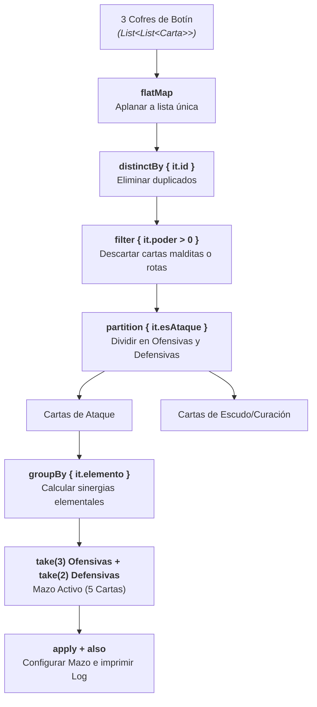

# Bloque 4: Colecciones Funcionales, Mappers y Scope Functions

En este cuarto bloque trabajarás con la biblioteca de operaciones funcionales de Kotlin (`map`, `filter`, `groupBy`, etc.), la inmutabilidad de colecciones y las 5 funciones de ámbito (*Scope Functions*: `let`, `run`, `with`, `apply`, `also`). Estas herramientas son el motor para transformar datos entre capas (patrón **Data Mapper** de Clean Architecture) y estructurar pipelines declarativos sin bucles imperativos.

📁 **Paquete de trabajo:** `package b04_colecciones`  
Ubicación en tu proyecto: `src/main/kotlin/b04_colecciones/`

---

## 🟢 Nivel Básico (Colecciones Inmutables y Filtros)

### Ejercicio 4.1: Inmutabilidad en Listas y el Operador `+`
📄 **Archivo:** `E01_ListasInmutables.kt`

#### 1. Enunciado y Requisitos

1. Declara una lista inmutable `listaJuegos: List<String>` con 3 títulos.

2. En lugar de convertirla a `MutableList` y hacer `add()`, utiliza el operador funcional **`+`** para derivar una nueva lista inmutable que incluya dos juegos adicionales.

3. Utiliza `filterNot` para eliminar un juego específico generando una tercera lista inmutable.

4. Muestra por consola las tres listas comprobando que la lista original no ha cambiado en ningún momento.

#### 2. Salida Esperada en Consola

```text
Original: [Zelda, Metroid, Mario]
Con añadidos: [Zelda, Metroid, Mario, Pokemon, Kirby]
Sin Metroid: [Zelda, Mario, Pokemon, Kirby]
```

#### 3. Solución Comentada
??? tip "Ver solución comentada"
    ```kotlin
    package b04_colecciones

    fun main() {
        val original: List<String> = listOf("Zelda", "Metroid", "Mario")

        // Inmutabilidad: derivamos nuevas listas con operadores funcionales
        val conAnadidos: List<String> = original + listOf("Pokemon", "Kirby")
        val sinMetroid: List<String> = conAnadidos.filterNot { it == "Metroid" }

        println("Original: $original")
        println("Con añadidos: $conAnadidos")
        println("Sin Metroid: $sinMetroid")
    }
    ```

---

### Ejercicio 4.2: Transformaciones con `map` y `filter`
📄 **Archivo:** `E02_MapFilterBasico.kt`

#### 1. Enunciado y Requisitos

Dada una lista de precios brutos en dólares: `val preciosDolares = listOf(15.0, 4.5, 60.0, 8.0, 35.0, 120.0)`

1. Filtra los precios para conservar únicamente los superiores a `10.0` $.

2. Transforma cada precio a euros multiplicándolo por el factor de conversión `0.92`.

3. Convierte cada valor a una cadena formateada con dos decimales y el sufijo `"€"`.

4. Realiza todo el proceso en un único pipeline funcional encadenado.

#### 2. Salida Esperada en Consola

```text
Precios en euros (>10$): [13.80 €, 55.20 €, 32.20 €, 110.40 €]
```

#### 3. Solución Comentada
??? tip "Ver solución comentada"
    ```kotlin
    package b04_colecciones

    fun main() {
        val preciosDolares = listOf(15.0, 4.5, 60.0, 8.0, 35.0, 120.0)

        val preciosEuros = preciosDolares
            .filter { it > 10.0 }
            .map { it * 0.92 }
            .map { "%.2f €".format(it) }

        println("Precios en euros (>10$): $preciosEuros")
    }
    ```

---

### Ejercicio 4.3: Conjuntos (`Set`) para Unicidad y Operaciones Matemáticas
📄 **Archivo:** `E03_ConjuntosYOperaciones.kt`

#### 1. Enunciado y Requisitos

1. Crea una lista con etiquetas (*tags*) duplicadas de una tienda de videojuegos: `listOf("RPG", "Acción", "Indie", "RPG", "Aventura", "Indie")`.

2. Convierte la lista en un `Set<String>` inmutable mediante `.toSet()` para eliminar automáticamente duplicados.

3. Declara otro conjunto con los géneros favoritos de un usuario: `setOf("Acción", "Estrategia", "RPG", "Terror")`.

4. Realiza y muestra las tres operaciones de teoría de conjuntos:

    - **Intersección (`intersect`):** Etiquetas que coinciden en la tienda y en los gustos del usuario.

    - **Unión (`union`):** Todas las etiquetas sin duplicados.

    - **Diferencia (`subtract`):** Etiquetas que le gustan al usuario pero no están en la tienda.

#### 2. Salida Esperada en Consola

```text
Etiquetas únicas tienda: [RPG, Acción, Indie, Aventura]
Géneros favoritos usuario: [Acción, Estrategia, RPG, Terror]
Coincidencias (intersect): [RPG, Acción]
Catálogo combinado (union): [RPG, Acción, Indie, Aventura, Estrategia, Terror]
Pendientes por encontrar (subtract): [Estrategia, Terror]
```

#### 3. Solución Comentada
??? tip "Ver solución comentada"
    ```kotlin
    package b04_colecciones

    fun main() {
        val listaConDuplicados = listOf("RPG", "Acción", "Indie", "RPG", "Aventura", "Indie")
        val tagsTienda: Set<String> = listaConDuplicados.toSet()
        val favoritosUsuario: Set<String> = setOf("Acción", "Estrategia", "RPG", "Terror")

        println("Etiquetas únicas tienda: $tagsTienda")
        println("Géneros favoritos usuario: $favoritosUsuario")

        // Operaciones de conjuntos
        val coincidencias = tagsTienda intersect favoritosUsuario
        val todas = tagsTienda union favoritosUsuario
        val faltantes = favoritosUsuario subtract tagsTienda

        println("Coincidencias (intersect): $coincidencias")
        println("Catálogo combinado (union): $todas")
        println("Pendientes por encontrar (subtract): $faltantes")
    }
    ```

---

### Ejercicio 4.4: Mapas Asociativos (`Map`) y Acceso Seguro
📄 **Archivo:** `E04_MapasYValoresPorDefecto.kt`

#### 1. Enunciado y Requisitos

1. Modela un inventario de munición mediante un mapa inmutable `Map<String, Int>` usando `mapOf("Pistola" to 45, "Escopeta" to 12, "Rifle" to 30)`.

2. Consulta la munición de `"Pistola"` y muestra el resultado.

3. Demuestra el problema de usar el operador de indexación directo `map["Lanzacohetes"]` (devuelve `null`).

4. Utiliza **`getOrDefault`** para consultar el `"Lanzacohetes"` indicando `0` como valor por defecto.

5. Utiliza **`getOrElse`** para calcular una munición de emergencia mediante una lambda si el arma no existe.

#### 2. Salida Esperada en Consola

```text
Munición Pistola: 45
Munición Lanzacohetes (directo): null
Munición Lanzacohetes (getOrDefault): 0
Munición Arco (getOrElse con lógica): 5 (suministro base)
```

#### 3. Solución Comentada
??? tip "Ver solución comentada"
    ```kotlin
    package b04_colecciones

    fun main() {
        val inventario: Map<String, Int> = mapOf(
            "Pistola" to 45,
            "Escopeta" to 12,
            "Rifle" to 30
        )

        println("Munición Pistola: ${inventario["Pistola"]}")
        println("Munición Lanzacohetes (directo): ${inventario["Lanzacohetes"]}")
        println("Munición Lanzacohetes (getOrDefault): ${inventario.getOrDefault("Lanzacohetes", 0)}")

        val municionArco = inventario.getOrElse("Arco") {
            // Se ejecuta solo si la clave no existe
            val baseReserva = 5
            baseReserva
        }
        println("Munición Arco (getOrElse con lógica): $municionArco (suministro base)")
    }
    ```

---

### Ejercicio 4.5: Búsqueda y Predicados (`find`, `any`, `all`, `none`)
📄 **Archivo:** `E05_BusquedaYPredicados.kt`

#### 1. Enunciado y Requisitos

Dada una lista de puntuaciones de jugadores: `val puntuaciones = listOf(120, 85, 450, 990, 310, 60)`

1. Encuentra con **`find`** o **`firstOrNull`** el primer jugador que haya superado los 400 puntos.

2. Utiliza **`any`** para comprobar si algún jugador ha alcanzado una puntuación legendaria (>= 900).

3. Utiliza **`all`** para comprobar si todos los jugadores tienen al menos 50 puntos (superaron el tutorial).

4. Utiliza **`none`** para comprobar que nadie tiene una puntuación negativa (< 0).

5. Imprime un informe claro con los resultados de cada comprobación.

#### 2. Salida Esperada en Consola

```text
Puntuaciones: [120, 85, 450, 990, 310, 60]
Primer jugador > 400 pts: 450
¿Alguien superó los 900 pts? true
¿Todos superaron el tutorial (>= 50 pts)? true
¿Nadie tiene puntuación negativa? true
```

#### 3. Solución Comentada
??? tip "Ver solución comentada"
    ```kotlin
    package b04_colecciones

    fun main() {
        val puntuaciones = listOf(120, 85, 450, 990, 310, 60)

        val primerDestacado = puntuaciones.firstOrNull { it > 400 }
        val hayRangoLegendario = puntuaciones.any { it >= 900 }
        val todosPasaronTutorial = puntuaciones.all { it >= 50 }
        val sinNegativos = puntuaciones.none { it < 0 }

        println("Puntuaciones: $puntuaciones")
        println("Primer jugador > 400 pts: $primerDestacado")
        println("¿Alguien superó los 900 pts? $hayRangoLegendario")
        println("¿Todos superaron el tutorial (>= 50 pts)? $todosPasaronTutorial")
        println("¿Nadie tiene puntuación negativa? $sinNegativos")
    }
    ```

---

## 🟡 Nivel Intermedio (Agrupaciones y Scope Functions)

### Ejercicio 4.6: Agrupación con `groupBy` y Estadísticas
📄 **Archivo:** `E06_GroupByEstadisticas.kt`

#### 1. Enunciado y Requisitos

1. Modela una `data class ItemInventario(val nombre: String, val categoria: String, val valorMonedas: Int)`.

2. Crea una lista con al menos 6 items de diferentes categorías (`"Arma"`, `"Armadura"`, `"Consumible"`).

3. Utiliza **`groupBy`** para organizar los elementos por su categoría en un `Map<String, List<ItemInventario>>`.

4. Recorre el mapa calculando la suma total del valor en monedas de los items de cada categoría mediante `.sumOf { it.valorMonedas }`.

#### 2. Salida Esperada en Consola

```text
=== RESUMEN POR CATEGORÍA ===
Categoría: Arma (2 items) -> Valor total: 450 monedas
Categoría: Armadura (2 items) -> Valor total: 600 monedas
Categoría: Consumible (2 items) -> Valor total: 80 monedas
```

#### 3. Solución Comentada
??? tip "Ver solución comentada"
    ```kotlin
    package b04_colecciones

    data class ItemInventario(val nombre: String, val categoria: String, val valorMonedas: Int)

    fun main() {
        val inventario = listOf(
            ItemInventario("Espada Maestra", "Arma", 350),
            ItemInventario("Arco de Madera", "Arma", 100),
            ItemInventario("Escudo Hyliano", "Armadura", 400),
            ItemInventario("Casco de Hierro", "Armadura", 200),
            ItemInventario("Poción de Vida", "Consumible", 50),
            ItemInventario("Elixir de Maná", "Consumible", 30)
        )

        val porCategoria: Map<String, List<ItemInventario>> = inventario.groupBy { it.categoria }

        println("=== RESUMEN POR CATEGORÍA ===")
        porCategoria.forEach { (cat, items) ->
            val totalValor = items.sumOf { it.valorMonedas }
            println("Categoría: $cat (${items.size} items) -> Valor total: $totalValor monedas")
        }
    }
    ```

---

### Ejercicio 4.7: `partition` y Ordenación Funcional
📄 **Archivo:** `E07_PartitionYSorted.kt`

#### 1. Enunciado y Requisitos

Dada una lista de usuarios registrados:
`data class Usuario(val username: String, val horasJugadas: Int, val esPremium: Boolean)`

1. Crea una lista de al menos 5 usuarios mezclando cuentas normales y premium.

2. Utiliza **`partition`** con desestructuración `val (premiums, estandar) = ...` para dividir la lista en una sola pasada.

3. Ordena a los usuarios premium de mayor a menor horas jugadas utilizando `sortedByDescending { it.horasJugadas }`.

4. Imprime el resultado de ambos grupos.

#### 2. Salida Esperada en Consola

```text
--- USUARIOS PREMIUM (Ordenados por horas) ---
1. ShadowLink: 240 horas
2. ZeldaFan: 150 horas
3. PixelMaster: 45 horas

--- USUARIOS ESTÁNDAR ---
Total cuentas gratuitas: 2
```

#### 3. Solución Comentada
??? tip "Ver solución comentada"
    ```kotlin
    package b04_colecciones

    data class Usuario(val username: String, val horasJugadas: Int, val esPremium: Boolean)

    fun main() {
        val usuarios = listOf(
            Usuario("ZeldaFan", 150, true),
            Usuario("Novato2026", 12, false),
            Usuario("ShadowLink", 240, true),
            Usuario("CasualPlayer", 5, false),
            Usuario("PixelMaster", 45, true)
        )

        // Dividimos en dos listas en una sola pasada
        val (premiums, estandar) = usuarios.partition { it.esPremium }

        val premiumsOrdenados = premiums.sortedByDescending { it.horasJugadas }

        println("--- USUARIOS PREMIUM (Ordenados por horas) ---")
        premiumsOrdenados.forEachIndexed { i, u ->
            println("${i + 1}. ${u.username}: ${u.horasJugadas} horas")
        }

        println("\n--- USUARIOS ESTÁNDAR ---")
        println("Total cuentas gratuitas: ${estandar.size}")
    }
    ```

---

### Ejercicio 4.8: Indexación Eficiente con `associateBy` y `associateWith`
📄 **Archivo:** `E08_AssociateByYWith.kt`

#### 1. Enunciado y Requisitos

En aplicaciones Android frecuentemente recibimos listas de la API y necesitamos convertirlas a mapas indexados por clave primaria (ID) para búsquedas de complejidad $O(1)$ en repositorios o caché.

1. Modela una `data class Personaje(val id: String, val nombre: String, val nivel: Int)`.

2. Crea una lista de personajes: `[Personaje("P-01", "Geralt", 50), Personaje("P-02", "Ciri", 45), Personaje("P-03", "Yennefer", 60)]`.

3. Utiliza **`associateBy { it.id }`** para indexar la lista en un `Map<String, Personaje>`.

4. Dado un conjunto de IDs buscados `setOf("P-02", "P-99")`, busca cada uno en el mapa y comprueba su existencia instantánea.

5. Utiliza **`associateWith`** para crear un mapa que asocie cada ID con su estado de carga inicial (`"CARGADO"`).

#### 2. Salida Esperada en Consola

```text
Mapa indexado por ID:
P-01 -> Geralt (Nvl 50)
P-02 -> Ciri (Nvl 45)
P-03 -> Yennefer (Nvl 60)

Búsqueda instantánea de P-02: Ciri
Búsqueda instantánea de P-99: No encontrado en caché
Estados iniciales: {P-02=CARGADO, P-99=CARGADO}
```

#### 3. Solución Comentada
??? tip "Ver solución comentada"
    ```kotlin
    package b04_colecciones

    data class Personaje(val id: String, val nombre: String, val nivel: Int)

    fun main() {
        val lista = listOf(
            Personaje("P-01", "Geralt", 50),
            Personaje("P-02", "Ciri", 45),
            Personaje("P-03", "Yennefer", 60)
        )

        // Indexación por clave primaria (ID -> Personaje)
        val mapaPorId: Map<String, Personaje> = lista.associateBy { it.id }

        println("Mapa indexado por ID:")
        mapaPorId.forEach { (id, p) -> println("$id -> ${p.nombre} (Nvl ${p.nivel})") }

        println("\nBúsqueda instantánea de P-02: ${mapaPorId["P-02"]?.nombre ?: "No encontrado"}")
        println("Búsqueda instantánea de P-99: ${mapaPorId["P-99"]?.nombre ?: "No encontrado en caché"}")

        val idsConsultados = setOf("P-02", "P-99")
        val estados = idsConsultados.associateWith { "CARGADO" }
        println("Estados iniciales: $estados")
    }
    ```

---

### Ejercicio 4.9: Aplanado de Jerarquías con `flatten` y `flatMap`
📄 **Archivo:** `E09_FlattenYFlatMap.kt`

#### 1. Enunciado y Requisitos

1. Modela una `data class Desarrolladora(val nombre: String, val juegosLanzados: List<String>)`.

2. Crea una lista con 3 estudios de videojuegos (ej. Nintendo, FromSoftware, IndieStudio), cada uno con 2 o 3 juegos en su lista interna.

3. Utiliza **`flatMap`** para extraer todos los títulos de todos los estudios en una única lista plana de cadenas `List<String>`.

4. Aplica `.distinct()` sobre la lista resultante para asegurarte de que no haya títulos repetidos.

5. Ordena alfabéticamente la lista y muéstrala.

#### 2. Salida Esperada en Consola

```text
=== CATÁLOGO GLOBAL UNIFICADO (FLATMAP) ===
- Animal Crossing
- Dark Souls
- Elden Ring
- Hollow Knight
- Mario Odyssey
- Zelda Tears of the Kingdom
```

#### 3. Solución Comentada
??? tip "Ver solución comentada"
    ```kotlin
    package b04_colecciones

    data class Desarrolladora(val nombre: String, val juegosLanzados: List<String>)

    fun main() {
        val estudios = listOf(
            Desarrolladora("Nintendo", listOf("Zelda Tears of the Kingdom", "Mario Odyssey", "Animal Crossing")),
            Desarrolladora("FromSoftware", listOf("Elden Ring", "Dark Souls")),
            Desarrolladora("Team Cherry", listOf("Hollow Knight"))
        )

        // Aplanamos la lista de listas en una sola secuencia de títulos
        val catalogoUnificado = estudios
            .flatMap { it.juegosLanzados }
            .distinct()
            .sorted()

        println("=== CATÁLOGO GLOBAL UNIFICADO (FLATMAP) ===")
        catalogoUnificado.forEach { println("- $it") }
    }
    ```

---

### Ejercicio 4.10: Configuración de Objetos con `apply` y Trazas con `also`
📄 **Archivo:** `E10_ScopeFunctionsApplyAlso.kt`

#### 1. Enunciado y Requisitos

1. Modela una clase mutable `ConfiguracionJuego` con propiedades `volumenMusica: Int = 100`, `brillo: Int = 50`, `subtitulos: Boolean = false`.

2. Utiliza la función de ámbito **`apply`** para instanciar y configurar el objeto en un bloque expresivo sin repetir el nombre de la variable (`this` implícito).

3. Encadena inmediatamente una llamada a **`also`** para imprimir un log de auditoría (*side-effect*) que confirme la creación del objeto sin modificarlo.

4. Imprime el estado final del objeto configurado.

#### 2. Salida Esperada en Consola

```text
[LOG]: Configuración instanciada correctamente en memoria.
Estado final -> Volumen: 75, Brillo: 80, Subtítulos: true
```

#### 3. Solución Comentada
??? tip "Ver solución comentada"
    ```kotlin
    package b04_colecciones

    class ConfiguracionJuego {
        var volumenMusica: Int = 100
        var brillo: Int = 50
        var subtitulos: Boolean = false

        override fun toString(): String =
            "Volumen: $volumenMusica, Brillo: $brillo, Subtítulos: $subtitulos"
    }

    fun main() {
        // apply ejecuta configuración sobre el receptor (this) y lo devuelve
        // also ejecuta efectos secundarios (it) y devuelve el mismo objeto
        val config = ConfiguracionJuego().apply {
            volumenMusica = 75
            brillo = 80
            subtitulos = true
        }.also {
            println("[LOG]: Configuración instanciada correctamente en memoria.")
        }

        println("Estado final -> $config")
    }
    ```

---

## 🔴 Nivel Avanzado (Arquitectura Limpia y Analítica)

### Ejercicio 4.11: Transformación DTO a Dominio con `run` y `let` (Data Mapper)
📄 **Archivo:** `E11_MapperDtoADominio.kt`

#### 1. Enunciado y Requisitos

En Android Clean Architecture, los datos crudos que llegan de la red (Retrofit DTO) contienen campos nulos o formatos no aptos para la UI. Deben transformarse a modelos de Dominio limpios.

1. Declara el modelo de red `data class VideojuegoDto(val id_api: Long?, val raw_title: String?, val score_percent: Int?)`.

2. Declara el modelo limpio de dominio `data class Videojuego(val id: Long, val titulo: String, val puntuacionSobreDiez: Double)`.

3. Crea una función de extensión `fun VideojuegoDto.toDomain(): Videojuego?`.

4. Dentro de la función, utiliza **`let`** y el operador Elvis para validar que si `id_api` o `raw_title` son nulos, la función devuelva `null`.

5. Utiliza **`run`** para construir el objeto final calculando la nota sobre 10 dividiendo `score_percent` entre `10.0`.

#### 2. Salida Esperada en Consola

```text
DTO Válido transformado: Videojuego(id=101, titulo=Silksong, puntuacionSobreDiez=9.8)
DTO Inválido transformado: null
```

#### 3. Solución Comentada
??? tip "Ver solución comentada"
    ```kotlin
    package b04_colecciones

    // Modelo de datos de la API (Retrofit DTO)
    data class VideojuegoDto(
        val id_api: Long?,
        val raw_title: String?,
        val score_percent: Int?
    )

    // Modelo puro de Dominio para la app Android
    data class Videojuego(
        val id: Long,
        val titulo: String,
        val puntuacionSobreDiez: Double
    )

    // Mapper utilizando Scope Functions
    fun VideojuegoDto.toDomain(): Videojuego? {
        val validId = this.id_api ?: return null
        val validTitle = this.raw_title ?: return null

        return this.run {
            val nota = (score_percent ?: 0) / 10.0
            Videojuego(
                id = validId,
                titulo = validTitle.trim(),
                puntuacionSobreDiez = nota
            )
        }
    }

    fun main() {
        val dtoValido = VideojuegoDto(101L, "  Silksong  ", 98)
        val dtoInvalido = VideojuegoDto(null, "Juego Fantasma", 50)

        println("DTO Válido transformado: ${dtoValido.toDomain()}")
        println("DTO Inválido transformado: ${dtoInvalido.toDomain()}")
    }
    ```

---

### Ejercicio 4.12: Pipeline Funcional Completo: Analítica de Sesiones
📄 **Archivo:** `E12_PipelineAnaliticaCompleta.kt`

#### 1. Enunciado y Requisitos

Modela una sesión de juego:
`data class SesionJuego(val usuarioId: String, val juego: String, val minutos: Int, val completado: Boolean)`

Dada una lista con al menos 8 registros de sesiones de diferentes usuarios y juegos:

1. Filtra las sesiones que duren al menos 15 minutos (descartar sesiones erróneas o abandonos inmediatos).

2. Agrupa por nombre del `juego`.

3. Para cada juego, calcula:

    - Total de minutos acumulados por todos los usuarios.

    - Porcentaje de partidas completadas con éxito.

4. Transforma los resultados a una lista de resúmenes y ordénalos de mayor a menor tiempo jugado total.

#### 2. Salida Esperada en Consola

```text
=== RANKING DE JUEGOS MÁS POPULARES ===
1. Elden Ring -> 320 min totales | Éxito: 33.3%
2. Hollow Knight -> 180 min totales | Éxito: 50.0%
3. Celeste -> 45 min totales | Éxito: 100.0%
```

#### 3. Solución Comentada
??? tip "Ver solución comentada"
    ```kotlin
    package b04_colecciones

    data class SesionJuego(
        val usuarioId: String,
        val juego: String,
        val minutos: Int,
        val completado: Boolean
    )

    data class ResumenJuego(
        val juego: String,
        val minutosTotales: Int,
        val porcentajeExito: Double
    )

    fun main() {
        val sesiones = listOf(
            SesionJuego("U1", "Elden Ring", 120, false),
            SesionJuego("U2", "Elden Ring", 150, true),
            SesionJuego("U3", "Elden Ring", 50, false),
            SesionJuego("U1", "Hollow Knight", 90, true),
            SesionJuego("U4", "Hollow Knight", 90, false),
            SesionJuego("U2", "Celeste", 45, true),
            SesionJuego("U3", "Celeste", 8, true) // Descartada (<15 min)
        )

        val ranking: List<ResumenJuego> = sesiones
            .filter { it.minutos >= 15 }
            .groupBy { it.juego }
            .map { (juego, lista) ->
                val totalMin = lista.sumOf { it.minutos }
                val exitos = lista.count { it.completado }
                val porcentaje = (exitos.toDouble() / lista.size) * 100.0
                ResumenJuego(juego, totalMin, porcentaje)
            }
            .sortedByDescending { it.minutosTotales }

        println("=== RANKING DE JUEGOS MÁS POPULARES ===")
        ranking.forEachIndexed { i, r ->
            println("${i + 1}. ${r.juego} -> ${r.minutosTotales} min totales | Éxito: ${"%.1f".format(r.porcentajeExito)}%")
        }
    }
    ```

---

### Reto 4.13: Deck Builder RPG (*Simulador de Saqueo y Forja de Mazo*)
📄 **Archivo:** `Reto04_DeckBuilder.kt`

#### 1. Contexto y Objetivos

Vas a programar el motor de gestión de cartas para un juego de construcción de mazos (*Deck Builder RPG*). El reto consiste en procesar el botín obtenido al derrotar a varios jefes de mazmorra, transformando, limpiando, agrupando y seleccionando las mejores cartas **mediante pipelines 100% funcionales (sin un solo bucle `for` tradicional)**.

#### 2. Modelo Mental del Reto (Pipeline Funcional de Transformación)

Visualiza el flujo continuo de datos por el que viajan las cartas desde los cofres hasta el mazo definitivo:



#### 3. Preguntas de Reflexión (Aprender a Pensar)

- **¿Por qué `flatMap` y no `map`?** Si usas `map`, obtendrás una `List<List<Carta>>`. `flatMap` extrae los elementos internos concatenándolos en una única secuencia plana `List<Carta>`.
- **¿Por qué `distinctBy`?** Dos cartas pueden tener el mismo identificador si cayeron en cofres distintos. `distinctBy { it.id }` asegura unicidad sin tener que implementar `.equals()` y `.hashCode()` manualmente.
- **¿Cómo reemplazar un bucle acumulador de daño?** La función `.sumOf { it.poder }` suma valores numéricos de una colección de forma idiomática y sin variables acumuladoras mutables.

#### 4. Requisitos Funcionales

1. Modela una carta:
   `data class Carta(val id: String, val nombre: String, val elemento: String, val poder: Int, val esAtaque: Boolean)`

2. Recibe 3 cofres (listas de cartas) con al menos 9 cartas en total, incluyendo duplicados por ID y al menos una carta maldita con `poder <= 0`.

3. Aplica un pipeline funcional que:

    - Aplane los 3 cofres en una única lista mediante **`flatMap`**.

    - Elimine duplicados con **`distinctBy { it.id }`**.

    - Descarte cartas con `poder <= 0` mediante **`filter`**.

    - Divida las cartas en dos grupos (**Ofensivas** y **Defensivas**) mediante **`partition`**.

    - Agrupe las cartas ofensivas por su `elemento` (**`groupBy`**) y calcule la suma total de daño por cada elemento (`sumOf`).

4. Selecciona las 3 mejores cartas ofensivas y las 2 mejores defensivas (ordenadas por poder descendente) y combínalas en el **Mazo de Combate (5 cartas)**.

5. Empaqueta el mazo en una clase `MazoCombate` configurada mediante **`apply`** y muestra una traza de auditoría con **`also`**.

#### 5. Pistas Progresivas de Ayuda

??? tip "💡 Pista 1: Aplanar colecciones anidadas con `flatMap`"
    Si tienes `val cofres = listOf(cofre1, cofre2, cofre3)`, puedes aplanarlos directamente:
    ```kotlin
    val todasLasCartas = cofres.flatMap { it }
    ```

??? tip "💡 Pista 2: Agrupación y Sumas con `sumOf`"
    Para calcular el poder total por cada elemento a partir de un mapa agrupado:
    ```kotlin
    val sinergias = ofensivas.groupBy { it.elemento }.mapValues { (_, cartas) ->
        cartas.sumOf { it.poder }
    }
    ```

??? tip "💡 Pista 3: Construcción del Mazo con `apply` y `also`"
    Combina las listas filtradas y envuélvelas:
    ```kotlin
    val mazoDefinitivo = (topOfensivas + topDefensivas).also {
        println("[LOG AUDITORÍA]: Mazo de 5 cartas sellado para la batalla.")
    }
    ```

#### 6. Salida Esperada en Consola

```text
=== SIMULADOR DE SAQUEO: DECK BUILDER RPG ===
Botín inicial recogido en 3 cofres: 9 cartas.
Tras eliminar duplicados y cartas malditas: 7 cartas válidas.

--- ANÁLISIS DE SINERGIAS ELEMENTALES (ATAQUE) ---
Elemento Fuego: 155 pts de daño total (2 cartas)
Elemento Hielo: 65 pts de daño total (1 cartas)
Elemento Rayo: 80 pts de daño total (1 cartas)

[LOG AUDITORÍA]: Mazo de 5 cartas sellado y validado con éxito.

--- MAZO FINAL DE COMBATE (TOP 5) ---
1. [ATAQUE - Fuego] Meteoro Ígneo (Poder: 90)
2. [ATAQUE - Rayo] Rayo Fulminante (Poder: 80)
3. [ATAQUE - Fuego] Bola de Fuego (Poder: 65)
4. [DEFENSA - Hielo] Muro de Hielo (Poder: 70)
5. [DEFENSA - Luz] Escudo Divino (Poder: 50)
Poder total del mazo: 355 pts
```

#### 7. Solución Comentada
??? tip "Ver solución comentada paso a paso"
    ```kotlin
    package b04_colecciones

    data class Carta(
        val id: String,
        val nombre: String,
        val elemento: String,
        val poder: Int,
        val esAtaque: Boolean
    )

    class MazoCombate {
        var cartas: List<Carta> = emptyList()
        val poderTotal: Int
            get() = cartas.sumOf { it.poder }
    }

    fun main() {
        println("=== SIMULADOR DE SAQUEO: DECK BUILDER RPG ===")

        // 3 cofres de botín
        val cofre1 = listOf(
            Carta("C-01", "Bola de Fuego", "Fuego", 65, true),
            Carta("C-02", "Muro de Hielo", "Hielo", 70, false),
            Carta("C-03", "Maldición Oscura", "Sombra", -20, true) // Maldita
        )

        val cofre2 = listOf(
            Carta("C-01", "Bola de Fuego", "Fuego", 65, true), // Duplicada
            Carta("C-04", "Rayo Fulminante", "Rayo", 80, true),
            Carta("C-05", "Meteoro Ígneo", "Fuego", 90, true)
        )

        val cofre3 = listOf(
            Carta("C-06", "Escudo Divino", "Luz", 50, false),
            Carta("C-07", "Ventisca Glacial", "Hielo", 65, true),
            Carta("C-08", "Poción Rota", "Neutro", 0, false) // Rota
        )

        val todosLosCofres = listOf(cofre1, cofre2, cofre3)
        println("Botín inicial recogido en 3 cofres: ${todosLosCofres.sumOf { it.size }} cartas.")

        // PIPELINE FUNCIONAL:
        val cartasValidas = todosLosCofres
            .flatMap { it }
            .distinctBy { it.id }
            .filter { it.poder > 0 }

        println("Tras eliminar duplicados y cartas malditas: ${cartasValidas.size} cartas válidas.\n")

        // Dividimos en ataque y defensa en una pasada
        val (ofensivas, defensivas) = cartasValidas.partition { it.esAtaque }

        // Sinergias por elemento
        println("--- ANÁLISIS DE SINERGIAS ELEMENTALES (ATAQUE) ---")
        val porElemento = ofensivas.groupBy { it.elemento }
        porElemento.forEach { (elem, lista) ->
            val totalPoder = lista.sumOf { it.poder }
            println("Elemento $elem: $totalPoder pts de daño total (${lista.size} cartas)")
        }

        // Selección del Top 3 de ataque y Top 2 de defensa
        val topAtaque = ofensivas.sortedByDescending { it.poder }.take(3)
        val topDefensa = defensivas.sortedByDescending { it.poder }.take(2)

        // Ensamblado del mazo con Scope Functions: apply y also
        val mazo = MazoCombate().apply {
            cartas = topAtaque + topDefensa
        }.also {
            println("\n[LOG AUDITORÍA]: Mazo de ${it.cartas.size} cartas sellado y validado con éxito.")
        }

        println("\n--- MAZO FINAL DE COMBATE (TOP 5) ---")
        mazo.cartas.forEachIndexed { i, c ->
            val rol = if (c.esAtaque) "ATAQUE" else "DEFENSA"
            println("${i + 1}. [$rol - ${c.elemento}] ${c.nombre} (Poder: ${c.poder})")
        }
        println("Poder total del mazo: ${mazo.poderTotal} pts")
    }
    ```

