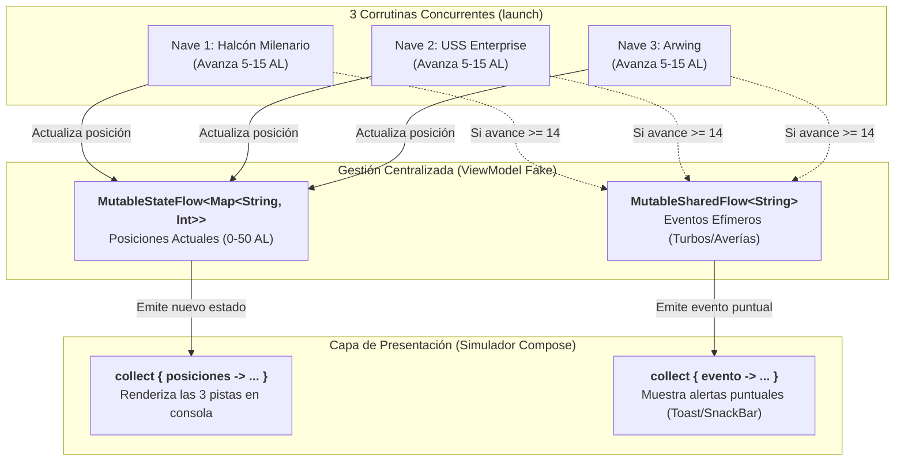

# Bloque 5: Asincronía, Corrutinas y Kotlin Flows

En este quinto bloque te enfrentarás a la **programación asíncrona no bloqueante**, imprescindible para no congelar la pantalla en Android (evitando errores ANR - *Application Not Responding*). Aprenderás a utilizar `suspend fun`, constructores de corrutinas (`launch`, `async`), cambio de hilos con `withContext` y flujos reactivos de datos con **`Flow`**, **`StateFlow`** y **`SharedFlow`**.

📁 **Paquete de trabajo:** `package b05_corrutinas`  
Ubicación en tu proyecto: `src/main/kotlin/b05_corrutinas/`

---

## 🟢 Nivel Básico (Suspensión, Builders y Flows Simples)

### Ejercicio 5.1: Funciones de Suspensión con `delay()`
📄 **Archivo:** `E01_SuspendFunDelay.kt`

#### 1. Enunciado y Requisitos

1. Crea una función de suspensión `simularCargaServidor(tarea: String, duracionMs: Long): String`.

2. Dentro de la función, imprime el inicio de la tarea, espera de forma no bloqueante usando `delay(duracionMs)` y devuelve un mensaje de confirmación con el nombre de la tarea completada.

3. Invoca la función dos veces secuencialmente desde un bloque `runBlocking` en `main()`.

#### 2. Salida Esperada en Consola

```text
[INICIO]: Conectando con servidor de base de datos...
-> Completado: Conectando con servidor de base de datos en 1000 ms
[INICIO]: Sincronizando catálogo de juegos...
-> Completado: Sincronizando catálogo de juegos en 1500 ms
```

#### 3. Solución Comentada
??? tip "Ver solución comentada"
    ```kotlin
    package b05_corrutinas

    import kotlinx.coroutines.delay
    import kotlinx.coroutines.runBlocking

    suspend fun simularCargaServidor(tarea: String, duracionMs: Long): String {
        println("[INICIO]: $tarea...")
        delay(duracionMs) // Pausa asíncrona cooperativa (no bloquea el hilo)
        return "-> Completado: $tarea en $duracionMs ms"
    }

    fun main() = runBlocking {
        val r1 = simularCargaServidor("Conectando con servidor de base de datos", 1000)
        println(r1)

        val r2 = simularCargaServidor("Sincronizando catálogo de juegos", 1500)
        println(r2)
    }
    ```

---

### Ejercicio 5.2: `launch` para Tareas en Segundo Plano
📄 **Archivo:** `E02_LaunchFireAndForget.kt`

#### 1. Enunciado y Requisitos

1. En Android es común enviar analíticas de uso a servidores en segundo plano sin detener la ejecución de la UI (*Fire and Forget*).

2. Utiliza `launch` dentro de un `runBlocking` para lanzar una tarea que tarde 800 ms en enviar un log simulado.

3. Comprueba que el código principal continúa ejecutándose inmediatamente sin esperar a que el `launch` finalice.

#### 2. Salida Esperada en Consola

```text
Hilo principal: Usuario ha pulsado el botón 'Ver Detalles'
Hilo principal: Abriendo pantalla inmediatamente...
[SEGUNDO PLANO]: Analítica enviada a Google Analytics (800 ms después)
```

#### 3. Solución Comentada
??? tip "Ver solución comentada"
    ```kotlin
    package b05_corrutinas

    import kotlinx.coroutines.delay
    import kotlinx.coroutines.launch
    import kotlinx.coroutines.runBlocking

    fun main() = runBlocking {
        // Lanzamos la corrutina en segundo plano sin bloquear el flujo principal
        launch {
            delay(800)
            println("[SEGUNDO PLANO]: Analítica enviada a Google Analytics (800 ms después)")
        }

        println("Hilo principal: Usuario ha pulsado el botón 'Ver Detalles'")
        println("Hilo principal: Abriendo pantalla inmediatamente...")

        // runBlocking espera activamente a que todas las corrutinas hijas finalicen antes de cerrar la JVM
    }
    ```

---

### Ejercicio 5.3: Múltiples Tareas Concurrentes con `join()`
📄 **Archivo:** `E03_MultiplesLaunchJoin.kt`

#### 1. Enunciado y Requisitos

1. Simula la precarga simultánea de dos recursos pesados en un juego móvil:

    - Descarga de texturas (tarda 1200 ms).

    - Descarga de efectos de sonido (tarda 700 ms).

2. Inicia ambas descargas concurrentemente en corrutinas separadas mediante `launch`, guardando las referencias `Job`.

3. Utiliza `job1.join()` y `job2.join()` para suspender la ejecución hasta que ambas descargas hayan concluido antes de iniciar la partida.

4. Mide o muestra el orden de finalización (el audio terminará antes aunque se haya iniciado a la vez).

#### 2. Salida Esperada en Consola

```text
Iniciando precarga paralela de assets...
[AUDIO] Efectos de sonido descargados (700 ms)
[TEXTURAS] Texturas de alta definición listas (1200 ms)
¡Todos los assets listos! Entrando a la pantalla de juego.
```

#### 3. Solución Comentada
??? tip "Ver solución comentada"
    ```kotlin
    package b05_corrutinas

    import kotlinx.coroutines.delay
    import kotlinx.coroutines.launch
    import kotlinx.coroutines.runBlocking

    fun main() = runBlocking {
        println("Iniciando precarga paralela de assets...")

        val jobTexturas = launch {
            delay(1200)
            println("[TEXTURAS] Texturas de alta definición listas (1200 ms)")
        }

        val jobAudio = launch {
            delay(700)
            println("[AUDIO] Efectos de sonido descargados (700 ms)")
        }

        // Esperamos explícitamente a que ambos trabajos terminen
        jobTexturas.join()
        jobAudio.join()

        println("¡Todos los assets listos! Entrando a la pantalla de juego.")
    }
    ```

---

### Ejercicio 5.4: Emisión y Recolección Básica de un `Flow`
📄 **Archivo:** `E04_FlowBasicoEmision.kt`

#### 1. Enunciado y Requisitos

1. Crea una función `obtenerProgresoDescarga(): Flow<Int>` utilizando el builder **`flow { ... }`**.

2. La función debe emitir valores del 20 en 20 (`20`, `40`, `60`, `80`, `100`) pausando 300 ms entre cada emisión con `delay()`.

3. En `main()`, dentro de `runBlocking`, consume el flujo mediante el operador terminal **`.collect { ... }`**.

4. Imprime una barra de progreso textual con cada valor recibido.

#### 2. Salida Esperada en Consola

```text
Iniciando descarga de parche...
Progreso recibido: [==                  ] 20%
Progreso recibido: [====                ] 40%
Progreso recibido: [======              ] 60%
Progreso recibido: [========            ] 80%
Progreso recibido: [==========          ] 100%
¡Parche descargado e instalado con éxito!
```

#### 3. Solución Comentada
??? tip "Ver solución comentada"
    ```kotlin
    package b05_corrutinas

    import kotlinx.coroutines.delay
    import kotlinx.coroutines.flow.Flow
    import kotlinx.coroutines.flow.flow
    import kotlinx.coroutines.runBlocking

    fun obtenerProgresoDescarga(): Flow<Int> = flow {
        for (progreso in 20..100 step 20) {
            delay(300) // Simula la transferencia de datos por red
            emit(progreso) // Emite un valor reactivo al recolector
        }
    }

    fun main() = runBlocking {
        println("Iniciando descarga de parche...")

        obtenerProgresoDescarga().collect { valor ->
            val barras = "=".repeat(valor / 10)
            val espacios = " ".repeat(10 - (valor / 10))
            println("Progreso recibido: [$barras$espacios] $valor%")
        }

        println("¡Parche descargado e instalado con éxito!")
    }
    ```

---

### Ejercicio 5.5: Operadores de Transformación en Flow (`map`, `filter`, `take`)
📄 **Archivo:** `E05_OperadoresFlow.kt`

#### 1. Enunciado y Requisitos

1. Modela un sensor de pulsaciones por minuto (PPM) en un smartwatch deportivo que emite una lectura cada 200 ms: `val sensorFlow = flowOf(65, 72, 85, 120, 135, 142, 110, 95)`.

2. Aplica **`filter`** para descartar lecturas en reposo (menores o iguales a 80 PPM).

3. Aplica **`map`** para clasificar la zona de esfuerzo:

    - Mayor a 130: `"Zona Anaeróbica / Máximo esfuerzo"`

    - En otro caso: `"Zona Aeróbica / Quema de grasas"`

4. Aplica **`take(3)`** para finalizar la suscripción tras procesar las 3 primeras alertas de esfuerzo activo.

5. Recolecta con `.collect` mostrando la alerta formateada.

#### 2. Salida Esperada en Consola

```text
[ALERTA CARDIO]: 85 PPM -> Zona Aeróbica / Quema de grasas
[ALERTA CARDIO]: 120 PPM -> Zona Aeróbica / Quema de grasas
[ALERTA CARDIO]: 135 PPM -> Zona Anaeróbica / Máximo esfuerzo
Monitorización finalizada tras 3 alertas de actividad.
```

#### 3. Solución Comentada
??? tip "Ver solución comentada"
    ```kotlin
    package b05_corrutinas

    import kotlinx.coroutines.flow.asFlow
    import kotlinx.coroutines.flow.filter
    import kotlinx.coroutines.flow.map
    import kotlinx.coroutines.flow.take
    import kotlinx.coroutines.runBlocking

    fun main() = runBlocking {
        val sensorPpm = listOf(65, 72, 85, 120, 135, 142, 110, 95).asFlow()

        sensorPpm
            .filter { it > 80 }
            .map { ppm ->
                val zona = if (ppm > 130) "Zona Anaeróbica / Máximo esfuerzo" else "Zona Aeróbica / Quema de grasas"
                "[ALERTA CARDIO]: $ppm PPM -> $zona"
            }
            .take(3)
            .collect { alerta ->
                println(alerta)
            }

        println("Monitorización finalizada tras 3 alertas de actividad.")
    }
    ```

---

## 🟡 Nivel Intermedio (Concurrencia, Despachadores y StateFlow)

### Ejercicio 5.6: Paralelismo con `async` y `await`
📄 **Archivo:** `E06_AsyncAwaitParalelo.kt`

#### 1. Enunciado y Requisitos

1. Crea dos funciones de suspensión simulando dos peticiones de red independientes:

    - `obtenerPerfilUsuario(): String` (tarda 1000 ms).

    - `obtenerListaAmigos(): List<String>` (tarda 1000 ms).

2. Si las ejecutas secuencialmente tardarían 2000 ms en completarse.

3. Utiliza **`async`** para disparar ambas peticiones en paralelo.

4. Espera sus resultados con **`.await()`** y muestra el tiempo total empleado (debe ser aproximadamente ~1000 ms, no 2000 ms).

#### 2. Salida Esperada en Consola

```text
Iniciando peticiones en paralelo...
Perfil: Link | Amigos: [Zelda, Daruk, Mipha]
Tiempo total transcurrido: ~1050 ms (¡Paralelismo real!)
```

#### 3. Solución Comentada
??? tip "Ver solución comentada"
    ```kotlin
    package b05_corrutinas

    import kotlinx.coroutines.async
    import kotlinx.coroutines.delay
    import kotlinx.coroutines.runBlocking
    import kotlin.system.measureTimeMillis

    suspend fun obtenerPerfilUsuario(): String {
        delay(1000)
        return "Link"
    }

    suspend fun obtenerListaAmigos(): List<String> {
        delay(1000)
        return listOf("Zelda", "Daruk", "Mipha")
    }

    fun main() = runBlocking {
        val tiempoTotal = measureTimeMillis {
            println("Iniciando peticiones en paralelo...")

            // Disparamos ambas tareas en paralelo:
            val diferidoPerfil = async { obtenerPerfilUsuario() }
            val diferidoAmigos = async { obtenerListaAmigos() }

            // Obtenemos los resultados cuando ambas concluyen:
            val perfil = diferidoPerfil.await()
            val amigos = diferidoAmigos.await()

            println("Perfil: $perfil | Amigos: $amigos")
        }

        println("Tiempo total transcurrido: ~$tiempoTotal ms (¡Paralelismo real!)")
    }
    ```

---

### Ejercicio 5.7: Cambio Seguro de Hilos con `withContext(Dispatchers.IO)`
📄 **Archivo:** `E07_DispatchersWithContext.kt`

#### 1. Enunciado y Requisitos

En Android está terminantemente prohibido acceder a disco o bases de datos SQLite/Room en el hilo principal (`Main`).

1. Crea una función de suspensión `leerConfiguracionLocal(): String`.

2. Dentro de la función, utiliza **`withContext(Dispatchers.IO)`** para forzar que la lectura de disco se ejecute en el pool de hilos de entrada/salida.

3. Imprime por consola el nombre del hilo actual (`Thread.currentThread().name`) antes de entrar al `withContext`, dentro de él, y después de salir.

#### 2. Salida Esperada en Consola

```text
Antes de la llamada -> Hilo: main
[DISCO]: Leyendo config.json -> Hilo: DefaultDispatcher-worker-1
De vuelta en la UI -> Hilo: main
Configuración recuperada: {"tema": "oscuro", "notificaciones": true}
```

#### 3. Solución Comentada
??? tip "Ver solución comentada"
    ```kotlin
    package b05_corrutinas

    import kotlinx.coroutines.Dispatchers
    import kotlinx.coroutines.delay
    import kotlinx.coroutines.runBlocking
    import kotlinx.coroutines.withContext

    suspend fun leerConfiguracionLocal(): String {
        // Cambiamos el contexto de ejecución al despachador de Entrada/Salida
        return withContext(Dispatchers.IO) {
            println("[DISCO]: Leyendo config.json -> Hilo: ${Thread.currentThread().name}")
            delay(400) // Simula la latencia del disco
            """{"tema": "oscuro", "notificaciones": true}"""
        }
    }

    fun main() = runBlocking {
        println("Antes de la llamada -> Hilo: ${Thread.currentThread().name}")

        val resultado = leerConfiguracionLocal()

        println("De vuelta en la UI -> Hilo: ${Thread.currentThread().name}")
        println("Configuración recuperada: $resultado")
    }
    ```

---

### Ejercicio 5.8: Manejo Seguro de Excepciones en Corrutinas
📄 **Archivo:** `E08_ExcepcionesEnCorrutinas.kt`

#### 1. Enunciado y Requisitos

1. Modela una función de suspensión `consultarServidorApi(idPartida: Int): String` que lance una excepción `IllegalStateException("Servidor 503: Servicio No Disponible")` si `idPartida == 99`.

2. En `main()`, dentro de un bloque `runBlocking`, invoca la función para dos partidas (`id: 1` e `id: 99`).

3. Utiliza la construcción idiomática **`runCatching { ... }`** sobre la corrutina para capturar el fallo sin detener la ejecución global.

4. Emplea `.onSuccess { ... }` y `.onFailure { ... }` para mostrar el mensaje correspondiente.

#### 2. Salida Esperada en Consola

```text
Consultando partida 1...
-> Éxito: Partida 1 recuperada correctamente.
Consultando partida 99...
-> Error controlado en corrutina: Servidor 503: Servicio No Disponible
La aplicación sigue funcionando normalmente tras el fallo de red.
```

#### 3. Solución Comentada
??? tip "Ver solución comentada"
    ```kotlin
    package b05_corrutinas

    import kotlinx.coroutines.delay
    import kotlinx.coroutines.runBlocking

    suspend fun consultarServidorApi(idPartida: Int): String {
        delay(300)
        if (idPartida == 99) {
            throw IllegalStateException("Servidor 503: Servicio No Disponible")
        }
        return "Partida $idPartida recuperada correctamente."
    }

    fun main() = runBlocking {
        val ids = listOf(1, 99)

        for (id in ids) {
            println("Consultando partida $id...")
            val resultado = runCatching {
                consultarServidorApi(id)
            }

            resultado.onSuccess { datos ->
                println("-> Éxito: $datos")
            }.onFailure { error ->
                println("-> Error controlado en corrutina: ${error.message}")
            }
        }

        println("La aplicación sigue funcionando normalmente tras el fallo de red.")
    }
    ```

---

### Ejercicio 5.9: `StateFlow` como Fuente de Verdad para UI (ViewModel)
📄 **Archivo:** `E09_StateFlowUiState.kt`

#### 1. Enunciado y Requisitos

En Jetpack Compose, las pantallas observan un `StateFlow<UiState>` expuesto por el `ViewModel`.

1. Modela una jerarquía sellada `sealed interface PerfilUiState`:

    - `data object Cargando : PerfilUiState`

    - `data class Exito(val nombre: String, val nivel: Int) : PerfilUiState`

    - `data class Error(val mensaje: String) : PerfilUiState`

2. Crea una clase `FakePerfilViewModel` con una propiedad privada `_uiState = MutableStateFlow<PerfilUiState>(PerfilUiState.Cargando)` y expónla como `val uiState: StateFlow<PerfilUiState> = _uiState.asStateFlow()`.

3. Añade una función `cargarDatos()` que espere 600 ms y actualice el valor con `_uiState.value = PerfilUiState.Exito("Samus Aran", 40)`.

4. En `main()`, lanza una corrutina recolectora que imprima cada nuevo estado recibido.

#### 2. Salida Esperada en Consola

```text
[UI COMPOSE OBSERVANDO]: Estado actual -> Cargando (Mostrando CircularProgressIndicator)
[UI COMPOSE OBSERVANDO]: Estado actual -> Exito(nombre=Samus Aran, nivel=40) (Renderizando PerfilScreen)
```

#### 3. Solución Comentada
??? tip "Ver solución comentada"
    ```kotlin
    package b05_corrutinas

    import kotlinx.coroutines.delay
    import kotlinx.coroutines.flow.MutableStateFlow
    import kotlinx.coroutines.flow.StateFlow
    import kotlinx.coroutines.flow.asStateFlow
    import kotlinx.coroutines.launch
    import kotlinx.coroutines.runBlocking

    sealed interface PerfilUiState {
        data object Cargando : PerfilUiState
        data class Exito(val nombre: String, val nivel: Int) : PerfilUiState
        data class Error(val mensaje: String) : PerfilUiState
    }

    class FakePerfilViewModel {
        private val _uiState = MutableStateFlow<PerfilUiState>(PerfilUiState.Cargando)
        val uiState: StateFlow<PerfilUiState> = _uiState.asStateFlow()

        suspend fun cargarDatos() {
            delay(600)
            _uiState.value = PerfilUiState.Exito("Samus Aran", 40)
        }
    }

    fun main() = runBlocking {
        val vm = FakePerfilViewModel()

        // Corrutina que simula a Jetpack Compose observando uiState.collectAsState()
        val collectorJob = launch {
            vm.uiState.collect { estado ->
                when (estado) {
                    is PerfilUiState.Cargando ->
                        println("[UI COMPOSE OBSERVANDO]: Estado actual -> Cargando (Mostrando CircularProgressIndicator)")
                    is PerfilUiState.Exito ->
                        println("[UI COMPOSE OBSERVANDO]: Estado actual -> $estado (Renderizando PerfilScreen)")
                    is PerfilUiState.Error ->
                        println("[UI COMPOSE OBSERVANDO]: Estado actual -> Error: ${estado.mensaje}")
                }
            }
        }

        // Simulamos la carga en el ViewModel
        vm.cargarDatos()
        delay(200)

        collectorJob.cancel() // Finalizamos la recolección para terminar el programa
    }
    ```

---

### Ejercicio 5.10: `SharedFlow` para Eventos de Interfaz (*One-Off Events*)
📄 **Archivo:** `E10_SharedFlowEventosUnicos.kt`

#### 1. Enunciado y Requisitos

A diferencia de los estados de pantalla (que deben persistir ante recomposiciones), los mensajes Toast o las navegaciones deben consumirse **una única vez** (*One-Off Events*). Para esto se utiliza `SharedFlow`.

1. Crea un `MutableSharedFlow<String>()` simulando un bus de eventos de notificaciones efímeras (*SnackBars*).

2. Inicia dos corrutinas recolectoras (simulando dos componentes de pantalla suscritos).

3. Emite dos mensajes mediante `.emit("¡Partida guardada en la nube!")` y `.emit("¡Nuevo logro desbloqueado!")`.

4. Comprueba que ambos suscriptores reciben los eventos instantáneamente sin retener valores antiguos para futuros suscriptores.

#### 2. Salida Esperada en Consola

```text
[SUSCRIPTOR A]: Mostrando SnackBar: ¡Partida guardada en la nube!
[SUSCRIPTOR B]: Registro auditado: ¡Partida guardada en la nube!
[SUSCRIPTOR A]: Mostrando SnackBar: ¡Nuevo logro desbloqueado!
[SUSCRIPTOR B]: Registro auditado: ¡Nuevo logro desbloqueado!
```

#### 3. Solución Comentada
??? tip "Ver solución comentada"
    ```kotlin
    package b05_corrutinas

    import kotlinx.coroutines.delay
    import kotlinx.coroutines.flow.MutableSharedFlow
    import kotlinx.coroutines.launch
    import kotlinx.coroutines.runBlocking

    fun main() = runBlocking {
        // SharedFlow sin buffer ni replay (hot stream para eventos puntuales)
        val eventosUi = MutableSharedFlow<String>()

        val jobA = launch {
            eventosUi.collect { println("[SUSCRIPTOR A]: Mostrando SnackBar: $it") }
        }

        val jobB = launch {
            eventosUi.collect { println("[SUSCRIPTOR B]: Registro auditado: $it") }
        }

        delay(100) // Aseguramos que los suscriptores estén listos
        eventosUi.emit("¡Partida guardada en la nube!")
        delay(100)
        eventosUi.emit("¡Nuevo logro desbloqueado!")
        delay(100)

        jobA.cancel()
        jobB.cancel()
    }
    ```

---

## 🔴 Nivel Avanzado (Patrones de Producción en Android)

### Ejercicio 5.11: Buscador Reactivo con Flow (`debounce` y `distinctUntilChanged`)
📄 **Archivo:** `E11_BuscadorReactivoFlow.kt`

#### 1. Enunciado y Requisitos

Cuando un usuario teclea en una barra de búsqueda (`OutlinedTextField`), no debemos enviar peticiones a la API por cada pulsación de tecla, sino esperar a que pause su escritura (**`debounce`**) y descartar términos repetidos (**`distinctUntilChanged`**).

1. Crea un flujo con las teclas pulsadas por un usuario:
   `"k" -> 100ms -> "ko" -> 150ms -> "kot" -> 100ms -> "kotl" -> 500ms -> "kotlin"`

2. Aplica **`debounce(300)`** para emitir solo cuando el usuario pare de teclear más de 300 ms.

3. Aplica **`distinctUntilChanged()`** para evitar búsquedas duplicadas.

4. Imprime las búsquedas que realmente alcanzarían al servidor API.

#### 2. Salida Esperada en Consola

```text
[TECLEANDO]: 'k'
[TECLEANDO]: 'ko'
[TECLEANDO]: 'kot'
[TECLEANDO]: 'kotl'
---> [PETICIÓN API ENVIADA]: Buscando juegos con término 'kotl' (Pausa de 500 ms detectada)
[TECLEANDO]: 'kotlin'
---> [PETICIÓN API ENVIADA]: Buscando juegos con término 'kotlin' (Fin de escritura)
```

#### 3. Solución Comentada
??? tip "Ver solución comentada"
    ```kotlin
    package b05_corrutinas

    import kotlinx.coroutines.FlowPreview
    import kotlinx.coroutines.delay
    import kotlinx.coroutines.flow.debounce
    import kotlinx.coroutines.flow.distinctUntilChanged
    import kotlinx.coroutines.flow.flow
    import kotlinx.coroutines.runBlocking

    @OptIn(FlowPreview::class)
    fun main() = runBlocking {
        val flujoTextoUsuario = flow {
            emit("k"); println("[TECLEANDO]: 'k'"); delay(100)
            emit("ko"); println("[TECLEANDO]: 'ko'"); delay(150)
            emit("kot"); println("[TECLEANDO]: 'kot'"); delay(100)
            emit("kotl"); println("[TECLEANDO]: 'kotl'"); delay(500) // Pausa de 500ms > 300ms
            emit("kotlin"); println("[TECLEANDO]: 'kotlin'"); delay(400) // Pausa > 300ms
        }

        flujoTextoUsuario
            .debounce(300) // Solo emite si transcurren 300 ms sin nuevas emisiones
            .distinctUntilChanged()
            .collect { termino ->
                println("---> [PETICIÓN API ENVIADA]: Buscando juegos con término '$termino'")
            }
    }
    ```

---

### Ejercicio 5.12: Orquestador de Repositorio Offline-First (Room + API)
📄 **Archivo:** `E12_RepositorioOfflineFirst.kt`

#### 1. Enunciado y Requisitos

Modela la arquitectura **Offline-First** recomendada por Google: emitir inmediatamente lo que tengamos en base de datos local y, simultáneamente, consultar la API para actualizar la base de datos y reemitir los datos frescos.

1. Modela una función `obtenerJuegosRepository(): Flow<List<String>> = flow { ... }`.

2. En el primer paso, lee y emite la caché local con `emit(listOf("Juego Local (Caché)"))`.

3. A continuación, simula una descarga de red que tarde 1000 ms y emite la lista sincronizada: `listOf("Juego Local", "Juego Nuevo 1 (API)", "Juego Nuevo 2 (API)")`.

4. Recolecta el flujo en `main()` observando cómo la UI recibe dos emisiones sin pantalla en blanco.

#### 2. Salida Esperada en Consola

```text
[OBSERVADOR UI]: Datos recibidos -> [Juego Local (Caché)] (Pantalla pintada al instante)
Sincronizando con backend en segundo plano...
[OBSERVADOR UI]: Datos recibidos -> [Juego Local, Juego Nuevo 1 (API), Juego Nuevo 2 (API)] (UI refrescada)
```

#### 3. Solución Comentada
??? tip "Ver solución comentada"
    ```kotlin
    package b05_corrutinas

    import kotlinx.coroutines.delay
    import kotlinx.coroutines.flow.Flow
    import kotlinx.coroutines.flow.flow
    import kotlinx.coroutines.runBlocking

    fun obtenerJuegosRepository(): Flow<List<String>> = flow {
        // 1. Emisión inmediata desde Base de Datos Local (Room)
        val datosLocales = listOf("Juego Local (Caché)")
        emit(datosLocales)

        // 2. Consulta a servidor remoto por red (Retrofit)
        delay(1000)
        val datosFrescos = listOf("Juego Local", "Juego Nuevo 1 (API)", "Juego Nuevo 2 (API)")
        
        // 3. Reemisión con los datos consolidados
        emit(datosFrescos)
    }

    fun main() = runBlocking {
        obtenerJuegosRepository().collect { lista ->
            if (lista.size == 1) {
                println("[OBSERVADOR UI]: Datos recibidos -> $lista (Pantalla pintada al instante)")
                println("Sincronizando con backend en segundo plano...")
            } else {
                println("[OBSERVADOR UI]: Datos recibidos -> $lista (UI refrescada)")
            }
        }
    }
    ```

---

### Reto 5.13: Carrera Espacial Galáctica (*Space Grand Prix*)
📄 **Archivo:** `Reto05_CarreraEspacial.kt`

#### 1. Contexto y Objetivos

Vas a construir un simulador de carreras galácticas en consola donde varias naves espaciales compiten en paralelo para alcanzar una baliza a **50 años luz**.

Este reto une **todas las piezas del Bloque 5**: múltiples corrutinas concurrentes (`launch`), pausas asíncronas no bloqueantes (`delay`), un **`StateFlow`** que actúa como fuente única de verdad para las posiciones del circuito, y un **`SharedFlow`** para eventos efímeros como la activación de *Turbos Hiperespaciales*.

#### 2. Modelo Mental del Reto (Arquitectura Reactiva Concurrente)

Analiza cómo interactúan los productores concurrentes de datos con el estado centralizado y la capa de presentación:



#### 3. Preguntas de Reflexión (Aprender a Pensar)

- **¿Por qué `StateFlow` para las posiciones y `SharedFlow` para los turbos?** Las posiciones representan un **estado continuo** (la pantalla necesita saber dónde está cada nave en todo momento, incluso si rota o se recomone). Los avisos de turbo son **eventos efímeros** que solo deben mostrarse una vez y no persistir en pantalla.
- **¿Por qué `launch` en lugar de llamadas secuenciales?** Si llamas secuencialmente a una función con `delay(200)`, una nave esperará a que la anterior termine. Con `launch`, las 3 naves avanzan a la vez de forma verdaderamente concurrente.
- **¿Cómo evitar carreras de datos (*race conditions*)?** El método `.update { anterior -> ... }` de `MutableStateFlow` es atómico y seguro ante concurrencia.

#### 4. Requisitos Funcionales

1. Modela una lista inmutable con los nombres de las 3 naves:
   `val naves = listOf("Halcón", "Enterprise", "Arwing")`

2. Modela una clase `CarreraManager`:

    - Una propiedad privada `_posiciones = MutableStateFlow(naves.associateWith { 0 })` expuesta como `val posiciones: StateFlow<Map<String, Int>>`.

    - Una propiedad privada `_eventos = MutableSharedFlow<String>()` expuesta como `val eventos: SharedFlow<String>`.

    - Un método `suspend fun actualizarNave(nombre: String, avance: Int)`.

3. Lanza una corrutina por cada nave que, en un bucle mientras nadie haya llegado a la meta (`50 AL`), espere entre `150` y `300` ms con `delay()` y avance entre `4` y `12` años luz.

4. Si una nave avanza `11` o más años luz en un solo turno, emite un evento al `SharedFlow`: `"⚡ ¡TURBO HIPERESPACIAL ACTIVADO POR $nombre!"`.

5. En el recolector principal, dibuja las pistas en consola con barras horizontales hasta que una de las naves cruce la meta.

#### 5. Pistas Progresivas de Ayuda

??? tip "💡 Pista 1: Actualización Atómica de StateFlow"
    Usa `.update` para derivar un nuevo mapa inmutable sin alterar el anterior:
    ```kotlin
    _posiciones.update { mapaActual ->
        val posActual = mapaActual[nombre] ?: 0
        mapaActual + (nombre to (posActual + avance).coerceAtMost(50))
    }
    ```

??? tip "💡 Pista 2: Cancelación de corrutinas observadoras al terminar"
    Las corrutinas que observan `StateFlow` y `SharedFlow` con `.collect` son infinitas (*hot streams*). Para finalizar el programa cuando haya ganador, guarda su `Job` y cancela:
    ```kotlin
    observadorJob.cancel()
    ```

??? tip "💡 Pista 3: Esperar a que los competidores terminen con `joinAll`"
    Guarda los trabajos de las naves en una lista `val jobs = naves.map { launch { ... } }` y espera:
    ```kotlin
    jobs.joinAll()
    ```

#### 6. Salida Esperada en Consola

```text
==================================================
      🚀 GRAN PREMIO ESPACIAL: 50 AÑOS LUZ 🚀      
==================================================

Halcón     : =====> [10/50 AL]
Enterprise : =======> [14/50 AL]
Arwing     : ====> [8/50 AL]

⚡ [ALERTA TELEMETRÍA]: ¡TURBO HIPERESPACIAL ACTIVADO POR Enterprise!

Halcón     : ============> [24/50 AL]
Enterprise : ==================> [36/50 AL]
Arwing     : =============> [26/50 AL]

...

==================================================
           🏆 ¡TENEMOS GANADOR GALÁCTICO! 🏆       
La nave 'Enterprise' ha cruzado la meta estelar (50 AL).
==================================================
```

#### 7. Solución Comentada
??? tip "Ver solución comentada paso a paso"
    ```kotlin
    package b05_corrutinas

    import kotlinx.coroutines.*
    import kotlinx.coroutines.flow.*

    class CarreraManager(val nombresNaves: List<String>) {
        private val _posiciones = MutableStateFlow<Map<String, Int>>(
            nombresNaves.associateWith { 0 }
        )
        val posiciones: StateFlow<Map<String, Int>> = _posiciones.asStateFlow()

        private val _eventos = MutableSharedFlow<String>()
        val eventos: SharedFlow<String> = _eventos.asSharedFlow()

        suspend fun moverNave(nombre: String, avance: Int) {
            _posiciones.update { mapaActual ->
                val posActual = mapaActual[nombre] ?: 0
                val nuevaPos = (posActual + avance).coerceAtMost(50)
                mapaActual + (nombre to nuevaPos)
            }

            if (avance >= 11) {
                _eventos.emit("⚡ ¡TURBO HIPERESPACIAL ACTIVADO POR $nombre! (+$avance AL)")
            }
        }

        fun hayGanador(): String? {
            return _posiciones.value.entries.firstOrNull { it.value >= 50 }?.key
        }
    }

    fun main() = runBlocking {
        println("""
            ==================================================
                  🚀 GRAN PREMIO ESPACIAL: 50 AÑOS LUZ 🚀      
            ==================================================
        """.trimIndent())

        val naves = listOf("Halcón", "Enterprise", "Arwing")
        val manager = CarreraManager(naves)

        // Corrutina observadora de Eventos Efímeros (SharedFlow)
        val jobEventos = launch {
            manager.eventos.collect { aviso ->
                println("\n$aviso\n")
            }
        }

        // Corrutina observadora de Estado de Pantalla (StateFlow)
        val jobRender = launch {
            manager.posiciones.collect { mapa ->
                println("--- CIRCUITO ESTELAR ---")
                mapa.forEach { (nave, pos) ->
                    val barra = "=".repeat(pos / 2)
                    println("${nave.padEnd(11)}: $barra> [$pos/50 AL]")
                }
                println()
                delay(200)
            }
        }

        // Lanzamos las 3 naves concurrentemente
        val jobsNaves = naves.map { nave ->
            launch {
                while (manager.hayGanador() == null) {
                    delay((150..300).random().toLong())
                    val avance = (4..12).random()
                    manager.moverNave(nave, avance)
                }
            }
        }

        // Esperamos a que todas las naves finalicen su bucle
        jobsNaves.joinAll()

        // Detenemos los observadores reactivos
        jobEventos.cancel()
        jobRender.cancel()

        val ganador = manager.hayGanador()
        println("""
            ==================================================
                       🏆 ¡TENEMOS GANADOR GALÁCTICO! 🏆       
            La nave '$ganador' ha cruzado la meta estelar (50 AL).
            ==================================================
        """.trimIndent())
    }
    ```

