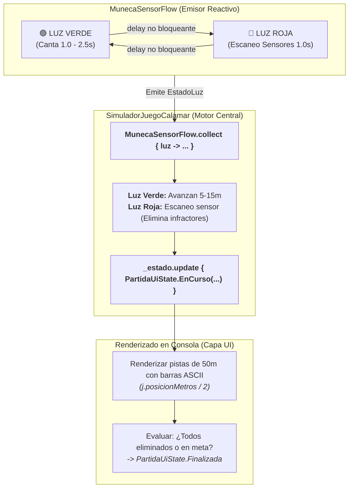

# Proyecto Integrador Final: "El Juego del Calamar" (Luz Roja, Luz Verde)

¡Enhorabuena por llegar al reto final del laboratorio de Kotlin! En este proyecto integrador construirás una simulación completa del mítico juego **"Luz Roja, Luz Verde" (*El Juego del Calamar*)**. 

Este proyecto reúne **todos los conceptos aprendidos a lo largo del curso** (inmutabilidad, tipos sellados, colecciones funcionales, corrutinas concurrentes y flujos reactivos con `Flow`), estructurado bajo los principios de **Clean Architecture** que utilizarás en Android Studio.

📁 **Paquete de trabajo:** `package b06_proyecto_integrador`  
Ubicación en tu proyecto: `src/main/kotlin/b06_proyecto_integrador/`

!!! info "📚 Apuntes Teóricos de Referencia"
    Este proyecto consolida los conocimientos de todo el módulo de Kotlin. Puedes consultar los siguientes apuntes teóricos para resolver cada componente:
    
    - [Data Classes y Modelado Inmutable](../23-data-classes.md) y [Enum Classes](../24-enum-classes.md) (para las entidades y estados de la luz en `model/`).
    - [Sealed Classes y Sealed Interfaces](../26-sealed-classes.md) (para el modelado exhaustivo de estados en `state/PartidaUiState.kt`).
    - [Flujos Asíncronos Reactivos (Flow y StateFlow)](../52-flows.md) (para la emisión de eventos de la muñeca y el estado de la partida).
    - [Corrutinas y Concurrencia con async/await](../51-corrutinas.md) y [Colecciones y Listas](../42-listas.md) (para la simulación de avance de jugadores).

---

## 🎯 Objetivos de Aprendizaje Demostrados

1. **Modelado Inmutable:** Representación de entidades y estados mediante `data class` y `copy()`.

2. **Jerarquía Sellada (UiState):** Control exhaustivo del estado global mediante `sealed interface`.

3. **Flujos Asíncronos Reactivos (Flow):** Emisión continua de eventos de la Muñeca (canto y escaneo).

4. **Concurrencia con Corrutinas:** Simulación de múltiples jugadores corriendo en paralelo mediante `launch`.

5. **Colecciones y Operaciones Funcionales:** Filtrado de eliminados, transformaciones y estadísticas.

---

## 📜 Reglas de la Simulación

1. **El Terreno:** Hay una pista de **50 metros**. Los jugadores parten de la posición `0m` y ganan si alcanzan o superan los `50m`.

2. **La Muñeca Robot:**

    - Canta *"Jugaremos, muévete luz verde..."* durante un tiempo aleatorio entre 1 y 2.5 segundos (**Estado `LuzVerde`**).

    - De repente, se detiene y se gira (**Estado `LuzRoja`**). Durante 1 segundo, cualquier jugador que intente avanzar en ese intervalo es detectado por los sensores y queda **eliminado inmediatamente**.

3. **Los Jugadores (Corrutinas Concurrentes):**

    - Se crea un grupo de jugadores (ej. 8 participantes).

    - Cada jugador avanza ráfagas de 5 a 15 metros mientras la luz está verde. Algunos jugadores arriesgan más que otros, aumentando la probabilidad de moverse cuando la muñeca se gira.

4. **Condición de Fin de Juego:**

    - La partida termina cuando todos los jugadores han cruzado la meta o han sido eliminados.

---

## 🧠 Modelo Mental de la Simulación (Diagrama Reactivo)

Antes de programar cada archivo, observa cómo interactúan la Muñeca Robot (productor reactivo de `Flow`), los jugadores concurrentes y el estado global de la partida:



---

## 🏗️ Arquitectura Modular Propuesta

```text
src/main/kotlin/b06_proyecto_integrador/
├── model/
│   ├── Jugador.kt                 <-- data class Jugador inmutable
│   └── EstadoLuz.kt               <-- enum class EstadoLuz { VERDE, ROJA }
├── state/
│   └── PartidaUiState.kt          <-- sealed interface con los estados de la partida
├── engine/
│   └── MunecaSensorFlow.kt        <-- Emisor de Flow reactivo para la Muñeca
└── JuegoCalamarApp.kt             <-- fun main() y orquestación con corrutinas
```

---

## 💻 Implementación Guiada Paso a Paso

### Paso 1: Modelos de Datos (`model/`)
📚 **Teoría de referencia:** [El Método copy() y la Inmutabilidad](../23-data-classes.md#3-el-metodo-copy-y-la-inmutabilidad) y [Declaración Básica de un enum class](../24-enum-classes.md#1-declaracion-basica-de-un-enum-class)

Crea el archivo `Jugador.kt`:
```kotlin
package b06_proyecto_integrador.model

data class Jugador(
    val id: Int,
    val alias: String,
    val posicionMetros: Int = 0,
    val eliminado: Boolean = false,
    val haLlegadoAMeta: Boolean = false
) {
    fun avanzar(metros: Int): Jugador {
        if (eliminado || haLlegadoAMeta) return this
        val nuevaPos = posicionMetros + metros
        return this.copy(
            posicionMetros = nuevaPos,
            haLlegadoAMeta = nuevaPos >= 50
        )
    }

    fun eliminar(): Jugador = this.copy(eliminado = true)
}

enum class EstadoLuz(val emoji: String) {
    LUZ_VERDE("🟢 LUZ VERDE (¡Puedes correr!)"),
    LUZ_ROJA("🔴 LUZ ROJA (¡Prohibido moverse!)")
}
```

---

### Paso 2: Estados Sellados de la Partida (`state/`)
📚 **Teoría de referencia:** [Sintaxis Moderna: sealed interface](../26-sealed-classes.md#2-sintaxis-moderna-sealed-interface-y-data-object-kotlin-19) y [Patrón Arquitectónico UiState](../26-sealed-classes.md#5-el-patron-universal-de-arquitectura-en-android-uistate)

Crea el archivo `PartidaUiState.kt`:
```kotlin
package b06_proyecto_integrador.state

import b06_proyecto_integrador.model.Jugador

sealed interface PartidaUiState {
    data object Preparando : PartidaUiState
    
    data class EnCurso(
        val ronda: Int,
        val luzActual: b06_proyecto_integrador.model.EstadoLuz,
        val jugadores: List<Jugador>
    ) : PartidaUiState

    data class Finalizada(
        val supervivientes: List<Jugador>,
        val eliminados: List<Jugador>
    ) : PartidaUiState
}
```

---

### Paso 3: El Emisor de Flujos de la Muñeca (`engine/`)
📚 **Teoría de referencia:** [Creación y Consumo Básico de un Flow](../52-flows.md#2-creacion-y-consumo-basico-de-un-flow)

Crea el archivo `MunecaSensorFlow.kt`:
```kotlin
package b06_proyecto_integrador.engine

import b06_proyecto_integrador.model.EstadoLuz
import kotlinx.coroutines.delay
import kotlinx.coroutines.flow.Flow
import kotlinx.coroutines.flow.flow
import kotlin.random.Random

class MunecaSensorFlow {
    // Emite alternancia continua de LUZ_VERDE y LUZ_ROJA como un Flow
    fun iniciarCanto(totalRondas: Int): Flow<Pair<Int, EstadoLuz>> = flow {
        for (ronda in 1..totalRondas) {
            // 1. Fase Luz Verde: duración variable
            val tiempoVerde = Random.nextLong(1200, 2500)
            emit(ronda to EstadoLuz.LUZ_VERDE)
            delay(tiempoVerde)

            // 2. Fase Luz Roja: la muñeca se gira de golpe
            emit(ronda to EstadoLuz.LUZ_ROJA)
            delay(1200) // 1.2 segundos escaneando
        }
    }
}
```

---

### Paso 4: Programa Principal y Orquestación Concurrente (`JuegoCalamarApp.kt`)
📚 **Teoría de referencia:** [async y await: Peticiones en Paralelo](../51-corrutinas.md#42-async-y-await-peticiones-en-paralelo-con-retorno-de-valor), [StateFlow Reactivo](../52-flows.md#4-stateflow-el-rey-de-la-arquitectura-en-android-y-compose) y [Operaciones en Listas](../42-listas.md#4-operaciones-funcionales-imprescindibles)

Crea el archivo ejecutable `JuegoCalamarApp.kt`:
```kotlin
package b06_proyecto_integrador

import b06_proyecto_integrador.engine.MunecaSensorFlow
import b06_proyecto_integrador.model.EstadoLuz
import b06_proyecto_integrador.model.Jugador
import b06_proyecto_integrador.state.PartidaUiState
import kotlinx.coroutines.*
import kotlinx.coroutines.flow.MutableStateFlow
import kotlinx.coroutines.flow.StateFlow
import kotlinx.coroutines.flow.asStateFlow
import kotlinx.coroutines.flow.update
import kotlin.random.Random

class SimuladorJuegoCalamar(nombres: List<String>) {
    private val muneca = MunecaSensorFlow()

    private val _estado = MutableStateFlow<PartidaUiState>(PartidaUiState.Preparando)
    val estado: StateFlow<PartidaUiState> = _estado.asStateFlow()

    private var jugadores = nombres.mapIndexed { idx, nombre ->
        Jugador(id = idx + 1, alias = nombre)
    }

    suspend fun ejecutarPartida() = coroutineScope {
        println("==================================================")
        println("   🦑 SIMULADOR: EL JUEGO DEL CALAMAR (50m) 🦑    ")
        println("==================================================")
        println("Jugadores en línea de salida: ${jugadores.map { it.alias }}")
        delay(1000)

        // Escuchamos el Flow de la muñeca
        muneca.iniciarCanto(totalRondas = 5).collect { (ronda, luz) ->
            println("\n--------------------------------------------------")
            println("RONDA #$ronda: ${luz.emoji}")
            println("--------------------------------------------------")

            // Si la luz es verde, los jugadores intentan avanzar en paralelo con corrutinas
            if (luz == EstadoLuz.LUZ_VERDE) {
                val tareas = jugadores.filterNot { it.eliminado || it.haLlegadoAMeta }.map { jugador ->
                    async {
                        delay(Random.nextLong(200, 800)) // Tiempo de reacción
                        val metros = Random.nextInt(8, 16)
                        jugador.avanzar(metros)
                    }
                }
                val resultados = tareas.awaitAll()

                // Actualizamos la lista con los que avanzaron
                jugadores = jugadores.map { original ->
                    resultados.find { it.id == original.id } ?: original
                }
            } else {
                // LUZ ROJA: Simulación de escaneo. Un 25% de los que no han llegado arriesgan y son eliminados
                println("👀 [SENSOR ACTIVADO]: Escaneando movimientos en pista...")
                jugadores = jugadores.map { jugador ->
                    if (!jugador.haLlegadoAMeta && !jugador.eliminado && Random.nextDouble() < 0.25) {
                        println("💀 ¡JUGADOR #${jugador.id} (${jugador.alias}) SE HA MOVIDO! -> ¡ELIMINADO!")
                        jugador.eliminar()
                    } else {
                        jugador
                    }
                }
            }

            // Mostramos el marcador de la ronda
            mostrarMarcadorPista(jugadores)

            _estado.update { PartidaUiState.EnCurso(ronda, luz, jugadores) }

            // Si todos terminaron (ganaron o murieron), abortamos antes
            if (jugadores.all { it.eliminado || it.haLlegadoAMeta }) {
                return@collect
            }
        }

        // Fin de la partida
        val ganadores = jugadores.filter { it.haLlegadoAMeta && !it.eliminado }
        val bajas = jugadores.filter { it.eliminado }

        _estado.update { PartidaUiState.Finalizada(ganadores, bajas) }
        mostrarResumenFinal(ganadores, bajas)
    }

    private fun mostrarMarcadorPista(lista: List<Jugador>) {
        lista.forEach { j ->
            val estado = when {
                j.eliminado -> "[ELIMINADO 💀]"
                j.haLlegadoAMeta -> "[¡META CONSEGUIDA! 🏆]"
                else -> "[${j.posicionMetros}m / 50m]"
            }
            val barra = "=".repeat(j.posicionMetros.coerceIn(0, 50) / 2)
            println("Jugador #${j.id} (${j.alias.padEnd(8)}): $barra> $estado")
        }
    }

    private fun mostrarResumenFinal(ganadores: List<Jugador>, bajas: List<Jugador>) {
        println("\n==================================================")
        println("            🏆 RESULTADO FINAL DEL JUEGO 🏆         ")
        println("==================================================")
        println("Supervivientes ganadores (${ganadores.size}): ${ganadores.map { "${it.alias} (#${it.id})" }}")
        println("Bajas totales (${bajas.size}): ${bajas.map { "${it.alias} (#${it.id})" }}")
        println("==================================================")
    }
}

fun main() = runBlocking {
    val participantes = listOf("Gi-hun", "Sang-woo", "Sae-byeok", "Il-nam", "Ali", "Deok-su")
    val simulador = SimuladorJuegoCalamar(participantes)
    simulador.ejecutarPartida()
}
```

---

## 🎮 Salida de Ejecución en Consola (Ejemplo Real)

```text
==================================================
   🦑 SIMULADOR: EL JUEGO DEL CALAMAR (50m) 🦑    
==================================================
Jugadores en línea de salida: [Gi-hun, Sang-woo, Sae-byeok, Il-nam, Ali, Deok-su]

--------------------------------------------------
RONDA #1: 🟢 LUZ VERDE (¡Puedes correr!)
--------------------------------------------------
Jugador #1 (Gi-hun  ): =======> [14m / 50m]
Jugador #2 (Sang-woo): ======> [12m / 50m]
Jugador #3 (Sae-byeok): ========> [16m / 50m]
Jugador #4 (Il-nam  ): =====> [10m / 50m]
Jugador #5 (Ali     ): ========> [16m / 50m]
Jugador #6 (Deok-su ): =======> [15m / 50m]

--------------------------------------------------
RONDA #1: 🔴 LUZ ROJA (¡Prohibido moverse!)
--------------------------------------------------
👀 [SENSOR ACTIVADO]: Escaneando movimientos en pista...
💀 ¡JUGADOR #6 (Deok-su) SE HA MOVIDO! -> ¡ELIMINADO!

--------------------------------------------------
RONDA #2: 🟢 LUZ VERDE (¡Puedes correr!)
--------------------------------------------------
Jugador #1 (Gi-hun  ): =============> [27m / 50m]
Jugador #2 (Sang-woo): =============> [26m / 50m]
Jugador #3 (Sae-byeok): ================> [32m / 50m]
Jugador #4 (Il-nam  ): ===========> [22m / 50m]
Jugador #5 (Ali     ): ================> [31m / 50m]
Jugador #6 (Deok-su ): =======> [ELIMINADO 💀]

...

==================================================
            🏆 RESULTADO FINAL DEL JUEGO 🏆         
==================================================
Supervivientes ganadores (3): [Sae-byeok (#3), Gi-hun (#1), Ali (#5)]
Bajas totales (3): [Deok-su (#6), Il-nam (#4), Sang-woo (#2)]
==================================================
```

---

## 🌟 Retos de Ampliación para Alumnos Avanzados

Si terminas la simulación básica y quieres llevar tu código al siguiente nivel:

1. **Personalidades y Probabilidades:** Añade un campo `perfilRiesgo: Double` (entre 0.0 y 1.0) a cada jugador para que los más cautos (como Il-nam) avancen menos metros pero raramente sean eliminados, y los más agresivos (como Deok-su) avancen más metros con alto riesgo.

2. **Segundo Juego (El Puente de Cristal):** Implementa una segunda fase donde los supervivientes deban cruzar un puente de 8 peldaños dobles (uno de cristal templado y otro de cristal frágil) usando una lista de tuplas `Pair<Boolean, Boolean>`.

3. **Exportación de Estadísticas:** Utiliza funciones de extensión de colecciones (`groupBy`, `average`) para mostrar un informe final con los metros promedio recorridos antes de morir y la velocidad media de los ganadores.
