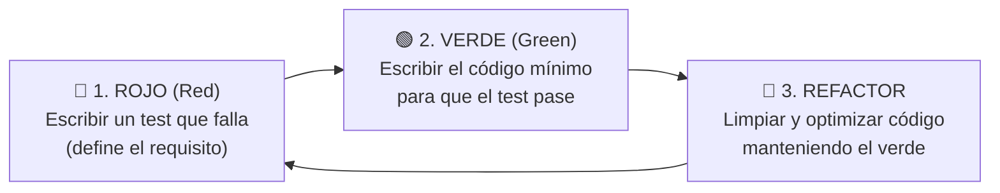

# Taller de Testing 2: El Ahorcado con TDD (Desarrollo Guiado por Pruebas)

En el taller anterior del [Combate RPG](./01-test-combate-rpg.md) aprendiste a realizar **testing retrospectivo**: tomaste un código que ya funcionaba en consola y lo refactorizaste para extraer funciones puras que pudieran ser probadas con JUnit y Gradle.

En este segundo taller daremos el gran salto metodológico que aplican los equipos de ingeniería de élite: **TDD (*Test-Driven Development* o Desarrollo Guiado por Pruebas)**.

---

## 1. La Filosofía TDD: El Ciclo Rojo → Verde → Refactorizar

En TDD, **el test se escribe antes que el código de producción**. El flujo de trabajo se divide en tres fases iterativas (*Red-Green-Refactor*):



1. **🔴 Rojo (*Red*):** Se define la prueba unitaria que describe un requisito exacto. Como la función aún no está implementada, el test compila pero **falla** al ejecutarse.
2. **🟢 Verde (*Green*):** Escribes la solución mínima necesaria para satisfacer la aserción y conseguir que el test pase con éxito.
3. **🔵 Refactorizar (*Refactor*):** Limpias la sintaxis, eliminas duplicidades o mejoras el rendimiento sabiendo que la suite de tests te protege contra cualquier error involuntario.

!!! tip "¿Cómo encaja esto con tu proyecto `pmdm-kotlin-lab`?"
    Para evitar conflictos de firmas con tu juego original de consola del Bloque 2 (`Reto02_AhorcadoJuego.kt`), este taller se desarrolla en un subpaquete limpio y aislado:  
    📁 **`package b02_funciones_lambdas.tdd`**

---

## 2. Fase 1: El Contrato Inicial (Tu Punto de Partida en Rojo)

En un entorno profesional, el arquitecto de software o el líder técnico define el **contrato de interfaz** y la **suite de pruebas de aceptación**. Tu misión como desarrollador es implementar la lógica hasta conseguir el semáforo verde.

---

### Paso 1: Crear el esqueleto en `src/main`

Crea el archivo `MotorAhorcado.kt` en la siguiente ruta exacta:  
📁 `src/main/kotlin/b02_funciones_lambdas/tdd/MotorAhorcado.kt`

Pega el siguiente esqueleto con las firmas de función vacías que lanzan `TODO()`:

```kotlin
package b02_funciones_lambdas.tdd

// ============================================================================
// CONTRATO DEL MOTOR DE AHORCADO (TDD CON ARQUITECTURA DE ESTADO)
// Tu objetivo es sustituir cada TODO() por la lógica que haga pasar los tests.
// ============================================================================

enum class EstadoPartida {
    JUGANDO,
    VICTORIA,
    DERROTA
}

enum class EventoTurno {
    ACIERTO,
    FALLO,
    LETRA_REPETIDA,
    ENTRADA_NULA
}

/**
 * Devuelve la palabra con las letras acertadas visibles y las no probadas sustituidas
 * por guiones bajos '_', separadas entre sí por un espacio en blanco.
 * Ejemplo: "KOTLIN" con probadas "OI" -> "_ O _ _ I _"
 */
fun String.enmascarar(probadas: String): String {
    TODO("Misión 1: Implementar función de extensión enmascarar")
}

/**
 * Determina si la totalidad de los caracteres de la palabra secreta están presentes
 * dentro de la cadena acumulada de letras probadas.
 */
fun String.estaAdivinada(probadas: String): Boolean {
    TODO("Misión 2: Implementar función de extensión estaAdivinada")
}

/**
 * Contenedor inmutable que almacena todo el estado del juego.
 */
data class EstadoAhorcado(
    val palabraSecreta: String,
    val letrasProbadas: String = "",
    val vidasRestantes: Int = 6,
    val estado: EstadoPartida = EstadoPartida.JUGANDO
) {
    val mascara: String
        get() = palabraSecreta.enmascarar(letrasProbadas)
}

/**
 * Función pura de transición: evalúa el intento del jugador, emite el evento de notificación
 * a través de la lambda y retorna un nuevo EstadoAhorcado inmutable con copy().
 */
fun procesarIntento(
    estadoActual: EstadoAhorcado,
    letraInput: Char?,
    onNotificacion: (evento: EventoTurno, letra: Char?) -> Unit
): EstadoAhorcado {
    TODO("Misión 3: Implementar transición de estados con Null Safety y notificación")
}
```

---

### Paso 2: Crear la Suite de Pruebas en `src/test`

Crea el archivo `MotorAhorcadoTest.kt` en la siguiente ruta paralela de pruebas:  
📁 `src/test/kotlin/b02_funciones_lambdas/tdd/MotorAhorcadoTest.kt`

Copia la suite completa de pruebas:

```kotlin
package b02_funciones_lambdas.tdd

import kotlin.test.Test
import kotlin.test.assertEquals
import kotlin.test.assertFalse
import kotlin.test.assertTrue
import kotlin.test.fail

class MotorAhorcadoTest {

    // ========================================================================
    // 🎭 MISIÓN 1: PRUEBAS DE LA MÁSCARA VISUAL (enmascarar)
    // ========================================================================

    @Test
    fun `enmascarar palabra sin letras probadas solo muestra guiones bajos`() {
        val palabra = "KOTLIN"
        val probadas = ""

        val resultado = palabra.enmascarar(probadas)

        assertEquals("_ _ _ _ _ _", resultado)
    }

    @Test
    fun `enmascarar palabra con aciertos parciales descubre solo las letras acertadas`() {
        val palabra = "KOTLIN"
        val probadas = "OI"

        val resultado = palabra.enmascarar(probadas)

        assertEquals("_ O _ _ I _", resultado)
    }

    @Test
    fun `enmascarar palabra con todas las letras probadas la muestra totalmente visible`() {
        val palabra = "JAVA"
        val probadas = "AJV"

        val resultado = palabra.enmascarar(probadas)

        assertEquals("J A V A", resultado)
    }

    // ========================================================================
    // 🏆 MISIÓN 2: PRUEBAS DE CONDICIÓN DE VICTORIA (estaAdivinada)
    // ========================================================================

    @Test
    fun `palabra no esta adivinada si faltan letras por descubrir`() {
        val palabra = "KOTLIN"
        val probadas = "KTLN" // Falta la 'O' y la 'I'

        assertFalse(palabra.estaAdivinada(probadas))
    }

    @Test
    fun `palabra esta adivinada cuando todas sus letras estan en probadas`() {
        val palabra = "KOTLIN"
        val probadas = "KOTLINXYZ"

        assertTrue(palabra.estaAdivinada(probadas))
    }

    // ========================================================================
    // ⚡ MISIÓN 3: PRUEBAS DE TRANSICIÓN DE ESTADO Y NOTIFICACIONES
    // ========================================================================

    @Test
    fun `entrada nula notifica ENTRADA_NULA y mantiene estado intacto`() {
        var eventoRecibido: EventoTurno? = null
        val estadoInicial = EstadoAhorcado(palabraSecreta = "KOTLIN", vidasRestantes = 6)

        val nuevoEstado = procesarIntento(estadoInicial, null) { evento, _ ->
            eventoRecibido = evento
        }

        assertEquals(EventoTurno.ENTRADA_NULA, eventoRecibido)
        assertEquals(estadoInicial, nuevoEstado, "El estado debe permanecer idéntico")
    }

    @Test
    fun `proponer letra repetida notifica LETRA_REPETIDA y mantiene estado intacto`() {
        var eventoRecibido: EventoTurno? = null
        var letraNotificada: Char? = null
        val estadoInicial = EstadoAhorcado(palabraSecreta = "KOTLIN", letrasProbadas = "AO", vidasRestantes = 6)

        val nuevoEstado = procesarIntento(estadoInicial, 'o') { evento, letra ->
            eventoRecibido = evento
            letraNotificada = letra
        }

        assertEquals(EventoTurno.LETRA_REPETIDA, eventoRecibido)
        assertEquals('O', letraNotificada, "Debió normalizar la letra a mayúsculas")
        assertEquals(estadoInicial, nuevoEstado, "No debe alterar vidas ni probadas")
    }

    @Test
    fun `acertar letra nueva notifica ACIERTO y actualiza letras probadas con vidas intactas`() {
        var eventoRecibido: EventoTurno? = null
        val estadoInicial = EstadoAhorcado(palabraSecreta = "KOTLIN", letrasProbadas = "A", vidasRestantes = 5)

        val nuevoEstado = procesarIntento(estadoInicial, 'k') { evento, _ ->
            eventoRecibido = evento
        }

        assertEquals(EventoTurno.ACIERTO, eventoRecibido)
        assertEquals("AK", nuevoEstado.letrasProbadas)
        assertEquals(5, nuevoEstado.vidasRestantes)
        assertEquals(EstadoPartida.JUGANDO, nuevoEstado.estado)
    }

    @Test
    fun `fallar letra nueva notifica FALLO y resta exactamente una vida`() {
        var eventoRecibido: EventoTurno? = null
        val estadoInicial = EstadoAhorcado(palabraSecreta = "KOTLIN", letrasProbadas = "A", vidasRestantes = 6)

        val nuevoEstado = procesarIntento(estadoInicial, 'Z') { evento, _ ->
            eventoRecibido = evento
        }

        assertEquals(EventoTurno.FALLO, eventoRecibido)
        assertEquals("AZ", nuevoEstado.letrasProbadas)
        assertEquals(5, nuevoEstado.vidasRestantes, "Un fallo debe reducir vidas de 6 a 5")
        assertEquals(EstadoPartida.JUGANDO, nuevoEstado.estado)
    }

    @Test
    fun `descubrir la ultima letra transiciona el estado a VICTORIA`() {
        val estadoInicial = EstadoAhorcado(palabraSecreta = "KOTLIN", letrasProbadas = "KOTLI", vidasRestantes = 3)

        val nuevoEstado = procesarIntento(estadoInicial, 'N') { _, _ -> }

        assertEquals(EstadoPartida.VICTORIA, nuevoEstado.estado)
    }

    @Test
    fun `quedarse sin vidas transiciona el estado a DERROTA`() {
        val estadoInicial = EstadoAhorcado(palabraSecreta = "KOTLIN", letrasProbadas = "A", vidasRestantes = 1)

        val nuevoEstado = procesarIntento(estadoInicial, 'X') { _, _ -> }

        assertEquals(EstadoPartida.DERROTA, nuevoEstado.estado)
        assertEquals(0, nuevoEstado.vidasRestantes)
    }
}
```

---

### Paso 3: Experimentar el Semáforo en Rojo

Abre la terminal y ejecuta la suite del subpaquete:

```bash
./gradlew test --tests "b02_funciones_lambdas.tdd.MotorAhorcadoTest"
```

El resultado debe ser un **fallo rotundo con `BUILD FAILED`**:
```text
MotorAhorcadoTest > enmascarar palabra sin letras probadas solo muestra guiones bajos() FAILED
    kotlin.NotImplementedError: An operation is not implemented: Misión 1: Implementar función de extensión enmascarar
```

¡Excelente! La fase roja está lista. Tienes un contrato cerrado y un marco de pruebas que te guiará hacia la solución correcta.

---

## 3. Fase 2: Misión Verde (Implementación Guiada Paso a Paso)

Ahora avanzaremos implementando una a una las funciones en `MotorAhorcado.kt` hasta conseguir que todos los tests pasen a verde.

---

### Misión 1: Implementar `String.enmascarar`

Abre `src/main/kotlin/b02_funciones_lambdas/tdd/MotorAhorcado.kt`.

Para enmascarar la cadena, necesitamos recorrer cada carácter de `this`: si el carácter ya existe en `probadas`, lo dejamos visible; si no, ponemos `'_'`. Finalmente, unimos los caracteres con espacios usando `.joinToString(" ")`:

```kotlin
fun String.enmascarar(probadas: String): String {
    return this.map { c ->
        if (c in probadas) c else '_'
    }.joinToString(" ")
}
```

Vuelve a lanzar las pruebas de enmascarar:
```bash
./gradlew test --tests "*enmascarar*"
```

**Resultado:** ¡Los 3 primeros tests ya están en **VERDE**!

---

### Misión 2: Implementar `String.estaAdivinada`

Una palabra está adivinada si **todos (`all`)** sus caracteres están presentes dentro de la cadena `probadas`:

```kotlin
fun String.estaAdivinada(probadas: String): Boolean {
    return this.all { c -> c in probadas }
}
```

Lanza las pruebas de victoria:
```bash
./gradlew test --tests "*adivinada*"
```

**Resultado:** ¡Los tests de condición de victoria pasan a **VERDE**!

---

### Misión 3: Implementar `procesarIntento` (Arquitectura de Estado y Notificación)

Este es el núcleo de transición de estados del juego:

1. **Cláusula de guarda con Null Safety:** `letraInput?.uppercaseChar() ?: run { onNotificacion(EventoTurno.ENTRADA_NULA, null); return estadoActual }`.
2. **Comprobación de repetición:** Si `letra in estadoActual.letrasProbadas`, notificamos `EventoTurno.LETRA_REPETIDA` y retornamos `estadoActual` sin cambios.
3. **Acierto vs Fallo:**
    - Si `letra in estadoActual.palabraSecreta` → notificamos `EventoTurno.ACIERTO` y comprobamos si la palabra queda totalmente adivinada para pasar a `EstadoPartida.VICTORIA`.
    - Si no → notificamos `EventoTurno.FALLO` y comprobamos si las vidas restantes llegan a 0 para pasar a `EstadoPartida.DERROTA`.
4. En ambos casos, generamos y retornamos un **nuevo estado inmutable con `.copy()`**.

```kotlin
fun procesarIntento(
    estadoActual: EstadoAhorcado,
    letraInput: Char?,
    onNotificacion: (evento: EventoTurno, letra: Char?) -> Unit
): EstadoAhorcado {
    // 1. Cláusula de guarda ante nulos
    val letra = letraInput?.uppercaseChar() ?: run {
        onNotificacion(EventoTurno.ENTRADA_NULA, null)
        return estadoActual
    }

    // 2. Comprobación de repetición
    if (letra in estadoActual.letrasProbadas) {
        onNotificacion(EventoTurno.LETRA_REPETIDA, letra)
        return estadoActual
    }

    val nuevasProbadas = estadoActual.letrasProbadas + letra

    // 3. Evaluar acierto o fallo
    return if (letra in estadoActual.palabraSecreta) {
        onNotificacion(EventoTurno.ACIERTO, letra)
        val victoria = estadoActual.palabraSecreta.estaAdivinada(nuevasProbadas)
        estadoActual.copy(
            letrasProbadas = nuevasProbadas,
            estado = if (victoria) EstadoPartida.VICTORIA else EstadoPartida.JUGANDO
        )
    } else {
        val nuevasVidas = estadoActual.vidasRestantes - 1
        onNotificacion(EventoTurno.FALLO, letra)
        val derrota = (nuevasVidas <= 0)
        estadoActual.copy(
            letrasProbadas = nuevasProbadas,
            vidasRestantes = nuevasVidas,
            estado = if (derrota) EstadoPartida.DERROTA else EstadoPartida.JUGANDO
        )
    }
}
```

---

## 4. Fase 3: Verificación Completa y Semáforo 100% Verde

Lanza ahora toda la suite de pruebas del subpaquete TDD:

```bash
./gradlew test --tests "b02_funciones_lambdas.tdd.MotorAhorcadoTest"
```

### Salida en consola:

```text
> Task :compileKotlin UP-TO-DATE
> Task :compileTestKotlin UP-TO-DATE
> Task :testClasses UP-TO-DATE
> Task :test

BUILD SUCCESSFUL in 320ms
3 actionable tasks: 1 executed, 2 up-to-date
```

Abre el informe HTML en tu navegador:  
📁 `pmdm-kotlin-lab/build/reports/tests/test/index.html`

Verás la suite `b02_funciones_lambdas.tdd.MotorAhorcadoTest` con sus **9 pruebas en verde**. Has completado con éxito el ciclo TDD.

---

## 5. El Ensamblado Final: Jugar desde `main()` con un Motor Blindado

Ahora que tienes la certeza matemática de que tu motor de juego está libre de fallos, montar un bucle interactivo de consola para jugar se convierte en una tarea trivial.

Al final de `MotorAhorcado.kt`, añade la función de ejecución:

```kotlin
fun main() {
    var estado = EstadoAhorcado(palabraSecreta = "KOTLIN")

    println("=== EL AHORCADO (MOTOR VERIFICADO CON TDD) ===")
    println("Palabra: ${estado.mascara} | Vidas: ${estado.vidasRestantes}\n")

    val turnosSimulados = listOf('O', 'Z', null, 'K', 'T', 'L', 'I', 'N')

    for (intento in turnosSimulados) {
        println("-> Jugador propone: '$intento'")

        estado = procesarIntento(estado, intento) { evento, letra ->
            when (evento) {
                EventoTurno.ACIERTO -> println("  ✅ [NOTIFICACIÓN]: ¡Acierto con '$letra'!")
                EventoTurno.FALLO -> println("  ❌ [NOTIFICACIÓN]: ¡Fallo con '$letra'!")
                EventoTurno.LETRA_REPETIDA -> println("  ⚠️ [NOTIFICACIÓN]: Letra '$letra' ya probada.")
                EventoTurno.ENTRADA_NULA -> println("  🛑 [NOTIFICACIÓN]: Entrada nula recibida. Sin penalización.")
            }
        }

        println("  Marcador: ${estado.mascara} | Vidas: ${estado.vidasRestantes}\n")

        if (estado.estado != EstadoPartida.JUGANDO) break
    }

    when (estado.estado) {
        EstadoPartida.VICTORIA -> println("🏆 ¡VICTORIA HEROICA! Has completado: ${estado.palabraSecreta}")
        EstadoPartida.DERROTA -> println("💀 ¡HAS SIDO AHORCADO! La palabra era: ${estado.palabraSecreta}")
        EstadoPartida.JUGANDO -> Unit
    }
}
```

Pulsa el icono verde ▶ junto a `fun main()` y disfruta de tu juego respaldado al 100% por pruebas unitarias automatizadas.
