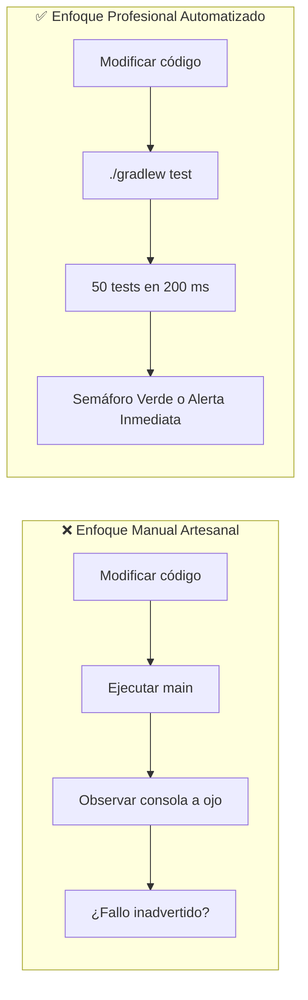

# Fundamentos de Testing Unitario y Automatización con Gradle

El **Testing Unitario (pruebas unitarias automatizadas)** es una de las disciplinas más determinantes de la ingeniería de software profesional. En el desarrollo móvil moderno (y especialmente en arquitecturas reactivas con Jetpack Compose), escribir código sin pruebas automáticas equivale a construir un edificio sin planos de carga: cualquier cambio futuro puede derrumbar componentes que antes funcionaban sin que nos demos cuenta.

En este módulo aprenderás no solo la sintaxis para escribir pruebas con **`kotlin.test`**, sino lo más importante: **aprender a pensar en pruebas**, diseñar código fácilmente testeable y automatizar su verificación mediante **Gradle**.

---

## 1. La Falacia de la Prueba Manual en Consola

Durante tu formación en 1º de DAM, la forma habitual de comprobar si un programa funcionaba consistía en:

1. Ejecutar el método `main`.
2. Introducir valores por teclado o esperar a que se imprimieran líneas en la consola.
3. Comprobar «a ojo» si el resultado parecía correcto.

Este enfoque artesanal tiene graves limitaciones en proyectos reales:

- **Es extremadamente lento y agotador:** Si tienes que probar 15 combinaciones de daño, curación y recursos, tendrías que ejecutar y observar la consola 15 veces consecutivas tras cada pequeño cambio.
- **No protege contra regresiones:** Una **regresión** ocurre cuando introduces una nueva funcionalidad o corriges un fallo y, sin querer, rompes otra parte del programa que ya funcionaba. La prueba manual rara vez vuelve a verificar todo el sistema histórico.
- **Produce falsos positivos:** El ojo humano se cansa y pasa por alto casos sutiles (como que la vida quede en `-2` en lugar de `0`, o que una curación supere los `100 HP` máximos).



---

## 2. Cómo Pensar en Testing: La Mentalidad de Calidad

Escribir un buen test no consiste en teclear código al azar, sino en aplicar un **marco de razonamiento riguroso** antes de escribir la primera línea de aserción.

---

### 2.1. El Contrato de una Función (Caja Negra)

Piensa en una función como un contrato formal:

> *«Si te proporciono estas entradas específicas, me garantizas matemáticamente que me devolverás esta salida exacta, sin sorpresas ni efectos secundarios imprevistos».*

Cuando testeamos, tratamos la función como una **caja negra**: no nos importa cómo está implementada por dentro en este instante, sino que **cumpla rigurosamente su contrato**.

---

### 2.2. Funciones Puras vs. Efectos Secundarios (*Side Effects*)

Este es el secreto número uno de la testeabilidad en programación:

- **Efecto Secundario (*Side Effect*):** Una operación que interactúa con el mundo exterior: imprimir en consola (`println`), leer de teclado (`Scanner` / `readln`), invocar números aleatorios (`(..).random()`), consultar una base de datos o pausar el hilo (`Thread.sleep`).
- **Función Pura:** Una función matemática que:
    1. Siempre devuelve el mismo resultado para los mismos argumentos de entrada (determinista).
    2. No altera ningún estado global ni interactúa con la consola o el sistema.

!!! warning "Regla de Oro de la Testeabilidad"
    **Un bloque de código monolítico lleno de `println()` y `random()` dentro de un `fun main()` es prácticamente imposible de testear.**
    
    Para hacer un sistema testeable, **separamos la lógica de cálculo y decisión (funciones puras) de la presentación y la interacción (consola, bucles de juego o UI)**.

```kotlin
// ❌ INTRODUCIR LÓGICA CON EFECTOS SECUNDARIOS (IMPOSIBLE DE TESTEAR AUTOMÁTICAMENTE)
fun turnoAtaqueHeroe() {
    val dano = (18..25).random() // No determinista: cambia en cada tirada
    println("Daño infligido: $dano") // Efecto secundario: salida por consola
}

// ✅ SEPARAR EL CÁLCULO EN UNA FUNCIÓN PURA (TESTEABLE AL 100%)
fun calcularVidaTrasImpacto(vidaActual: Int, danoRecibido: Int): Int {
    return (vidaActual - danoRecibido).coerceAtLeast(0)
}
```

---

### 2.3. Estructura Mental de una Prueba: El Patrón AAA (*Arrange - Act - Assert*)

Cualquier prueba unitaria del mundo, sin importar el lenguaje, se divide conceptualmente en tres fases consecutivas:

1. **Arrange (Preparar / Dado):** Configuras el escenario inicial y los datos de entrada necesarios.
2. **Act (Actuar / Cuando):** Ejecutas la función o el comportamiento concreto que deseas poner a prueba.
3. **Assert (Afirmar / Entonces):** Verificas que el resultado obtenido coincide de forma exacta con la expectativa esperada.

```kotlin
@Test
fun `beber pocion no debe sobrepasar la vida maxima`() {
    // 1. Arrange (Dado un héroe con 90 HP y una poción de 35 HP)
    val vidaActual = 90
    val potenciaPocion = 35
    val topeMaximo = 100

    // 2. Act (Cuando bebe la poción)
    val vidaCalculada = calcularCuracion(vidaActual, potenciaPocion, topeMaximo)

    // 3. Assert (Entonces la vida resultante DEBE ser 100, jamás 125)
    assertEquals(expected = 100, actual = vidaCalculada)
}
```

---

### 2.4. Identificación de Casos: Casos Nominales vs. Casos Límite (*Edge Cases*)

Un error de principiante es probar únicamente el camino feliz (*Happy Path*). Los desarrolladores profesionales dedican el 80% de su esfuerzo a buscar los límites donde el sistema puede quebrarse:

| Categoría de Caso | Descripción | Ejemplo en un Juego RPG |
| :--- | :--- | :--- |
| **Caso Nominal (*Happy Path*)** | La situación típica en condiciones estándar de funcionamiento. | Héroe con 50 HP recibe 20 de daño → queda con 30 HP. |
| **Caso Límite (*Edge Case*): Desbordamiento Superior** | Valores que rozan o superan el límite máximo permitido. | Héroe con 95 HP bebe poción de +35 → queda topado a 100 HP. |
| **Caso Límite (*Edge Case*): Desbordamiento Inferior (*Overkill*)** | Valores que reducen los recursos por debajo de cero. | Dragón con 10 HP recibe crítico de 45 → vida queda en 0 HP, nunca en -35 HP. |
| **Caso Límite: Recursos al límite exacto** | El umbral matemático exacto de una condición condicional. | Héroe con exactamente 40 HP (umbral crítico) → ¿se activa la poción? |
| **Caso de Agotamiento de Recursos** | Intento de realizar una acción sin recursos suficientes. | Héroe sin pociones (0) o sin energía (< 15) → la IA debe elegir el ataque básico. |

---

### 2.5. Nombres Expresivos en Kotlin con Comillas Invertidas

En Java tradicional, los nombres de métodos de test se veían obligados a usar notaciones largas como `testCalcularCuracion_cuandoVidaEs90_debeRetornar100()`.

Kotlin introduce una característica sintáctica idónea para testing: **permite nombres de funciones con espacios y signos de puntuación si se encierran entre comillas invertidas (*backticks*) \` \`**. Esto permite que el informe de resultados se lea como una especificación en lenguaje natural:

```kotlin
@Test
fun `un ataque letal debe dejar la vida en cero y no en valores negativos`() {
    val vidaFinal = calcularVidaTrasImpacto(vidaActual = 15, danoRecibido = 40)
    assertEquals(0, vidaFinal)
}
```

---

## 3. El Ecosistema `kotlin.test`

Kotlin incluye en su biblioteca estándar el módulo multiplataforma **`kotlin.test`**, que unifica las aserciones tanto para JVM como para Android y proyectos Multiplataforma (KMP).

### Aserciones Fundamentales

| Aserción | Propósito | Ejemplo de Uso |
| :--- | :--- | :--- |
| **`assertEquals(expected, actual)`** | Comprueba que el valor obtenido sea idéntico al esperado mediante igualdad estructural (`==`). | `assertEquals(100, heroeHp)` |
| **`assertNotEquals(illegal, actual)`** | Comprueba que el resultado sea diferente a un valor prohibido. | `assertNotEquals(0, dragonHp)` |
| **`assertTrue(boolean)`** | Verifica que una condición booleana se evalúe a `true`. | `assertTrue(heroeHp > 0)` |
| **`assertFalse(boolean)`** | Verifica que una condición booleana se evalúe a `false`. | `assertFalse(dragonDerrotado)` |
| **`assertNull(actual)`** | Verifica que una referencia nullable sea nula. | `assertNull(ganadorEmpate)` |
| **`assertNotNull(actual)`** | Verifica que una referencia no sea nula. | `assertNotNull(heroe)` |
| **`assertFailsWith<T> { ... }`** | Verifica que un bloque de código lance una excepción esperada de tipo `T`. | `assertFailsWith<IllegalArgumentException> { calcularDano(-5) }` |

!!! tip "Mensajes de Diagnóstico en Aserciones"
    Todas las aserciones de `kotlin.test` admiten un mensaje opcional al final. Si el test falla, ese texto se mostrará en rojo en el informe, facilitando enormemente la detección del error:
    
    ```kotlin
    assertEquals(100, vidaFinal, "La salud no debe sobrepasar la vida máxima configurada")
    ```

---

## 4. Automatización con Gradle en `pmdm-kotlin-lab`

### 4.1. Organización Canónica del Proyecto

En el proyecto **`pmdm-kotlin-lab`**, el código de producción y el código de pruebas conviven en carpetas paralelas perfectamente aisladas:

```text
pmdm-kotlin-lab/
├── build.gradle.kts
└── src/
    ├── main/                        <-- CÓDIGO DE PRODUCCIÓN (Tus juegos y algoritmos)
    │   └── kotlin/
    │       └── b01_fundamentos/
    │           └── Reto01_CombateRpg.kt
    │
    └── test/                        <-- CÓDIGO DE PRUEBAS (Tus suites de tests unitarios)
        └── kotlin/
            └── b01_fundamentos/
                └── Reto01_CombateRpgTest.kt
```

!!! note "Mismo Paquete, Distinta Carpeta"
    Observa que ambos archivos pertenecen al mismo paquete: `package b01_fundamentos`. Gracias a esto, el archivo de test puede invocar las funciones del archivo principal de forma directa, sin necesidad de imports especiales.

---

### 4.2. Configuración en `build.gradle.kts`

Tu archivo `build.gradle.kts` ya cuenta con el soporte oficial de testing configurado:

```kotlin
dependencies {
    // Motor de aserciones de Kotlin
    testImplementation(kotlin("test"))
}

tasks.test {
    // Indica a Gradle que utilice la plataforma JUnit para descubrir y ejecutar tests
    useJUnitPlatform()
}
```

---

### 4.3. Formas de Ejecutar los Tests

#### Opción A: Desde la interfaz de IntelliJ IDEA (Interactivo)

1. Abre el archivo de test (por ejemplo, `Reto01_CombateRpgTest.kt`).
2. En el margen izquierdo verás iconos verdes de reproducción **▶**:
    - Si pulsas el icono junto a la clase `class Reto01_CombateRpgTest`, se ejecutarán **todos los tests de ese archivo**.
    - Si pulsas el icono junto a un `@Test` específico, se ejecutará **únicamente esa prueba**.
3. Se abrirá la ventana inferior **Run / Test Results**, mostrando la lista de pruebas con marcas de verificación verdes (✔) o cruces rojas (✖).

---

#### Opción B: Desde la Terminal con Gradle Wrapper (Automatización Pura)

En un entorno profesional o en servidores de Integración Continua (CI/CD como GitHub Actions), no hay pantallas con botones. Las pruebas se lanzan por línea de comandos:

=== "macOS / Linux"
    ```bash
    # 1. Ejecutar absolutamente todos los tests del proyecto:
    ./gradlew test

    # 2. Ejecutar únicamente los tests de un paquete concreto:
    ./gradlew test --tests "b01_fundamentos.*"

    # 3. Ejecutar una clase de test específica:
    ./gradlew test --tests "b01_fundamentos.Reto01_CombateRpgTest"

    # 4. Ejecutar un único test por su nombre:
    ./gradlew test --tests "*beber pocion*"
    ```

=== "Windows (CMD / PowerShell)"
    ```powershell
    # Ejecutar todos los tests del proyecto:
    .\gradlew.bat test

    # Ejecutar una clase de test específica:
    .\gradlew.bat test --tests "b01_fundamentos.Reto01_CombateRpgTest"
    ```

---

### 4.4. El Informe Visual HTML Generado por Gradle

Cada vez que ejecutas `./gradlew test`, Gradle compila el código, corre todas las pruebas y genera automáticamente un **informe interactivo en formato web**:

📁 **Ruta del informe:**  
`pmdm-kotlin-lab/build/reports/tests/test/index.html`

Puedes abrir este archivo en cualquier navegador (Chrome, Firefox, Safari) o pulsar con el botón derecho en IntelliJ IDEA sobre `index.html` → **Open In** → **Browser**.

Obtendrás una vista ejecutiva con:

- Porcentaje global de éxito (ej. `100% successful`).
- Tiempo exacto de ejecución en milisegundos de cada prueba individual.
- Trazas de error detalladas con el valor esperado (*expected*) frente al valor real recibido (*actual*) en caso de fallo.

---

## 5. Conexión con el Itinerario Formativo

Las habilidades de testing que adquieres en este laboratorio se trasladan directamente a los siguientes bloques de la asignatura:

- [Estructura y Gestión de Gradle](../../00-tools/01-gradle-agp-estructura.md): Profundiza en cómo Gradle gestiona dependencias, tareas de compilación y empaquetado.
- [Testing en Android y Kotlin Multiplatform](../../02-arquitectura/06-testing-android-kmp.md): Descubre cómo estos mismos principios se aplican a ViewModels con Corrutinas, estados reactivos con Turbine y pruebas instrumentadas de interfaz en Jetpack Compose.

---

## 6. Talleres Prácticos de Testing de Retos

A continuación tienes disponibles los talleres guiados paso a paso para aplicar todo lo aprendido sobre los retos prácticos de Kotlin:

- 🎮 **[Taller de Testing 1: Testeando el Combate RPG (Fundamentos e Inmutabilidad)](./01-test-combate-rpg.md)**: Aprende a diagnosticar la falta de testeabilidad de un bucle de consola, refactorizarlo a funciones puras y redactar una suite completa de pruebas unitarias automatizadas.
- 🔤 **[Taller de Testing 2: El Juego del Ahorcado con TDD (Funciones, Lambdas y Null Safety)](./02-test-ahorcado-tdd.md)**: Aplica la metodología TDD pura (*Red-Green-Refactor*) en un subpaquete aislado (`tdd/`), verificando funciones de extensión, contratos ante entradas nulas y callbacks reactivos.
- 🟩 **[Taller de Testing 3: Wordle Engine con TDD (Dominio, Data Classes y Excepciones)](./03-test-wordle-dominio.md)**: Aplica TDD para blindar un motor de juego de palabras, validando excepciones con `assertFailsWith`, igualdad estructural en colecciones y cálculo de estado inmutable (`PartidaWordle`).
- 🃏 **[Taller de Testing 4: Deck Builder RPG con TDD (Colecciones Funcionales y Scopes)](./04-test-deck-builder-colecciones.md)**: Aplica TDD para verificar pipelines inmutables (`flatMap`, `distinctBy`, `filter`), particiones (`partition`), sinergias agregadas (`groupBy`, `sumOf`) y configuración con scope functions (`apply`, `also`).
- 🚀 **[Taller de Testing 5: Carrera Espacial con TDD (Corrutinas, StateFlow y SharedFlow)](./05-test-carrera-corrutinas.md)**: Aplica TDD asíncrono con `runTest` y `TestScope` para verificar actualizaciones atómicas en `StateFlow`, captura de eventos efímeros en `SharedFlow` y detección concurrente de victoria.


