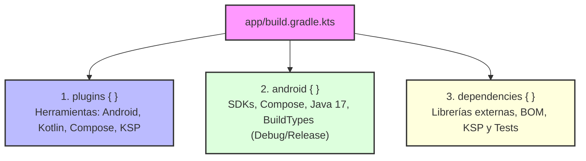

# El Fichero de Construcción: `build.gradle.kts`

---

## 1. El Corazón de tu Módulo: `build.gradle.kts`

En el corazón de la compilación de cualquier aplicación Android se encuentra el archivo `app/build.gradle.kts`. Aunque históricamente se escribía en Groovy (`build.gradle`), hoy en día el estándar indiscutible de la industria es **Kotlin DSL** (`.kts`), que ofrece tipado estático, comprobación de errores en tiempo de edición y autocompletado nativo.

Este fichero define **CÓMO** se debe construir tu aplicación: qué SDK de Android soporta, qué plugins intervienen, qué librerías externas consume y qué optimizaciones de seguridad o rendimiento se aplican en cada variante.



---

## 2. Anatomía Completa de un `build.gradle.kts` Profesional

A continuación se muestra la estructura recomendada para proyectos modernos de **2º DAM**, configurada para **Jetpack Compose**, **Kotlin 2.0+** y **Java 17**:

```kotlin
// 1. PLUGINS APLICADOS
plugins {
    alias(libs.plugins.android.application)
    alias(libs.plugins.kotlin.android)
    alias(libs.plugins.compose.compiler) // Imprescindible desde Kotlin 2.0+
    alias(libs.plugins.ksp) optional true // Procesador moderno de anotaciones (Room)
}

// 2. CONFIGURACIÓN DEL ECOSISTEMA ANDROID
android {
    namespace = "com.ejemplo.gamevault"
    compileSdk = 35 // Android 15 (APIs disponibles durante la compilación)

    defaultConfig {
        applicationId = "com.ejemplo.gamevault"
        minSdk = 24 // Android 7.0 (compatibilidad con el 95%+ de dispositivos)
        targetSdk = 35 // Versión para la que se ha diseñado y probado la app
        versionCode = 1 // Número incremental para la Play Store
        versionName = "1.0.0" // Versión visible para los usuarios

        testInstrumentationRunner = "androidx.test.runner.AndroidJUnitRunner"
    }

    buildTypes {
        release {
            isMinifyEnabled = true // R8: Ofuscación y eliminación de código muerto
            proguardFiles(
                getDefaultProguardFile("proguard-android-optimize.txt"),
                "proguard-rules.pro"
            )
        }
        debug {
            applicationIdSuffix = ".debug" // Permite instalar ambas variantes a la vez en el móvil
            isDebuggable = true
        }
    }

    // Activación de características modernas
    buildFeatures {
        compose = true // Habilita el soporte para Jetpack Compose
        buildConfig = true // Genera la clase BuildConfig con variables de compilación
    }

    // Estándar de compilación para la JVM
    compileOptions {
        sourceCompatibility = JavaVersion.VERSION_17
        targetCompatibility = JavaVersion.VERSION_17
    }
    kotlinOptions {
        jvmTarget = "17"
    }
}

// 3. DECLARACIÓN DE DEPENDENCIAS
dependencies {
    // Core y ciclo de vida
    implementation(libs.androidx.core.ktx)
    implementation(libs.androidx.lifecycle.runtime.ktx)
    implementation(libs.androidx.activity.compose)

    // Jetpack Compose mediante BOM (Bill of Materials)
    implementation(platform(libs.androidx.compose.bom))
    implementation(libs.androidx.ui)
    implementation(libs.androidx.ui.graphics)
    implementation(libs.androidx.ui.tooling.preview)
    implementation(libs.androidx.material3)

    // Herramientas de depuración (solo se empaquetan en Debug)
    debugImplementation(libs.androidx.ui.tooling)
    debugImplementation(libs.androidx.ui.test.manifest)

    // Tests unitarios locales y en dispositivo
    testImplementation(libs.junit)
    androidTestImplementation(libs.androidx.junit)
    androidTestImplementation(libs.androidx.espresso.core)
    androidTestImplementation(platform(libs.androidx.compose.bom))
}
```

---

## 3. Disección de los Bloques Clave

### 3.1. Plugins y el nuevo compilador de Compose
En versiones anteriores a Kotlin 2.0, el compilador de Compose requería configurar manualmente el bloque `composeOptions { kotlinCompilerExtensionVersion = "..." }`. 

Hoy en día, el compilador de Compose se integra directamente como un plugin de Kotlin:
```kotlin
plugins {
    alias(libs.plugins.compose.compiler)
}
```
Esto elimina los problemas históricos de desincronización entre la versión de Kotlin y la extensión de Compose.

---

### 3.2. Versiones del SDK: `compileSdk` vs `minSdk` vs `targetSdk`

Es uno de los conceptos que más dudas genera en los exámenes y prácticas:

| Propiedad | Función | Ejemplo recomendado |
| :--- | :--- | :--- |
| **`compileSdk`** | ¿Con qué APIs compila Android Studio? Define los métodos y clases disponibles en tu código Kotlin. | `35` (Android 15) |
| **`minSdk`** | ¿Cuál es el teléfono más antiguo que puede instalar la app? Si un usuario tiene una versión inferior, Google Play no le dejará instalarla. | `24` (Android 7.0) |
| **`targetSdk`** | ¿Para qué versión has certificado el comportamiento de tu app? Activa las restricciones de seguridad y permisos modernos del sistema operativo. | `35` (Debe coincidir con `compileSdk`) |

---

### 3.3. Bloque `buildFeatures`

Permite activar o desactivar generadores de código para que Gradle no consuma memoria innecesaria:

```kotlin
buildFeatures {
    compose = true      // Obligatorio para proyectos con UI declarativa Compose
    buildConfig = true  // Permite acceder a BuildConfig.APPLICATION_ID o variables secretas
}
```

!!! tip "Inyección de variables seguras (`buildConfigField`)"
    Si tu aplicación consume una API REST externa, **nunca escribas la URL o la clave directamente en el código de Kotlin**. Puedes inyectarla desde Gradle según la variante:
    
    ```kotlin
    buildTypes {
        debug {
            buildConfigField("String", "API_BASE_URL", "\"https://dev.api.midominio.com/\"")
        }
        release {
            buildConfigField("String", "API_BASE_URL", "\"https://api.midominio.com/\"")
        }
    }
    ```
    En tu código Kotlin podrás acceder a ella de forma limpia con `BuildConfig.API_BASE_URL`.

---

### 3.4. Tipos de Dependencias (Ámbitos o Scopes)

En el bloque `dependencies { }`, cada palabra clave determina en qué momento del ciclo de vida estará disponible esa librería:

| Ámbito | ¿Se incluye en el APK final? | Propósito principal | Ejemplo |
| :--- | :---: | :--- | :--- |
| **`implementation`** | ✅ Sí | Dependencia estándar de producción. | `libs.material3`, `libs.retrofit` |
| **`debugImplementation`**| ⚠️ Solo en Debug | Herramientas de inspección visual o rendimiento. No engorda la APK de producción. | `libs.ui.tooling` (Preview de Compose) |
| **`ksp`** | ❌ No | Procesador de símbolos en tiempo de compilación. Genera código automático para bases de datos o inyección. | `libs.room.compiler` |
| **`testImplementation`** | ❌ No | Pruebas unitarias que se ejecutan en la máquina del desarrollador (rápidas, sin móvil). | `libs.junit`, `libs.mockk` |
| **`androidTestImplementation`** | ⚠️ Solo en APK de test | Pruebas de integración o UI que se ejecutan sobre un emulador o teléfono real. | `libs.espresso.core` |

!!! warning "¿KSP o KAPT?"
    Históricamente se utilizaba `kapt` (*Kotlin Annotation Processing Tool*). Hoy en día, **`kapt` está en mantenimiento** y su uso ralentiza las compilaciones. Para librerías como **Room** o **Moshi**, el estándar de Google es **KSP** (*Kotlin Symbol Processing*), que compila hasta un **50% más rápido**.

---

## 4. Ejecutar Tareas de Gradle desde la Terminal

Cualquier bloque definido en `build.gradle.kts` genera tareas que puedes lanzar directamente desde **Warp**:

### Compilar e instalar la app en el emulador
```bash
./gradlew installDebug
# o con nuestro atajo de Warp:
gw installDebug
```

### Comprobar las dependencias del proyecto y buscar conflictos
```bash
./gradlew app:dependencies
```

### Ejecutar todas las pruebas unitarias locales
```bash
./gradlew testDebugUnitTest
# o con el atajo:
gw-test
```
