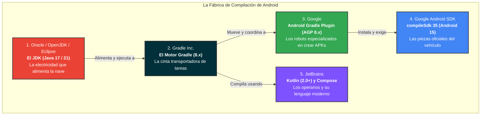
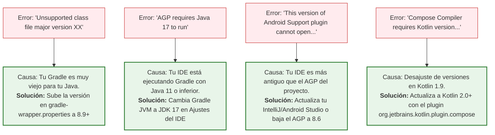

# Matriz de Compatibilidad en Android: JDK, Gradle, AGP, Kotlin y Compose

---

## 1. El Gran Misterio: ¿Por qué mi proyecto no compila si no he tocado nada?

Uno de los mayores choques culturales para los alumnos de 2º de DAM al comenzar con Android es descubrir que un proyecto recién descargado de GitHub o creado en clase **puede fallar estrepitosamente antes de escribir una sola línea de código**.

En 1º de DAM estábamos acostumbrados a un modelo con **un único compilador**:
> *"Instalo el JDK, abro IntelliJ, pulso 'Play' y mi programa Java o C# funciona. Si falla, el error está en mi código."*

En Android, sin embargo, nos encontramos con errores intimidantes como:

- `Unsupported class file major version 65`
- `Android Gradle plugin requires Java 17 to run. You are currently using Java 11.`
- `This version of the Android Support plugin cannot open this project...`
- `This version (X) of the Compose Compiler requires Kotlin version (Y)...`

¿Por qué ocurre esto? La respuesta es sencilla: **Google no es dueña de todas las herramientas**.

---

## 2. La Metáfora: La Línea de Montaje de Cuatro Empresas Independientes

Para compilar una aplicación Android moderna, cuatro fabricantes independientes deben colaborar en perfecta armonía:



- **El JDK (Java Development Kit):** Es la máquina virtual en tu ordenador que ejecuta el proceso de construcción. Si la versión de Java es demasiado moderna o antigua, la cinta de Gradle no sabrá cómo arrancar.
- **Gradle:** Es el orquestador agnóstico de tareas. No sabe qué es un móvil; solo sabe descargar librerías de internet y procesar tareas paso a paso.
- **AGP (Android Gradle Plugin):** Es el plugin creado por Google que se "enchufa" a Gradle para enseñarle cómo empaquetar un APK, procesar recursos o generar archivos DEX para teléfonos.
- **Kotlin y Compose:** Es el lenguaje de programación y el compilador de interfaz gráfica de JetBrains que traduce tu código declarativo a bytecode ejecutable.

!!! warning "La Ley de Oro de la Compatibilidad"
    **Un robot moderno de Google (AGP 8.7) no sabe funcionar en una cinta antigua de Gradle de hace dos años (Gradle 7.2), ni Gradle 8.0 sabe ejecutarse sobre la electricidad moderna de Java 21.**
    
    Todas las piezas deben pertenecer a épocas compatibles.

---

## 3. El "Combo Infalible" para el Curso 2026/2027

Antes de analizar proyectos antiguos o tablas complejas, grábate esta combinación. **Si tus proyectos respetan esta receta, compilarán a la primera sin ningún tipo de fricción:**

| Componente | Versión Recomendada para 2º DAM | Dónde se define |
| :--- | :--- | :--- |
| **JDK en el equipo (Gradle JVM)** | **Java 17 LTS** (o Java 21 LTS) | En Warp con Scoop/SDKMAN y en los ajustes del IDE |
| **Gradle Wrapper** | **Gradle 8.9 o superior** | `gradle/wrapper/gradle-wrapper.properties` |
| **Android Plugin (AGP)** | **8.7.x** | `gradle/libs.versions.toml` |
| **SDK de Compilación (`compileSdk`)** | **35** (Android 15) | `app/build.gradle.kts` |
| **Kotlin + Compilador de Compose** | **2.0.21** (o superior) | `gradle/libs.versions.toml` |

---

## 4. La Revolución de Kotlin 2.0: El Fin del Dolor de Cabeza con Compose

Durante años, la relación entre Kotlin y Jetpack Compose fue la principal causa de abandono y frustración entre desarrolladores noveles.

### El Pasado (Kotlin 1.9 o inferior): El "Mismatch" Permanente
Google publicaba el compilador de Compose en un repositorio independiente. Esto obligaba a que cada subversión exacta de Kotlin requiriese una versión idéntica de la extensión de Compose:

```kotlin
// ❌ ENFOQUE ANTIGUO (Propenso a fallos graves):
android {
    composeOptions {
        // Si subías Kotlin a 1.9.23 y dejabas 1.5.8 aquí, ¡el proyecto crasheaba!
        kotlinCompilerExtensionVersion = "1.5.10"
    }
}
```

### El Presente (A partir de Kotlin 2.0): Unificación Total
A partir de **Kotlin 2.0**, Google y JetBrains unificaron esfuerzos: el compilador de Compose ahora se desarrolla **dentro del propio compilador de Kotlin**.

```kotlin
// ✅ ENFOQUE MODERNO (Oficial en Kotlin 2.0+):
plugins {
    alias(libs.plugins.android.application)
    alias(libs.plugins.kotlin.android)
    alias(libs.plugins.compose.compiler) // <-- Sincronizado automáticamente con Kotlin
}
```

!!! success "Ventaja Directa para el Alumno"
    Al usar `alias(libs.plugins.compose.compiler)`, la versión del compilador de Compose **se sincroniza automáticamente** con la versión de Kotlin definida en tu catálogo. Ya no existe la propiedad `kotlinCompilerExtensionVersion`.

---

## 5. Tabla Maestra de Compatibilidad

Utiliza esta tabla como referencia de consulta cuando abras proyectos de cursos anteriores, repositorios de internet o tras actualizar tu entorno:

| Versión de Android Objetivo | `compileSdk` | Versión de AGP Requerida | Versión de Gradle Recomendada | Versión de JDK (Gradle JVM) | Versión de Kotlin |
| :---: | :---: | :---: | :---: | :---: | :---: |
| **Android 15 (Vanilla Ice Cream)** | **35** | **8.6.x - 8.8+** | **8.9 - 8.11+** | **Java 17 o Java 21** | **Kotlin 2.0.x / 2.1.x** |
| **Android 14 (Upside Down Cake)** | **34** | **8.2.x - 8.5.x** | **8.4 - 8.7** | **Java 17** | **Kotlin 1.9.2x / 2.0.x** |
| **Android 13 (Tiramisu)** | **33** | **7.4.x - 8.1.x** | **7.5 - 8.0** | **Java 11 o Java 17** | **Kotlin 1.8.x / 1.9.x** |
| **Android 12 / 12L (Snow Cone)** | **31 / 32** | **7.1.x - 7.3.x** | **7.2 - 7.4** | **Java 11** | **Kotlin 1.6.x / 1.7.x** |

---

## 6. Dónde se Configura Cada Pieza en tu Proyecto

Para tener el control total, solo necesitas revisar **cuatro archivos clave**:

```text
mi-proyecto/
├── gradle/
│   ├── wrapper/
│   │   └── gradle-wrapper.properties    <-- 1. Versión de Gradle Wrapper
│   └── libs.versions.toml               <-- 2. Versiones de AGP, Kotlin y Compose
├── app/
│   └── build.gradle.kts                 <-- 3. compileSdk, minSdk y Java Target
└── (Ajustes de IntelliJ / Warp)         <-- 4. Gradle JVM (JDK del sistema)
```

### 1. `gradle/wrapper/gradle-wrapper.properties` (Gradle)
```properties
distributionUrl=https\://services.gradle.org/distributions/gradle-8.9-bin.zip
```

### 2. `gradle/libs.versions.toml` (Plugins y Lenguaje)
```toml
[versions]
agp = "8.7.0"
kotlin = "2.0.21"

[plugins]
android-application = { id = "com.android.application", version.ref = "agp" }
kotlin-android = { id = "org.jetbrains.kotlin.android", version.ref = "kotlin" }
compose-compiler = { id = "org.jetbrains.kotlin.plugin.compose", version.ref = "kotlin" }
```

### 3. `app/build.gradle.kts` (SDK de Android y JVM Target)
```kotlin
android {
    compileSdk = 35 // Android 15

    defaultConfig {
        minSdk = 24
        targetSdk = 35
    }

    compileOptions {
        sourceCompatibility = JavaVersion.VERSION_17
        targetCompatibility = JavaVersion.VERSION_17
    }
}
```

### 4. Ajustes del IDE: `Settings ➔ Build Tools ➔ Gradle`
Comprueba que el campo **Gradle JVM** apunte a tu **JDK 17** (o Java 21). Si apunta por error a Java 8 o Java 11 antiguo, Gradle no podrá arrancar el plugin de Android.

---

## 7. Guía de Diagnóstico Rápido: ¿Qué falla cuando tocas qué?

Cuando veas un error rojo durante la sincronización, usa esta guía para localizar la causa en 10 segundos:



### Protocolo de Supervivencia en el Aula (3 Pasos):

1. **Paso 1 (Comprobar la versión de Java):** En el 80% de los casos en clase, el problema es que el ordenador del instituto tiene un Java 8 o Java 11 antiguo seleccionado en `Settings ➔ Build Tools ➔ Gradle ➔ Gradle JVM`. Cámbialo a **Java 17**.

2. **Paso 2 (Revisar el Wrapper):** Si abres un proyecto antiguo de GitHub, abre `gradle-wrapper.properties` y sube la versión a `gradle-8.9-bin.zip`.

3. **Paso 3 (Limpiar la caché):** Abre Warp y ejecuta:

    ```bash
    ./gradlew clean --refresh-dependencies
    # o con nuestro atajo:
    gw clean
    ```
