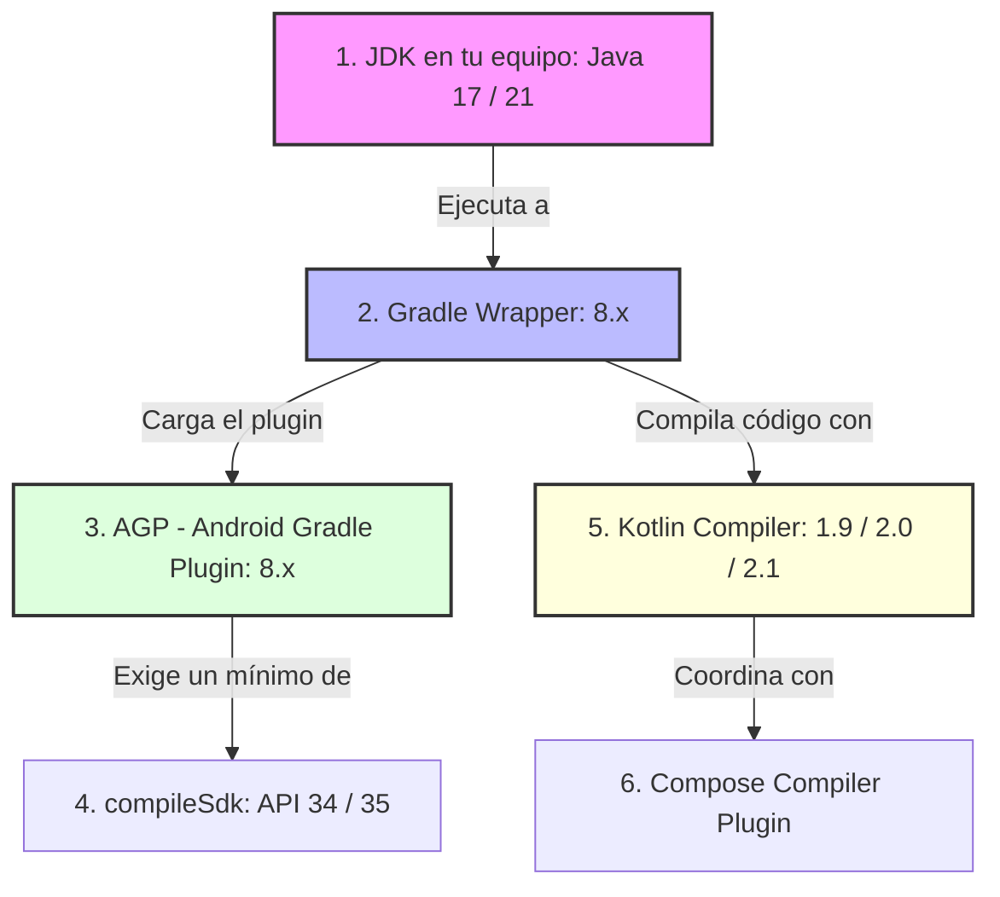

# Matriz de Compatibilidad en Android: JDK, Gradle, AGP, Kotlin y Compose

---

## 1. El Gran Desafío: La Cadena de Construcción en Android

Uno de los mayores obstáculos a los que se enfrenta cualquier estudiante o desarrollador novato en Android no es programar la lógica o la interfaz, sino conseguir que el proyecto **compile y sincronice correctamente** cuando se abren proyectos descargados de internet o se actualizan dependencias.

Es muy habitual toparse con mensajes de error intimidantes como:
- `Unsupported class file major version 65`
- `This version of the Android Support plugin for IntelliJ IDEA cannot open the Gradle project...`
- `This version (X) of the Compose Compiler requires Kotlin version (Y)...`
- `Android Gradle plugin requires Java 17 to run. You are currently using Java 11.`

Todos estos errores tienen un origen común: **incompatibilidad entre las piezas del ecosistema de compilación**. 

A diferencia de otros entornos donde un único compilador se encarga de todo, en Android moderno conviven **cinco tecnologías independientes** que deben estar perfectamente coordinadas:



---

## 2. La "Cadena de Mando": ¿Qué Controla a Qué?

Para resolver cualquier conflicto de versiones, primero debemos entender el rol de cada eslabón de la cadena:

### 1. El JDK (Java Development Kit)
Es la máquina virtual y entorno de desarrollo de Java instalado en tu ordenador que **ejecuta el propio proceso de Gradle**.
- No confundir con la versión de Java que soporta tu teléfono: es la versión de Java que tu ordenador usa para compilar.
- **Regla actual:** Desde AGP 8.0, es **obligatorio utilizar Java 17 como mínimo** (y Java 21 en versiones recientes). Intentar compilar con Java 8 o Java 11 provocará un fallo inmediato.

### 2. Gradle (El Motor de Tareas)
Es el sistema agnóstico que orquesta la compilación, gestiona dependencias y ejecuta tareas.
- Se define en el proyecto mediante el **Gradle Wrapper** (`gradle/wrapper/gradle-wrapper.properties`).
- Cada versión de Gradle solo sabe ejecutarse sobre ciertas versiones de JDK. Por ejemplo, Gradle 8.0 no soporta Java 21; para usar Java 21 necesitas Gradle 8.5+.

### 3. AGP (Android Gradle Plugin)
Es el plugin desarrollado por Google (`com.android.application` o `com.android.library`) que le enseña a Gradle las reglas específicas de Android (procesar recursos XML, empaquetar APKs/AABs, compilar DEX).
- **Relación estricta:** Cada versión de AGP exige una versión mínima de Gradle. Si intentas usar AGP 8.6 con un Gradle 7.5 antiguo, la sincronización fallará.

### 4. `compileSdk` (El Nivel de API de Android)
Es la versión del SDK de Android contra la que se compila tu aplicación (por ejemplo, API 34 para Android 14 o API 35 para Android 15).
- Para poder compilar contra una versión moderna de `compileSdk`, necesitas un AGP que conozca esa versión. No puedes usar `compileSdk = 35` con un AGP 7.x de hace varios años.

### 5. Compilador de Kotlin
El compilador (`org.jetbrains.kotlin.android`) que traduce tus archivos `.kt` a bytecode.
- Debe ser compatible con la versión de Gradle utilizada y con el compilador de Jetpack Compose.

---

## 3. La Revolución de Kotlin 2.0 y el Compilador de Compose

Durante años, la relación entre Kotlin y Jetpack Compose fue el mayor quebradero de cabeza para la comunidad de desarrolladores.

### El Pasado (Antes de Kotlin 2.0): El Infierno de Versiones
Históricamente, el compilador de Compose era desarrollado por Google en un repositorio separado del de Kotlin. Esto obligaba a que **cada versión exacta de Kotlin exigiera una versión exacta del compilador de Compose**:

```kotlin
// ANTES (En desuso, requiere alineación milimétrica):
android {
    composeOptions {
        // Si subías Kotlin a 1.9.23 y aquí tenías 1.5.8, la compilación EXPLOTABA
        kotlinCompilerExtensionVersion = "1.5.10"
    }
}
```
Si querías actualizar Kotlin para aprovechar una mejora del lenguaje, estabas bloqueado hasta que Google publicaba la versión correspondiente de `kotlinCompilerExtensionVersion`.

### El Presente (A partir de Kotlin 2.0): Unificación y Simplicidad
A partir de **Kotlin 2.0.0**, JetBrains y Google unificaron el compilador. El compilador de Compose ahora se desarrolla **dentro del propio compilador de Kotlin**:

```kotlin
// AHORA (Enfoque moderno oficial con Kotlin 2.0+):
plugins {
    alias(libs.plugins.android.application)
    alias(libs.plugins.kotlin.android)
    alias(libs.plugins.kotlin.compose) // <-- Plugin oficial unificado
}
```
!!! success "Fin del Mismatch de Compose"
    Al usar el plugin `org.jetbrains.kotlin.plugin.compose`, la versión del compilador de Compose **se sincroniza automáticamente** con la versión de Kotlin definida en tu proyecto. Ya no es necesario configurar `kotlinCompilerExtensionVersion`.

---

## 4. Tabla Maestra de Compatibilidad (Chuleta de Referencia)

Esta tabla resume las combinaciones oficiales compatibles que debes utilizar en tus proyectos:

| Versión de Android Objetivo | `compileSdk` | Versión de AGP Requerida | Versión de Gradle Recomendada | Versión de JDK (Gradle JVM) | Versión de Kotlin |
| :---: | :---: | :---: | :---: | :---: | :---: |
| **Android 15 (Vanilla Ice Cream)** | **35** | **8.6.x - 8.8+** | **8.9 - 8.11+** | **Java 17 o Java 21** | **Kotlin 2.0.x / 2.1.x** |
| **Android 14 (Upside Down Cake)** | **34** | **8.2.x - 8.5.x** | **8.4 - 8.7** | **Java 17** | **Kotlin 1.9.2x / 2.0.x** |
| **Android 13 (Tiramisu)** | **33** | **7.4.x - 8.1.x** | **7.5 - 8.0** | **Java 11 o Java 17** | **Kotlin 1.8.x / 1.9.x** |
| **Android 12 / 12L (Snow Cone)** | **31 / 32** | **7.1.x - 7.3.x** | **7.2 - 7.4** | **Java 11** | **Kotlin 1.6.x / 1.7.x** |

---

## 5. Dónde se Configura Cada Elemento en el Proyecto

Para tener el control absoluto de las versiones, estos son los **cuatro archivos clave** que debes inspeccionar:

### 1. La Versión de Gradle: `gradle/wrapper/gradle-wrapper.properties`

```properties
distributionBase=GRADLE_USER_HOME
distributionPath=wrapper/dists
# Aquí se define qué versión de Gradle se descargará y usará automáticamente:
distributionUrl=https\://services.gradle.org/distributions/gradle-8.9-bin.zip
zipStoreBase=GRADLE_USER_HOME
zipStorePath=wrapper/dists
```

### 2. Las Versiones de Plugins y Librerías: `gradle/libs.versions.toml`

En el catálogo de versiones centralizado definimos las versiones de AGP y Kotlin:

```toml
[versions]
agp = "8.6.1"
kotlin = "2.0.21"
coreKtx = "1.13.1"

[plugins]
android-application = { id = "com.android.application", version.ref = "agp" }
kotlin-android = { id = "org.jetbrains.kotlin.android", version.ref = "kotlin" }
kotlin-compose = { id = "org.jetbrains.kotlin.plugin.compose", version.ref = "kotlin" }
```

### 3. Las Versiones del SDK y Compatibilidad Java: `app/build.gradle.kts`

```kotlin
android {
    namespace = "com.docente.gamevault"
    compileSdk = 35 // Nivel de API para compilar

    defaultConfig {
        applicationId = "com.docente.gamevault"
        minSdk = 26
        targetSdk = 35
        versionCode = 1
        versionName = "1.0"
    }

    compileOptions {
        sourceCompatibility = JavaVersion.VERSION_17
        targetCompatibility = JavaVersion.VERSION_17
    }
    kotlinOptions {
        jvmTarget = "17"
    }
    buildFeatures {
        compose = true
    }
}
```

### 4. El JDK Utilizado por el IDE (IntelliJ IDEA o Android Studio)

En tu entorno de desarrollo, ve a:
👉 `Settings (o Preferences)` → `Build, Execution, Deployment` → `Build Tools` → `Gradle`

Localiza la opción **Gradle JVM**:
- Debe apuntar a un **JDK 17** o **JDK 21** (como el *jbr-17* embebido de JetBrains o un JDK instalado como Temurin/Corretto).
- Si seleccionas accidentalmente un Java 8 o Java 11 antiguo de tu sistema, la sincronización fallará de inmediato.

---

## 6. Guía de Diagnóstico de Errores Típicos ("Troubleshooting")

Cuando un proyecto no compile por problemas de versiones, consulta esta guía rápida de resolución:

### Error 1: `Unsupported class file major version XX`
- **Causa:** Tu versión de Gradle es demasiado antigua para el JDK que estás utilizando.
  - Versión 65 = Java 21
  - Versión 61 = Java 17
  - Versión 55 = Java 11
- **Solución:**
  1. O actualizas Gradle en `gradle-wrapper.properties` a una versión moderna (ej. Gradle 8.9).
  2. O en los ajustes de tu IDE cambias la `Gradle JVM` a Java 17.

### Error 2: `Android Gradle plugin requires Java 17 to run`
- **Causa:** Tienes AGP 8+ configurado en tu proyecto, pero tu IDE tiene configurado un JDK 11 o inferior para ejecutar Gradle.
- **Solución:** Ve a `Settings` → `Build Tools` → `Gradle` y cambia **Gradle JVM** a una versión 17+.

### Error 3: `This version of the Android Support plugin cannot open this project`
- **Causa:** El proyecto utiliza una versión de AGP más moderna que la que soporta tu versión de IntelliJ IDEA.
- **Solución:** 
  1. Actualiza IntelliJ IDEA a la última versión disponible mediante JetBrains Toolbox.
  2. O baja temporalmente la versión de AGP en `libs.versions.toml` a una que tu versión actual del IDE soporte.

### Error 4: `This version (X) of the Compose Compiler requires Kotlin version (Y)`
- **Causa:** Estás en Kotlin 1.9.x y las versiones de `kotlin` y `kotlinCompilerExtensionVersion` no coinciden exactamente.
- **Solución:**
  1. Consulta la tabla oficial de Compose to Kotlin Compatibility Map de Google.
  2. **La mejor solución:** Migra el proyecto a **Kotlin 2.0+** adoptando el plugin `org.jetbrains.kotlin.plugin.compose`.
