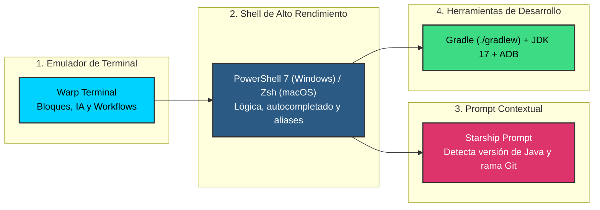
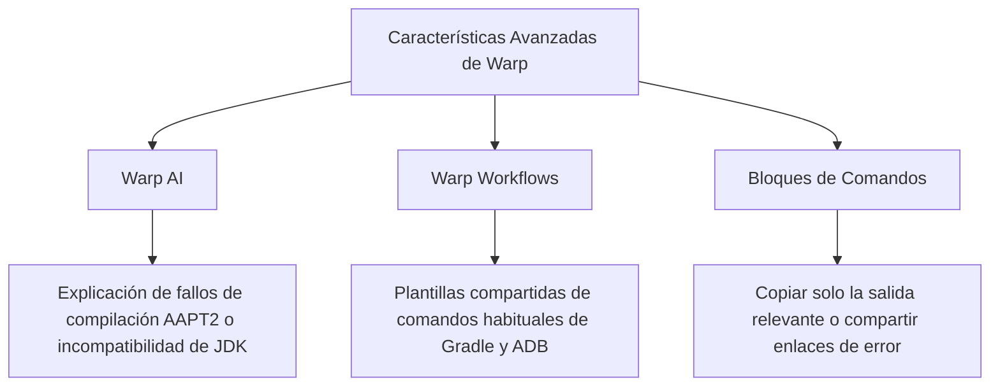

# Entorno de Terminal Avanzado: Warp, Shell Moderno y Starship

---

## 1. ¿Por qué una Terminal Moderna en Desarrollo Móvil?

Aunque **Android Studio** e **IntelliJ IDEA** disponen de botones gráficos para compilar, sincronizar y ejecutar aplicaciones, depender exclusivamente de la interfaz gráfica presenta limitaciones importantes en el ámbito profesional:

1. **Diagnóstico preciso de fallos:** Cuando una compilación falla por incompatibilidades de JVM o dependencias circulares, la consola de Gradle con parámetros como `--stacktrace`, `--info` o `--scan` ofrece información mucho más detallada que los resúmenes del IDE.
2. **Velocidad y automatización:** Tareas repetitivas (limpiar caché de Gradle, desinstalar una app del emulador, consultar logs filtrados de `adb`, compilar variantes de release) se ejecutan en segundos mediante atajos de terminal.
3. **Flujos profesionales (CI/CD):** En entornos reales, los pipelines de integración continua (GitHub Actions, GitLab CI, Bitrise) compilan las aplicaciones mediante la línea de comandos de Gradle, nunca con interfaces gráficas.

Para conseguir una experiencia cómoda, ágil y visualmente atractiva, configuraremos una **pila de terminal de última generación**:



---

## 2. Instalación y Configuración Paso a Paso

!!! info "¿Dónde está el Android SDK y cómo se instala?"
    Para que comandos como `adb` o los emuladores funcionen en tu terminal, necesitas tener instalados los componentes del **Android SDK**.
    
    Si aún no lo has instalado a través del IDE o necesitas comprobar la ruta exacta de la carpeta en tu disco (`ANDROID_HOME`), consulta la guía previa:  
    👉 [**Configuración del Android SDK y Variables del Sistema en IntelliJ IDEA**](../00-ide-intellij/index.md#6-configuracion-del-entorno-android-sdk-y-variables-del-sistema).

Sigue las instrucciones correspondientes al sistema operativo de tu equipo:

=== "Windows 10 / 11 (PowerShell 7 + Scoop)"

    ### Paso 1: Instalar Scoop (Gestor de paquetes sin privilegios)
    Abre la consola de **Windows PowerShell** y ejecuta:
    ```powershell
    Set-ExecutionPolicy -ExecutionPolicy RemoteSigned -Scope CurrentUser
    irm get.scoop.sh | iex
    ```

    ### Paso 2: Instalar herramientas base con Scoop
    Añadimos el repositorio de Java e instalamos la versión moderna de PowerShell (`pwsh`), Git, el JDK 17 oficial y el motor de Starship:
    ```powershell
    # 1. Repositorio oficial de Java
    scoop bucket add java

    # 2. Instalación de herramientas
    scoop install pwsh git temurin17-jdk starship
    ```

    ### Paso 3: Instalar Warp Terminal y la tipografía Nerd Font
    Para que los iconos del prompt (taza de Java, ramas de Git, carpetas) se muestren correctamente, necesitamos una fuente con glifos extendidos:
    ```powershell
    # Instalar Warp Terminal
    winget install Warp.Warp

    # Instalar JetBrains Mono con soporte para iconos
    winget install DEVCOM.JetBrainsMonoNerdFont
    ```
    *(Si winget experimenta problemas de red en tu equipo, puedes descargar directamente el instalador desde [warp.dev](https://www.warp.dev) y la fuente desde [nerdfonts.com](https://www.nerdfonts.com)).*

    ### Paso 4: Configurar el perfil de PowerShell 7 (`$PROFILE`)
    El archivo de perfil se ejecuta al abrir cada sesión. Vamos a inicializar Starship y registrar atajos de desarrollo:
    
    1. Abre o crea el archivo de perfil:
       ```powershell
       if (!(Test-Path $PROFILE)) { New-Item -ItemType File -Path $PROFILE -Force }
       notepad $PROFILE
       ```
    2. Pega el siguiente contenido y guarda el archivo:
       ```powershell
       # Inicializar prompt de Starship
       Invoke-Expression (&starship init powershell)

       # Atajos rápidos para Gradle en PMDM
       function gw { ./gradlew $args }
       function gw-clean { ./gradlew clean }
       function gw-debug { ./gradlew assembleDebug }
       function gw-test { ./gradlew testDebugUnitTest }

       # Atajos para Android Debug Bridge (ADB)
       function adb-devs { adb devices -l }
       function adb-restart { adb kill-server; adb start-server }
       ```

    ### Paso 5: Ajustar Warp Terminal
    Abre Warp y accede a **Settings** (`Ctrl + ,`):

    1. **Features ➔ Startup shell:** Selecciona **Custom** e introduce la ruta directa al ejecutable de Scoop:
       ```text
       C:\Users\<tu_usuario>\scoop\apps\pwsh\current\pwsh.exe
       ```
       *(Evita usar las rutas de `WindowsApps`, ya que son enlaces protegidos que pueden congelar el arranque).*

    2. **Appearance ➔ Prompt:** Selecciona la opción **"Honor user's custom prompt (PS1)"**.

    3. **Appearance ➔ Terminal font:** Elige `JetBrainsMono Nerd Font`.

=== "macOS (Zsh + Homebrew + SDKMAN!)"

    ### Paso 1: Instalar Homebrew (Gestor de paquetes de macOS)
    Si aún no lo tienes instalado, abre el Terminal de macOS y ejecuta:
    ```bash
    /bin/bash -c "$(curl -fsSL https://raw.githubusercontent.com/Homebrew/install/HEAD/install.sh)"
    ```

    ### Paso 2: Instalar Warp, Starship y la Nerd Font
    Ejecuta en la terminal:
    ```bash
    # Instalar emulador Warp
    brew install --cask warp

    # Instalar Starship Prompt
    brew install starship

    # Instalar tipografía con iconos
    brew install --cask font-jetbrains-mono-nerd-font
    ```

    ### Paso 3: Instalar y gestionar JDK con SDKMAN!
    En entornos Unix, [SDKMAN!](https://sdkman.io) es la forma estándar de instalar y alternar versiones del JDK:
    ```bash
    # 1. Instalar SDKMAN
    curl -s "https://get.sdkman.io" | bash
    source "$HOME/.sdkman/bin/sdkman-init.sh"

    # 2. Instalar Java 17 LTS (Eclipse Temurin)
    sdk install java 17.0.12-tem
    ```

    ### Paso 4: Configurar el perfil de Zsh (`~/.zshrc`)
    Edita tu archivo de configuración personal:
    ```bash
    nano ~/.zshrc
    ```
    Añade al final del archivo:
    ```bash
    # Variables de entorno del SDK de Android en macOS
    export ANDROID_HOME=$HOME/Library/Android/sdk
    export PATH=$PATH:$ANDROID_HOME/platform-tools:$ANDROID_HOME/cmdline-tools/latest/bin

    # Inicializar Starship Prompt
    eval "$(starship init zsh)"

    # Atajos de Gradle
    alias gw='./gradlew'
    alias gw-clean='./gradlew clean'
    alias gw-debug='./gradlew assembleDebug'
    alias gw-test='./gradlew testDebugUnitTest'

    # Atajos de ADB
    alias adb-devs='adb devices -l'
    alias adb-restart='adb kill-server && adb start-server'
    ```
    Guarda los cambios con `Ctrl + O`, pulsa `Enter` y sal con `Ctrl + X`. Luego recarga la configuración con `source ~/.zshrc`.

    ### Paso 5: Ajustar Warp Terminal
    Abre Warp y entra en **Settings** (`Cmd + ,`):

    1. **Features ➔ Startup shell:** Viene fijado en `zsh` por defecto.

    2. **Appearance ➔ Prompt:** Selecciona **"Honor user's custom prompt (PS1)"**.

    3. **Appearance ➔ Terminal font:** Elige `JetBrainsMono Nerd Font`.

---

## 3. Configuración de Starship (`starship.toml`)

Starship utiliza un archivo de configuración común para todos los sistemas operativos ubicado en `~/.config/starship.toml`.

### Paso 1: Crear y abrir el archivo de configuración

=== "Windows (PowerShell)"
    ```powershell
    New-Item -ItemType Directory -Path "$HOME\.config" -Force
    New-Item -ItemType File -Path "$HOME\.config\starship.toml" -Force
    notepad "$HOME\.config\starship.toml"
    ```

=== "macOS (Zsh)"
    ```bash
    mkdir -p ~/.config
    nano ~/.config/starship.toml
    ```

### Paso 2: Pegar la configuración recomendada para Android

Pega el siguiente contenido dentro de `starship.toml`:

```toml
# Formato visual en dos líneas con separación limpia
add_newline = true

[character]
success_symbol = "[➜](bold green)"
error_symbol = "[✗](bold red)"

# Módulo de Java: se activa automáticamente al detectar proyectos Android/Java
[java]
symbol = "☕ "
style = "bold yellow"
format = "via [$symbol($version )]($style)"

# Módulo de Git: rama actual y cambios pendientes
[git_branch]
symbol = "🌱 "
style = "bold cyan"

[git_status]
style = "bold red"
format = '([\[$all_status$ahead_behind\]]($style) )'

# Módulo de directorio
[directory]
style = "bold blue"
truncation_length = 4
truncate_to_repo = true
```

!!! tip "Comportamiento contextual de Starship"
    Starship **no muestra el icono de Java de forma permanente** para no saturar la pantalla. Solo se activará automáticamente cuando hagas `cd` a un directorio que contenga archivos `.gradle`, `build.gradle.kts`, `.kt` o `.java`.

---

## 4. Atajos de Productividad para PMDM

Una vez configurado el perfil, dispondrás de estos atajos globales tanto en Windows como en macOS:

| Comando | Acción equivalente | Utilidad en el aula |
| :--- | :--- | :--- |
| `gw-debug` | `./gradlew assembleDebug` | Compila la APK de depuración sin abrir el menú de Android Studio. |
| `gw-clean` | `./gradlew clean` | Elimina la carpeta `build/` cuando se corrompe la caché de recursos. |
| `gw-test` | `./gradlew testDebugUnitTest` | Ejecuta las pruebas unitarias locales de la aplicación. |
| `gw tasks` | `./gradlew tasks --all` | Lista todas las tareas disponibles del proyecto. |
| `adb-devs` | `adb devices -l` | Muestra dispositivos físicos y emuladores conectados con sus identificadores. |
| `adb-restart` | `adb kill-server && adb start-server` | Reinicia el demonio de depuración cuando el IDE no detecta el móvil. |

---

## 5. Explotar las Funcionalidades Nativas de Warp

Warp no es solo un visor de texto tradicional, incluye herramientas interactivas que facilitan el trabajo docente:



### 1. Warp AI (Diagnóstico asistido de compilación)
Cuando un comando de Gradle falle (por ejemplo, por una incompatibilidad entre la versión de AGP y el JDK):
- Haz clic derecho sobre el bloque con error o pulsa en **"Ask Warp AI"**.
- La inteligencia artificial analizará el *stacktrace* del compilador y sugerirá la causa exacta (ej. versión de Java requerida o dependencia desactualizada).

### 2. Warp Workflows (Comandos parametrizados)
Pulsando `Ctrl + R` (Windows) o `Cmd + P` (macOS), puedes buscar y ejecutar flujos preconfigurados con parámetros interactivos sin necesidad de memorizar las opciones de consola.

### 3. Navegación y exportación por bloques
Cada comando ejecutado en Warp queda encapsulado en un bloque independiente:
- Puedes hacer clic en el menú del bloque para copiar únicamente la salida de ese comando.
- Puedes compartir un enlace permanente al bloque (*Share Block*) para enviar una duda al profesor con la traza completa de error sin saturar capturas de pantalla.

---

## 6. Preguntas Frecuentes y Solución de Problemas

??? question "¿Por qué no aparece el icono de Java en el prompt?"
    1. Asegúrate de estar dentro de una carpeta que contenga un proyecto Android (con archivo `build.gradle` o `build.gradle.kts`).
    2. Comprueba que Java está en el PATH ejecutando `java -version`.
    3. Verifica que en los ajustes de Warp (**Settings ➔ Appearance ➔ Prompt**) esté marcada la opción **"Honor user's custom prompt (PS1)"**.

??? question "¿Por qué aparecen signos de interrogación o rectángulos rotos en vez de iconos?"
    Significa que la terminal no está utilizando una **Nerd Font**. Ve a **Settings ➔ Appearance ➔ Terminal font** y asegúrate de haber seleccionado `JetBrainsMono Nerd Font` o `CaskaydiaCove Nerd Font`.

??? question "En Windows, Warp se queda congelado indicando 'Starting powershell core...'"
    Ocurre cuando Warp intenta ejecutar el alias protegido de la Microsoft Store (`...\Microsoft\WindowsApps\pwsh.exe`). 
    
    Para resolverlo:
    1. Ve a **Settings ➔ Features ➔ Startup shell**.
    2. Selecciona **Custom** y coloca la ruta directa al binario real de Scoop:
       `C:\Users\<tu_usuario>\scoop\apps\pwsh\current\pwsh.exe`

??? question "¿Por qué la terminal indica que 'adb' no se reconoce como un comando?"
    Significa que la carpeta `platform-tools` del Android SDK no está añadida al `PATH` de tu sistema operativo. Revisa la guía de [configuración de variables de entorno del SDK](../00-ide-intellij/index.md#62-configuracion-de-variables-de-entorno-en-el-sistema-operativo) para registrar la ruta en Windows o macOS y reinicia la terminal.
