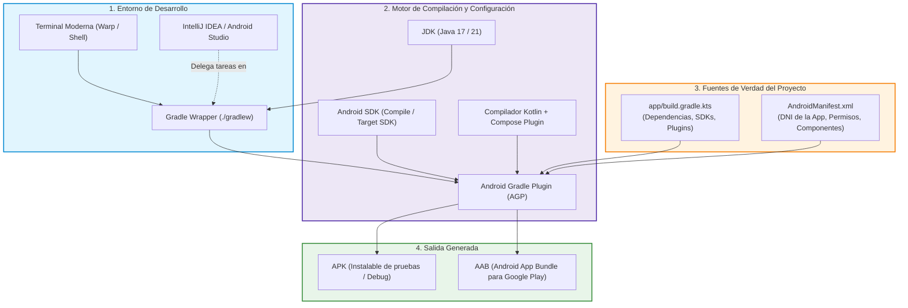

# Herramientas del Proyecto Android: Ecosistema y Configuración

El desarrollo móvil profesional en Android no se limita a escribir código en Kotlin o componer pantallas con Jetpack Compose. A diferencia de los proyectos de consola o escritorio tradicionales de 1º de DAM (donde un único compilador Java bastaba para todo), una aplicación Android moderna es el resultado de una **orquestación compleja de herramientas independientes**: el JDK, el motor de construcción Gradle, el plugin AGP de Google, los SDKs de la plataforma, el compilador de Compose y los manifiestos del sistema operativo.

Dominar esta cadena de herramientas (*toolchain*) es la habilidad que distingue a un alumno principiante de un desarrollador autónomo capaz de configurar entornos desde cero, resolver fallos de compilación en segundos y automatizar entregas en integración continua (CI/CD).

---

## 🛠️ La Cadena de Construcción de Android

El siguiente diagrama resume cómo interactúan las herramientas del ecosistema desde que introduces un comando en la terminal o pulsas *Play* en el IDE hasta que se genera el binario ejecutable:

---

## 🧭 Mapa de Contenidos

Este bloque está estructurado en 5 guías esenciales que cubren desde la terminal hasta la publicación del binario:

### 1. Entorno y Productividad

- **[Entorno de Terminal Avanzado (Warp, Shell y Starship)](./05-terminal-warp.md):**  
  Configuración de una terminal moderna con Warp, prompts contextuales que muestran la versión activa de Java y la rama Git, y automatización con comandos clave de `./gradlew` y `adb`.

### 2. Automatización y Construcción

- **[Gradle, AGP y Estructura del Proyecto Android](./01-gradle-agp-estructura.md):**  
  Qué es Gradle (el motor agnóstico) y qué es AGP (el plugin móvil de Google). Explicación del Gradle Wrapper (`gradlew`), anatomía de carpetas de un proyecto moderno y la regla de oro: *Gradle como Única Fuente de Verdad* frente a los menús del IDE.

- **[El Fichero de Construcción: build.gradle.kts](./02-build-gradle.md):**  
  Estructura interna del fichero de módulo en Kotlin DSL (`plugins`, `android`, `dependencies`), uso de Version Catalogs (`libs.versions.toml`), gestión de Compose BOM y variantes de compilación (*Debug* vs *Release*).

### 3. Diagnóstico y Estabilidad

- **[Matriz de Compatibilidad del Ecosistema Android](./04-matriz-compatibilidad.md):**  
  La guía definitiva para entender por qué un proyecto falla antes de compilar. Tabla de correspondencias obligatorias entre **JDK**, **Gradle**, **AGP**, **Kotlin** y el **Compilador de Compose**, con recetas paso a paso para resolver incompatibilidades de versiones.

### 4. Contrato con el Sistema Operativo

- **[El Manifiesto de la Aplicación: AndroidManifest.xml](./03-android-manifest.md):**  
  El pasaporte y DNI de la aplicación. Declaración de permisos en tiempo de instalación y ejecución (`<uses-permission>`), requisitos de hardware para Google Play (`<uses-feature>`) y registro de componentes centrales (`<activity>`, `<service>`, `<provider>`).

---

## 💡 Reglas de Oro del Taller de Desarrollo Android

!!! tip "1. Gradle es la Única Fuente de Verdad (Single Source of Truth)"
    Cualquier dependencia, versión de Java o configuración de compilación **debe definirse en los ficheros `.gradle.kts`**. Si realizas cambios manuales desde la interfaz gráfica de IntelliJ (`Project Structure`), se borrarán silenciosamente en el siguiente *Sync*.

!!! tip "2. Usa siempre el Gradle Wrapper (`./gradlew`)"
    No instales Gradle de forma global en tu sistema operativo. El wrapper (`./gradlew` en macOS/Linux o `gradlew.bat` en Windows) garantiza que todo el aula, tus compañeros de equipo y los servidores de GitHub Actions ejecuten **exactamente la misma versión de compilador**.

!!! tip "3. Revisa la Matriz antes de actualizar librerías"
    En Android no se pueden subir versiones a ciegas. Una versión de AGP requiere una versión mínima de Gradle, la cual a su vez exige un JDK específico. Si actualizas Kotlin, debes verificar la compatibilidad con el compilador de Compose.

---

## 🔗 Continuación del Itinerario

Una vez comprendido el ecosistema de herramientas y la estructura de construcción, continúa con el desarrollo de la interfaz de usuario y la arquitectura:

- **[Módulo de Jetpack Compose](../00-compose/index.md):** Creación declarativa de interfaces modernas con Kotlin.
- **[Módulo de Arquitectura y KMP con Koin](../02-arquitectura/index.md):** Separación en capas (UI, Dominio, Datos) e inyección de dependencias.
- **[Proyecto Guía Transversal: GameVault](../../proyectos/GameVault/index.md):** Aplicación completa aplicando todas las herramientas vistas.
