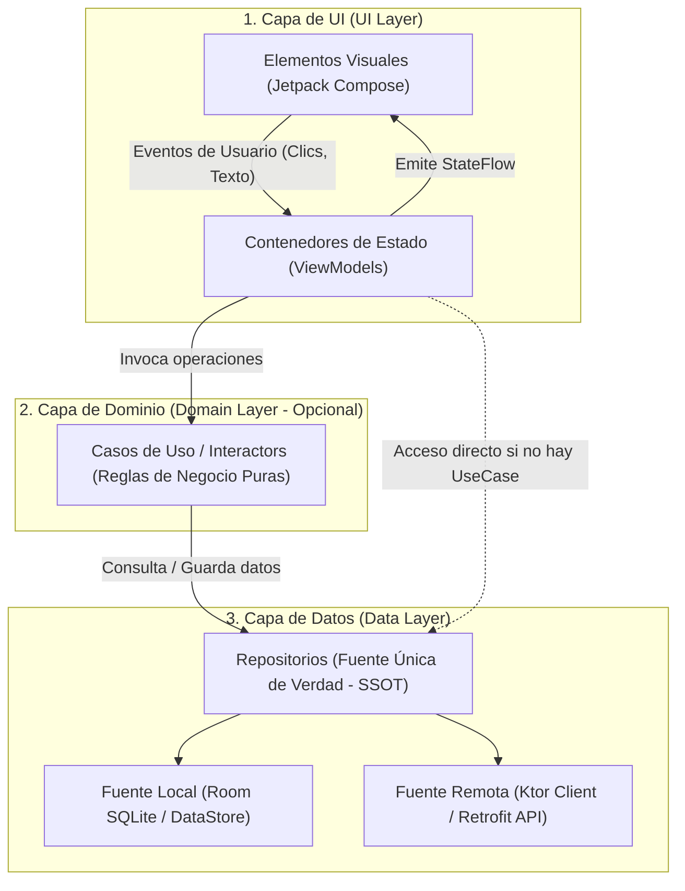

# Guía Oficial de Arquitectura en Android (Google MAD)

Al construir aplicaciones para dispositivos móviles, enfrentamos desafíos que no existen en otros entornos: recursos de hardware limitados (batería, memoria RAM), conectividad de red intermitente o nula, y un sistema operativo que puede destruir y recrear nuestras pantallas en cualquier momento (rotaciones de pantalla, llamadas entrantes o cambios de configuración).

Para resolver estos retos con garantías, Google define la **Guía Oficial de Arquitectura de Apps de Android** (*Modern Android Architecture* o **MAD**). En este tema exploraremos sus principios rectores y la separación en capas recomendada.

---

## 1. Principios Rectores de la Arquitectura Moderna {#principios-arquitectura-google}

Una aplicación Android profesional no sitúa la lógica de red o de base de datos dentro de los componentes visuales (Activities o Composables). La arquitectura recomendada por Google se fundamenta en cinco pilares inquebrantables:

### 1.1. Separación de Responsabilidades (*Separation of Concerns*)

El error más común de un programador principiante es escribir llamadas a bases de datos, peticiones HTTP y formateo de textos dentro del mismo archivo de interfaz gráfica. Cada clase debe tener **una única responsabilidad**:

- La pantalla solo sabe pintar píxeles y recibir toques.

- El repositorio solo sabe coordinar datos.

- El caso de uso solo sabe ejecutar una regla de negocio.

### 1.2. La UI está Gobernada por Modelos de Datos (*UI Driven by Models*)

Las pantallas deben ser un reflejo pasivo de los modelos de datos subyacentes. Si un modelo cambia, la UI se actualiza automáticamente. Los datos deben persistir independientemente de si la pantalla del móvil está encendida, apagada o rotando.

### 1.3. Fuente Única de Verdad (*Single Source of Truth* - SSOT)

Para cualquier dato de la aplicación (por ejemplo, el perfil del usuario o su lista de favoritos), debe existir **un único lugar oficial responsable de almacenarlo y emitirlo**. 

Normalmente, la base de datos local (**Room**) actúa como la Fuente Única de Verdad: cualquier cambio (venga de la red, de un servicio o de un formulario) se guarda primero en la base de datos local, y es esta la que notifica el nuevo estado a la pantalla.

### 1.4. Flujo de Datos Unidireccional (*Unidirectional Data Flow* - UDF)

El estado fluye en un único sentido, evitando condiciones de carrera y desincronizaciones:

- **El Estado fluye hacia abajo (*State Down*):** Desde las capas de datos hacia la UI.

- **Los Eventos fluyen hacia arriba (*Events Up*):** Desde la UI (un clic del usuario) hacia el ViewModel y las capas de lógica.

### 1.5. Estrategia Sin Conexión Primero (*Offline-First*)

Una aplicación móvil moderna debe ser utilizable sin conexión a internet. Los datos se leen inmediatamente desde la caché local (Room / DataStore) y se sincronizan con el servidor remoto en segundo plano cuando la red está disponible.

---

## 2. La Arquitectura en 3 Capas de Google

Google estructura cualquier aplicación Android en tres capas jerárquicas claramente delimitadas:



---

## 3. Capa de UI (*UI Layer*) {#capa-ui-layer}

La misión de la **Capa de UI** es mostrar los datos de la aplicación en la pantalla y capturar las interacciones del usuario. Se divide en dos componentes cooperativos:

1. **Elementos de UI (Vistas / Composables):** Funciones de Jetpack Compose que renderizan la pantalla de forma declarativa. Son **pasivas y sin estado propio** (*Stateless*).

2. **Contenedores de Estado (*State Holders* / ViewModels):** Clases `ViewModel` de Android Jetpack que retienen el estado de la pantalla, sobreviven a rotaciones y gestionan la lógica de presentación.

### El Contrato de Estado: `UiState`

El ViewModel transforma los datos brutos procedentes de las capas inferiores en un único objeto inmutable llamado **`UiState`**, que la pantalla observa y dibuja:

```kotlin
// 1. Estado inmutable representativo de la pantalla
sealed interface CatalogoUiState {
    data object Cargando : CatalogoUiState
    data class Exito(val juegos: List<Juego>, val total: Int) : CatalogoUiState
    data class Error(val mensaje: String) : CatalogoUiState
}

// 2. ViewModel que gestiona y expone el estado
class CatalogoViewModel(
    private val obtenerJuegosUseCase: ObtenerJuegosUseCase
) : ViewModel() {

    private val _uiState = MutableStateFlow<CatalogoUiState>(CatalogoUiState.Cargando)
    val uiState: StateFlow<CatalogoUiState> = _uiState.asStateFlow()

    init {
        cargarCatalogo()
    }

    fun cargarCatalogo() {
        viewModelScope.launch {
            _uiState.value = CatalogoUiState.Cargando
            try {
                val juegos = obtenerJuegosUseCase()
                _uiState.value = CatalogoUiState.Exito(juegos, juegos.size)
            } catch (e: Exception) {
                _uiState.value = CatalogoUiState.Error(e.message ?: "Error desconocido")
            }
        }
    }
}
```

---

## 4. Capa de Dominio (*Domain Layer*) {#capa-domain-layer}

La **Capa de Dominio** es una capa opcional situada entre la UI y los Datos. Su propósito es **encapsular lógica de negocio compleja o reutilizable** que múltiples ViewModels necesiten ejecutar.

### Características Clave:

- **100% Kotlin Puro:** No debe contener ninguna referencia a APIs de Android (`android.content.Context`, Views, etc.). Es totalmente portable a Kotlin Multiplatform (**KMP**).

- **Casos de Uso (*UseCases* o *Interactors*):** Clases que realizan **una única acción concreta**.

- **Operador `invoke()`:** Se suelen implementar sobrecargando el operador `invoke()` para poder ser ejecutadas como si fueran funciones directas:

```kotlin
// Caso de uso: Aplica descuentos y filtra juegos según la edad del usuario
class ObtenerJuegosRecomendadosUseCase(
    private val gameRepository: GameRepository
) {
    suspend operator fun invoke(edadUsuario: Int): List<Juego> {
        val todosLosJuegos = gameRepository.obtenerJuegos()
        return todosLosJuegos
            .filter { juego -> juego.edadMinima <= edadUsuario }
            .sortedByDescending { it.puntuacion }
    }
}
```

---

## 5. Capa de Datos (*Data Layer*) {#capa-data-layer}

La **Capa de Datos** contiene la lógica empresarial fundamental y el acceso a los datos de la aplicación. Se compone de:

1. **Repositorios (*Repositories*):** Coordinan los datos entre las diferentes fuentes, exponen APIs limpias a las capas superiores y resuelven conflictos.

2. **Fuentes de Datos (*DataSources*):** Clases que interactúan directamente con un único medio de almacenamiento o servicio:

    - **`LocalDataSource`:** Lee y escribe en la base de datos SQLite con **Room** o en preferencias con **DataStore**.

    - **`RemoteDataSource`:** Realiza peticiones HTTP a servidores web mediante **Ktor Client** o **Retrofit**.

### La Estrategia Offline-First en el Repositorio

El repositorio combina las fuentes para garantizar disponibilidad inmediata incluso sin internet:

```kotlin
class GameRepository(
    private val localDataSource: GameDao,
    private val remoteDataSource: GameApiService
) {
    // Expone un Flow reactivo: la UI lee siempre de Room (Fuente Única de Verdad)
    fun getJuegos(): Flow<List<JuegoEntity>> = localDataSource.getJuegosFlow()

    // Sincroniza en segundo plano descargando de la API y guardando en Room
    suspend fun sincronizarConServidor() {
        val juegosRemotos = remoteDataSource.fetchJuegos()
        localDataSource.insertarJuegos(juegosRemotos.map { it.toEntity() })
    }
}
```

---

## 6. Resumen de Flujo de Datos Completo

| Paso | Capa | Acción |
| :--- | :--- | :--- |
| **1. Entrada** | UI (Compose) | El usuario abre la pantalla o pulsa un botón. La UI emite un evento al ViewModel. |
| **2. Orquestación** | UI (ViewModel) | El ViewModel invoca el Caso de Uso adecuado dentro de una corrutina (`viewModelScope`). |
| **3. Negocio** | Dominio (UseCase) | El Caso de Uso ejecuta reglas de validación y solicita datos al Repositorio. |
| **4. Coordinación** | Datos (Repository) | El Repositorio lee la caché local (Room) y sincroniza con el servidor web (Ktor). |
| **5. Retorno** | UI (Compose) | Los datos viajan de vuelta; el ViewModel actualiza el `StateFlow<UiState>` y Compose recompone la pantalla. |

---

## 📚 Enlaces y Siguientes Pasos

- [Clean Architecture en Android y KMP](./02-clean-architecture.md): Profundización en la regla de dependencia, mappers y separación estricta de modelos.
- [Inyección de Dependencias con Koin](./03-inyeccion-dependencias-koin.md): Cómo conectar y ensamblar todas estas capas de forma modular.
- [Gestión del Estado en Jetpack Compose](../00-compose/22-state-management.md): Implementación práctica del consumo de `UiState` con `collectAsStateWithLifecycle()`.
