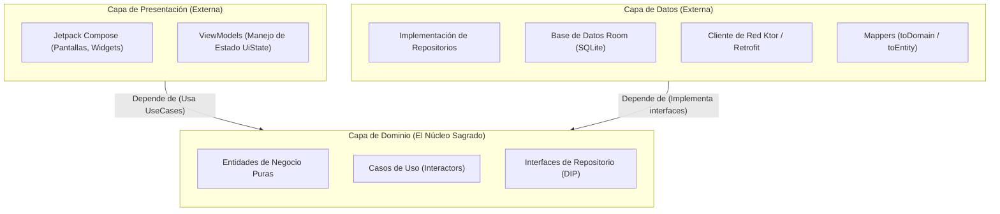

# Clean Architecture en Android y KMP

La **Clean Architecture** (Arquitectura Limpia), propuesta originalmente por Robert C. Martin (*Uncle Bob*) y adaptada por la comunidad moderna de Android y Kotlin Multiplatform (**KMP**), es un patrón de diseño arquitectónico cuyo objetivo es crear sistemas **independientes de marcos de trabajo (frameworks), bases de datos, interfaces de usuario y agentes externos**.

En el ecosistema móvil actual (Android con Jetpack Compose y KMP compartiendo código con iOS), Clean Architecture es el estándar de la industria para garantizar que una aplicación sea **testeable al 100%**, **escalable** y **fácilmente mantenible**.

---

## 1. La Regla de Dependencia (*The Dependency Rule*) {#regla-de-dependencia}

El principio sagrado sobre el que descansa toda la Clean Architecture es la **Regla de Dependencia**:

> **El código de las capas internas no debe saber absolutamente nada sobre las capas externas.**

Las dependencias de código fuente (las flechas en los diagramas e importaciones en Kotlin) **solo pueden apuntar hacia adentro**, en dirección a las políticas de mayor nivel (las reglas de negocio del Dominio).



### ¿Qué implica esta regla en la práctica?

- **El Dominio es 100% agnóstico:** La capa de Dominio se escribe en **Kotlin puro**. No importa si la base de datos es Room, SQLDelight o un archivo plano; tampoco importa si la UI está hecha con Jetpack Compose, SwiftUI en iOS o la consola de terminal. Si cambias de base de datos o de framework de UI, **el Dominio no sufre ni un solo cambio**.

- **Inversión de Dependencias (DIP de SOLID):** La capa de Dominio define la interfaz de lo que necesita (`interface GameRepository`), y es la capa de Datos (externa) la que se encarga de implementarla (`class GameRepositoryImpl : GameRepository`).

---

## 2. Desglose de Capas en Código Kotlin

Analicemos la implementación práctica de cada capa utilizando como ejemplo la biblioteca de juegos de nuestra aplicación transversal:

### 2.1. Capa de Dominio (*Domain Layer*) {#entidades-y-usecases}

Es el corazón de la aplicación. Contiene las reglas del negocio y los modelos puros.

#### A. Entidad de Dominio
Una simple `data class` inmutable de Kotlin. **Sin anotaciones de Room (`@Entity`) ni de serialización JSON (`@Serializable`)**:

```kotlin
// domain/model/Game.kt
data class Game(
    val id: String,
    val title: String,
    val rating: Double,
    val isFavorite: Boolean
)
```

#### B. Interfaz del Repositorio (Contrato)
El Dominio declara *qué* datos necesita, pero no *cómo* se consiguen:

```kotlin
// domain/repository/GameRepository.kt
interface GameRepository {
    fun getGamesFlow(): Flow<List<Game>>
    suspend fun getGameById(id: String): Game?
    suspend fun toggleFavorite(gameId: String, isFavorite: Boolean)
    suspend fun refreshGamesFromRemote(): Result<Unit>
}
```

#### C. Casos de Uso (*Use Cases* o *Interactors*)
Cada caso de uso representa **una única acción que el usuario o el sistema puede realizar**. Se nombra con un verbo en infinitivo y se implementa con el operador `invoke()`:

```kotlin
// domain/usecase/ToggleFavoriteGameUseCase.kt
class ToggleFavoriteGameUseCase(
    private val gameRepository: GameRepository
) {
    suspend operator fun invoke(gameId: String, currentFavorite: Boolean): Result<Unit> {
        return try {
            gameRepository.toggleFavorite(gameId, !currentFavorite)
            Result.success(Unit)
        } catch (e: Exception) {
            Result.failure(e)
        }
    }
}
```

---

### 2.2. Capa de Datos (*Data Layer*) {#patron-mapper}

La capa de datos implementa las interfaces definidas por el Dominio y se comunica con las fuentes de datos físicas (red y disco).

#### A. Entidad Local de Room y DTO de Red
Aquí sí utilizamos las anotaciones específicas de cada librería:

```kotlin
// data/local/entity/GameEntity.kt (Para Room SQLite)
@Entity(tableName = "games")
data class GameEntity(
    @PrimaryKey val id: String,
    val title: String,
    val score: Double,
    val isFav: Boolean,
    val lastUpdated: Long
)

// data/remote/dto/GameDto.kt (Para respuesta JSON de la API)
@Serializable
data class GameDto(
    @SerialName("game_id") val id: String,
    @SerialName("name") val name: String,
    @SerialName("metacritic") val metacriticScore: Double?
)
```

#### B. El Patrón Mapper (Los Traductores entre Capas)
Para que los modelos de la base de datos o de la red no ensucien el Dominio ni la UI, se utilizan **funciones de extensión de mapeo**:

```kotlin
// data/mapper/GameMappers.kt

// De Room Entity a Dominio
fun GameEntity.toDomain(): Game = Game(
    id = this.id,
    title = this.title,
    rating = this.score,
    isFavorite = this.isFav
)

// De Dominio a Room Entity
fun Game.toEntity(): GameEntity = GameEntity(
    id = this.id,
    title = this.title,
    score = this.rating,
    isFav = this.isFavorite,
    lastUpdated = System.currentTimeMillis()
)

// De DTO de red a Room Entity
fun GameDto.toEntity(): GameEntity = GameEntity(
    id = this.id,
    title = this.name,
    score = this.metacriticScore ?: 0.0,
    isFav = false,
    lastUpdated = System.currentTimeMillis()
)
```

#### C. Implementación del Repositorio
Coordina Room y la API de red:

```kotlin
// data/repository/GameRepositoryImpl.kt
class GameRepositoryImpl(
    private val gameDao: GameDao,
    private val gameApi: GameApiService
) : GameRepository {

    override fun getGamesFlow(): Flow<List<Game>> {
        // Leemos de Room (SSOT) y mapeamos cada lista a modelos de dominio sobre la marcha
        return gameDao.getAllGamesFlow().map { entities ->
            entities.map { it.toDomain() }
        }
    }

    override suspend fun toggleFavorite(gameId: String, isFavorite: Boolean) {
        gameDao.updateFavoriteStatus(gameId, isFavorite)
    }

    override suspend fun refreshGamesFromRemote(): Result<Unit> = runCatching {
        val dtos = gameApi.fetchPopularGames()
        gameDao.insertGames(dtos.map { it.toEntity() })
    }
}
```

---

### 2.3. Capa de Presentación (*Presentation Layer*)

La capa de presentación alberga los componentes visuales de **Jetpack Compose** y los **ViewModels**.

#### A. El ViewModel (Conecta Dominio con la Vista)
El ViewModel **no conoce Room ni Ktor**; solo conoce los Casos de Uso:

```kotlin
// presentation/home/HomeViewModel.kt
class HomeViewModel(
    private val getGamesUseCase: GetGamesUseCase,
    private val toggleFavoriteUseCase: ToggleFavoriteGameUseCase
) : ViewModel() {

    private val _uiState = MutableStateFlow<HomeUiState>(HomeUiState.Loading)
    val uiState: StateFlow<HomeUiState> = _uiState.asStateFlow()

    init {
        loadGames()
    }

    private fun loadGames() {
        viewModelScope.launch {
            getGamesUseCase()
                .catch { e -> _uiState.value = HomeUiState.Error(e.message ?: "Error al cargar") }
                .collect { games -> _uiState.value = HomeUiState.Success(games) }
        }
    }

    fun onToggleFavorite(gameId: String, currentFavorite: Boolean) {
        viewModelScope.launch {
            toggleFavoriteUseCase(gameId, currentFavorite)
        }
    }
}
```

---

## 3. Organización de Paquetes en el Proyecto

En un proyecto Android/KMP existen dos filosofías principales para estructurar los directorios:

=== "Package by Layer (Por Capas - Recomendado para iniciación)"
    ```text
    com.example.gamevault/
    ├── data/
    │   ├── local/ (Dao, AppDatabase, Entities)
    │   ├── remote/ (KtorClient, DTOs)
    │   ├── repository/ (GameRepositoryImpl)
    │   └── mapper/ (Mappers de conversión)
    ├── domain/
    │   ├── model/ (Game, User)
    │   ├── repository/ (GameRepository - Interface)
    │   └── usecase/ (GetGamesUseCase, ToggleFavoriteUseCase)
    ├── presentation/
    │   ├── home/ (HomeScreen, HomeViewModel, HomeUiState)
    │   ├── detail/ (DetailScreen, DetailViewModel)
    │   └── theme/ (Color, Type, Theme M3)
    └── di/ (KoinModules)
    ```

=== "Package by Feature (Por Funcionalidad - Recomendado para proyectos grandes y KMP)"
    ```text
    com.example.gamevault/
    ├── core/ (Red, Base de datos global, Tema Compose)
    ├── features/
    │   ├── auth/
    │   │   ├── data/
    │   │   ├── domain/
    │   │   └── presentation/
    │   ├── catalog/
    │   │   ├── data/
    │   │   ├── domain/
    │   │   └── presentation/
    │   └── library/
    │       ├── data/
    │       ├── domain/
    │       └── presentation/
    └── di/ (Módulos Koin ensamblados)
    ```

---

## 4. Beneficios Tangibles de Clean Architecture

| Beneficio | ¿Cómo se consigue? |
| :--- | :--- |
| **Facilidad para Pruebas (Testability)** | Puedes probar un `UseCase` o un `ViewModel` con tests unitarios en milisegundos sustituyendo el `GameRepository` por un *Fake* o *Mock*, sin levantar emuladores de Android. |
| **Independencia Tecnológica** | Si mañana la empresa decide migrar de Retrofit a Ktor Client, solo tocas la capa `data/remote`. El `Domain`, el `ViewModel` y la UI de `Compose` no cambian en absoluto. |
| **Preparado para KMP** | Las capas `domain` y `data` pueden mudarse directamente a `commonMain` de Kotlin Multiplatform para ser reutilizadas en iOS sin tocar una sola línea de lógica. |

---

## 📚 Enlaces y Siguientes Pasos

- [Inyección de Dependencias con Koin](./03-inyeccion-dependencias-koin.md): Cómo desacoplar y cablear todas estas clases sin instanciarlas manualmente.
- [Ecosistema Multiplataforma (KMP)](./04-ecosistema-kmp-multiplataforma.md): Cómo llevar este Dominio y Datos a proyectos compartidos entre Android e iOS.
- [Tipos Sellados y UiState en Kotlin](../00-kotlin/26-sealed-classes.md#5-el-patron-universal-de-arquitectura-en-android-uistate): Modelado exhaustivo del estado en la capa de presentación.
