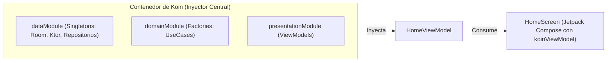

# Inyección de Dependencias con Koin en Android y KMP

La **Inyección de Dependencias (DI - Dependency Injection)** es el pegamento arquitectónico que permite implementar los principios de **Clean Architecture** e **Inversión de Control (IoC)**. Sin un mecanismo de DI, las clases tendrían que instanciar manualmente sus propias dependencias (`val repo = GameRepositoryImpl(GameDaoImpl(...))`), provocando un acoplamiento extremo que hace imposible la modularización y los tests unitarios.

En este tema aprenderemos qué es la inyección de dependencias, por qué en este módulo apostamos decididamente por **Koin** frente a alternativas como Hilt, y cómo configurarlo e integrarlo en **Jetpack Compose** y **Kotlin Multiplatform (KMP)**.

---

## 1. Fundamentos: De la Instanciación Manual a la Inyección {#fundamentos-di}

Imagina que estás construyendo una pantalla de inicio con su `HomeViewModel`. Para funcionar, necesita acceder a un `GameRepository`:

### El Problema: Acoplamiento Manual Fuerte (Sin DI)

```kotlin
// ❌ ACOPLAMIENTO PELIGROSO: El ViewModel crea directamente sus dependencias
class HomeViewModel : ViewModel() {
    private val api = Retrofit.Builder().baseUrl("https://api.com").build().create(GameApi::class.java)
    private val db = Room.databaseBuilder(context, AppDatabase::class.java, "games.db").build()
    private val repository = GameRepositoryImpl(db.gameDao(), api)
    // ¡El ViewModel está atado para siempre a Room, Retrofit y al Context de Android!
}
```

**Consecuencias desastrosas:**

1. **Imposible de testear:** No puedes sustituir `api` o `db` por datos simulados (*mocks*) en una prueba unitaria.

2. **Violación de Clean Architecture:** La capa de presentación depende de librerías de infraestructura como Room y Retrofit.

3. **Desperdicio de recursos:** Cada pantalla crea nuevas instancias duplicadas de la base de datos y clientes de red en lugar de reutilizarlas como *Singletons*.

### La Solución: Inyección de Dependencias

Con DI, el ViewModel **no crea nada**; simplemente declara en su constructor lo que necesita para trabajar, y un **Contenedor de Inyección** externo se encarga de suministrárselo:

```kotlin
// ✅ LIMPIO Y DESACOPLADO: Recibe la interfaz por constructor
class HomeViewModel(
    private val getGamesUseCase: GetGamesUseCase
) : ViewModel() {
    // Listo para funcionar y 100% testeable
}
```

---

## 2. ¿Por qué Koin frente a Hilt / Dagger? {#por-que-koin-frente-a-hilt}

En el ecosistema Android existen dos grandes escuelas de inyección de dependencias. Para nuestro curso de 2º de DAM y la industria moderna, la comparativa es contundente:

| Característica | Google Hilt / Dagger | Koin Framework |
| :--- | :--- | :--- |
| **Plataformas Soportadas** | **Solo Android / JVM**. | **Kotlin Multiplatform (KMP)**: Android, iOS, Desktop y Web. |
| **Mecanismo Interno** | Generación de código pesada en compilación (**KSP / kapt**). | **Kotlin Puro en tiempo de ejecución**. Cero procesado de anotaciones. |
| **Tiempo de Compilación** | Lento (añade una sobrecarga considerable a Gradle). | Ultrarrápido e instantáneo. |
| **Curva de Aprendizaje** | Alta y compleja (`@AndroidEntryPoint`, `@InstallIn`, `@Binds`). | Sencilla, idiomática e intuitiva mediante un DSL de Kotlin. |
| **Futuro Profesional** | Proyectos Android tradicionales heredados. | **El estándar de facto para KMP y Compose Multiplatform**. |

!!! tip "La Elección Estratégica"
    Si aprendes Hilt, solo puedes programar apps para el sistema operativo Android. Al dominar **Koin**, puedes reutilizar exactamente la misma arquitectura y módulos de inyección en proyectos compartidos con **iOS, Desktop y aplicaciones multiplataforma**.

---

## 3. Arquitectura de Módulos con el DSL de Koin {#dsl-declarativo-koin}

Koin organiza las dependencias en **Módulos**. Cada módulo es una receta que le enseña a Koin cómo instanciar cada componente de nuestra aplicación:



### Los Tres Tipos de Alcance (*Scopes*) en Koin:

1. **`single` / `singleOf` (Singleton):** Crea una **única instancia** que se mantiene viva en memoria durante todo el ciclo de vida de la aplicación (ideal para bases de datos, DAOs, clientes HTTP y repositorios).

2. **`factory` / `factoryOf` (Nueva instancia):** Genera una **nueva instancia cada vez** que alguien la solicita (ideal para Casos de Uso, que son sin estado).

3. **`viewModel` / `viewModelOf` (Ciclo de vida Android):** Crea un `ViewModel` gestionado automáticamente por Jetpack, asegurando que sobreviva a rotaciones de pantalla y se limpie cuando la pantalla se destruya.

### Definición de Módulos de Clean Architecture con Koin:

```kotlin
// di/AppModules.kt
import org.koin.core.module.dsl.factoryOf
import org.koin.core.module.dsl.singleOf
import org.koin.core.module.dsl.viewModelOf
import org.koin.dsl.bind
import org.koin.dsl.module

// 1. Módulo de Datos (Singletons)
val dataModule = module {
    // Base de datos local Room
    single { 
        Room.databaseBuilder(
            get(), // 'get()' resuelve automáticamente el Context de Android
            AppDatabase::class.java, 
            "gamevault.db"
        ).build() 
    }
    single { get<AppDatabase>().gameDao() }

    // Cliente de red Ktor
    single { KtorClientFactory.createHttpClient() }

    // Repositorio: vinculamos la implementación con su interfaz de dominio (DIP)
    singleOf(::GameRepositoryImpl) bind GameRepository::class
}

// 2. Módulo de Dominio (Casos de uso)
val domainModule = module {
    factoryOf(::GetGamesUseCase)
    factoryOf(::ToggleFavoriteGameUseCase)
}

// 3. Módulo de Presentación (ViewModels)
val presentationModule = module {
    viewModelOf(::HomeViewModel)
    viewModelOf(::DetailViewModel)
}

// Lista consolidada de módulos
val appModules = listOf(dataModule, domainModule, presentationModule)
```

---

## 4. Inicialización de Koin

### En una Aplicación Android Clásica
Se inicializa en la clase personalizada que extiende de `Application`:

```kotlin
// GameVaultApp.kt
import android.app.Application
import org.koin.android.ext.koin.androidContext
import org.koin.android.ext.koin.androidLogger
import org.koin.core.context.startKoin
import org.koin.core.logger.Level

class GameVaultApp : Application() {
    override fun onCreate() {
        super.onCreate()

        startKoin {
            androidLogger(Level.DEBUG) // Logs de depuración de Koin
            androidContext(this@GameVaultApp) // Proporciona el Context global
            modules(appModules) // Carga los módulos definidos
        }
    }
}
```

*(Recuerda registrar la clase en el `AndroidManifest.xml` con el atributo `android:name=".GameVaultApp"`).*

### En un Proyecto Kotlin Multiplatform (KMP) {#koin-en-kmp}
En KMP, creamos una función compartida en `commonMain`:

```kotlin
// commonMain/.../di/KoinInit.kt
fun initKoin(appDeclaration: KoinAppDeclaration = {}) = startKoin {
    appDeclaration()
    modules(appModules)
}

// androidMain: La Application de Android invoca:
// initKoin { androidContext(this@GameVaultApp) }

// iosMain: El AppDelegate de Swift/iOS invoca directamente:
// KoinInitKt.initKoin()
```

---

## 5. Inyección Directa en Jetpack Compose (`koinViewModel`) {#inyeccion-en-compose-koinviewmodel}

Gracias a la librería `koin-androidx-compose` (o `koin-compose` en KMP), inyectar un ViewModel dentro de un composable de pantalla es tan sencillo como invocar la función **`koinViewModel()`**:

```kotlin
// presentation/home/HomeScreen.kt
import androidx.compose.runtime.Composable
import androidx.compose.runtime.getValue
import androidx.lifecycle.compose.collectAsStateWithLifecycle
import org.koin.androidx.compose.koinViewModel

@Composable
fun HomeScreen(
    // Koin resuelve el ViewModel y todas sus dependencias automáticamente
    viewModel: HomeViewModel = koinViewModel(),
    onNavigateToDetail: (String) -> Unit
) {
    // Recolectamos el estado de forma segura ante el ciclo de vida
    val uiState by viewModel.uiState.collectAsStateWithLifecycle()

    HomeScreenContent(
        uiState = uiState,
        onFavoriteClick = viewModel::onToggleFavorite,
        onGameClick = onNavigateToDetail
    )
}
```

!!! tip "Ventaja Monumental para @Preview y Testing"
    Al usar el parámetro por defecto `viewModel: HomeViewModel = koinViewModel()`, en tus vistas previas (`@Preview`) y pruebas unitarias puedes ignorar Koin por completo llamando a `HomeScreenContent` pasando datos ficticios sin levantar ningún contenedor de inyección.

---

## 📚 Enlaces y Siguientes Pasos

- [Clean Architecture en Android y KMP](./02-clean-architecture.md): Entiende el diseño de interfaces y casos de uso que Koin se encarga de inyectar.
- [Ecosistema Multiplataforma (KMP)](./04-ecosistema-kmp-multiplataforma.md): Cómo estructurar proyectos compartidos con Koin, Ktor y Room KMP.
- [Gestión de Estado en Jetpack Compose](../00-compose/22-state-management.md): Profundización en State Hoisting, ViewModels y `collectAsStateWithLifecycle()`.
