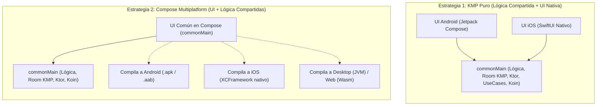

# Ecosistema Multiplataforma: Kotlin Multiplatform (KMP) y Compose Multiplatform (CMP)

El desarrollo móvil moderno ha superado la antigua dicotomía de tener que elegir entre **desarrollar dos aplicaciones nativas completamente independientes** (una en Kotlin para Android y otra en Swift para iOS, duplicando el coste y el tiempo de mantenimiento) o **recurrir a soluciones híbridas** (como Flutter o React Native, que añaden una capa intermedia pesada sobre WebViews o motores gráficos propios ajenos a la plataforma).

Con **Kotlin Multiplatform (KMP)** y **Compose Multiplatform (CMP)** de JetBrains y Google, la industria dispone de un enfoque superador: **código 100% nativo que se compila a bytecode de la JVM en Android, a binarios nativos de Objective-C/Swift en iOS y a WebAssembly/Desktop**, permitiendo compartir desde la lógica de negocio hasta la interfaz de usuario completa.

---

## 1. KMP Puro vs. Compose Multiplatform (CMP) {#kmp-vs-compose-multiplatform}

Es fundamental comprender las dos formas estratégicas de abordar un proyecto multiplataforma en el mundo laboral:



### ¿Cuándo elegir cada estrategia?

- **KMP Puro (Compartir el 70% del código):** Se comparte toda la lógica de negocio, bases de datos, redes, repositorios y modelos de dominio en `commonMain`. La interfaz se programa de forma 100% nativa en cada plataforma (Jetpack Compose en Android y SwiftUI en iOS). Es la opción predilecta de grandes empresas con equipos consolidados de iOS y Android (como Netflix, Cash App, McDonald's o Forbes).

- **Compose Multiplatform (Compartir el 100% del código):** Se escribe la interfaz de usuario **una sola vez en Jetpack Compose** dentro de `commonMain` y JetBrains se encarga de renderizarla de forma nativa en Android, iOS, Windows, macOS, Linux y Web. Es ideal para startups, agencias y nuevos proyectos donde se busca la máxima velocidad de comercialización (*Time to Market*).

---

## 2. El Mecanismo `expect` / `actual` (El Puente con el Hardware) {#mecanismo-expect-actual}

La pregunta obligada de cualquier desarrollador al comenzar con KMP es: *«Si mi código común está en `commonMain`, ¿cómo accedo a APIs específicas del sistema operativo como la cámara, el Bluetooth, el almacenamiento seguro o la versión del sistema operativo?»*.

Kotlin resuelve esto en tiempo de compilación mediante el par de palabras clave **`expect`** y **`actual`**:

### Ejemplo Didáctico: Detección de la Plataforma

1. **Declaración en `commonMain` (`expect`):** Define el contrato que toda plataforma debe cumplir:

```kotlin
// commonMain/.../Platform.kt
expect class Platform() {
    val name: String
    val osVersion: String
}

expect fun getPlatform(): Platform
```

2. **Implementación en `androidMain` (`actual`):** Utiliza las clases y APIs del SDK de Android:

```kotlin
// androidMain/.../Platform.android.kt
import android.os.Build

actual class Platform actual constructor() {
    actual val name: String = "Android"
    actual val osVersion: String = "${Build.VERSION.SDK_INT}"
}

actual fun getPlatform(): Platform = Platform()
```

3. **Implementación en `iosMain` (`actual`):** Utiliza directamente las APIs nativas de Apple en Kotlin (UIKit):

```kotlin
// iosMain/.../Platform.ios.kt
import platform.UIKit.UIDevice

actual class Platform actual constructor() {
    actual val name: String = UIDevice.currentDevice.systemName()
    actual val osVersion: String = UIDevice.currentDevice.systemVersion()
}

actual fun getPlatform(): Platform = Platform()
```

El compilador de Kotlin enlaza en tiempo de compilación la llamada `getPlatform()` con la implementación binaria correspondiente de cada sistema. Cero sobrecoste en tiempo de ejecución.

---

## 3. La Pila Tecnológica Multiplataforma Oficial {#pila-tecnologica-kmp}

En una aplicación Android clásica se utilizan librerías dependientes del `Context` o de la máquina virtual Java de Android (`Retrofit`, `SharedPreferences`, `Room antiguo`, `Glide`). En el mundo multiplataforma, la comunidad oficial de JetBrains y Google ha estandarizado los **sustitutos 100% multiplataforma**:

| Área Funcional | Librería Android Tradicional | Estándar Multiplataforma KMP |
| :--- | :--- | :--- |
| **Cliente de Red / HTTP** | Retrofit / OkHttp | **Ktor Client** (100% Kotlin con corrutinas y motores nativos) |
| **Serialización JSON** | Gson / Moshi | **Kotlinx.serialization** (Tipado estricto con `@Serializable`) |
| **Persistencia SQL** | Room antiguo / SQLite | **Room KMP** (Oficial de Google desde 2.7+) o **SQLDelight** |
| **Persistencia Clave-Valor** | SharedPreferences | **DataStore KMP** (Oficial de Google) o **Multiplatform Settings** |
| **Carga de Imágenes** | Glide / Picasso | **Coil 3.0+** (Reescrito por completo para KMP y Compose) |
| **Inyección de Dependencias** | Hilt / Dagger | **Koin** (El estándar indiscutible de KMP) |
| **Programación Reactiva** | LiveData / RxJava | **Kotlin Flows y Corrutinas** |

---

## 4. Gestión de Recursos Multiplataforma (`composeResources`) {#recursos-compose-multiplatform}

En Android tradicional, los textos, imágenes y colores se almacenan en la carpeta `res/` y se accede a ellos con la clase generada `R` (`R.string.hola`, `R.drawable.logo`).

En Compose Multiplatform, los recursos se almacenan en `commonMain/composeResources/` y se gestionan con el objeto tipado **`Res`**:

```kotlin
// commonMain/src/commonMain/composeResources/values/strings.xml
// <resources>
//     <string name="app_name">GameVault</string>
//     <string name="welcome_message">¡Bienvenido de nuevo, %s!</string>
// </resources>

@Composable
fun WelcomeBanner(userName: String) {
    Column {
        // Carga de imágenes compartidas entre Android, iOS y Desktop:
        Image(
            painter = painterResource(Res.drawable.ic_gamevault_logo),
            contentDescription = stringResource(Res.string.app_name)
        )

        // Textos traducibles compartidos:
        Text(text = stringResource(Res.string.welcome_message, userName))
    }
}
```

---

## 5. Navegación en Proyectos Multiplataforma {#navegacion-kmp}

Google ha portado oficialmente la librería **`androidx.navigation:navigation-compose` a Kotlin Multiplatform**.

Esto significa que la misma **Type-Safe Navigation** que aprenderás en el tema de [Navegación y Rutas](../00-compose/24-navegacion-rutas.md):

- Utiliza las mismas clases de datos con `@Serializable`.
- Soporta la misma sintaxis tipada `composable<Ruta> { ... }`.
- Se ejecuta de forma idéntica en Android, iOS y Desktop sin alterar una sola línea de lógica de navegación.

---

## 📚 Enlaces y Siguientes Pasos

- [Guía Oficial de Arquitectura en Android](./01-guia-arquitectura-google.md): Conoce las capas y principios que hacen posible este modelo multiplataforma.
- [Clean Architecture en Android y KMP](./02-clean-architecture.md): Aprende a aislar las capas de Dominio y Datos en `commonMain`.
- [Inyección de Dependencias con Koin](./03-inyeccion-dependencias-koin.md): El pegamento para ensamblar proyectos multiplataforma sin depender de frameworks locales.
- [Navegación y Rutas en Compose](../00-compose/24-navegacion-rutas.md): Implementación de Type-Safe Navigation aplicable a KMP.
