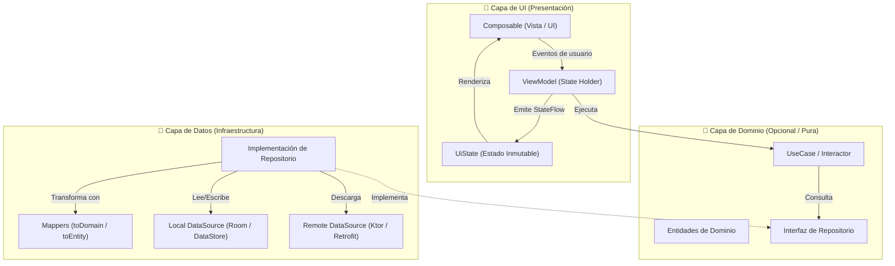

# Glosario y Patrones Clave de Arquitectura

En el desarrollo móvil moderno con Android y Kotlin Multiplatform (KMP), la arquitectura se fundamenta en un conjunto de **patrones de diseño y componentes estructurales** bien definidos. Este glosario proporciona una referencia rápida, precisa y pedagógica sobre el propósito de cada pieza, a qué capa pertenece y qué errores comunes se deben evitar.

---

## 1. Mapa de Componentes por Capa



---

## 2. Componentes de la Capa de UI {#capa-ui}

### ViewModel (State Holder de Pantalla)

- **Definición:** Componente encargado de preparar, almacenar y gestionar el estado observable de una pantalla concreta.
- **Responsabilidades:**

    - Sobrevivir a cambios de configuración (como rotaciones de pantalla o cambios de modo oscuro/claro).
    - Recibir eventos de la vista (ej. pulsación de botones, escritura de texto) y transformarlos en lógica de negocio llamando a Casos de Uso o Repositorios.
    - Exponer un único `StateFlow<UiState>` inmutable hacia los Composables.
- ⚠️ **Regla de Oro:** Un ViewModel **nunca** debe conocer a Jetpack Compose ni almacenar referencias a `Context`, `Activity` o vistas. Si guardas un `Context` en un ViewModel, provocarás una fuga de memoria (*memory leak*).

---

### UiState (Estado Inmutable de Pantalla)

- **Definición:** Representación atómica, exhaustiva e inmutable de todo lo que el usuario ve en la pantalla en un milisegundo concreto.
- **Propósito:** Aplica la ecuación fundamental del desarrollo declarativo:
  
    $$\text{UI} = f(\text{UiState})$$
  
- **Formatos habituales:**

    - **`sealed interface`:** Ideal para pantallas de carga y transiciones de estados mutuamente excluyentes (`Cargando`, `Exito(val datos)`, `Error(val mensaje)`).
    - **`data class`:** Ideal para formularios o pantallas ricas donde coexisten múltiples campos simultáneos (`val nombre: String`, `val email: String`, `val cargando: Boolean`).

---

### State Hoisting (Elevación de Estado)

- **Definición:** Patrón de diseño en Jetpack Compose que consiste en trasladar el estado mutable fuera de un componente visual para convertirlo en un componente **Stateless** (sin estado propio).
- **Fórmula estándar:** Un composable elevado recibe el valor como parámetro de solo lectura y expone los cambios mediante lambdas:
  
    ```kotlin
    @Composable
    fun CampoTextoElevado(
        texto: String,                    // Estado desciende
        onTextoCambio: (String) -> Unit   // Evento asciende
    )
    ```

---

## 3. Componentes de la Capa de Dominio {#capa-dominio}

### UseCase / Interactor (Caso de Uso)

- **Definición:** Unidad atómica e independiente de lógica de negocio pura que resuelve **un único requisito funcional** del sistema (un solo verbo).
- **Características:**

    - Ejemplos de nombres: `ObtenerJuegosFavoritosUseCase`, `ValidarCredencialesUseCase`, `ComprarJuegoUseCase`.
    - No depende de Android, ni de vistas, ni de bibliotecas de bases de datos. Es 100% Kotlin nativo y portable a iOS/Desktop.
    - Implementa idiomáticamente el operador `invoke()` para llamarse como una función estándar: `obtenerJuegosUseCase()`.
- **¿Cuándo es necesario?:** Cuando la lógica de negocio es compleja, se reutiliza entre varios ViewModels o combina datos provenientes de múltiples repositorios.

---

### Entidad de Dominio (Domain Entity / Domain Model)

- **Definición:** Clase de datos de Kotlin (`data class`) que modela los conceptos esenciales de la aplicación según las reglas de negocio, limpia de tecnologías externas.
- **Diferencia con Entities de Base de Datos:**

    - Una entidad de dominio `Juego` **no tiene** anotaciones de Room (`@Entity`, `@PrimaryKey`), ni anotaciones de serialización JSON (`@SerialName`, `@JsonProperty`).
    - Si la API cambia su JSON o SQLite se sustituye por Realm, la entidad de dominio permanece intacta.

---

## 4. Componentes de la Capa de Datos {#capa-datos}

### Repository (Repositorio)

- **Definición:** Mediador y Fuente Única de Verdad (SSOT) que centraliza el acceso a los datos de la aplicación y oculta de dónde proceden realmente.
- **Inversión de Dependencias:**

    - **Interfaz (`GameRepository`):** Vive en la **Capa de Dominio**. Define *qué* operaciones de datos existen (`fun obtenerJuegos(): Flow<List<Juego>>`).
    - **Implementación (`GameRepositoryImpl`):** Vive en la **Capa de Datos**. Define *cómo* se obtienen los datos, coordinando la base de datos local y el cliente de red.
- **Estrategia Offline-First:** El repositorio lee primero de la base de datos local (para mostrar datos al instante sin conexión) y, en segundo plano, sincroniza con la API remota actualizando la BD local.

---

### DataSource (Fuente de Datos)

- **Definición:** Componente especializado que habla directamente con una fuente de datos específica y traduce las operaciones a bajo nivel.
- **Tipos comunes:**

    - **Local DataSource:** Envuelve los DAOs de **Room**, archivos en disco o preferencias en **DataStore**.
    - **Remote DataSource:** Envuelve los clientes HTTP (**Ktor Client** o **Retrofit**) o Firebase Firestore.

---

### DTO (Data Transfer Object)

- **Definición:** Clase de datos modelada específicamente para coincidir con la estructura exacta del JSON devuelto por una API externa.
- **Características:**

    - Anotada con `@Serializable` de `kotlinx.serialization` (o `@JsonClass` de Moshi).
    - Suele contener tipos nulos o campos específicos de transporte que la UI no necesita ver directamente.

---

### Mapper (Mapeador / Transformador)

- **Definición:** Función pura de transformación encargada de convertir objetos entre capas para respetar el principio de aislamiento.
- **Patrón idiomático en Kotlin:** Se implementa mediante **funciones de extensión**:
  
    ```kotlin
    // Transforma DTO de red a modelo de Dominio
    fun JuegoDto.toDomain(): Juego = Juego(
        id = this.gameId,
        titulo = this.title ?: "Sin título",
        precio = this.cost
    )

    // Transforma modelo de Dominio a Entidad de Room
    fun Juego.toEntity(): JuegoEntity = JuegoEntity(
        id = this.id,
        titulo = this.titulo,
        precio = this.precio
    )
    ```

---

## 5. Principios y Patrones Transversales {#principios-transversales}

### UDF (Unidirectional Data Flow)

- **Definición:** Flujo unidireccional de datos en el que la información viaja en un único sentido continuo:
  
    $$\text{Estado } (\downarrow) \text{ desciende del ViewModel hacia la UI}$$
    $$\text{Eventos } (\uparrow) \text{ ascienden desde la UI hacia el ViewModel}$$

- **Ventaja:** Evita inconsistencias visuales, previene que la UI modifique datos por su cuenta y garantiza que el ViewModel sea el único con potestad de actualizar el estado.

---

### SSOT (Single Source of Truth)

- **Definición:** Principio de diseño que dicta que cada dato en la aplicación debe tener un único dueño y punto canónico de origen.
- **En aplicaciones Offline-First:** La **Base de Datos local (Room)** actúa como la Fuente Única de Verdad; la UI observa la BD local a través de un `Flow`, y la red únicamente actualiza la BD, nunca la UI directamente.

---

### Inversión de Dependencias (DIP) e Inyección (DI)

- **Inversión de Dependencias (Principio SOLID):** Los módulos de alto nivel (lógica de negocio) no deben depender de módulos de bajo nivel (bases de datos, red); ambos deben depender de abstracciones (interfaces).
- **Inyección de Dependencias (DI):** Técnica de diseño donde un componente recibe sus dependencias desde el exterior en lugar de crearlas internamente con `new` o constructores.
- **Koin:** Herramienta de DI 100% Kotlin nativa que permite definir módulos declarativos (`singleOf`, `viewModelOf`) compatibles tanto con Android como con Kotlin Multiplatform (KMP).

---

## 📚 Enlaces de Interés

- [Guía Oficial de Arquitectura de Google](./01-guia-arquitectura-google.md)
- [Clean Architecture en Android y KMP](./02-clean-architecture.md)
- [Inyección de Dependencias con Koin](./03-inyeccion-dependencias-koin.md)
- [Gestión de Estado y UDF en Jetpack Compose](../00-compose/22-state-management.md)
