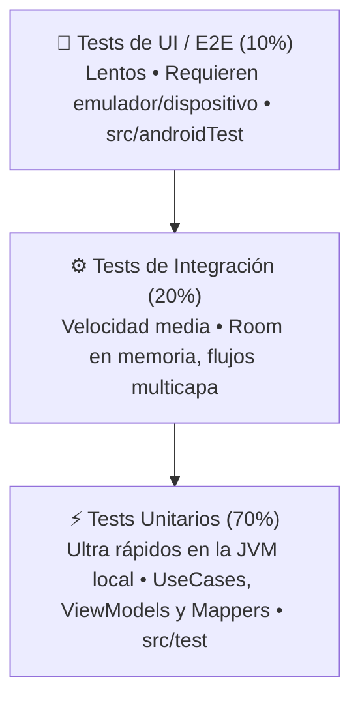

# Fundamentos de Testing en Android y Kotlin Multiplatform

El **Testing (pruebas automatizadas)** es una disciplina indispensable en la ingeniería de software profesional. Garantiza que cada componente cumpla su contrato, previene la reaparición de errores históricos (*regresiones*) tras una refactorización y sirve como documentación viva ejecutable de la lógica de negocio.

En el desarrollo actual asistido por herramientas de Inteligencia Artificial, redactar el esqueleto de un test es más rápido que nunca. Sin embargo, **el desarrollador debe poseer el criterio técnico para definir la estrategia de prueba, aislar las dependencias y validar las aserciones**. Un test generado por IA que comprueba obviedades o que nunca falla ante un error de lógica (*falso positivo*) produce una falsa sensación de seguridad sumamente peligrosa.

---

## 1. La Pirámide de Testing y la Estructura del Proyecto

Google clasifica las pruebas automatizadas en tres niveles según su velocidad de ejecución, coste de mantenimiento y grado de aislamiento:



### Organización de Carpetas en un Proyecto Android / KMP

En la raíz de cada módulo (como `app/`), el código se divide en tres carpetas (*source sets*):

1. **`src/main/` (Código de producción):**
   
   - Contiene los Composables, ViewModels, Casos de Uso, Entidades y Repositorios que se empaquetan en el APK final.

2. **`src/test/` (Tests Unitarios Locales en JVM):**
   
   - **No necesitan emulador ni teléfono conectado.**
   - Se ejecutan directamente sobre la máquina virtual de Java de tu ordenador en milisegundos.
   - Aquí se testea la lógica pura: Casos de Uso de Dominio, Mappers, algoritmos de cálculo y ViewModels.

3. **`src/androidTest/` (Tests Instrumentados en Dispositivo):**
   
   - **Requieren un emulador en ejecución o un móvil físico conectado por USB.**
   - Se compilan en un APK de pruebas secundario que se instala en el dispositivo.
   - Aquí se prueban DAOs de Room reales con bases de datos SQLite y flujos de interfaz con Compose.

---

## 2. Ecosistema de Librerías y Frameworks de Testing

Para construir una suite de pruebas robusta en Android y KMP se utiliza una combinación de bibliotecas especializadas:

| Librería / Framework | Propósito | Ámbito habitual |
| :--- | :--- | :--- |
| **`kotlin.test`** | Aserciones estándar multiplataforma (`assertEquals`, `assertTrue`, `assertNull`, `assertFailsWith`). | `src/test` y `src/androidTest` |
| **`JUnit 4 / 5`** | Motor ejecutor (*test runner*) que orquesta los tests mediante `@Test`, `@Before` y `@After`. | `src/test` y `src/androidTest` |
| **`kotlinx-coroutines-test`** | Control de tiempo virtual (`runTest`), despachadores simulados (`StandardTestDispatcher`) y sustitución del hilo principal con `setMain()`. | `src/test` |
| **`Turbine`** (Cash App) | La biblioteca estándar de la industria para observar y testear flujos reactivos de Kotlin (`Flow` y `StateFlow`). | `src/test` |
| **`Koin Test`** | Valida que todos los módulos y dependencias de Koin estén correctamente configurados sin arrancar la app. | `src/test` |
| **`Compose UI Test`** | Inspecciona e interactúa con el árbol semántico de Jetpack Compose (`createComposeRule`). | `src/androidTest` (o local con Robolectric) |
| **`MockK`** | Creación de dobles dinámicos (*mocks* y *spies*) cuando no es viable usar un *Fake*. | `src/test` |

---

## 3. Configuración de Dependencias en Gradle

Para añadir estas librerías a tu proyecto, registra las versiones en `libs.versions.toml` y aplícalas en el archivo de construcción del módulo:

=== "build.gradle.kts (:app)"
    ```kotlin
    dependencies {
        // --- 1. Tests Unitarios Locales (src/test/) ---
        testImplementation(libs.kotlin.test)
        testImplementation(libs.junit)
        testImplementation(libs.kotlinx.coroutines.test)
        testImplementation(libs.turbine)
        testImplementation(libs.koin.test)
        testImplementation(libs.koin.test.junit4)

        // --- 2. Tests Instrumentados en Emulador (src/androidTest/) ---
        androidTestImplementation(libs.androidx.junit)
        androidTestImplementation(libs.androidx.espresso.core)
        androidTestImplementation(platform(libs.androidx.compose.bom))
        androidTestImplementation(libs.androidx.compose.ui.test.junit4)

        // Necesario para que el test runner de Compose pueda instanciar actividades
        debugImplementation(libs.androidx.compose.ui.test.manifest)
    }
    ```

=== "libs.versions.toml"
    ```toml
    [versions]
    junit = "4.13.2"
    androidxJunit = "1.2.1"
    espresso = "3.6.1"
    coroutinesTest = "1.9.0"
    turbine = "1.2.0"
    koin = "4.0.0"

    [libraries]
    kotlin-test = { module = "org.jetbrains.kotlin:kotlin-test" }
    junit = { module = "junit:junit", version.ref = "junit" }
    androidx-junit = { module = "androidx.test.ext:junit", version.ref = "androidxJunit" }
    androidx-espresso-core = { module = "androidx.test.espresso:espresso-core", version.ref = "espresso" }
    kotlinx-coroutines-test = { module = "org.jetbrains.kotlinx:kotlinx-coroutines-test", version.ref = "coroutinesTest" }
    turbine = { module = "app.cash.turbine:turbine", version.ref = "turbine" }
    koin-test = { module = "io.insert-koin:koin-test", version.ref = "koin" }
    koin-test-junit4 = { module = "io.insert-koin:koin-test-junit4", version.ref = "koin" }
    androidx-compose-ui-test-junit4 = { module = "androidx.compose.ui:ui-test-junit4" }
    androidx-compose-ui-test-manifest = { module = "androidx.compose.ui:ui-test-manifest" }
    ```

---

## 4. Ejecución de Tests con Gradle desde Terminal

Además de pulsar el botón verde de "Play" junto a cada método en Android Studio o IntelliJ, en entornos de integración continua (CI/CD) o en tu terminal de trabajo se utilizan las tareas oficiales de Gradle:

```bash
# 1. Ejecutar TODOS los tests unitarios locales del proyecto
./gradlew test

# 2. Ejecutar los tests unitarios de la variante Debug del módulo :app (el comando más habitual)
./gradlew :app:testDebugUnitTest

# 3. Ejecutar únicamente una clase de test concreta
./gradlew :app:testDebugUnitTest --tests "b01_fundamentos.CatalogoViewModelTest"

# 4. Ejecutar tests que coincidan con un patrón de nombre
./gradlew :app:testDebugUnitTest --tests "*cuando_el_usuario_es_VIP*"

# 5. Forzar la reejecución limpia de los tests (ignorando la caché de compilación previa)
./gradlew :app:testDebugUnitTest --rerun-tasks --info

# 6. Ejecutar tests instrumentados y de UI en el emulador o teléfono conectado
./gradlew connectedAndroidTest
```

### Informe HTML de Resultados

Tras ejecutar `./gradlew testDebugUnitTest`, Gradle genera un **informe interactivo completo en formato HTML**. Puedes abrirlo en tu navegador para inspeccionar tiempos de ejecución, pruebas superadas y trazas de error:

```bash
open app/build/reports/tests/testDebugUnitTest/index.html # En macOS
xdg-open app/build/reports/tests/testDebugUnitTest/index.html # En Linux
```

---

## 5. El Patrón Universal AAA (Arrange, Act, Assert)

Todo test automatizado debe estructurarse obligatoriamente en tres fases independientes para maximizar su legibilidad:

```kotlin
import kotlin.test.Test
import kotlin.test.assertEquals

class CalculadoraDescuentoTest {

    @Test
    fun `cuando el usuario es VIP se aplica un 20 por ciento de descuento`() {
        // 1. ARRANGE (Preparar el escenario, mocks/fakes y datos de entrada)
        val precioOriginal = 100.0
        val esVip = true

        // 2. ACT (Ejecutar la acción o caso de uso bajo prueba)
        val precioFinal = calcularPrecioConDescuento(precioOriginal, esVip)

        // 3. ASSERT (Verificar que el resultado coincide exactamente con lo esperado)
        assertEquals(expected = 80.0, actual = precioFinal)
    }
}
```

---

## 6. Fakes vs Mocks: La Estrategia Multiplataforma

Al probar una clase (como un Caso de Uso o un ViewModel), esta depende de un Repositorio. No queremos que el test realice peticiones de red reales ni escriba en la base de datos física.

Existen dos aproximaciones para sustituir la dependencia:

- **Mocks:** Objetos vacíos creados con librerías (MockK/Mockito) que registran llamadas y devuelven respuestas predefinidas mediante sintaxis reflexiva (`coEvery { repo.obtener() } returns lista`).
- **Fakes:** Clases reales de Kotlin que implementan la interfaz del repositorio guardando los datos en una estructura en memoria (`mutableListOf()`).

!!! tip "Recomendación oficial de Google y Kotlin Multiplatform"
    Tanto Google como el equipo de JetBrains recomiendan **priorizar Fakes sobre Mocks**. Los Fakes son código Kotlin 100% puro, funcionan en todas las plataformas (iOS, Android, Desktop), son más rápidos al no usar reflexión y no se rompen si refactorizas detalles internos de implementación.

### Implementación de un Fake Repository

```kotlin
// 1. Interfaz en la Capa de Dominio (src/main/)
interface GameRepository {
    suspend fun obtenerJuegos(): List<Juego>
    suspend fun guardarJuego(juego: Juego)
}

// 2. Fake en la Capa de Test (src/test/)
class FakeGameRepository : GameRepository {
    private val baseDeDatosEnMemoria = mutableListOf<Juego>()

    override suspend fun obtenerJuegos(): List<Juego> = baseDeDatosEnMemoria.toList()

    override suspend fun guardarJuego(juego: Juego) {
        baseDeDatosEnMemoria.add(juego)
    }
}
```

---

## 7. Test Unitario de un Caso de Uso (Capa de Dominio)

Los Casos de Uso son clases de Kotlin puro sin dependencias del SDK de Android. Se ejecutan en milisegundos en la JVM:

```kotlin
import kotlinx.coroutines.test.runTest
import kotlin.test.Test
import kotlin.test.assertEquals
import kotlin.test.assertTrue

class GuardarJuegoFavoritoUseCaseTest {

    private val fakeRepository = FakeGameRepository()
    private val useCase = GuardarJuegoFavoritoUseCase(fakeRepository)

    @Test
    fun `guardar un juego valido lo persiste en el repositorio`() = runTest {
        // Arrange
        val nuevoJuego = Juego(id = 1L, titulo = "Elden Ring", precio = 59.99)

        // Act
        useCase(nuevoJuego)

        // Assert
        val juegosGuardados = fakeRepository.obtenerJuegos()
        assertEquals(1, juegosGuardados.size)
        assertEquals("Elden Ring", juegosGuardados.first().titulo)
    }

    @Test
    fun `guardar un juego con precio negativo arroja excepcion de negocio`() = runTest {
        // Arrange
        val juegoInvalido = Juego(id = 2L, titulo = "Juego Erroneo", precio = -5.0)

        // Act & Assert
        val resultado = runCatching { useCase(juegoInvalido) }
        assertTrue(resultado.isFailure)
    }
}
```

---

## 8. Test de ViewModels con Corrutinas y Turbine

Los ViewModels ejecutan corrutinas en `viewModelScope`, que por defecto utiliza el despachador de interfaz `Dispatchers.Main`. Como `Dispatchers.Main` no existe en la JVM pura de `src/test/`, debemos reemplazarlo por un `StandardTestDispatcher`:

```kotlin
import app.cash.turbine.test
import kotlinx.coroutines.Dispatchers
import kotlinx.coroutines.ExperimentalCoroutinesApi
import kotlinx.coroutines.test.StandardTestDispatcher
import kotlinx.coroutines.test.resetMain
import kotlinx.coroutines.test.runTest
import kotlinx.coroutines.test.setMain
import org.junit.After
import org.junit.Before
import org.junit.Test
import kotlin.test.assertEquals
import kotlin.test.assertTrue

@OptIn(ExperimentalCoroutinesApi::class)
class CatalogoViewModelTest {

    private val testDispatcher = StandardTestDispatcher()
    private val fakeRepository = FakeGameRepository()

    @Before
    fun setUp() {
        // Sustituye el hilo principal por el despachador de test
        Dispatchers.setMain(testDispatcher)
    }

    @After
    fun tearDown() {
        // Restablece el hilo principal al finalizar la prueba
        Dispatchers.resetMain()
    }

    @Test
    fun `el estado inicial transiciona de Cargando a Exito con datos usando Turbine`() = runTest {
        // Arrange
        fakeRepository.guardarJuego(Juego(id = 1L, titulo = "Hollow Knight", precio = 15.0))

        val viewModel = CatalogoViewModel(fakeRepository)

        // Verificamos los estados reactivos emitidos por el StateFlow con Turbine
        viewModel.uiState.test {
            // 1. Estado inicial por defecto
            assertEquals(CatalogoUiState.Cargando, awaitItem())

            // Ejecuta las corrutinas pendientes en el despachador virtual
            testDispatcher.scheduler.advanceUntilIdle()

            // 2. Siguiente estado emitido tras la carga
            val estadoExito = awaitItem()
            assertTrue(estadoExito is CatalogoUiState.Exito)
            assertEquals("Hollow Knight", (estadoExito as CatalogoUiState.Exito).juegos.first().titulo)
        }
    }
}
```

---

## 9. Validación del Grafo de Inyección de Koin

Un error habitual en desarrollo con inyección de dependencias es olvidar registrar una clase o interfaz en un módulo, lo que provocaría que la aplicación colapse en tiempo de ejecución al entrar a esa pantalla.

Con `koin-test` podemos crear un test unitario que verifique la integridad de todo el grafo en 200 milisegundos:

```kotlin
import org.junit.Test
import org.koin.core.annotation.KoinExperimentalAPI
import org.koin.test.KoinTest
import org.koin.test.verify.verify

class KoinModulosIntegridadTest : KoinTest {

    @OptIn(KoinExperimentalAPI::class)
    @Test
    fun `verificar que todas las dependencias del grafo de Koin estan satisfechas`() {
        // Comprueba que no falte ninguna interfaz ni clase registrada en los modulos
        appModule.verify()
    }
}
```

---

## 10. Tests de Interfaz en Jetpack Compose

Los tests de interfaz en Compose verifican el **Árbol Semántico (*Semantics Tree*)**, comprobando qué textos o elementos son accesibles y visibles para el usuario.

Al aplicar el patrón desacoplado **Stateless** visto en [Diseño Ágil con @Preview y Mock Data](../00-compose/26-preview-diseno-mock.md), podemos montar directamente `CatalogoJuegosContent` pasándole un `UiState` simulado, sin requerir emuladores pesados ni bases de datos:

```kotlin
import androidx.compose.ui.test.assertIsDisplayed
import androidx.compose.ui.test.junit4.createComposeRule
import androidx.compose.ui.test.onNodeWithText
import androidx.compose.ui.test.performClick
import org.junit.Rule
import org.junit.Test

class CatalogoJuegosContentTest {

    @get:Rule
    val composeTestRule = createComposeRule()

    @Test
    fun cuando_el_estado_es_error_se_muestra_el_mensaje_y_el_boton_reintentar() {
        var reintentarPulsado = false

        // 1. Arrange: Montamos la vista Stateless pura
        composeTestRule.setContent {
            CatalogoJuegosContent(
                uiState = CatalogoUiState.Error("Servidor no disponible"),
                onJuegoClick = {},
                onReintentar = { reintentarPulsado = true }
            )
        }

        // 2. Assert: Verificamos presencia en el arbol de la UI
        composeTestRule
            .onNodeWithText("Servidor no disponible")
            .assertIsDisplayed()

        // 3. Act: Simulamos la pulsacion fisica del boton
        composeTestRule
            .onNodeWithText("Reintentar")
            .performClick()

        assert(reintentarPulsado)
    }
}
```

---

## 📚 Enlaces Relacionados

- [Diseño Ágil con @Preview y Datos Mock en Compose](../00-compose/26-preview-diseno-mock.md)
- [Glosario y Patrones Clave de Arquitectura](./05-glosario-patrones.md)
- [Clean Architecture en Android y KMP](./02-clean-architecture.md)
- [Inyección de Dependencias con Koin](./03-inyeccion-dependencias-koin.md)
- [Documentación oficial de Testing en Android (Google Developers)](https://developer.android.com/training/testing)
