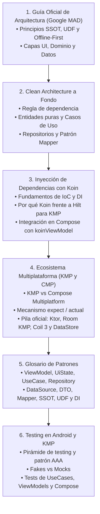

# Arquitectura en Android y Kotlin Multiplatform (KMP)

Construir una aplicación móvil moderna no consiste únicamente en diseñar pantallas atractivas con Jetpack Compose; el verdadero desafío radica en diseñar una **estructura de código robusta, escalable, desacoplada y 100% testeable** que resista el paso del tiempo y sea capaz de compartir lógica con otras plataformas (**iOS, Desktop y Web**).

En este bloque formativo abordaremos las directrices oficiales de Google (**MAD - Modern Android Architecture**), el diseño estricto por capas de **Clean Architecture**, y las herramientas del estándar de la industria: **Inyección de Dependencias con Koin** y el ecosistema **Kotlin Multiplatform (KMP)**.

---

## 🗺️ Mapa de Contenidos del Módulo

---

## 📚 Apartados del Módulo

1. **[Guía Oficial de Arquitectura en Android](./01-guia-arquitectura-google.md):**

   - Principios rectores: Separación de responsabilidades, UI dirigida por modelos, Fuente Única de Verdad (**SSOT**), Flujo Unidireccional de Datos (**UDF**) y **Offline-First**.
   - Desglose de las 3 capas: **UI Layer** (Compose + ViewModel), **Domain Layer** (UseCases) y **Data Layer** (Repositorios Room/Ktor).

2. **[Clean Architecture en Android y KMP](./02-clean-architecture.md):**

   - La Regla de Dependencia de Robert C. Martin adaptada a Kotlin.
   - Modelado estricto: Entidades puras de Dominio, Casos de Uso con `operator fun invoke()`, Inversión de Dependencias (DIP) y el **Patrón Mapper** (`toDomain()`, `toEntity()`).
   - Organización de paquetes: *Package by Layer* vs *Package by Feature*.

3. **[Inyección de Dependencias con Koin](./03-inyeccion-dependencias-koin.md):**

   - Qué es DI y por qué Koin es la solución idiomática para proyectos multiplataforma frente a Hilt/Dagger.
   - Definición de módulos (`singleOf`, `factoryOf`, `viewModelOf`).
   - Inyección directa en Compose mediante **`koinViewModel()`** e inicialización compartida con `initKoin`.

4. **[Ecosistema Multiplataforma: KMP y Compose Multiplatform](./04-ecosistema-kmp-multiplataforma.md):**

   - Comparativa estratégica: KMP (lógica compartida) vs Compose Multiplatform (UI y lógica compartidas).
   - El mecanismo **`expect` / `actual`** para acceder a APIs y hardware del sistema operativo.
   - La pila tecnológica oficial de librerías multiplataforma (Ktor, Kotlinx.serialization, Room KMP, DataStore KMP, Coil 3).
   - Gestión de recursos compartidos con `composeResources` y navegación multiplataforma.

5. **[Glosario y Patrones Clave de Arquitectura](./05-glosario-patrones.md):**

   - Diccionario de referencia rápida sobre el rol, responsabilidades y errores comunes de cada pieza: **ViewModel**, **UiState**, **State Hoisting**, **UseCase**, **Entidad de Dominio**, **Repository**, **DataSource**, **DTO**, **Mapper**, **UDF**, **SSOT** y **DI**.

6. **[Testing en Android y KMP](./06-testing-android-kmp.md):**

   - Fundamentos de pruebas automatizadas, pirámide de tests y estructura AAA (*Arrange, Act, Assert*).
   - Aislamiento de dependencias con **Fakes** frente a Mocks en entornos multiplataforma.
   - Pruebas unitarias de Casos de Uso y ViewModels con Corrutinas (`TestDispatcher`, Turbine).
   - Pruebas de interfaz en Jetpack Compose mediante el Árbol Semántico (*Semantics Tree*).

---

## 🔗 Relación con el Proyecto Transversal y Otros Temas

- **Proyecto Guía GameVault:** Toda la arquitectura de [GameVault](../../proyectos/GameVault/index.md) se basa en esta estructura de 3 capas con Clean Architecture e inyección con Koin.
- **Gestión del Estado en Compose:** Conecta directamente con la [Gestión del Estado](../00-compose/22-state-management.md) para entender cómo el Composable consume el `UiState` generado por el ViewModel.
- **Tipos Sellados y Estados de Pantalla:** Consulta cómo modelar los estados inmutables en [Sealed Interfaces y UiState](../00-kotlin/26-sealed-classes.md#5-el-patron-universal-de-arquitectura-en-android-uistate).
