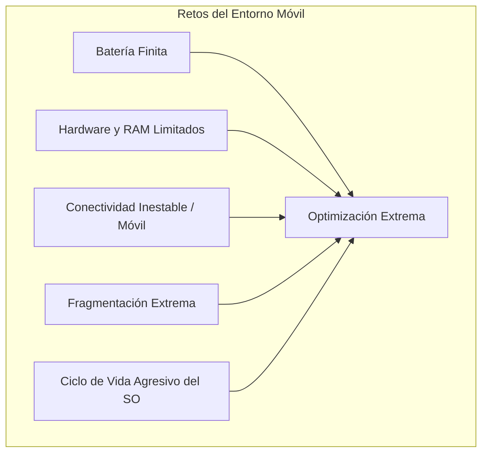
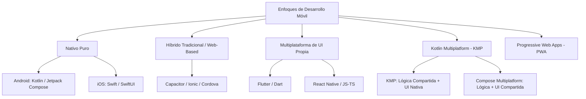
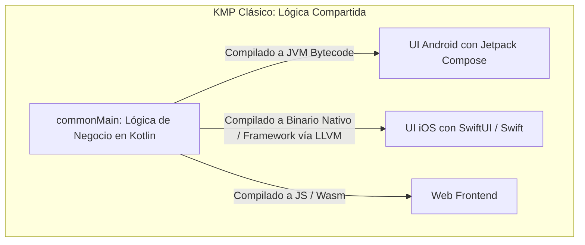
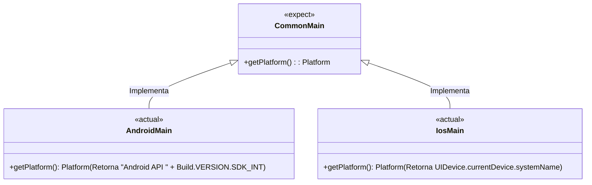
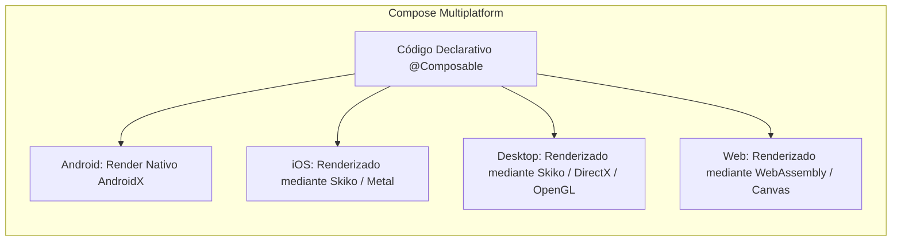
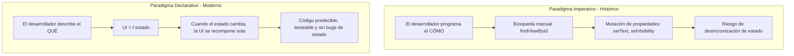
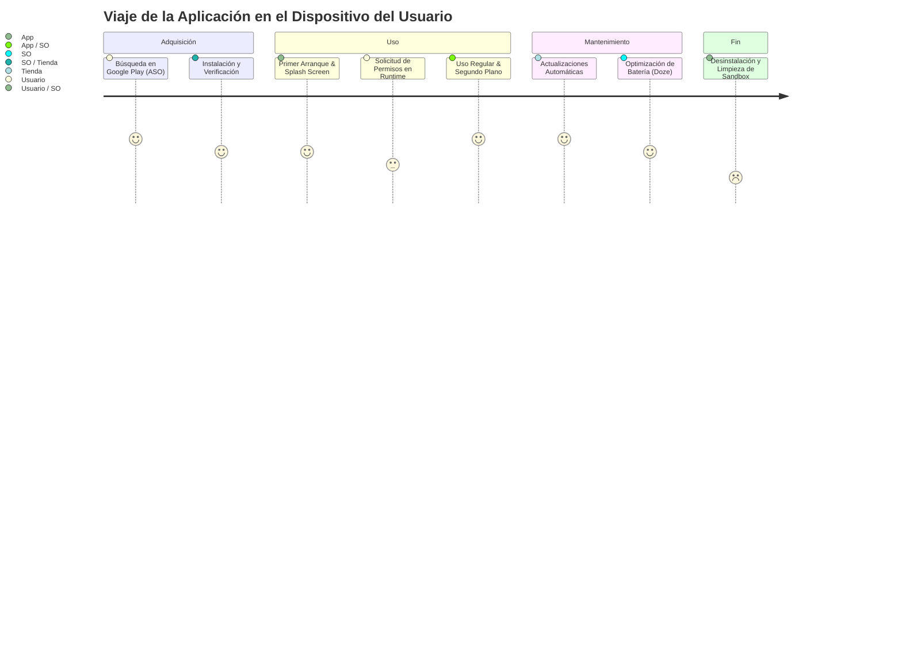
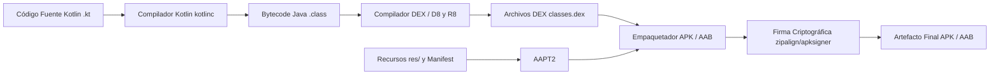
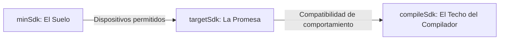

# **UT1. Evolución y Entornos de Desarrollo Móvil**

---

## 1. Limitaciones y Retos en el Desarrollo Móvil

A menudo, cuando empezamos a programar venimos del entorno de desarrollo de escritorio o de servidores web, donde los recursos del sistema parecen prácticamente ilimitados: gigabytes de memoria RAM, procesadores multinúcleo a altas velocidades sin restricciones térmicas estrictas, almacenamiento masivo y una alimentación eléctrica constante.

Sin embargo, el entorno móvil plantea un ecosistema radicalmente distinto. Un smartphone es un dispositivo de bolsillo, alimentado por una batería química finita y sujeto a condiciones de conectividad y temperatura muy variables. Ignorar estas limitaciones no solo conduce a un rendimiento deficiente, sino a la desinstalación inmediata de la aplicación por parte del usuario.

Pensemos en el desarrollador de escritorio o backend como el arquitecto de un rascacielos con cimientos profundos y acceso ilimitado a la red eléctrica; en cambio, el desarrollador móvil es como un **ingeniero de Fórmula 1**: cada gramo de peso, cada ciclo de reloj de la CPU, cada llamada a la red y cada milivatio de batería cuentan.



### 1.1. Recursos de Hardware: La Eterna Dieta

A pesar de los enormes avances en microelectrónica móvil, los smartphones operan bajo restricciones físicas estrictas:

- **Procesador (CPU y GPU):** Las CPUs móviles (basadas predominantemente en arquitecturas ARM y núcleos big.LITTLE) priorizan la eficiencia energética por encima de la potencia bruta continua. No disponen de ventiladores activos; si una aplicación satura la CPU durante periodos prolongados, el procesador entrará en *thermal throttling* (reducción automática de frecuencia para evitar daños térmicos), ralentizando el dispositivo.
- **Memoria RAM y el Asesino Silencioso (Low Memory Killer):** A diferencia de un PC donde el sistema operativo utiliza memoria virtual (swap) en disco si la RAM se agota, en los sistemas operativos móviles la memoria swap intensiva está limitada para no degradar la memoria flash. Si el sistema detecta presión de memoria, el servicio **Low Memory Killer (LMK)** de Android destruirá procesos en segundo plano sin previo aviso. Nuestra aplicación debe estar preparada en todo momento para restaurar su estado tras ser eliminada de la memoria.
- **Almacenamiento Flash:** Aunque la capacidad ha crecido, sigue siendo finita y compartida con fotos, vídeos y cachés del sistema. Las aplicaciones que superan cientos de megabytes sin justificación sufren mayores tasas de desinstalación.

### 1.2. La Batería: El Recurso Más Crítico

En un dispositivo móvil, cada byte transmitido por la antena celular, cada cálculo matemático y cada píxel iluminado en una pantalla OLED consume energía.

- **Impacto de las Antenas (Radio Móvil):** La antena celular (4G/5G) pasa por estados de energía (*Sleep*, *Idle*, *Active*). Realizar muchas peticiones de red pequeñas y espaciadas en el tiempo despierta la antena repetidamente impidiendo que entre en reposo, lo que dispara el consumo.
- **Mecanismos del Sistema Operativo:** Android implementa políticas muy estrictas como **Doze Mode** y **App Standby**. Cuando el usuario deja el teléfono sobre la mesa con la pantalla apagada, el sistema entra en un sueño profundo, limitando el acceso a la red y posponiendo tareas en segundo plano. El desarrollador no puede pretender ejecutar hilos infinitos; debe delegar el trabajo diferible a herramientas del sistema como **WorkManager**.

### 1.3. Conectividad Móvil: Un Entorno Inestable

Las aplicaciones móviles deben operar con la premisa de que la red es intrínsecamente hostil y cambiante:

- **Transiciones Constantes:** La app debe tolerar el cambio instantáneo entre una red Wi-Fi de alta velocidad, una conexión 5G con baja latencia, una cobertura 3G degradada en un túnel y la pérdida total de señal (*modo avión* o zonas sin cobertura).
- **Enfoque Offline-First:** Las aplicaciones modernas deben diseñarse con una arquitectura *offline-first*, almacenando los datos en una base de datos local (como Room o SQLDelight) y sincronizando con la nube de manera transparente cuando la conectividad se restablezca.

### 1.4. Fragmentación del Ecosistema

La diversidad de dispositivos en el mercado Android es inmensa:

- **Pantallas y Densidades:** Dispositivos que van desde 4 pulgadas hasta pantallas plegables de 8 pulgadas, tablets y pantallas de vehículos, con diferentes densidades de píxeles (`mdpi`, `hdpi`, `xhdpi`, `xxhdpi`, `xxxhdpi`) y relaciones de aspecto variadas (16:9, 19.5:9, 21:9).
- **Variedad de Fabricantes (Capas de Personalización):** Samsung (One UI), Xiaomi (HyperOS), Google (Pixel UI), etc., cada uno con configuraciones de ahorro de batería agresivas y modificaciones sobre el comportamiento estándar de Android AOSP.
- **Versiones de Android en el Mercado:** Conviven dispositivos con versiones que van desde Android 10 hasta Android 16. La aplicación debe fijar una versión mínima (`minSdk`) y verificar capacidades en tiempo de ejecución.

---

## 2. Ecosistema de Opciones en el Desarrollo Móvil Actual

A la hora de crear una aplicación móvil existen distintas aproximaciones técnicas. La elección adecuada impactará directamente en el rendimiento, los costes de mantenimiento y el tiempo de comercialización (*time-to-market*).



### A. Desarrollo Nativo Puro: Máxima Potencia e Integración

Consiste en programar directamente contra las APIs oficiales de cada plataforma utilizando sus lenguajes y herramientas recomendadas.

- **Android:** Lenguaje **Kotlin** (apoyado históricamente en Java), entorno **Android Studio**, interfaz declarativa con **Jetpack Compose**.
- **iOS:** Lenguaje **Swift** (anteriormente Objective-C), entorno **Xcode** (exclusivo de macOS), interfaz declarativa con **SwiftUI**.

!!! info "Ventajas e Inconvenientes del Enfoque Nativo"
    - **Ventajas:** Rendimiento óptimo sin capas de traducción; acceso el primer día a cualquier nueva API del sistema operativo; integración de diseño al 100% con las guías de estilo de cada plataforma (Material 3 en Android, Human Interface Guidelines en iOS).
    - **Inconvenientes:** Coste económico y de tiempo duplicado. Requiere mantener dos bases de código distintas y contar con dos equipos de ingenieros especializados.

---

### B. Frameworks Híbridos y Multiplataforma Tradicionales

Surgen con el lema *"Write Once, Run Anywhere"* buscando abaratar costes unificando el código fuente.

#### 1. Basados en WebView (Ionic / Capacitor)
- Empaquetan una aplicación web (HTML5, CSS3, JavaScript/TypeScript) dentro de un contenedor nativo (*WebView*).
- **Limitación:** El rendimiento gráfico y la fluidez son inferiores, existiendo latencia en animaciones complejas y un aspecto que delata que no es una aplicación nativa.

#### 2. React Native (Meta)
- Utiliza **JavaScript o TypeScript** con el paradigma declarativo de React.
- **Funcionamiento:** En sus versiones modernas (con la nueva arquitectura *Fabric* y *TurboModules* con C++), sustituye el antiguo puente asíncrono (*bridge*) por la interfaz JSI (*JavaScript Interface*), renderizando componentes nativos reales de cada plataforma.
- **Uso ideal:** Empresas con fuertes equipos frontend web que buscan reutilizar conocimientos para el mundo móvil.

#### 3. Flutter (Google)
- Utiliza el lenguaje **Dart**.
- **Funcionamiento:** Flutter no utiliza los componentes de UI nativos del sistema. En su lugar, incluye su propio motor gráfico de alto rendimiento (**Impeller / Skia**) y dibuja cada botón, texto y animación directamente sobre un lienzo (*Canvas*).
- **Ventajas:** Control absoluto sobre cada píxel de la pantalla e interfaces visualmente idénticas en todas las plataformas.
- **Inconvenientes:** Mayor tamaño del ejecutable inicial y necesidad de aprender un lenguaje (Dart) con menor penetración fuera de Flutter.

---

## 3. Kotlin Multiplatform (KMP): La Revolución Multiplataforma

**Kotlin Multiplatform (KMP)** no es un framework híbrido más: es una tecnología desarrollada por **JetBrains** y respaldada oficialmente por **Google** que replantea por completo la estrategia de código compartido en la industria del software.

### 3.1. Filosofía de KMP: Código Compartido Donde Aporta Valor

La premisa tradicional de los frameworks híbridos solía ser "comparte el 100% de la aplicación, incluida la interfaz, a costa de intermediarios y puentes". KMP introduce una perspectiva mucho más sensata:

> **"Comparte la lógica de negocio que es idéntica en todas las plataformas, y decide libremente cuánta interfaz de usuario quieres compartir."**



A diferencia de React Native (que requiere un runtime de JavaScript en tiempo de ejecución) o Flutter (que empaqueta su propio motor de renderizado gráfico completo), **KMP se compila al formato nativo que cada plataforma espera**:
- Para **Android**, Kotlin compila a **bytecode de la JVM/DEX**, integrándose como código nativo de primera clase.
- Para **iOS**, el compilador de **Kotlin/Native** utiliza **LLVM** para generar un binario ejecutable o un `.framework` nativo de Apple que Swift consume sin wrappers ni penalización de rendimiento.

---

### 3.2. Adopción Oficial de Google en AndroidX

Un hito decisivo en la consolidación de KMP fue el anuncio oficial de **Google** adoptando Kotlin Multiplatform como tecnología recomendada para compartir código entre Android e iOS.

Librerías oficiales de **AndroidX** que ya tienen soporte oficial de KMP:
- **Room KMP:** La base de datos relacional estándar de Android ahora corre sobre iOS usando el mismo código de entidades y DAOs.
- **DataStore:** Almacenamiento clave-valor reactivo y transaccional compartido.
- **Lifecycle & ViewModel:** Los `ViewModel` de Jetpack y sus estados ahora pueden residir en el módulo común y ser consumidos tanto por Compose como por SwiftUI.
- **Paging:** Paginación eficiente de listas compartida.
- **Annotations & Collections:** Colecciones optimizadas de Android disponibles en iOS y Desktop.

---

### 3.3. Estructura de un Proyecto KMP

En un proyecto estándar de KMP, la estructura del código en el módulo compartido (habitualmente llamado `shared` o `composeApp`) organiza las fuentes por plataformas mediante los llamados **Source Sets**:

```
mi-proyecto-kmp/
├── composeApp/ (o shared/)
│   └── src/
│       ├── commonMain/         <-- Código 100% compartido
│       │   ├── kotlin/         <-- Modelos, Repositorios, Red, Casos de Uso
│       │   └── resources/      <-- Strings, imágenes y fuentes comunes
│       ├── androidMain/        <-- Código específico de Android (usa Android SDK)
│       ├── iosMain/            <-- Código específico de iOS (usa APIs de Apple / Cocoa)
│       ├── desktopMain/        <-- Código específico de JVM Desktop (Windows/Mac/Linux)
│       └── wasmJsMain/         <-- Código para WebAssembly (Navegador)
├── iosApp/                     <-- Proyecto Xcode de iOS (consume el framework de Kotlin)
└── build.gradle.kts            <-- Configuración Gradle Multiplataforma
```

#### Configuración del `build.gradle.kts` Multiplataforma:

```kotlin
plugins {
    alias(libs.plugins.kotlinMultiplatform)
    alias(libs.plugins.androidLibrary)
    alias(libs.plugins.composeMultiplatform)
}

kotlin {
    // Objetivos de compilación (Targets)
    androidTarget()
    
    listOf(
        iosX64(),
        iosArm64(),
        iosSimulatorArm64()
    ).forEach { iosTarget ->
        iosTarget.binaries.framework {
            baseName = "SharedApp"
            isStatic = true
        }
    }
    
    jvm("desktop")

    // Configuración de dependencias por Source Set
    sourceSets {
        commonMain.dependencies {
            implementation(libs.ktor.client.core)
            implementation(libs.kotlinx.coroutines.core)
            implementation(libs.kotlinx.serialization.json)
            implementation(libs.koin.core)
        }
        androidMain.dependencies {
            implementation(libs.ktor.client.okhttp)
        }
        iosMain.dependencies {
            implementation(libs.ktor.client.darwin)
        }
    }
}
```

---

### 3.4. El Mecanismo Clave: `expect` y `actual`

¿Qué ocurre cuando el código compartido en `commonMain` necesita acceder a una funcionalidad que solo existe en el hardware o en el sistema operativo concreto (por ejemplo, obtener el modelo del dispositivo, guardar en el Keychain/Keystore o consultar el nivel de batería)?

Kotlin proporciona un patrón de diseño a nivel de compilador mediante las palabras clave **`expect`** y **`actual`**.



#### Paso 1: Declarar el contrato en `commonMain` (`expect`)

```kotlin
// Archivo: commonMain/kotlin/com/example/Platform.kt
interface Platform {
    val name: String
    val osVersion: String
}

// Declaramos que esperamos que cada plataforma proporcione esta función
expect fun getPlatform(): Platform
```

#### Paso 2: Implementar en `androidMain` (`actual`)

En `androidMain`, tenemos acceso total a todo el SDK de Android (`android.os.Build`, `Context`, etc.):

```kotlin
// Archivo: androidMain/kotlin/com/example/Platform.android.kt
import android.os.Build

class AndroidPlatform : Platform {
    override val name: String = "Android"
    override val osVersion: String = "${Build.VERSION.SDK_INT}"
}

actual fun getPlatform(): Platform = AndroidPlatform()
```

#### Paso 3: Implementar en `iosMain` (`actual`)

En `iosMain`, Kotlin nos permite importar directamente los frameworks de Apple (**Foundation**, **UIKit**, etc.) como si fueran clases de Kotlin:

```kotlin
// Archivo: iosMain/kotlin/com/example/Platform.ios.kt
import platform.UIKit.UIDevice

class IOSPlatform : Platform {
    override val name: String = UIDevice.currentDevice.systemName()
    override val osVersion: String = UIDevice.currentDevice.systemVersion
}

actual fun getPlatform(): Platform = IOSPlatform()
```

---

### 3.5. Ecosistema de Librerías Estándar en KMP

Para construir aplicaciones reales sin reinventar la rueda, el ecosistema KMP cuenta con un conjunto de bibliotecas de primer nivel respaldadas por la comunidad y grandes compañías:

| Necesidad Arquitectónica | Librería KMP Estándar | Equivalente Tradicional en Android |
| :--- | :--- | :--- |
| **Cliente HTTP / Red** | **Ktor Client** | Retrofit / OkHttp |
| **Serialización JSON** | **`kotlinx.serialization`** | Gson / Moshi / Jackson |
| **Persistencia Local (BD)** | **Room KMP** / **SQLDelight** | Room (solo Android) / SQLite |
| **Almacenamiento Clave-Valor** | **Multiplatform Settings** / **DataStore** | SharedPreferences / DataStore |
| **Inyección de Dependencias** | **Koin** | Hilt / Dagger |
| **Concurrencia Asíncrona** | **Kotlinx Coroutines & Flow** | RxJava / Threads / Handlers |
| **Carga y Caché de Imágenes** | **Coil 3 (KMP)** / **Kamel** | Glide / Picasso / Coil 2 |
| **Navegación Multiplataforma** | **Navigation Compose KMP** / **Voyager** | Jetpack Navigation |

#### Ejemplo Práctico de Consumo de API en `commonMain`:

```kotlin
import io.ktor.client.*
import io.ktor.client.call.*
import io.ktor.client.plugins.contentnegotiation.*
import io.ktor.client.request.*
import io.ktor.serialization.kotlinx.json.*
import kotlinx.serialization.Serializable

@Serializable
data class Game(val id: Int, val title: String, val rating: Double)

class GameRepository(private val client: HttpClient) {
    suspend fun fetchGames(): List<Game> {
        return client.get("https://api.example.com/games").body()
    }
}
```
*Este único bloque de código se ejecuta idénticamente en Android, iOS, Windows, Mac y navegador web.*

---

### 3.6. Compose Multiplatform (CMP): Llevando la UI a Todas Partes

Si bien KMP nació enfocado en la lógica compartida con UI nativa (Jetpack Compose en Android y SwiftUI en iOS), **JetBrains** dio el siguiente paso natural con **Compose Multiplatform (CMP)**.



- **¿Qué es CMP?** Es una extensión de Jetpack Compose que permite usar exactamente la misma sintaxis declarativa de Kotlin para describir la interfaz de usuario en Android, iOS, Escritorio y Web.
- **¿Cómo funciona en iOS?** En iOS, Compose Multiplatform utiliza **Skiko** (un motor gráfico ligero basado en **Skia**, la misma tecnología gráfica que emplean Google Chrome y Flutter) para dibujar sobre una vista de Metal nativa a 60/120 FPS.
- **Ventaja competitiva frente a Flutter:** No aprendes un lenguaje nuevo (todo es Kotlin), puedes integrar vistas SwiftUI nativas dentro de Compose cuando lo desees (`UIKitView`) y tienes acceso directo a todas las APIs de Apple sin necesidad de programar complejos "Method Channels".

---

### 3.7. Matriz Comparativa: KMP vs Flutter vs React Native vs Nativo Puro

| Criterio | Nativo Puro | Kotlin Multiplatform (KMP/CMP) | Flutter | React Native |
| :--- | :--- | :--- | :--- | :--- |
| **Lenguaje** | Kotlin (Android) / Swift (iOS) | **Kotlin** | Dart | JavaScript / TypeScript |
| **Rendimiento** | Máximo (100% nativo) | **Nativo en lógica y compilación** | Casi nativo (motor propio Skia) | Casi nativo (con JSI / Fabric) |
| **Estrategia de UI** | Nativa independiente | **Flexible:** 100% nativa o CMP compartida | Compartida (dibuja su propio Canvas) | Componentes nativos mapeados |
| **Interoperabilidad** | Innecesaria | **Total y directa** (compila a `.framework` en iOS) | Requiere puentes (*Platform Channels*) | Requiere módulos nativos puente |
| **Curva de Adopción** | Requiere dos equipos | **Gradual:** Puedes empezar con un solo módulo | "Todo o nada" en la mayoría de casos | "Todo o nada" para la app |
| **Soporte Corporativo** | Google / Apple | **JetBrains & Google** | Google | Meta (Facebook) |
| **Ideal para...** | Apps con uso intensivo de APIs exclusivas | Proyectos que buscan maximizar código compartido sin perder potencia nativa | Apps con diseño idéntico muy estilizado | Equipos con fuerte base web React |

---

## 4. Evolución de los Paradigmas de Interfaz: De Imperativo a Declarativo

Uno de los saltos cualitativos más importantes en el desarrollo de software moderno ha sido la transición del paradigma imperativo al paradigma declarativo en el diseño de interfaces.



### 4.1. El Enfoque Imperativo Clásico (XML / Android Views)

Durante más de una década, construir una pantalla en Android requería:
1. Diseñar la estructura visual en un archivo XML (`activity_main.xml`).
2. Enlazar los elementos desde la actividad en Java o Kotlin mediante `findViewById` o View Binding.
3. Mutar manualmente cada vista cuando cambiaban los datos:
   ```kotlin
   // Enfoque imperativo: Nosotros manipulamos la vista paso a paso
   val textView = findViewById<TextView>(R.id.tvMensaje)
   val progressBar = findViewById<ProgressBar>(R.id.progressBar)
   
   if (cargando) {
       progressBar.visibility = View.VISIBLE
       textView.text = "Cargando datos..."
   } else {
       progressBar.visibility = View.GONE
       textView.text = "Datos recibidos: ${datos.total}"
   }
   ```
*Problema clásico:* Si el programador olvidaba ocultar la barra de progreso en uno de los muchos caminos de error, la vista quedaba en un estado inconsistente con la realidad interna de la aplicación.

### 4.2. El Enfoque Declarativo Moderno (Jetpack Compose / SwiftUI)

En el paradigma declarativo no manipulamos directamente los componentes gráficos. En su lugar, describimos **cómo debe verse la pantalla para cualquier estado posible**:

$$\text{UI} = f(\text{Estado})$$

```kotlin
// Enfoque declarativo con Jetpack Compose: La UI es un reflejo reactivo del estado
@Composable
fun PantallaDatos(uiState: DatosUiState) {
    Column(modifier = Modifier.fillMaxSize().padding(16.dp)) {
        if (uiState.isLoading) {
            CircularProgressIndicator()
            Text(text = "Cargando datos...")
        } else {
            Text(text = "Datos recibidos: ${uiState.total}")
        }
    }
}
```
Cuando el estado (`DatosUiState`) cambia, el framework se encarga de calcular de forma inteligente qué partes de la pantalla han cambiado y redibujarlas automáticamente (**Recomposición**). Es imposible que la interfaz quede desincronizada con el estado.

---

## 5. El Ciclo de Vida de una Aplicación Móvil como Producto

Una aplicación móvil no es un simple programa de ordenador: es un producto vivo que atraviesa distintas fases con las que el usuario y el sistema operativo interactúan a lo largo del tiempo.



### 5.1. Fases del Ciclo de Vida

1. **Descubrimiento (Marketing y ASO):**
   - Las tiendas oficiales (**Google Play Store** y **Apple App Store**) son el principal canal.
   - **ASO (App Store Optimization):** Estrategias para optimizar palabras clave, icono, capturas de pantalla y valoraciones con el fin de aparecer en las primeras posiciones de búsqueda.
2. **Instalación y Seguridad:**
   - **Tiendas Oficiales:** El sistema verifica la firma criptográfica del paquete (`.apk` / `.aab` o `.ipa`) y crea un directorio privado y aislado para la aplicación (**Sandbox**).
   - **Sideloading (Fuentes desconocidas):** En Android es posible instalar paquetes directamente desde un navegador o tiendas alternativas (como F-Droid). Por seguridad, el sistema bloquea estas acciones por defecto exigiendo confirmación explícita del usuario.
3. **Ejecución y Permisos en Tiempo de Ejecución (Runtime Permissions):**
   - Desde Android 6.0 (API 23), los permisos sensibles (cámara, ubicación precisa, micrófono, notificaciones a partir de Android 13) ya no se conceden al instalar la app.
   - La aplicación debe solicitarlos en el momento exacto en que va a utilizarlos, explicando el motivo al usuario y gestionando de forma elegante la posibilidad de que el usuario los rechace.
4. **Actualización:**
   - Se descargan mediante deltas (solo los bytes que han cambiado). El sistema operativo exige que la actualización esté firmada con exactamente la misma clave criptográfica privada que la versión anterior; de lo contrario, la instalación será bloqueada para evitar suplantaciones de identidad.
5. **Desinstalación y Datos Residuales:**
   - Al desinstalar la app, el sistema elimina por completo el ejecutable y el almacenamiento privado (*sandbox* interno: base de datos Room, preferencias y cachés).
   - Los archivos guardados en carpetas públicas compartidas (como `DCIM/` o `Descargas/`) y los datos almacenados en servidores en la nube no se borran con la desinstalación local.

---

## 6. Arquitectura del Sistema Android y Entorno de Ejecución

Para entender qué ocurre cuando pulsamos el botón "Run" en nuestro IDE, debemos conocer la maquinaria interna de Android.

### 6.1. De Código Fuente a Código Máquina: El Proceso de Compilación

A diferencia de una aplicación Java de escritorio convencional, Android no ejecuta directamente archivos `.class` ni empaqueta un archivo `.jar`.



1. **Compilación a Bytecode:** `kotlinc` compila los ficheros `.kt` a bytecode tradicional de la JVM (`.class`).
2. **Desechado y Optimización con D8 / R8:** El compilador **D8** convierte el bytecode Java en formato **DEX (Dalvik Executable)**, optimizado específicamente para consumir la mínima memoria posible. La herramienta **R8** analiza el código, elimina clases y métodos no utilizados (*tree-shaking*), optimiza llamadas y ofusca el código renombrando identificadores para dificultar la ingeniería inversa.
3. **Empaquetado de Recursos con AAPT2:** Compila los archivos XML, imágenes y recursos generando el binario compilado y la clase `R.java`.

---

### 6.2. La Máquina Virtual: De Dalvik a ART (Android Runtime)

Históricamente, Android ejecutaba el código sobre la máquina virtual **Dalvik**, pero desde Android 5.0 (Lollipop) el sistema utiliza **ART (Android Runtime)**:

- **Dalvik (Histórico):** Utilizaba compilación **JIT (Just-In-Time)**. Cada vez que el usuario abría una app, el código DEX se traducía a código máquina en tiempo real sobre la marcha. Esto consumía mucha CPU y drenaba la batería.
- **ART (Moderno):** Utiliza un modelo híbrido extremadamente avanzado:
  - **Compilación AOT (Ahead-Of-Time):** Durante la instalación o en periodos de inactividad mientras el teléfono carga, ART compila porciones críticas de código directamente a lenguaje máquina nativo (`.oat` / `.elf`).
  - **Perfiles Guiados por el Uso (Profile-Guided Optimization - PGO):** El sistema analiza qué partes de la app utiliza con más frecuencia el usuario y compila de forma prioritaria solo esas rutinas.
  - **Baseline Profiles:** Los desarrolladores pueden empaquetar un archivo de perfil en su app para que el dispositivo precompile la aplicación nada más instalarse, logrando arranques hasta un 40% más rápidos sin esperar al aprendizaje del sistema.

---

### 6.3. Formatos de Distribución: APK vs AAB (Android App Bundle)

| Característica | APK (Android Package) | AAB (Android App Bundle) |
| :--- | :--- | :--- |
| **Definición** | Formato de instalación clásico (`.apk`). Contiene todos los recursos para todos los dispositivos posibles. | Formato de publicación moderno (`.aab`). Contiene el código completo pero no es directamente instalable. |
| **Destino** | Emuladores, pruebas directas y tiendas alternativas (F-Droid). | **Obligatorio para publicar en Google Play Store**. |
| **Tamaño en el Dispositivo** | Mayor (incluye imágenes para todas las resoluciones y librerías C++ para todas las arquitecturas de CPU). | **Hasta un 30-40% más ligero**. Google Play genera un *Split APK* personalizado que solo contiene los recursos exactos que necesita el teléfono que lo descarga. |
| **Entrega Dinámica** | No soportada. | Permite descargar módulos de funcionalidades bajo demanda (*Play Feature Delivery*). |

---

## 7. El SDK de Android y la Tríada de Versiones en Gradle

El **SDK (Software Development Kit)** es la colección de herramientas, cabeceras y librerías que Google proporciona para desarrollar aplicaciones. En Android Studio se gestiona a través del **SDK Manager** dividiéndose en dos grandes apartados:

1. **SDK Platforms:** Versiones concretas del sistema operativo (que contienen el fichero esencial `android.jar` contra el que programamos y las imágenes de sistema para los emuladores).
2. **SDK Tools:** Herramientas independientes de la versión del SO (compiladores, emulador, analizadores de rendimiento y herramientas de línea de comandos).

---

### 7.1. La Tríada Clave en Gradle: `minSdk`, `compileSdk` y `targetSdk`

En todo archivo `build.gradle.kts` de un módulo Android encontraremos tres números esenciales que cualquier desarrollador debe comprender a la perfección:

```kotlin
android {
    compileSdk = 35 // Android 15

    defaultConfig {
        applicationId = "com.docente.gamevault"
        minSdk = 26     // Android 8.0 Oreo
        targetSdk = 35  // Android 15
        
        versionCode = 1
        versionName = "1.0.0"
    }
}
```



#### 1. `compileSdk` (El Techo del Compilador)
- Indica la versión del SDK de Android con la que el compilador comprobará tu código.
- Define qué clases y métodos de la API de Android puedes invocar en tu código fuente. No afecta al comportamiento en tiempo de ejecución en el teléfono del usuario.

#### 2. `minSdk` (El Suelo de Compatibilidad)
- Define la versión **mínima** de Android que requiere un dispositivo para poder instalar y ejecutar la aplicación.
- Si un usuario tiene un teléfono con una versión inferior a tu `minSdk`, Google Play ni siquiera le mostrará la aplicación en los resultados de búsqueda.
- *Compromiso del desarrollador:* Un `minSdk` muy bajo (ej. API 21) permite llegar a más dispositivos antiguos, pero impide usar APIs modernas directamente y requiere código de compatibilidad adicional. Un `minSdk` razonable actual se sitúa habitualmente entre el API 24 (Android 7.0) y el API 26 (Android 8.0).

#### 3. `targetSdk` (La Promesa de Comportamiento al Sistema Operativo)
- Indica a Android: *"He probado y diseñado mi app para comportarse según las reglas de seguridad y privacidad de esta versión de Android"*.
- **Mecanismo de compatibilidad hacia atrás:** Si ejecutas tu app en un teléfono con Android 15 pero tu `targetSdk` es 33, Android activará modos de compatibilidad para no romper tu app aunque las políticas de permisos hayan cambiado en Android 15.
- **Exigencia de Google Play:** Google obliga a que todas las aplicaciones publicadas o actualizadas en la Play Store tengan un `targetSdk` reciente (normalmente no superior a 1 año respecto a la última versión estable de Android).

---

### 7.2. Herramientas Esenciales de Línea de Comandos: ADB Práctico

Dentro de las *SDK Platform-Tools*, la herramienta más versátil para el desarrollador es **ADB (Android Debug Bridge)**. Permite comunicar nuestro ordenador de desarrollo con cualquier dispositivo físico o emulador conectado por USB o Wi-Fi.

Principales comandos que todo desarrollador móvil debe dominar:

```bash
# 1. Comprobar qué dispositivos o emuladores están conectados y autorizados
adb devices

# 2. Instalar una aplicación directamente (la opción -r reinstala manteniendo datos)
adb install -r app-release.apk

# 3. Desinstalar una aplicación indicando su Application ID
adb uninstall com.docente.gamevault

# 4. Ver el flujo de registros (logs) del sistema en tiempo real
adb logcat

# 5. Filtrar el logcat solo para mostrar los logs de nuestra aplicación o una etiqueta concreta
adb logcat -s "GameVaultTag"

# 6. Abrir un terminal de comandos dentro del sistema operativo del dispositivo
adb shell

# 7. Copiar archivos entre el ordenador y el móvil
adb push mi_archivo_local.json /sdcard/Download/
adb pull /sdcard/Download/captura.png ./captura_en_pc.png

# 8. Reiniciar el servidor daemon de ADB en caso de problemas de conexión
adb kill-server
adb start-server
```

---

### 7.3. Evolución de Versiones y Niveles de API de Android

| Versión de Android | Nombre Clave (Postre) | Nivel de API | Año de Lanzamiento | Hito Tecnológico Destacado |
| :---: | :---: | :---: | :---: | :--- |
| **Android 8.0 / 8.1** | Oreo | 26 / 27 | 2017 | Project Treble (modularización del SO) y límites a servicios en background. |
| **Android 9.0** | Pie | 28 | 2018 | Soporte para navegación por gestos y restricciones a la cámara en segundo plano. |
| **Android 10** | Quince Tart *(Fin de nombres públicos de postres)* | 29 | 2019 | Almacenamiento aislado (*Scoped Storage*) y soporte oficial para dispositivos plegables. |
| **Android 11** | Red Velvet Cake | 30 | 2020 | Permisos de un solo uso y burbujas de conversación nativas. |
| **Android 12 / 12L** | Snow Cone | 31 / 32 | 2021 | Rediseño radical **Material You (Material 3)** y Privacy Dashboard. |
| **Android 13** | Tiramisu | 33 | 2022 | Permiso obligatorio de notificaciones (`POST_NOTIFICATIONS`) y selector de fotos seguro. |
| **Android 14** | Upside Down Cake | 34 | 2023 | Mayor restricción a alarmas exactas y soporte avanzado para pantallas ultra HDR. |
| **Android 15** | Vanilla Ice Cream | 35 | 2024 | Espacio privado (*Private Space*), mejoras en rendimiento de renderizado y edge-to-edge forzado. |
| **Android 16** | Baklava | 36 | 2025 | Integración avanzada de modelos de IA locales (Gemini Nano) en el runtime del sistema. |

---

## 8. Resumen y Conclusiones

1. **El desarrollo móvil exige un cambio de mentalidad:** Las restricciones severas de memoria, consumo de batería y variabilidad de la red obligan a diseñar pensando en la eficiencia y la arquitectura *offline-first*.
2. **El paradigma declarativo es el estándar:** Tecnologías como **Jetpack Compose** y **SwiftUI** eliminan los problemas clásicos de desincronización de estado mediante la fórmula reactiva $\text{UI} = f(\text{Estado})$.
3. **Kotlin Multiplatform (KMP) lidera la nueva era:** Permite compartir la lógica de negocio, networking y persistencia con rendimiento 100% nativo y adopción gradual, contando con el respaldo oficial conjunto de **JetBrains y Google**.
4. **Compose Multiplatform (CMP) democratiza la UI compartida:** Ofrece una alternativa real a Flutter sin necesidad de abandonar el ecosistema ni el lenguaje de Kotlin.
5. **Conocer el runtime es fundamental:** Dominar la tríada de Gradle (`minSdk`, `compileSdk`, `targetSdk`), el funcionamiento de ART y herramientas como ADB marca la diferencia entre un programador novato y un ingeniero de software móvil cualificado.
