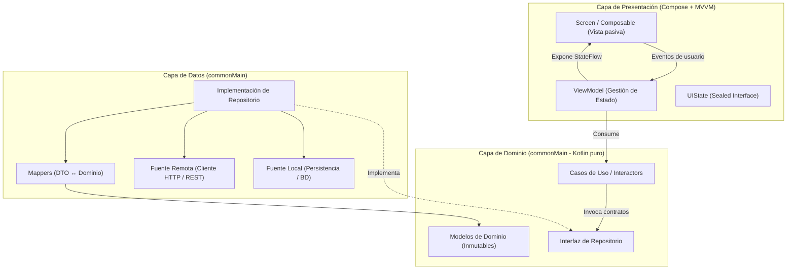

# Requisitos de PMDM para el Proyecto Intermodular (2º DAM)

En lo referente a **Programación Multimedia y Dispositivos Móviles (PMDM)**, los estudiantes pueden desarrollar la UI del proyecto a través de una App en Android y/o iOS. Este documento define con rigor técnico los **requisitos mínimos estrictos** (aquellos cuyo cumplimiento es obligatorio para superar la parte del módulo PMDM dentro del proyecto intermodular) y los **requisitos deseables** (ampliaciones que aportan valor añadido, madurez arquitectónica y distinción técnica).

!!! important "Ámbito de Aplicación de estos Requisitos"
    Los estándares y requerimientos descritos en este documento son **únicamente de aplicación** cuando el alumno o grupo decida implementar la interfaz de usuario del sistema mediante:

    - **Una aplicación móvil** (desarrollada nativamente para Android y/o iOS).
    - **Una aplicación de escritorio (*Desktop App*)** construida sobre el ecosistema **Kotlin Multiplatform (KMP) y Compose Multiplatform**, aprovechando la compartición de código y la UI declarativa para ejecutarse sobre la JVM en sistemas de escritorio (Linux, macOS o Windows).

    En caso de que el *proyecto desarrolle su interfaz exclusivamente a otros entornos tecnológicos* (por ejemplo, una aplicación desarrollada en Flutter o similar), este **documento no es de aplicación**.

---

## 1. Matriz Resumen de Requisitos

La siguiente tabla resume el alcance de cada dimensión técnica exigida:

| Dimensión Técnica | Requisito Mínimo Estricto | Requisito Deseable  |
| :--- | :--- | :--- |
| **Plataforma y Código** | Kotlin Multiplatform (KMP). Lógica de negocio y datos en `commonMain`. Android funcional (`androidMain`). | Ejecución multiplataforma real en un segundo destino (Desktop JVM o iOS). |
| **Arquitectura de Software** | Clean Architecture (Dominio, Datos, Presentación) + Patrón MVVM. | Estrategia *Offline-First* con sincronización bidireccional y repositorio unificado. |
| **Inyección de Dependencias** | Inversión de control y DI modularizada (ej. Koin). Cero instanciaciones manuales acopladas. | Inyección de parámetros dinámicos y configuración de diferentes entornos (Dev/Prod). |
| **Interfaz de Usuario (UI)** | 100% declarativa con Jetpack Compose / Compose Multiplatform. | Soporte adaptativo para modo claro y oscuro (*Dark Mode*) con tokens coherentes. |
| **Gestión del Estado** | Flujo Unidireccional de Datos (UDF) con `StateFlow` y estados sellados (`Loading`, `Success`, `Error`, `Empty`). | Transiciones animadas de interfaz y estados de carga tipo *Shimmer / Skeleton*. |
| **Componentes de UI** | Contenedor estructural `Scaffold`, listas perezosas (`LazyColumn` / `LazyGrid`) y formularios validados. | Gestos táctiles avanzados (*pull-to-refresh*, *swipe-to-dismiss*) y microanimaciones. |
| **Navegación** | Navegación fuertemente tipada (*Type-Safe Navigation* con objetos/clases serializables). | Animaciones de transición de pantalla y deep links. |
| **Conectividad de Red** | Consumo asíncrono de API REST con cliente HTTP tipado (ej. Ktor Client). Cero *crashes* de red. | Paginación infinita en servidor/cliente (*Infinite Scroll*) o comunicación en tiempo real (WebSockets). |
| **Persistencia Local** | Persistencia de datos de sesión o preferencias (ej. DataStore Preferences / Tokens). | Base de datos relacional local estructurada (Room KMP / SQLDelight) para caché de entidades. |
| **Concurrencia y Calidad** | Corrutinas estructuradas (`viewModelScope`), null-safety estricto y pruebas unitarias de casos de uso/VM. | Pruebas de flujos reactivos de estado (Turbine), pruebas de UI y linters integrados (Detekt/Ktlint). |
| **Hardware / APIs Nativa** | No obligatorio (opcional según el caso de uso del proyecto). | Integración de sensores o hardware (cámara, geolocalización, biometría, lector QR, notificaciones). |

---

## 2. Mapa Arquitectónico Global

La aplicación debe estructurarse siguiendo el principio de responsabilidad única y separación de preocupaciones. A continuación se ilustra el flujo de datos y dependencias en el ecosistema común:



---

## 3. Plataforma y Ecosistema Multiplataforma (KMP)

El proyecto debe beneficiarse del paradigma multiplataforma moderno para reutilizar lógica y evitar duplicidad de código.

### Requisito Mínimo Estricto

- **Estructura modular en Kotlin Multiplatform (KMP):** El proyecto debe configurarse de modo que la lógica de negocio, los modelos de dominio, la serialización y el acceso a datos residan en el módulo compartido (`commonMain`).

- **Plataforma Android plenamente operativa:** El código compilado para Android (`androidMain`) debe ser completamente funcional, desplegable y ejecutable tanto en emuladores oficiales como en dispositivos físicos.

### Requisito Deseable

- **Despliegue multidispositivo:** Ejecución operativa del proyecto en un segundo destino además de Android:
  
    - **Desktop (JVM):** Aplicación de escritorio ejecutable para Windows, Linux o macOS reutilizando la UI de Compose Multiplatform.
  
    - **iOS:** Despliegue en simulador/dispositivo iOS demostrando la total compatibilidad del código común.

---

## 4. Arquitectura y Patrones de Software

La mantenibilidad, legibilidad y testeabilidad son aspectos evaluados de forma prioritaria en este nivel académico.

### Requisitos Mínimos Estrictos

1. **Separación estricta de responsabilidades (Clean Architecture):**

    - **Capa de Dominio (`Domain Layer`):** Debe ser Kotlin puro, sin dependencias del SDK de Android ni librerías de UI. Debe contener las entidades de dominio inmutables y los **Casos de Uso (`UseCases`)** que encapsulen operaciones concretas de la aplicación (por ejemplo, `LoginUseCase`, `GetProductsUseCase`, `CreateOrderUseCase`).

    - **Capa de Datos (`Data Layer`):** Debe implementar el **Patrón Repositorio (`Repository Pattern`)**. El repositorio es el único punto de acceso a la información y debe abstraer el origen de los datos mediante una interfaz declarada en Dominio.

    - **Mappers explícitos:** Prohibido propagar DTOs de red directamente a la interfaz. Debe existir una función o clase de mapeo que transforme los modelos de transporte (DTO) en modelos de dominio limpios.

    - **Capa de Presentación (`Presentation Layer`):** Patrón **MVVM (Model-View-ViewModel)**. Los `ViewModels` no deben contener referencias a contextos de Android, vistas ni dependencias de plataforma.

2. **Inyección de Dependencias (DI):**

    - Toda la aplicación debe orquestarse mediante inversión de control e inyección de dependencias modular (utilizando por ejemplo **Koin**).

    - Los módulos deben estar segregados lógicamente (ej. `dataModule`, `domainModule`, `viewModelModule`).

    - Queda expresamente prohibido instanciar repositorios, clientes de red o casos de uso mediante llamadas directas al constructor dentro de pantallas o ViewModels.

### Requisitos Deseables

- **Estrategia Offline-First:** El repositorio consulta primero la fuente de datos local para entregar información inmediata y actualiza en segundo plano desde el servidor, notificando cambios reactivamente.

- **Gestión centralizada de autenticación:** Interceptores de red que inyecten automáticamente cabeceras de autorización (Bearer Token) y gestionen la renovación de tokens expirados (*Refresh Token*) sin intervención manual del usuario.

---

## 5. Capa de Presentación y Experiencia de Usuario (UI/UX)

La interfaz gráfica debe cumplir con los principios de diseño declarativo y diseño centrado en el usuario.

### Requisitos Mínimos Estrictos

1. **Paradigma 100% Declarativo:**

    - La interfaz de usuario debe construirse íntegramente mediante funciones componibles (**Jetpack Compose / Compose Multiplatform**). No se admiten layouts tradicionales basados en XML.

2. **Flujo Unidireccional de Datos (UDF):**

    - El estado visual debe ser inmutable y residir en el `ViewModel`.

    - El estado de cada pantalla debe modelarse mediante una interfaz o clase sellada (`sealed interface` / `sealed class`) que represente explícitamente los posibles estados de la vista:

    ```kotlin
    sealed interface UserListUiState {
        data object Loading : UserListUiState
        data class Success(val users: List<User>) : UserListUiState
        data class Error(val message: String) : UserListUiState
        data object Empty : UserListUiState
    }
    ```

    - La pantalla debe ser un componente observador pasivo que reaccione al `StateFlow` expuesto y transmita las interacciones del usuario hacia el `ViewModel` mediante eventos/lambdas.

3. **Componentes y Buenas Prácticas de Maquetación:**

    - Uso de contenedores estructurales estándar (`Scaffold`, barras superiores, barras de navegación o menús laterales).

    - **Renderizado perezoso y eficiente:** Colecciones de elementos mostradas obligatoriamente mediante componentes perezosos (`LazyColumn`, `LazyRow` o `LazyVerticalGrid`) que reutilicen recursos visuales.

    - **Formularios robustos:** Entradas de texto con validación reactiva (detección de formato de correo, contraseñas, campos requeridos) que ofrezcan retroalimentación visual clara e inhabiliten la acción principal mientras existan datos incorrectos.

4. **Navegación Fuertemente Tipada (*Type-Safe Navigation*):**

    - El grafo de navegación de la app debe construirse usando rutas basadas en tipos/objetos serializables (`@Serializable`), eliminando cadenas de texto arbitrarias propensas a errores tipográficos.

### Requisitos Deseables

- **Soporte completo de temas Claro / Oscuro:** Paletas de colores adaptadas y coherentes en ambas modalidades respetando las directrices de Material Design 3.

- **Efectos de carga avanzados:** Implementación de pantallas esqueleto (*Shimmer Loading*) en sustitución de indicadores de progreso circulares genéricos.

- **Microinteracciones y gestos:** Integración de componentes como deslizamiento para refrescar (*Pull-to-Refresh*), swipe para eliminar (*Swipe-to-Dismiss*) o animaciones de entrada y salida entre destinos de navegación.

---

## 6. Conectividad y Consumo de Servicios Web (APIs REST)

Al tratarse de un proyecto intermodular, la aplicación cliente móvil debe integrarse de forma coordinada con el backend desarrollado en el proyecto.

### Requisitos Mínimos Estrictos

1. **Cliente HTTP Tipado:**

    - Consumo asíncrono y no bloqueante de endpoints REST mediante un cliente HTTP multiplataforma moderno (ej. **Ktor Client** o equivalente del ecosistema).

    - Serialización y deserialización automática y tipada de payloads JSON (por ejemplo, con `kotlinx.serialization`).

2. **Tolerancia a Fallos y Resiliencia:**

    - La aplicación bajo ninguna circunstancia debe sufrir cierres forzados (*crashes*) como consecuencia de fallos en la capa de transporte (pérdida de cobertura, timeout de servidor, errores HTTP 401, 404, 500).

    - Los errores de red deben capturarse de forma controlada en la capa de datos, transformarse en tipos de error del dominio y comunicarse a la interfaz mediante mensajes comprensibles y un botón de reintento (*Retry Button*).

### Requisitos Deseables

- **Listados paginados (*Pagination / Infinite Scroll*):** Carga incremental de grandes volúmenes de datos bajo demanda según el usuario se desplaza por la lista.

- **Canales en tiempo real:** Comunicación bidireccional mediante WebSockets o eventos del servidor (SSE) si la naturaleza funcional del proyecto lo requiere (ej. avisos inmediatos, chat interno, monitorización de estados).

---

## 7. Persistencia Local y Gestión de Sesión

El cliente móvil debe gestionar la permanencia de información esencial en el dispositivo entre ejecuciones.

### Requisito Mínimo Estricto

- **Almacenamiento persistente de sesión o configuración:**

    - Almacenamiento local persistente y no volátil para datos de sesión (token de acceso JWT, identificador de usuario activo o preferencias de la aplicación) mediante mecanismos seguros como **DataStore Preferences** o equivalente multiplataforma.

    - La aplicación debe recordar el estado de autenticación al cerrarse y reabrirse sin obligar al usuario a iniciar sesión repetidamente.

### Requisito Deseable

- **Base de datos relacional local estructurada:**

    - Integración de un motor relacional embebido local (ej. **Room en KMP** o **SQLDelight**).

    - Persistencia de al menos una entidad completa de negocio que permita el funcionamiento de la app en modo desconectado (modo lectura offline) o almacenamiento de favoritos, historial y borradores locales.

---

## 8. Calidad de Código, Concurrencia y Pruebas Unitarias

La calidad interna del software es tan relevante como su apariencia visual.

### Requisitos Mínimos Estrictos

1. **Seguridad frente a Nulos y Buenas Prácticas Kotlin:**

    - Uso estricto de los mecanismos de Null-Safety del lenguaje. Queda terminantemente desaconsejado el uso del operador de aserción forzada `!!`.

2. **Concurrencia Estructurada:**

    - Todas las operaciones de entrada/salida (red, acceso a disco o cómputo intensivo) deben ejecutarse en hilos no principales mediante **Corrutinas** (`Dispatchers.IO` / `Dispatchers.Default`).

    - El ciclo de vida de las tareas asíncronas debe estar acotado al ciclo de vida del componente que las lanza (`viewModelScope`), evitando fugas de memoria o peticiones huérfanas al cerrar la pantalla.

3. **Batería de Pruebas Unitarias Mínima:**

    - Debe existir una suite de pruebas unitarias (`src/commonTest` o `src/test`) que verifique el correcto funcionamiento de al menos:

        - Los Casos de Uso críticos de la capa de Dominio (lógica de negocio).
        - Y/o las transiciones de estado de un ViewModel frente a respuestas simuladas (*Mocks* / *Fakes* de repositorio).

### Requisitos Deseables

- **Pruebas de flujo reactivo de estado:** Verificación exhaustiva de emisiones `StateFlow` mediante librerías especializadas (como Turbine).

- **Análisis estático y estilo de código:** Integración de herramientas de análisis estático (como Detekt o Ktlint) en el flujo de compilación de Gradle para asegurar convenciones de código compartidas en el equipo de desarrollo.

---

## 9. Integración con Capacidades del Dispositivo (Hardware y Sistema)

Esta dimensión evalúa el aprovechamiento de la naturaleza móvil del cliente frente a una aplicación web convencional.

### Requisito Mínimo Estricto

- **No obligatorio:** Si la funcionalidad pactada en el proyecto intermodular es de gestión empresarial o administrativa, no es indispensable integrar hardware específico para superar la evaluación.

### Requisito Deseable

- **Aprovechamiento de sensores y servicios del sistema operativo:**
  
    - Acceso a cámara o galería multimedia para captura y subida de imágenes/documentos.
  
    - Geolocalización y visualización cartográfica en tiempo real.
  
    - Lector de códigos de barras o códigos QR para captura automatizada de identificadores.
  
    - Notificaciones locales o notificaciones push para eventos relevantes del sistema.
  
    - Autenticación biométrica (huella dactilar / reconocimiento facial).

